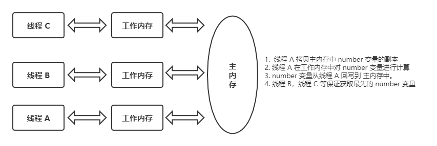
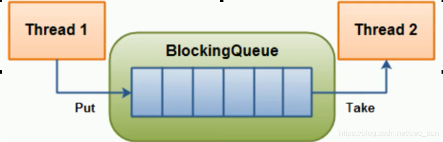

[toc]

# volatile 关键字

`volatile` 是 Java 虚拟机提供的轻量级的同步机制，其主要作用：
> 1. 保证可见性；
> 2. 不保证原子性；
> 3. 禁止指令重排

## 保证可见性
线程在自己的工作内存拷贝主内存中的共享数据，线程更新共享数据后再刷回到主内存中。其他线程会感知共享数据的变化，拷贝最新的数据到自己的工作内存进行操作。

```
public class VolatileDemo {
    public static void main(String[] args) {
        MyData data = new MyData();
        for(int i = 0;i<20;i++){
            new Thread(()->{
                try {
                    TimeUnit.SECONDS.sleep(5);
                } catch (InterruptedException e) {
                    e.printStackTrace();
                }

                data.addTen();
                System.out.println(Thread.currentThread().getName()+" 的 number 变量变化了: "+ data.number);
            },"线程1 "+String.valueOf(i)).start();

        }

        while (data.number == 0){
        }
        System.out.println(Thread.currentThread().getName()+" 的 number 变量变化了: " + data.number);
    }
}

class MyData{
    volatile int number = 0;
    public void addTen(){
        this.number = 10;
    }
}
```

## 不保证原子性
所谓原子性，就是在进行一个操作时，这个操作要么完成，要么失败。类似于 SQL 的事务。

如案例所示，使用 i++ 来模拟原子性。
```
public class VolatileDemo {

    public static void main(String[] args) {
        MyData data = new MyData();
        for(int i = 0;i<20;i++){
            new Thread(()->{
                for(int j = 0;j < 1000;j++) {
                    data.addPlus();
                }
//                System.out.println(Thread.currentThread().getName()+" 的 number 变量变化了: "+ data.number);
            },"线程1 "+String.valueOf(i)).start();
        }
        while (Thread.activeCount() > 2){
            Thread.yield();
        }

        System.out.println(Thread.currentThread().getName()+" 的 number 变量变化了: " + data.number);
    }
}

class MyData{
    volatile int number = 0;
    public void addPlus(){
        number++;
    }
}
```

### 如何避免非原子性
1. 可以使用 JUC 的原子类来进行操作；
2. 可以使用同步锁机制。
```
public class VolatileDemo {
    public static void main(String[] args) {
        MyData data = new MyData();
        for(int i = 0;i<20;i++){
            new Thread(()->{
                for(int j = 0;j < 1000;j++) {
                    data.addPlus();
                }
            },"线程1 "+String.valueOf(i)).start();

        }
        while (Thread.activeCount() > 2){
            Thread.yield();
        }

        System.out.println(Thread.currentThread().getName()+" 的 number 变量变化了: " + data.atomicInteger);
    }
}

class MyData{
     // JUC 原子类
    AtomicInteger atomicInteger = new AtomicInteger();
    public void addPlus(){
        atomicInteger.getAndIncrement();
    }
    // 同步锁
    volatile int number = 0;
    public synchronized void addPlus(){
        number++;
    }
}
```

## 禁止重排
虚拟机在执行程序时，为了提高性能，编译器会对程序指令进行优化重排，继而形成最终的执行指令。由于优化重排会考虑指令间的依赖关系，在单线程环境下，不会出现问题。而在多线程环境下，线程交替运行，程序优化重排后，变量的一致性无法得到保证。

`volatile` 实现禁止指令重排优化，从而可以避免在多线程环境下程序出现乱序执行的现象。

内存屏障（Memory Barrier，内存栅栏）：是一个 CPU 指令，其作用有：

 1. 保证特定操作的执行顺序；
 2. 保证某些变量的内存可见性。

由于编译器和处理器都能执行指令重排优化，如果在指令间插入一条 Memory Barrier，则会告诉编译器和处理器，不管什么指令都不能和这条 Memory Barrier 指令重排，也就是说：<font color="red">通过插入内存屏障禁止在内存屏障前后的指令执行重排序</font>。内存屏障另一个作用是强制刷出各种 CPU 的缓存数据，因此任何 CPU 上的线程都能读取到这些数据的最新版本。

 - 对 `volatile` 变量进行写操作时，会在写操作**后**加入一条 store 屏障指令，将工作内存中的共享变量刷新回主内存；
 - 对  `volatile` 变量进行读操作时，会在读操作**前**加入一条 load 屏障指令，从主内存中读取共享变量。

## JMM
JMM(Java内存模型Java Memory Model, 简称JMM) 本身是一种**抽象的概念** ，并不真实存在, 它描述的是一组规则或规范通过规范定制了程序中各个变量(包括实例字段,静态字段和构成数组对象的元素)的访问方式。

JMM关于同步规定:
1. 线程解锁前,必须把共享变量的值刷新回主内存
2. 线程加锁前,必须读取主内存的最新值到自己的工作内存
3. 加锁解锁是同一把锁

由于 JVM 运行程序的实体是线程, 而每个线程创建时JVM 都会为其创建一个**工作内存**(有些地方成为**栈空间**), **工作内存是每个线程的私有数据区域**, 而 Java 内存模型中规定**所有变量都存储在主内存**, 主内存是**共享内存区域**,  所有线程都可访问。但线程对变量的操作 (读取赋值等) 必须在工作内存中进行。

1. 首先要将变量从主内存拷贝到自己的工作空间；
2. 然后对变量进行操作；
3. 操作完成再将变量写回主内存, 不能直接操作主内存中的变量。

各个线程中的工作内存储存着主内存中的变量副本拷贝,因此不同的线程无法访问对方的工作内存,线程间的通讯(传值) 必须通过主内存来完成,其简要访问过程如下图:


## 单例模式 DCL
```
class Singleton{
    private static volatile Singleton singleton = null;

    private Singleton(){
    }

    public static Singleton getInstance(){
        if(singleton == null){
            synchronized (Singleton.class){
                if(singleton == null){
                    singleton = new Singleton();
                }
            }
        }
        return singleton;
    }
}
```


# CAS
CAS: compare and swap，比较并交换。

先来看如下代码，原子类的写操作是先比较在设置。**当且仅当对象偏移量V上的值和预期值A相等时，才会用更新值B更新V内存上的值，否则不执行更新。但是无论是否更新了V内存上的值，最终都会返回V内存上的旧值。**

```
public class CASDemo {
    public static void main(String[] args) {
        AtomicInteger atomicInteger = new AtomicInteger(4);
        System.out.println(atomicInteger.compareAndSet(4,6) +" , current: "+ atomicInteger.get());
        System.out.println(atomicInteger.compareAndSet(4,10) + " ,current: "+atomicInteger.get());
    }
}
```
`Atomic` 的底层实现是 UnSafe 类。

```
public final int getAndIncrement(){
	return unsafe.getAndAddInt(this,valueOffset,1)
}
```

1. UnSafe 是 CAS 的核心类。由于Java 方法无法直接访问底层 ,需要通过本地 (native) 方法来访问。UnSafe 可以直接操作特定额定的内存数据。UnSafe 类在于 sun.misc 包中，其内部方法操作可以像 C 指针一样直接操作内存，因为Java 中 CAS 操作的借助于依赖于 UnSafe 类的方法。

**UnSafe类中所有的方法都是native修饰的,也就是说UnSafe类中的方法都是直接调用操作底层资源执行响应的任务**

```
private static final long valueOffset

static{
	try{
		valueOffset = unsafe.objectFieldOffset(AtomicInteger.class.getDeclaredField("value"))
	}catch(Exception ex){throw new Error(ex);}
}
private volatile int value;
```

2. 变量 ValueOffset, 是该变量在内存中的偏移地址,因为UnSafe就是根据内存偏移地址获取数据的。
3. 变量 value 由 volatile 修饰,保证了多线程之间的可见性。


1. `UnSafe.getAndAddInt`
```
public final int getAndAddInt(Object var1, long var2, int var4) {
    int var5;
    do {
        var5 = this.getIntVolatile(var1, var2);
    } while(!this.compareAndSwapInt(var1, var2, var5, var5 + var4));

    return var5;
}

假设线程 A 和线程 B 两个线程同时执行 getAndAddInt 操作(分别在不同的 CPU上):
1. AtomicInteger 里面的 value 原始值为 3，即主内存中 AtomicInteger 的 value 为 3。根据 JMM 模型，线程 A 和线程 B 各自持有一份值为 3 的 value 的副本分别到各自的工作内存。
2. 线程 A 通过 getIntVolatile(var1,var2) 拿到 value 值 3，这是线程 A 被挂起。
3. 线程 B 也通过 getIntVolatile(var1,var2) 拿到 value 值 3，此时刚好线程 B 没有被挂起并执行 compareAndSwapInt 方法比较内存中的值也是 3 成功修改内存的值为 4 线程 B 打完收工一切OK。
4. 这是线程 A 恢复，执行 compareAndSwapInt 方法比较,发现自己手里的数值和内存中的数字 4 不一致,说明该值已经被其他线程抢先一步修改了,那 A 线程修改失败,只能重新来一遍了.
5. 线程 A 重新获取 value 值，因为变量 value 是 volatile 修饰，所以其他线程对他的修改，线程 A 总是能够看到，线程 A 继续执compareAndSwapInt 方法进行比较替换,直到成功。
```

## 缺点
1. 循环比较开销大；
由于 `UnSafe.getAndAddInt` 有一个 `while` 循环来进行比较。如果 CAS 失败，那么循环一直存在，导致 CPU 的开销较大。

2. 只能保证一个共享变量的原子性。如果对多个共享变量进行操作，需要使用锁操作。
3. 导致 ABA 问题。

## ABA 问题
如果主内存的共享变量值当前为 A，线程 a，b 拷贝共享变量。这是线程 a，线程 b 的共享变量值为 A，线程 b 更新共享变量值为 B，写入主内存。然后线程 b 再次拷贝共享变量，将共享变量值更新为 A，写入到主内存中。此时线程 a 才开始运行，但是线程 a 只会对比共享变量是否相等。其实主内存中的共享变量已经经历了 A -> B -> A 的变化了。

乐观锁考虑了利用版本号的方式来进行变量的锁定。因此解决 ABA 问题，也可以考虑增加一个时间戳对比验证处理。
```
public class ABADemo {
    static AtomicReference<Integer> atomicReference = new AtomicReference<>(10);
    static AtomicStampedReference<Integer> atomicStampedReference = new AtomicStampedReference<>(100,1);

    public static void main(String[] args) {
        new Thread(() ->{
           atomicReference.compareAndSet(10,11);
           atomicReference.compareAndSet(11,10);
        },"t1").start();

        new Thread(() ->{
            try {
                TimeUnit.SECONDS.sleep(5);
            } catch (InterruptedException e) {
                e.printStackTrace();
            }

            System.out.println(Thread.currentThread().getName() +"\t"+ atomicReference.compareAndSet(10,2019)+"\t"+atomicReference.get());
        },"t2").start();

        System.out.println("=================ABA 解决======================");

        new Thread(() ->{
            System.out.println(Thread.currentThread().getName() +"\t"+"传入"+"\t"+ atomicStampedReference.getStamp());
            try {
                TimeUnit.SECONDS.sleep(1);
            } catch (InterruptedException e) {
                e.printStackTrace();
            }
            atomicStampedReference.compareAndSet(100,101,atomicStampedReference.getStamp(),atomicStampedReference.getStamp()+1);
            System.out.println(Thread.currentThread().getName() +"\t"+"第一次"+"\t"+ atomicStampedReference.getStamp() + "\t" + atomicStampedReference.getReference());
            atomicStampedReference.compareAndSet(101,100,atomicStampedReference.getStamp(),atomicStampedReference.getStamp()+1);
            System.out.println(Thread.currentThread().getName() +"\t"+"第二次"+"\t"+ atomicStampedReference.getStamp() + "\t" + atomicStampedReference.getReference());
        },"t3").start();

        new Thread(()->{
            try {
                TimeUnit.SECONDS.sleep(5);
            } catch (InterruptedException e) {
                e.printStackTrace();
            }
            System.out.println(Thread.currentThread().getName()+"\t第1次版本号："+atomicStampedReference.getStamp());

            boolean result = atomicStampedReference.compareAndSet(100,2019,/*atomicStampedReference.getStamp()*/1,atomicStampedReference.getStamp()+1);

            System.out.println(Thread.currentThread().getName()+"\t修改成功否： "+result+"\t当前最新实际版本号："+atomicStampedReference.getStamp() + "\t" + atomicStampedReference.getReference());

        },"t4").start();
    }
}
```


# ArrayList 线程安全
ArrayList 是非线程安全的，如果强制在多进程中使用 ，将会报 `ConcurrentModificationException` 并发修改异常。
1. 使用 `Vector`，效率低下；
2. 使用 `Collections.synchronizedList`，实际返回了 `SynchronizedList`。在进行数据操作是，都加了 `synchronized` 锁来进行控制。
3. 使用 `CopyOnWriteArrayList`，该类会进行写时复制操作。CopyOnWrite 容器即写时复制的容器。往一个容器添加元素的时候，不直接往当前容器Object[]添加，而是先将当前object[]进行Copy，复制出一个新的容器Object[] newElements，然后新的容器Object[] newElements 里添加元素，添加完元素之后，再将原容器的引用指向新的容器setArray（newElements）;这样做的好处是可以对 copyonwrite 容器进行并发的读，而不需要加锁，因为当前容器不会添加任何元素。所以copyonwrite容器也是一种读写分离的思想，**读和写不同的容器**。

```java
public boolean add(E e) {
    final ReentrantLock lock = this.lock;
    lock.lock();
    try {
        Object[] elements = getArray();
        int len = elements.length;
        Object[] newElements = Arrays.copyOf(elements, len + 1);
        newElements[len] = e;
        setArray(newElements);
        return true;
    } finally {
        lock.unlock();
    }
}
```

实现代码：
```
public class ListDemo {
    public static void main(String[] args) {
        List<String> list = new ArrayList<>();
//        List<String> list = new Vector<>();
//        List<String> list = Collections.synchronizedList(new ArrayList<>());
//        List<String> list = new CopyOnWriteArrayList();
        for (int i = 0; i < 30; ++i) {
            new Thread(() -> {
                list.add(UUID.randomUUID().randomUUID().toString().substring(0, 4));
                System.out.println(list);
            }).start();
        }
    }
}
```


# 扩展 HashSet 和 HashMap 线程安全

HashSet 底层就是 HashMap，默认的 HashSet 是一个初始大小为16，负载因子为 0.75 的 HashMap。所以 HashSet 的多线程安全问题实际上就是 HashMap 的多线程安全问题：

1. Collections集合类的static方法SynchronizedSet。
2. CopyOnWriteArraySet：也是写时复制思想，但是内部还是使用CopyOnWriteArrayList实现。

相比于HashSet，HashMap 除了可以使用Collections集合类的synchronizedMap方法外，还可以使 juc包下ConcurrentHashMap类。
1. Collections 集合类的 static 方法SynchronizedSMap。
2. ConcurrentHashMap
```
public class ListDemo {
    public static void main(String[] args) {
//        Set<String> set = new CopyOnWriteArraySet<>();
//        Set<String> set = Collections.synchronizedSet(new HashSet<>());
//        Map<String,String> map = Collections.synchronizedMap(new HashMap<>());
         Map<String,String> map = new ConcurrentHashMap();
		
        for(int i = 0;i<30;i++){
            new Thread(()->{
                set.add(UUID.randomUUID().randomUUID().toString().substring(0, 4));
                System.out.println(Thread.currentThread().getName()+"\t"+set);
            },"thread_set "+i).start();
        }

        for(int i = 0;i<30;i++){
            new Thread(() ->{
                map.put(UUID.randomUUID().randomUUID().toString().substring(0, 4),UUID.randomUUID().randomUUID().toString().substring(0,1));
                System.out.println(Thread.currentThread().getName()+"\t"+map);
            },"thread_map "+i).start();
        }

    }
}
```


# 公平锁 & 非公平锁

 - 公平锁
	公平锁是指多个线程按照申请锁的顺序来获取，先来先得。
	
	在并发环境中，每个线程在获取锁时会先查看此锁维护的等待队列。如果为空，或者当前线程是等待队列的第一个，就占有锁，佛则就加入到等待队列中，按照 FIFO 的规则取出。
	
 - 非公平锁
非公平锁是指在多线程获取锁的顺序并不是按照申请锁的顺序，而是一种抢占式的方式来获取锁。

synchronized，ReentrantLock 都是一种非公平锁。 但是ReentrantLock的创建可以指定构造函数的boolean类型来得到公平锁或者非公平锁 默认是非公平锁。


# 可重入锁（递归锁）

指的是同一个线程外层函数获得锁之后，内层递归函数仍然能获取该锁的代码。在同一个线程在外层方法获取锁的时候，在进入内层方法会自动获取锁。

也就是说：线程可以进入到任何一个它已经拥有锁同步的代码块中。

作用：最大作用就是防止死锁，因为多层嵌套的锁，其实锁的是同一个对象，另一个含义就是：嵌套方法持有的是【同一把锁】。

- 演示 synchronized 可重入锁
```
public class ReentrantLockDemo {
    private int x = 1;
    public static void main(String[] args) {
        ReentrantLockDemo reentrantLockDemo = new ReentrantLockDemo();

        for(int i = 0;i<30;i++) {
            new Thread(() -> {
                reentrantLockDemo.set();
            }, "t1").start();
        }
    }

    public synchronized void set(){ // 获取锁
        x = x+1;
        get(); 
    }
    public synchronized void get(){
        System.out.println(x);
    }
}
```

- 演示 ReentrantLock 可重入锁
```
public class ReentrantLockDemo {

    public static void main(String[] args) {

        Phone phone = new Phone();
        Thread t3 = new Thread(phone);
        Thread t4 = new Thread(phone);
        t3.start();
        t4.start();
    }
}

class Phone implements Runnable{
    private Lock lock = new ReentrantLock();
    @Override
    public void run() {
        get();
    }

    private void get() {
        lock.lock();
        try {
            System.out.println(Thread.currentThread().getName() + "\t" + "get");
            set();
        }finally {
            lock.unlock();
        }
    }

    private void set() {
        lock.lock();
        try{
            System.out.println(Thread.currentThread().getName() + "\tset");
        }finally {
            lock.unlock();
        }
    }
}
```


# 自旋锁

自旋锁是指尝试获取锁的线程不会立即阻塞，而是 **采用循环的方式尝试获取锁**，这样的好处是可以减少线程上下文切换，但是自循环会导致消耗 CPU 资源。
```
public class SpinLockDemo { 
    // 原子对象
    AtomicReference<Thread> atomicReference = new AtomicReference<>();

    public void myLock(){
        Thread thread = Thread.currentThread();
        System.out.println(thread.getName() + "\t"+" come");

        while (!atomicReference.compareAndSet(null,thread)){
            //自旋
        }
    }

    public void myUnLock(){
        Thread thread = Thread.currentThread();
        atomicReference.compareAndSet(thread,null);
        System.out.println(Thread.currentThread().getName()+"\t"+ " invoked myUnLock");
    }

    public static void main(String[] args) {
        SpinLockDemo spinLockDemo = new SpinLockDemo();

        new Thread(()->{
            spinLockDemo.myLock();
            try {
                TimeUnit.SECONDS.sleep(5);
            } catch (InterruptedException e) {
                e.printStackTrace();
            }
        },"AA").start();

        try {
            TimeUnit.SECONDS.sleep(1);
        } catch (InterruptedException e) {
            e.printStackTrace();
        }

        new Thread(()->{
            spinLockDemo.myUnLock();
        },"BB").start();
    }
}
```


# 独占锁 & 共享锁

独占锁：锁每次只能被一个线程所持。synchronized，ReentrantLock 都是独占锁。

共享锁：锁可以被多个线程所有，ReentrantReadWriteLock 的【读锁是共享锁，写锁是独占锁。】
 ```
 public class ReentrantLockDemo {
    public static void main(String[] args) {
        MyCache myCache = new MyCache();

        for(int i= 1; i<=5;i++){
            final int tmpInt = i;
            new Thread(()->{
                myCache.put(tmpInt+"",tmpInt+"");
            },i+"").start();
        }

        for(int i=1;i<=5;i++){
            final int tempInt = i;
            new Thread(()->{
                myCache.get(tempInt+"");
            },String.valueOf(i)).start();
        }
    }
}

class MyCache{
    private volatile Map<String,Object> map = new HashMap();
    private ReentrantReadWriteLock lock = new ReentrantReadWriteLock();

    public void put(String key,Object value){
        lock.writeLock().lock();

        System.out.println(Thread.currentThread().getName()+"\t"+"正在写入");

        try {
            TimeUnit.SECONDS.sleep(1);
        } catch (InterruptedException e) {
            e.printStackTrace();
        }
        try {
            map.put(key, value);
            System.out.println(Thread.currentThread().getName() + "\t" + "写入完成");
        }finally {
            lock.writeLock().unlock();
        }
    }

    public void get(String key){
        lock.readLock().lock();
        System.out.println(Thread.currentThread().getName()+"\t 正在读取："+key);
        try {
            TimeUnit.MILLISECONDS.sleep(300);
        } catch (InterruptedException e) {
            e.printStackTrace();
        }
        try {
            Object result = map.get(key);
            System.out.println(Thread.currentThread().getName() + "\t 读取完成" + "\t" + result);
        }finally {
            lock.readLock().unlock();
        }
    }
}
 ```


# CountDownLatch
让一些线程阻塞直到另外一些完成后才被唤醒。

CountDownLatch 主要有两个方法,当一个或多个线程调用 `await`方法时,调用线程会被阻塞.其他线程调用 countDown 方法计数器减1(调用 countDown 方法时线程不会阻塞),当计数器的值变为0,因调用await方法被阻塞的线程会被唤醒,继续执行。
```
public class CountDownLatchDemo {
    public static void main(String[] args) throws InterruptedException {
        CountDownLatch countDownLatch = new CountDownLatch(6);

        for(int i = 0;i< 6 ;i++){
            new Thread(()->{
                System.out.println(Thread.currentThread().getName()+"\t AAAAAAAAAA");
                countDownLatch.countDown();
                try {
                    Thread.sleep(1000);
                } catch (InterruptedException e) {
                    e.printStackTrace();
                }
            },i+"").start();
        }


        countDownLatch.await();
        System.out.println(Thread.currentThread().getName()+"\t BBBBBBBBBBBBBB \t" + countDownLatch.getCount());
    }
}


0	 AAAAAAAAAA
3	 AAAAAAAAAA
2	 AAAAAAAAAA
5	 AAAAAAAAAA
1	 AAAAAAAAAA
4	 AAAAAAAAAA
main	 BBBBBBBBBBBBBB 	0

main 线程由于 await 处于阻塞状态，等待 countDownLatch 归零后才开始执行。
```


# CyclicBarrier

CyclicBarrier 的字面意思是可循环(Cyclic) 使用的屏障(barrier)。它要做的事情是：让一组线程到达一个屏障(也可以叫做同步点)时被阻塞，直到最后一个线程到达屏障时，屏障才会开门，所有被屏障拦截的线程才会继续干活，线程进入屏障通过 CyclicBarrier 的 await() 方法。
```
public class CyclicBarrierDemo {
    public static void main(String[] args) {

        CyclicBarrier cyclicBarrier = new CyclicBarrier(7,()->{
            System.out.println("召唤神龙");
        });

        for (int i = 0; i < 7; i++) {
            final int tmpInt = i;
            new Thread(()->{
                System.out.println(Thread.currentThread().getName()+"\t"+tmpInt);
                try {
                    cyclicBarrier.await();
                } catch (InterruptedException e) {
                    e.printStackTrace();
                } catch (BrokenBarrierException e) {
                    e.printStackTrace();
                }
                System.out.println(Thread.currentThread().getName()+"\t完成");
            },i+" 线程").start();
        }
    }
}


0 线程	0
3 线程	3
2 线程	2
1 线程	1
6 线程	6
5 线程	5
4 线程	4  # 直到 cyclicBarrier 之上的代码循环遍历完成，才进行执行下一行代码
召唤神龙
4 线程	完成
0 线程	完成
2 线程	完成
5 线程	完成
3 线程	完成
6 线程	完成
1 线程	完成

CyclicBarrier 的 await 等待其他线程执行，直到其他线程完成，当前线程才继续执行。
```


# Semaphore

Semaphore信号量主要有两个目的：
1. 用于多个共享资源的互斥使用；
2. 用于并发数量的控制（是synchronized的加强版，当并发数量为1时就退化成synchronized）；

主要方法：
- Semaphore(int permits)：构造函数，允许控制的并发数量；
- acquire()：请求一个信号量，导致信号量的数量减1；
- release()：释放一个信号量，信号量加1；

```
public class SemaphoreDemo {
    public static void main(String[] args) {
        Semaphore semaphore = new Semaphore(3);

        for (int i = 1; i <= 1000; i++) {
            new Thread(()->{
                try {
                    semaphore.acquire();

                    System.out.println(Thread.currentThread().getName() + "\t抢到车位");

                    try {
                        TimeUnit.SECONDS.sleep(3);
                    } catch (InterruptedException e) {
                        e.printStackTrace();
                    }

                    System.out.println(Thread.currentThread().getName() + "\t停车3秒后离开车位");
                }catch (Exception e){
                    e.printStackTrace();
                }finally {
                    semaphore.release();
                }

            },String.valueOf(i)).start();
        }
    }
}


1	抢到车位
2	抢到车位
4	抢到车位
3	抢到车位
5	抢到车位
5	停车3秒后离开车位
4	停车3秒后离开车位
1	停车3秒后离开车位
2	停车3秒后离开车位
3	停车3秒后离开车位
```


# 阻塞队列
阻塞队列，首先是一个队列，而一个阻塞队列在数据结构中所起的作用大致如图：


- 当阻塞队列是空，从队列中**获取**元素的操作将会被阻塞；
- 当阻塞队列为满，往队列中**添加**元素的操作将会被阻塞。

阻塞，在多线程环境中会挂起线程（线程阻塞），一旦条件满足，被挂起的线程会被自动唤醒。

## BlockingQueue
BlockingQueue让我们不需要关心什么时候需要阻塞线程，什么时候需要唤醒线程:
```
public class BlockingQueueDemo {
    public static void main(String[] args) throws Exception{
//        List list = null;
        BlockingQueue<String> blockingQueue = new ArrayBlockingQueue<>(3);
//        往阻塞队列添加元素
        System.out.println(blockingQueue.add("a"));
        System.out.println(blockingQueue.add("b"));
        System.out.println(blockingQueue.add("c"));

//        从阻塞队列取元素
        System.out.println(blockingQueue.element());

        System.out.println(blockingQueue.remove());
        System.out.println(blockingQueue.remove());

    }
}
```
**继承树：**


|  |  |
|:-:|:-:|
| ArrayBlockingQueue | 由数组结构组成的有界阻塞队列|
| LinkedBlockingQueue | 由链表结构组成的有界阻塞（默认大小Integer.MAX_VALUE()）队列|
|PriorityBlockingQueue | 支持优先级排序的无界阻塞队列|
|DelayQueue | 使用优先队列实现延迟无界阻塞队列|
|SynchronizedQueue | 不存储元素的阻塞队列，也即单个元素的队列|
|LinkedTransferQueue | 由链表结构组成的无界阻塞队列|
|LinkedBlockingDeque | 由链表结构组成的双向阻塞队列|

| 方法类型 | 抛出异常  |  特殊值  |  阻塞  |        超时        |
| :------: | :-------: | :------: | :----: | :----------------: |
|   插入   |  add(e)   | offer(e) | put(e) | offer(e,time,unit) |
|   移除   | remove()  |  poll()  | take() |  poll(time,unit)   |
|   检查   | element() |  peek()  | 不可用 |       不可用       |

|          |                                                              |
| :------: | :----------------------------------------------------------: |
| 抛出异常 | 当阻塞队列满时,再往队列里面add插入元素会抛IllegalStateException: Queue full当阻塞队列空时,再往队列Remove元素时候回抛出NoSuchElementException |
|  特殊值  | 插入方法,成功返回true 失败返回false 移除方法,成功返回元素,队列里面没有就返回null |
| 一直阻塞 | 当阻塞队列满时,生产者继续往队列里面put元素,队列会一直阻塞直到put数据or响应中断退出当阻塞队列空时,消费者试图从队列take元素,队列会一直阻塞消费者线程直到队列可用. |
| 超时退出 | 当阻塞队列满时,队列会阻塞生产者线程一定时间,超过后限时后生产者线程就会退出 |
- SynchronousQueue 示例
```
public class SynchronousQueueDemo {
    public static void main(String[] args) {
        BlockingQueue<String> blockingQueue = new SynchronousQueue<>();

        new Thread(()->{
            try{
                System.out.println(Thread.currentThread().getName()+"\t put 1");
                blockingQueue.put("1");
                System.out.println(Thread.currentThread().getName()+"\t put 2");
                blockingQueue.put("2");
                System.out.println(Thread.currentThread().getName()+"\t put 3");
                blockingQueue.put("3");
            }catch (Exception e){
                e.printStackTrace();
            }
        },"AAA").start();

        new Thread(()->{
            try{
                try{ TimeUnit.SECONDS.sleep(5); } catch (InterruptedException e){ e.printStackTrace(); }
                System.out.println(Thread.currentThread().getName()+"\t"+blockingQueue.take());

                try{ TimeUnit.SECONDS.sleep(5); } catch (InterruptedException e){ e.printStackTrace(); }
                System.out.println(Thread.currentThread().getName()+"\t"+blockingQueue.take());

                try{ TimeUnit.SECONDS.sleep(5); } catch (InterruptedException e){ e.printStackTrace(); }
                System.out.println(Thread.currentThread().getName()+"\t"+blockingQueue.take());
            } catch (InterruptedException e){
                e.printStackTrace();
            }
        },"BBB").start();
    }
}
```


### 传统版生产消费者模式

```
public class ProdConsumer_TraditionDemo {
    public static void main(String[] args) {
        ShareData shareData = new ShareData();

        new Thread(()->{
            for(int i = 1;i<=5;i++){
                shareData.increment();
            }
        },"AAA").start();

        new Thread(()->{
            for(int i =1;i<=5;i++){
                shareData.decrement();
            }
        },"BBB").start();
    }
}

class ShareData{
    private int number= 0;
    private Lock lock = new ReentrantLock();
    private Condition condition = lock.newCondition();

    public void increment(){
        lock.lock();
        try{
            while (number != 0){
                condition.await();
            }
            number ++;
            System.out.println(Thread.currentThread().getName()+"\t"+number);
            condition.signalAll();
        }catch (Exception e){
            e.printStackTrace();
        }finally {
            lock.unlock();
        }
    }

    public void decrement(){
        lock.lock();

        try{
            while (number == 0){
                condition.await();
            }
            number--;
            System.out.println(Thread.currentThread().getName()+"\t"+number);
            condition.signalAll();
        }catch (Exception e){
            e.printStackTrace();
        }finally {
            lock.unlock();
        }
    }
}
```


### 阻塞版生产消费者模式

```
public class ProdConsumer_BlockQueueDemo {

    public static void main(String[] args) throws InterruptedException {
        MyResource myResource = new MyResource(new ArrayBlockingQueue<>(10));

        new Thread(()->{
            System.out.println(Thread.currentThread().getName()+"\t 生产线程启动");
            try {
                myResource.myProd();
            } catch (InterruptedException e) {
                e.printStackTrace();
            }
        },"prod").start();

        new Thread(()->{
            System.out.println(Thread.currentThread().getName()+"\t 消费线程启动");
            try {
                myResource.myConsumer();
            } catch (InterruptedException e) {
                e.printStackTrace();
            }
        },"consumer").start();

        TimeUnit.SECONDS.sleep(5);

        System.out.println("5秒钟到，main停止");
        myResource.stop();
    }
}

class MyResource{
    private volatile boolean FLAG = true;
    private AtomicInteger atomicInteger = new AtomicInteger();

    BlockingQueue<String> blockingQueue = null;

    public MyResource(BlockingQueue<String> blockingQueue){
        this.blockingQueue = blockingQueue;
        System.out.println(blockingQueue.getClass().getName());
    }

    public void myProd() throws InterruptedException {
        String data = null;
        boolean retValue ;

        while (FLAG){
            data = atomicInteger.incrementAndGet()+"" ;
            retValue = blockingQueue.offer(data,2L, TimeUnit.SECONDS);

            if(retValue){
                System.out.println(Thread.currentThread().getName()+"\t插入队列 "+data+" 成功");
            }else{
                System.out.println(Thread.currentThread().getName()+"\t插入队列 "+data+" 失败");
            }

            TimeUnit.SECONDS.sleep(1);
        }
        System.out.println(Thread.currentThread().getName()+"\t生产停止");
    }

    public void myConsumer() throws InterruptedException {
        String result = null;
        while (FLAG){
            result = blockingQueue.poll(2L,TimeUnit.SECONDS);

            if(null == result || result.equalsIgnoreCase("")){
                FLAG = false;
                System.out.println(Thread.currentThread().getName()+"\t 超过2秒，消费退出");
                return;
            }

            System.out.println(Thread.currentThread().getName()+"\t消费队列 "+result+" 成功");
        }
    }

    public void stop(){
        this.FLAG = false;
    }
}
```


# synchronized & lock

synchronized和lock的区别：
|                                  |                         synchronized                         |                             lock                             |
| :------------------------------: | :----------------------------------------------------------: | :----------------------------------------------------------: |
|             原始构成             | synchronized属于JVM层面，底层通过 monitorenter 和 monitorexit 两个指令实现 |            lock是JUC提供的具体类，是API层面的东西            |
|               用法               | synchronized 不需要用户手动释放锁，当 synchronized 代码执行完毕之后会自动让线程释放持有的锁 | lock 需要一般使用try-finally模式去手动释放锁，并且加锁-解锁数量需要一直，否则容易出现死锁或者程序不终止现象 |
|          等待是否可中断          |    synchronized是不可中断的，除非抛出异常或者程序正常退出    | lock可中断: 1. 设置超时方法tryLock(time, unit)；2. 使用lockInterruptibly，调用iterrupt方法可中断； |
|            是否公平锁            |                    synchronized是非公平锁                    | lock默认是非公平锁，但是可以通过构造函数传入boolean类型值更改是否为公平锁 |
| 锁是否能绑定多个条件（condition) | synchronized没有condition的说法，要么唤醒所有线程，要么随机唤醒一个线程 | lock可以使用condition实现分组唤醒需要唤醒的线程，实现精准唤醒 |
```
/*
 * 题目：多线程之间按顺序调用，实现A->B->C三个线程启动，要求如下：
 * A打印5次，B打印10次，C打印15次
 * 紧接着
 * A打印5次，B打印10次，C打印15次
 * 。。。。。
 * 打印10轮
 *
 * */
public class SyncAndReentrantLockDemo {
    public static void main(String[] args) {
        ShareResource shareResource = new ShareResource();
        new Thread(()->{
            for(int i =1;i<=10;i++){
                shareResource.printA();
            }
        },"A").start();

        new Thread(()->{
            for(int i = 1;i<=10;i++){
                shareResource.printB();
            }
        },"B").start();

        new Thread(()->{
            for(int i =1;i<=10;i++){
                shareResource.printC();
            }
        },"C").start();
    }
}

class ShareResource{
    private int number = 1;
    private Lock lock = new ReentrantLock();
    private Condition cond1 =  lock.newCondition();
    private Condition cond2 = lock.newCondition();
    private Condition cond3 = lock.newCondition();

    public void printA(){
        lock.lock();
        try{
            while (number != 1){
                cond1.await();
            }

            for(int i =1;i<=5;i++){
                System.out.println(Thread.currentThread().getName()+"\t"+i);
            }

            number = 2;
            cond2.signal();

        }catch (Exception e){
            e.printStackTrace();
        }finally {
            lock.unlock();
        }
    }

    public void printB(){
        lock.lock();

        try{
            while (number != 2){
                cond2.await();
            }

            for(int i = 1;i<=10;i++){
                System.out.println(Thread.currentThread().getName()+"\t"+i);
            }
            number = 3;
            cond3.signal();
        }catch (Exception e){
            e.printStackTrace();
        }finally {
            lock.unlock();
        }
    }

    public void printC(){
        lock.lock();
        try{
            while (number != 3){
                cond3.await();
            }

            number = 1;
            cond1.signal();

        }catch (Exception e){
            e.printStackTrace();
        }finally {
            lock.unlock();
        }
    }
}
```


# Callable 接口
Java创建线程的4中方式：
- 继承Thread类：浪费仅有的一次继承机会
- 实现Runnable接口：无返回值
- 实现Callable接口：可以有返回值，可抛出异常，可中断
- 通过线程池创建：线程复用，但是实际开发中应该自己实现线程池

相对于Runnable接口而言，Callable接口的优势在于：
- 判断线程任务是否完成或者被取消
- 能够中断任务
- 能够获得返回结果，且可以抛出异常

## Callable 演示
```
public class CallableDemo {
    public static void main(String[] args) throws ExecutionException, InterruptedException {
        FutureTask<Integer> futureTask = new FutureTask<>(new MyThread());
        Thread t1 = new Thread(futureTask,"AA");
        t1.start();
        int r2= futureTask.get();
        System.out.println(Thread.currentThread().getName()+"\t"+r2);
    }
}

class MyThread implements Callable<Integer>{

    @Override
    public Integer call() throws Exception {
        System.out.println(Thread.currentThread().getName());
        return 1024;
    }
}
```

# 线程池
线程池做的工作主要是控制运行的线程的数量，处理过程中将任务加入队列，然后在线程创建后启动这些任务。如果先生超过了最大数量，超出的数量的线程排队等候，等其他线程执行完毕，再从队列中取出任务来执行。

主要**特点**为:
1. 线程复用；
2. 控制最大并发数；
3. 管理线程。

 优势为：
4. 降低资源消耗.通过重复利用自己创建的线程降低线程创建和销毁造成的消耗。
5. 提高响应速度。当任务到达时，任务可以不需要等到线程创建就能执行；
6. 提高线程的可管理性。

Java中的线程池是通过Executor框架实现的,该框架中用到了Executor, Executors, ExecutorService, ThreadPoolExecutor 这几个类。


## 示例
- 模拟10个用户来办理业务，每个用户就是一个来自外部的请求线程
```
public class MyThreadPoolDemo {

    public static void main(String[] args) {
        // 创建一个可缓存线程池,如果线程池长度超过处理需要,可灵活回收空闲线程,若无可回收,则创建新线程.
        // 适用:执行很多短期异步的小程序或者负载较轻的服务器
        ExecutorService cachedThreadPool = Executors.newCachedThreadPool();
        // 创建一个定长线程池,可控制线程的最大并发数,超出的线程会在队列中等待.
        // 执行一个长期的任务,性能好很多
        ExecutorService fixedThreadPool = Executors.newFixedThreadPool(10);
        // 创建一个单线程化的线程池,它只会用唯一的工作线程来执行任务,保证所有任务都按照指定顺序执行.
        // 一个任务一个线程执行的任务场景
        ExecutorService singleThreadPool = Executors.newSingleThreadExecutor();

        try{
            for(int i=1;i<10;i++){
                cachedThreadPool.execute(()->{
                    System.out.println(Thread.currentThread().getName());
                });
            }
        }catch (Exception e){
            e.printStackTrace();
        }finally {
            cachedThreadPool.shutdown();
        }
    }
}
```


# ThreadPoolExecutor
ThreadPoolExecutor 是主要线程池类的父类。
```
    public ThreadPoolExecutor(int corePoolSize,
                              int maximumPoolSize,
                              long keepAliveTime,
                              TimeUnit unit,
                              BlockingQueue<Runnable> workQueue,
                              ThreadFactory threadFactory,
                              RejectedExecutionHandler handler)

1. corePoolSize:线程池中的常驻核心线程数
2. maximumPoolSize:线程池能够容纳同时执行的最大线程数,此值大于等于1
3. keepAliveTime:多余的空闲线程存活时间,当空间时间达到keepAliveTime值时,多余的线程会被销毁直到只剩下corePoolSize个线程为止
4. unit:keepAliveTime的单位
5. workQueue:任务队列,被提交但尚未被执行的任务.
6. threadFactory:表示生成线程池中工作线程的线程工厂,用户创建新线程,一般用默认即可
7. handler:拒绝策略,表示当线程队列满了并且工作线程大于等于线程池的最大显示 数(maxnumPoolSize)时如何来拒绝.
```

- corePoolSize
1. 在创建了线程池后,当有请求任务来之后,就会安排池中的线程去执行请求任务,近视理解为今日当值线程
2. 当线程池中的线程数目达到corePoolSize后,就会把到达的任务放入到缓存队列当中.

-  keepAliveTime
只有当线程池中的线程数大于corePoolSize时keepAliveTime才会起作用,直到线程中的线程数不大于corepoolSIze。


## 线程池的工作原理

1. 在创建线程后，等待提交过来的任务请求
2. 当调用execute()/submit()方法添加一个请求任务时，线程池会做出以下判断：
	2.1.  如果正在运行的线程数量小于corePoolSize，会立刻创建线程运行该任务
	2.2. 如果正在运行的线程数量大于等于corePoolSize，会将该任务放入阻塞队列中
	2.3. 如果队列也满但是正在运行的线程数量小于maximumPoolSize，线程池会进行拓展，将线程池中的线程数拓展到最大线程数
	2.4. 如果队列满并且运行的线程数量大于等于maximumPoolSize，那么线程池会启动相应的拒绝策略来拒绝相应的任务请求
3.	当一个线程完成任务时，它会从队列中取下一个任务来执行
4. 当一个线程空闲时间超过给定的keepAliveTime时，线程会做出判断：如果当前运行线程大于corePoolSize，那么该线程将会被停止。也就是说，当线程池的所有任务都完成之后，它会收缩到corePoolSize的大小。

## handler 拒绝策略
阻塞队列也已经排满了,再也塞不下新的任务了。同时, 线程池的 max 也到达了,无法接续为新任务服务
这时我们需要拒绝策略机制合理的处理这个问题。

- AbortPolicy(默认)：直接抛出RejectedExecutionException异常阻止系统正常运行
- CallerRunsPolicy：调用者运行的一种机制，该策略既不会抛弃任务，也不会抛出异常，而是将某些任务回退到调用者
- DiscardOldestPolicy：抛弃队列中等待最久的任务，然后把当前任务加入到队列中尝试再次提交当前任务
- DiscardPolicy：直接丢弃任务，不予任何处理也不抛出异常。如果任务允许丢失，那么该策略是最好的方案

**注意**

以上4种拒绝策略均实现了RejectedExecutionHandler接口

在实际开发中不允许使用内置的线程池：必须明确地通过ThreadPoolExecutor 方式，指定相应的线程池参数创建自定义线程或者使用其它框架提供的线程池。因为内置线程池的第五个参数阻塞队列允许的请求队列长度为 Integer.MAX_VALUE，可能造成大量请求堆积，导致OOM：


- 自构造线程池
```
    public static void main(String[] args) {
       ExecutorService threadPool = new ThreadPoolExecutor(
               2,
               5,
               1L,
               TimeUnit.SECONDS,
               new LinkedBlockingQueue<>(3),
               Executors.defaultThreadFactory(),
               new ThreadPoolExecutor.DiscardPolicy()
       );
        try {
            for (int i = 1; i <= 10; i++) {
                threadPool.execute(() -> {
                    System.out.println(Thread.currentThread().getName() + "\t 办理业务");
                });
            }
        }catch (Exception e){
            e.printStackTrace();
        }finally {
            threadPool.shutdown();
        }

    }
```

# 死锁
两个及以上的线程在执行过程中，因为**互相争夺**资源而造成一种**相互等待**的现象，如果外力干涉，那么它们都将无法推进下去。

死锁产生的一般原因包括：
1. 系统资源不足
2. 进程运行推进的顺序不合适
3. 资源分配不当

- 死锁演示代码
```
public class DeadLockDemo {
    public static void main(String[] args) {
        String lockA = "lockA";
        String lockB = "lockB";

        new Thread(new HoldLockThread(lockA,lockB),"ThreadAAA").start();
        new Thread(new HoldLockThread(lockB,lockA),"ThreadBBB").start();
    }
}

class HoldLockThread implements Runnable{

    private String lockA;
    private String lockB;

    public HoldLockThread(String lockA, String lockB) {
        this.lockA = lockA;
        this.lockB = lockB;
    }

    @Override
    public void run() {
        synchronized (lockA){
            System.out.println(Thread.currentThread().getName()+"\t自己持有："+lockA+"\t尝试获得："+lockB);

            try {
                TimeUnit.SECONDS.sleep(2);
            } catch (InterruptedException e) {
                e.printStackTrace();
            }

            synchronized (lockB){
                System.out.println(Thread.currentThread().getName()+"\t自己持有："+lockB+"\t尝试获得："+lockA);
            }
        }
    }
}


# 对进程进行分析，可以得知，这个程序发生了 deadlock。
D:\projects\java-simple\src\main\java\com\atLearn>jps
39536 RemoteMavenServer36
35908 DeadLockDemo
36164 Jps
38184
39372 Launcher

D:\projects\java-simple\src\main\java\com\atLearn>jstack 35908
2020-07-04 01:15:23
Full thread dump Java HotSpot(TM) 64-Bit Server VM (25.131-b11 mixed mode):

=============================
"ThreadBBB":
  waiting to lock monitor 0x000000001c6c0528 (object 0x000000076b51a9d8, a java.lang.String),
  which is held by "ThreadAAA"
"ThreadAAA":
  waiting to lock monitor 0x000000001c6c2ba8 (object 0x000000076b51aa10, a java.lang.String),
  which is held by "ThreadBBB"

Java stack information for the threads listed above:
===================================================
"ThreadBBB":
        at com.atLearn.HoldLockThread.run(DeadLockDemo.java:39)
        - waiting to lock <0x000000076b51a9d8> (a java.lang.String)
        - locked <0x000000076b51aa10> (a java.lang.String)
        at java.lang.Thread.run(Thread.java:748)
"ThreadAAA":
        at com.atLearn.HoldLockThread.run(DeadLockDemo.java:39)
        - waiting to lock <0x000000076b51aa10> (a java.lang.String)
        - locked <0x000000076b51a9d8> (a java.lang.String)
        at java.lang.Thread.run(Thread.java:748)

Found 1 deadlock.
```


# JVM
## JVM 内存结构


## 垃圾回收算法
1. 引用计数
2. 复制
3. 标记清除
4. 标记整理

## GC Root
什么是垃圾：内存中已经不在被使用到的空间就是垃圾，要进行垃圾回收，首先需要判断一个对象是否可以被回收。

如何判断一个对象是否可以被回收：
1. 引用计数；
Java中,引用和对象是有关联的。如果要操作对象则必须用引用进行。因此,很显然一个简单的办法是通过引用计数来判断一个对象是否可以回收。简单说：给对象中添加一个引用计数器，每当有一个地方引用它,计数器值加1。每当有一个引用失效时,计数器值减1。任何时刻计数器值为零的对象就是不可能再被使用的,那么这个对象就是可回收对象。由于它难解决对象之间相互循环引用的问题，所以主流的Java虚拟机里面都没有选用这种算法

2. 枚举根节点做可达性分析。
 通过一系列 “GC Roots” 的对象作为起始点，从这个被称为 “GC Roots” 的对象开始向下搜索，遍历到的对象（可达对象）被判断为存活。没有被遍历到的对象判断为死亡。

- 可以做GCRoots的对象
1. 虚拟机栈(栈帧中的局部变量区,也叫做局部变量表）
2. 方法区中的类静态属性引用的对象。
3. 方法区中常量引用的对象
4. 本地方法栈中( Native方法)引用的对象

## JVM参数配置
- JVM参数类型：
	- 标配参数：-version、-help、java -showversion，标配参数从Java1.0开始就有
	- X参数：java -Xint|-Xcomp|-Xmixed -version
		- -Xint：解释执行，Java HotSpot™ 64-Bit Server VM (build 25.211-b12, interpreted mode)
		- -Xcomp：第一次使用就编译成本地代码，Java HotSpot™ 64-Bit Server VM (build 25.211-b12, compiled mode)
		- -Xmixed：混合模式，Java HotSpot™ 64-Bit Server VM (build 25.211-b12, mixed mode)
	
	- XX参数：
		- Boolean类型：-XX:+|-属性值 (开启/关闭属性)
		```
		# 开启/关闭打印GC详细信息属性
		-XX:+PrintGCDetails
		-XX:-PrintGCDetails

		# 开启/关闭串行垃圾回收器
		-XX:+UseSerialGC
		-XX:-UseSerialGC
		```
		- kv 类型
		```
		-XX：属性key=属性值value
		
		-XX:MetaspaceSize=128m
		-XX:MaxTenuringThreshold=15
		```

## 查看当前运行程序的配置
```
# 查看 java 进程
jps

# 查看进程指定配置项的配置，当程序正在运行时
jinfo -flag 配置项 进程编号

# 查看进程所有配置项的配置，当程序正在运行时
jinfo -flags 进程编号

# 查看进程指定配置项 InitialHeapSize  的配置
D:\projects\java-simple\src\main\java\com\atLearn>jps
26400 Jps
39456 DeadLockDemo
39536 RemoteMavenServer36
40304 Launcher
38184
7132 JavaHeapSpaceDemo

D:\projects\java-simple\src\main\java\com\atLearn>jinfo -flag InitialHeapSize 7132
-XX:InitialHeapSize=268435456

# 查看进程所有配置项的配置
D:\projects\java-simple\src\main\java\com\atLearn>jinfo -flags 7132
Attaching to process ID 7132, please wait...
Debugger attached successfully.
Server compiler detected.
JVM version is 25.131-b11
Non-default VM flags: -XX:CICompilerCount=4 -XX:InitialHeapSize=268435456 -XX:MaxHeapSize=4267704320 -XX:MaxNewSize=1
422393344 -XX:MinHeapDeltaBytes=524288 -XX:NewSize=89128960 -XX:OldSize=179306496 -XX:+PrintGCDetails -XX:+UseCompres
sedClassPointers -XX:+UseCompressedOops -XX:+UseFastUnorderedTimeStamps -XX:-UseLargePagesIndividualAllocation -XX:+U
seParallelGC
Command line:  -XX:+PrintGCDetails -javaagent:C:\Program Files\JetBrains\IntelliJ IDEA Community Edition 2020.1.2\lib
\idea_rt.jar=59973:C:\Program Files\JetBrains\IntelliJ IDEA Community Edition 2020.1.2\bin -Dfile.encoding=UTF-8


D:\projects\java-simple\src\main\java\com\atLearn>jinfo -flag MaxHeapSize 7132
-XX:MaxHeapSize=4267704320

D:\projects\java-simple\src\main\java\com\atLearn>jinfo -flag UseParallelGC 7132
-XX:+UseParallelGC

D:\projects\java-simple\src\main\java\com\atLearn>jinfo -flag UseSerialGC 7132
-XX:-UseSerialGC
```

注意：-Xms和-Xmx属于KV键值对类型的缩写形式：它们分别等价于-XX:InitialHeapSize和-XX:Max HeapSize

## 查看JVM默认值
```
# 查看JVM默认参数，能够在Java程序未运行时查看
java -XX:+PrintFlagsInitial -version
java -XX:+PrintFlagsInitial


# PrintFlagsFinal举例，运行Java命令的同时打印出参数。查看 修改更新的参数 -Xss128k 更新值。
java -XX:+PrintFlagsFinal -Xss128k  java类名java
java -XX:+PrintFlagsFinal -version

# 打印HotSpotVM采用的自动优化参数
java -XX:+PrintCommandLineFlags -verion
```

# 参数
```
public class JavaHeapSpaceDemo {
    public static void main(String[] args){
        // java 虚拟机中的内存总量
        long totalMemory = Runtime.getRuntime().totalMemory();
        
        // Java 虚拟机试图使用的最大内存
        long maxMemory = Runtime.getRuntime().maxMemory();
        System.out.println("total memory: "+totalMemory/(1024* 1024));
        System.out.println("max memory: "+maxMemory/(1024* 1024));
    }
}


total memory: 245
max memory: 3618
Heap
 PSYoungGen      total 76288K, used 6557K [0x000000076b380000, 0x0000000770880000, 0x00000007c0000000)
  eden space 65536K, 10% used [0x000000076b380000,0x000000076b9e74a8,0x000000076f380000)
  from space 10752K, 0% used [0x000000076fe00000,0x000000076fe00000,0x0000000770880000)
  to   space 10752K, 0% used [0x000000076f380000,0x000000076f380000,0x000000076fe00000)
 ParOldGen       total 175104K, used 0K [0x00000006c1a00000, 0x00000006cc500000, 0x000000076b380000)
  object space 175104K, 0% used [0x00000006c1a00000,0x00000006c1a00000,0x00000006cc500000)
 Metaspace       used 3462K, capacity 4496K, committed 4864K, reserved 1056768K
  class space    used 382K, capacity 388K, committed 512K, reserved 1048576K
```

## 常见参数

>-Xms：初始大小内存，默认为物理内存1/64，等价于：-XX:InitialHeapSize
>-Xmx：最大分配内存，默认为物理内存1/4，等价于：-XX:MaxHeapSize
>-Xss：设置单个线程栈的大小，一般默认为512k-1024k（依赖平台），但是JVM该参数默认为0，代表的是使用默认值，
>而不是说单个线程的大小为0，等价于：-XX:ThreadStackSize
>-Xmn：设置年轻代大小，一般不调节该参数
>-XX:MetaspaceSize：设置元空间大小，元空间并不在虚拟机中，而是使用本地内存，元空间的大小仅受本地内存限制
>-XX:SurvivorRatio： 设置新生代中Eden和s0/s1空间的比例，默认是-XX:SurivivorRatio=8，即Eden:s0:s1=8:1:1，
>-XX:SurvivorRatio=4 -> Eden:s0:s1=4:1:1
>-XX:NewRatio：配置年轻代和老年代在堆结构中的占比，默认是-XX:NewRatio=2，即新生代占1，老年代占2，
>-XX:NewRatio=4 -> 新生代占1，老年代占4，NewRatio所设置的数值为老年代占的比例，新生代始终为1
>-XX:MaxTenuringThreshold：设置垃圾的最大年龄，默认值为15


```
-Xms：初始大小内存，默认为物理内存1/64，等价于：-XX:InitialHeapSize

D:\projects\java-simple\src\main\java\com\atLearn>jinfo -flag InitialHeapSize 37840
-XX:InitialHeapSize=209715200
```

```
-Xmx：最大分配内存，默认为物理内存1/4，等价于：-XX:MaxHeapSize

D:\projects\java-simple\src\main\java\com\atLearn>jinfo -flag MaxHeapSize 11472
-XX:MaxHeapSize=2147483648
```

```
-Xss：设置单个线程栈的大小，一般默认为512k-1024k（依赖平台），但是JVM该参数默认为0，代表的是使用默认值，而不是说单个线程的大小为0，等价于：-XX:ThreadStackSize

D:\projects\java-simple\src\main\java\com\atLearn>jinfo -flag ThreadStackSize 42076
-XX:ThreadStackSize=128
```

```
-Xmn：设置年轻代大小，一般不调节该参数
```

```
-XX:MetaspaceSize：设置元空间大小，元空间并不在虚拟机中，而是使用本地内存，元空间的大小仅受本地内存限制

D:\projects\java-simple\src\main\java\com\atLearn>jinfo -flag MetaspaceSize 43760
-XX:MetaspaceSize=2147483648
```

```
-XX:SurvivorRatio： 设置新生代中Eden和s0/s1空间的比例，默认是-XX:SurivivorRatio=8，即Eden:s0:s1=8:1:1。-XX:SurvivorRatio=4 -> Eden:s0:s1=4:1:1

D:\projects\java-simple\src\main\java\com\atLearn>jinfo -flag SurvivorRatio 37572
-XX:SurvivorRatio=4
```

```
-XX:NewRatio：配置年轻代和老年代在堆结构中的占比，默认是-XX:NewRatio=2，即新生代占1，老年代占2。-XX:NewRatio=4 -> 新生代占1，老年代占4，NewRatio所设置的数值为老年代占的比例，新生代始终为1。

D:\projects\java-simple\src\main\java\com\atLearn>jinfo -flag NewRatio 37728
-XX:NewRatio=6
```

```
-XX:MaxTenuringThreshold：设置垃圾的最大年龄，范围在 [0,15]。默认值为15

D:\projects\java-simple\src\main\java\com\atLearn>jinfo -flag MaxTenuringThreshold 34572
-XX:MaxTenuringThreshold=10


# 常见参数设置
-Xms128m -Xmx4096m -Xss1024k -XX:MetaspaceSize=512m -XX:+PrintCommandLineFlags -XX:PrintGCDetails -XX:+UseSerialGC
```

## GC日志


# 引用
Java提供了四种引用，分别是：强引用、软引用、弱引用、虚引用，它们的关系图为：


## 强引用
强引用是默认支持的。当内存不足时，JVM 开始垃圾回收。对于强引用对象，就算出现 OOM，也不会对该对象进行回收。

强引用是常见的普通引用，只要还有强引用指向一个对象，就说明这个对象还活着。垃圾回收器不会对这种对象进行回收。把一个对象赋给一个引用变量，这个引用变量就是一个强引用。当一个对象被强引用变量引用时，它处于可达状态，是不可被垃圾回收的。强引用是造成 Java内存泄漏的主要原因之一。

```
public class StrongReferenceDemo {
    public static void main(String[] args) {

        // 强引用对象
        Object obj1 = new Object();
        // 引用赋值
        Object obj2 = obj1;

        obj1 = null;

        System.gc();
        System.out.println(obj1 + "\t" + obj2);
    }
}
```

## 软引用
软引用是一种相对强引用弱化了的引用，需要使用 java.lang.ref.SoftReference 类实现，可以让对象和面一些垃圾回收。

1. 当系统内存充足，软引用不会被回收；
2. 当系统内存不足，软引用会被回收。

软引用通常用在对内存敏感的程序中，比如高速缓存就用到了软引用。


```
/**
 * VM Options: -Xms5m -Xmx5m -XX:+PrintGCDetails
 */
public class SoftReferenceDemo {

    public static void main(String[] args) {
        System.out.println("===========内存足够===========");
        softRef_Memory_Enough();
        System.out.println("============内存不足==============");
        softRef_Memory_NotEnough();
    }

    private static void softRef_Memory_NotEnough(){
        Object obj1 = new Object();
        SoftReference<Object> obj2 = new SoftReference<>(obj1);
        System.out.println(obj1 + "\t"+ obj2.get());

        obj1 = null;

        try {
            byte[] bytes = new byte[30 * 1024 * 1024];
        }catch (Exception e){
            e.printStackTrace();
        }finally {
            System.out.println(obj1 + "\t"+ obj2.get());
        }
    }

    private static void softRef_Memory_Enough() {
        Object obj1 = new Object();
        SoftReference<Object> obj2 = new SoftReference<>(obj1);

        System.out.println(obj1 + "\t"+ obj2.get());

        obj1 = null;
        System.gc();

        System.out.println(obj1 + "\t"+ obj2.get());
    }
}
```


## 弱引用
弱引用需要用 java.lang.ref.WeakReference 来实现，其生存期比软引用的时间更短。

对于弱引用对象而言，只要回收器被开启，不管 JVM 内存空间是否充足，都会回收该对象。
```
/**
 *  VM Options:  -XX:+PrintGCDetails
 */
public class WeakReferenceDemo {
    public static void main(String[] args) {
        Object obj1 = new Object();
        WeakReference<Object> obj2 = new WeakReference<>(obj1);

        System.out.println(obj1 + "\t"+ obj2.get());
        System.out.println("======================启动垃圾回收=====================");
        obj1 = null;

        System.gc();
        System.out.println(obj1 + "\t"+ obj2.get());
    }
}
```

假如有一个应用需要读取大量的本地图片：
- 如果每次读取图片都从硬盘读取则会严重影响性能；
- 如果一次性全部加载到内存中可能导致内存溢出。

使用软应用即可以解决：用一个 HashMap 来保存图片的路径和相应图片对象关联的软引用的映射关系。在内存不足时，JVM 会自动回收这些缓存图片对象所占用的空间，从而有效避免 OOM 问题。
`Map<String,SoftReference<Bitmap>> imageCache = new HashMap<String,SoftReference<Bitmap>>();`

### WeakHashMap
```
/**
 *  VM Options:  -XX:+PrintGCDetails
 */
public class WeakHashMapDemo {
    public static void main(String[] args) {
        myHashMap();
        System.out.println("===============WeakHashMap==============");
        myWeakHashMap();
    }

    private static void myHashMap(){
        HashMap<Integer,String> map = new HashMap<>();
        Integer key = new Integer(1);
        String value = "hashMap";
        map.put(key,value);
        System.out.println(map);
        key = null;
        System.out.println(map);

        System.gc();
        System.out.println(map);
    }


    private static void myWeakHashMap(){
        WeakHashMap<Integer,String> map = new WeakHashMap<>();
        Integer key = new Integer(2);
        String value = "weakHashMap";

        map.put(key,value);
        System.out.println(map);
        key = null;
        System.out.println(map);
        System.gc();
        System.out.println(map);
    }
}
```


## 虚引用
虚引用需要java.lang.ref.PhantomReference类来实现。虚引用并不会决定对象的生命周期。如果一个对象仅持有虚引用，那么它和没有任何引用一样，任何时候都可能被垃圾回收器回收。虚引用必须和引用队列(ReferenceQueue)联合使用。

虚引用的主要作用是跟踪对象被回收的状态。仅仅是提供了一种确保对象被 `finalize` 以后，做某些事的机制。

PhantomReference 的 get 方法总是返回 null，因此无法访问对应的引用对象。其意义在于说明一个对象已经进入 finalization 阶段 gc 回收，用于实现比 finalization 机制更灵活的回收操作。

# 引用队列
```
/**
 *  VM Options:  -XX:+PrintGCDetails
 */
public class ReferenceQueueDemo {

    public static void main(String[] args) {
        Object obj1 = new Object();
        ReferenceQueue<Object> referenceQueue = new ReferenceQueue<>();
        WeakReference<Object> weakReference= new WeakReference<>(obj1,referenceQueue);

        System.out.println(obj1 +"\t"+weakReference.get()+"\t" + referenceQueue.poll());
        System.out.println("===============gc之后=================");
        obj1 = null;
        // 开启 GC，弱引用被回收。
        System.gc();
        try {
            Thread.sleep(5000);
        } catch (InterruptedException e) {
            e.printStackTrace();
        }
        System.out.println(obj1 +"\t"+weakReference.get()+"\t" + referenceQueue.poll());
}
```

如结果所示：对于弱引用，当进行垃圾回收时，首先会被放入到一个引用队列中。

```
public class PhantomReferenceDemo {
    public static void main(String[] args) {
        Object obj1 = new Object();
        ReferenceQueue<Object> referenceQueue = new ReferenceQueue<>();
        PhantomReference<Object> phantomReference = new PhantomReference<>(obj1,referenceQueue);

        System.out.println(obj1 + "\t" + phantomReference.get()+"\t" + referenceQueue.poll());
        System.out.println("============gc================");

        obj1 = null;
        System.gc();
        try {
            Thread.sleep(500);
        } catch (InterruptedException e) {
            e.printStackTrace();
        }

        System.out.println(obj1 + "\t" + phantomReference.get()+"\t" + referenceQueue.poll());
    }
}
```


## 总结


# OOM
## Java.lang.StackOverflowError
栈溢出异常，通常发生在递归调用且未添加终止条件时。使用 -Xss 参数可以更改栈的大小。
```
public class StackOverflowErrorDemo {
    public static void main(String[] args) {
        stackOverFlowError();
    }

    private static void stackOverFlowError(){
        stackOverFlowError();
    }
}


Exception in thread "main" java.lang.StackOverflowError
	at com.atLearn.StackOverflowErrorDemo.stackOverFlowError(StackOverflowErrorDemo.java:9)
```

## Java.lang.OutOfMemoryError:Java heap space
当new大对象或者不断new新对象，导致new出来的内存超过了heap的大小，会导致OOM: java heap space异常。
```
/**
 * -Xms5m -Xmx5m -XX:+PrintGCDetails
 */
public class JavaHeapSpaceDemo {
    public static void main(String[] args){
        // java 虚拟机中的内存总量
        long totalMemory = Runtime.getRuntime().totalMemory();

        // Java 虚拟机试图使用的最大内存
        long maxMemory = Runtime.getRuntime().maxMemory();
        System.out.println("total memory: "+totalMemory/(1024* 1024));
        System.out.println("max memory: "+maxMemory/(1024* 1024));

        String  str ="seu";
        while (true){
            str += str + new Random().nextInt(11111111)+new Random().nextInt(22222222);
            str.intern();
        }
    }
}
```


## Java.lang.OutOfMemeoryError:GC overhead limit exceeded
程序在垃圾回收上话费了 98% 的时间，却收集不了 2% 的空间， 通常这样的异常伴随着 CPU 的冲高。

GC 回收时间过长会抛出 OutOfMemeoryError。 过长的定义是：超过 98% 的时间用来做 GC，并且回收了 2% 的堆内存连续多次 GC都只回收了不到 2% 的极端情况下才会抛出。如果不抛出 GC overhead limit，那么 GC 清理了一点点内存后很快就会被再次被填满。迫使 GC 再次执行，导致恶性循环。
```
/**
 * -XX:+PrintGCDetails -XX:MaxDirectMemorySize=5m -Xms12m -Xmx12m
 */
public class GCOverheadDemo {
    public static void main(String[] args) {
        int i =0;
        List<String> list = new ArrayList<>();

        try {
            while (true) {
                list.add(String.valueOf(++i).intern());
            }
        }catch (Throwable e) {
            System.out.println("i: " + i);
            e.printStackTrace();
            throw e;
        }
    }
}
```


## Java.lang.OutOfMemeoryError:Direct buffer memory
在NIO程序中，经常需要使用ByteBuffer来读取或者写入数据，这是一种基于通道(Channel)和缓冲区(Buffer)的IO方式。它可以使用Native函数库直接分配堆外内存，然后通过一个存储在Java堆里面的DirectByteBuffer对象作为这块内存引用进行操作。这样能够在一些场景中显著提高性能，因为可以避免在Java堆和Native堆中来回复制数据：

- ByteBuffer.allocate(capacity)：第一种方式是分配JVM堆内存，属于GC管辖范围，由于需要拷贝所以速度较慢；
- ByteBuffer.allocateDirect(capacity)：这种方式是分配OS本地内存，不属于GC管辖范围，由于不需要内存拷贝所以速度相对较快；

但是如果不断分配本地内存，堆内存很少使用，那么JVM就不需要执行GC，DirectBuffer对象们就不会被收，这时候堆内存充足，但是本地内存可能已经使用完毕，再次尝试分配本地内存就会出现OOM，程序直接崩溃：
```
/**
 * -XX:+PrintGCDetails -XX:MaxDirectMemorySize=2m
 */
public class DirectBufferMemory {
    public static void main(String[] args) {
        System.out.println("maxDirectMemory: "+sun.misc.VM.maxDirectMemory()/(1024 * 1024));

        try {
            TimeUnit.SECONDS.sleep(3);
        } catch (InterruptedException e) {
            e.printStackTrace();
        }

        ByteBuffer bb = ByteBuffer.allocateDirect(10 * 1024 * 1024);
    }
}
```


## Java.lang.OutOfMemeoryError:unable to create new native thread
高并发请求服务器时，经常出现如下异常：java.lang.OutOfMemoryError：unable to create new native thread，准确的讲该native thread异常与对应的平台有关。

导致原因：
1. 应用创建了太多的线程，超过了系统承载极限
2. 对应的服务器不允许你的进程创建过多的线程，linux默认允许单个进程可以创建线程数1024个

解决方案：
1. 想办法降低你的进程创建线程的数量，分析程序是否真的需要创建那么多的线程；
2. 如果应用确实需要创建很多线程，需要修改linux默认配置，扩大linux默认限制；
```
public class UnableCreateNewNativeThread {
    public static void main(String[] args) {
        for(int i =1;;i++) {
            System.out.println("i: "+i);

            new Thread(()->{
                try {
                    Thread.sleep(Integer.MAX_VALUE);
                } catch (InterruptedException e) {
                    e.printStackTrace();
                }
            },""+i).start();
        }
    }
}
```


## Java.lang.OutOfMemeoryError:Metaspace
Metaspace是Java8及其以后版本中使用的，用来代替永久代。Metaspace是方法区在HotSpot中的实现，它与永久带最大的区别是：Metaspace 并不在JVM内存中而是直接使用本地内存。也就是说在Java8中，class metadata (the virtual machines internal presentation of Java class)，被存储在叫做Metaspace的Native Memory中。

- 永久代（Metaspace）存储的信息：
- JVM加载的类信息
- 常量池
- 静态变量
-  即时编译后的代码

```
/**
 * 使用Java -XX:+PrintFlagsInitial命令查看本机的初始化参数，-XX:MetaspaceSize为21810376B(约20M)
 *
 * VM options:    -XX:+PrintGCDetails -XX:MetaspaceSize=1m -XX:MaxMetaspaceSize=1m
 */
public class MetaspaceOOMT {
    static class OOMTest{

    }

    public static void main(String[] args) {
        int i = 0;
        try{
            while (true){
                i++;
            }
        }catch (Throwable e){
            e.printStackTrace();
            System.out.println("i: "+i);
        }
    }
}


Error occurred during initialization of VM
OutOfMemoryError: Metaspace
```

# 垃圾回收
GC算法（引用计数/复制/标清/标整）是内存回收的方法论，垃圾收集器就是算法落地实现。目前为止还没有完美的收集器出现，更加没有万能的收集器，只是针对具体应用最合适的收集器，进行分代收集。

## 垃圾收集器
| 串行垃圾回收器（Serial）                                     | 并行垃圾回收器（Parallel）                                   | 并发垃圾回收器（CMS）                                        | G1垃圾回收器                                                 |
| ------------------------------------------------------------ | ------------------------------------------------------------ | ------------------------------------------------------------ | ------------------------------------------------------------ |
| 它为单线程环境设计并且只使用一个线程进行垃圾回收，会暂停所有的用户线程。所以不适合服务器环境 | 多个垃圾回收线程并行工作，此时用户线程是暂停的，适用于科学计算/大数据处理等弱交互场景 | 用户线程和垃圾收集线程同时执行（不一定是并行，可能交替执行），不需要停顿用户线程互联网公司多用它，适用于对响应时间有要求的场景 | G1垃圾回收器将堆内存分割成不同的区域然后并发的对其进行垃圾回收 |


## 垃圾回收器在程序中的应用
`java -XX:+PrintCommandLineFlags -version`


对于一个正在运行的Java程序，可以通过jps找到Java的pid，然后 `jinfo flag UseXxxGC pid` 来查看
当前运行的程序是否开启了指定的垃圾回收器。


- JVM垃圾回收器日志中参数说明:
	- DefNew: Default New Generation
	- Tenured: 老年代 Old
	- ParNew: Parallel New Generation
	- PSYoungGen: Parallel Scavenge
	- ParOldGen: Parallel Old Generation

## 新生代收集器
### 串行GC（Serial）/（Serial Copying）
单线程的垃圾回收器。在进行垃圾回收时，必须暂停其他所有的工作线程直到垃圾回收线程完成工作，其他线程才可以继续。

串行收集器是最稳定，效率最高的收集器。只是用一个线程去回收。但是其在进行垃圾时会导致可能较长时间的停顿（Stop the World）。

对于限定单个 CPU 环境来说，没有线程交互的开销就可以获得最高的单线程垃圾手机效率，因此 Serial 垃圾收集器依然是 JVM 运行在 Client 模式下默认的新生代垃圾收集器。

- 对应参数
	- -XX:+UseSerialGC
	- 开启后： Serial + Serial Old 的垃圾收集器组合使用.
	`-Xms10m -Xmx10m -XX:+PrintGCDetails -XX:+PrintCommandLineFlags -XX:+UseSerialGC`
	
	- 新生代使用串行复制算法，，老年代使用串行 标记-整理算法。

### 并行GC(ParNew)
并行 GC 使用多线程进行垃圾回收。在进行垃圾收集时，会 STW 暂停其他所有工作线程直到收集结束。


ParNew 收集器是 Serial 收集器新生代的并行多线程版本。其行为基本与 Serial 收集器一致。ParNew 垃圾收集器在垃圾收集工程中同样需要暂停其他所有工作线程。

- 对应参数
	- -XX:+UseParNewGC
	- -XX:ParallelGCThread 限制线程数量
	`-Xms10m -Xmx10m -XX:+PrintGCDetails -XX:+PrintCommandLineFlags -XX:+UseParNewGC`


### 并行回收GC(Parallel)/(Parallel Scavenge)
Parallel Scavenge 收集类似 ParNew 是一个新生代收集器，使用复制算法。同时也是一个多线程的并行垃圾收集器。

- 优势
	- 可控制吐吞量
	- 自使用调节策略


-  参数
	-  -XX:+UseParallelGC
	- -XX:+UseParallelOldGC
    - -XX:ParallelGCThreads=N 开启 N 个GC线程

`-Xms10m -Xmx10m -XX:+PrintGCDetails -XX:+PrintCommandLineFlags -XX:+UseParallelGC`
`-Xms10m -Xmx10m -XX:+PrintGCDetails -XX:+PrintCommandLineFlags -XX:+UseParallelOldGC`
`-Xms10m -Xmx10m -XX:+PrintGCDetails -XX:+PrintCommandLineFlags`


## 老年代收集器
### 串行回收GC(Serial Old)/(Serial MSC)
Serial Old 是 Serial 垃圾收集器老年版本，同样采用单线程的收集器，使用 标记-整理 算法，这个收集器也是 Client 默认的 JVM 老年代垃圾收集器。

### 并行GC(Parallel Old)/(Parallel MSC)
Parallel Old收集器是Parallel Scavenge的年老代版本，使用多线程的标记-整理算法。

新生代使用 ParallelScavenge 收集器只能搭配年老代的 Serial Old 收集器，只能保证新生代的吞吐量优先，无法保证整体的吞吐量，Parallel Old 正是为了在年老代同样提供吞吐量优先的垃圾收集器，如果系统对吞吐量要求比较高，可以优先考虑新生代 Parallel Scavenge 和年老代 Parallel Old 收集器的搭配策略。

### 并发标记清除GC(CMS)
Concurrent mark sweep(CMS)收集器是一种年老代垃圾收集器，其最主要目标是获取最短垃圾回收停顿时间，和其他年老代使用标记-整理算法不同，它使用多线程的标记-清除算法。

最短的垃圾收集停顿时间可以为交互比较高的程序提高用户体验。

- JVM 参数
	- -XX:+UseConcMarkSweepGC
	这个参数会默认开启 -XX:+UseParNewGC。

`-Xms10m -Xmx10m -XX:+PrintGCDetails -XX:+PrintCommandLineFlags -XX:+UseConcMarkSweepGC`

- 步骤
	- 初始标记 CMS initial mark
	- 并发标记 CMS concurrent mark (和用户线程一起，不需要停顿工作线程)
	- 重新标记 CMS remark （修正并发标记记录）
	- 并发清除 CMS concurrent sweep ((和用户线程一起，不需要停顿工作线程)

- 优点
	- 并发收集低停顿

- 缺点
	- 并发执行，对CPU资源压力大
	- 采用的标记清除算法会导致大量碎片 


## 新生代与老生代的收集器关系

```
/**
 * 1 DefNex + Tenured
 * -Xms10m -Xmx10m -XX:+PrintGCDetails -XX:+PrintCommandLineFlags -XX:+UseSerialGC
 *
 * 2 ParNew + Tenured
 * -Xms10m -Xmx10m -XX:+PrintGCDetails -XX:+PrintCommandLineFlags -XX:+UseParNewGC
 *
 * 3 PSYongGen + parOldGen
 * -Xms10m -Xmx10m -XX:+PrintGCDetails -XX:+PrintCommandLineFlags -XX:+UseParalelGC
 *
 * 4 PSYongGen + ParOldGen
 * -Xms10m -Xmx10m -XX:+PrintGCDetails -XX:+PrintCommandLineFlags -XX:+UseParallelOldGC
 * -Xms10m -Xmx10m -XX:+PrintGCDetails -XX:+PrintCommandLineFlags
 *
 * 5 Par New + CMS
 * -Xms10m -Xmx10m -XX:+PrintGCDetails -XX:+PrintCommandLineFlags -XX:+UseConcMarkSweepGC
 *
 * 6
 * -Xms10m -Xmx10m -XX:+PrintGCDetails -XX:+PrintCommandLineFlags -XX:+UseG1GC
 *
 * -Xms10m -Xmx10m -XX:+PrintGCDetails -XX:+PrintCommandLineFlags -XX:+UseParallelGC -XX:+UseParallelOldGC
 * -Xms10m -Xmx10m -XX:+PrintGCDetails -XX:+PrintCommandLineFlags -XX:+UseParNewGC -XX:+UseConcMarkSweepGC
 *
 *
 */
public class GCDemo {
    public static void main(String[] args) {
        System.out.println("==============GMDemo==============");
        try{
            String str = "atguigu";
            while (true){
                str += str + new Random().nextInt(99999999) + new Random().nextInt(666666666);
            }
        }catch (Throwable e){
            e.printStackTrace();
        }
    }
}
```


## 总结

| 参数                                     | 新生代收集器             | 新生代算法                         | 老年代收集器                             | 老年代算法 |
| ---------------------------------------- | ------------------------ | ---------------------------------- | ---------------------------------------- | ---------- |
| --XX:+UseSerialGC                        | SerialGC                 | 复制                               | SerialOldGC                              | 标记-整理  |
| --XX:+UseParNewGC                        | ParNew                   | 复制                               | SerialOldGC                              | 标记 -整理 |
| --XX:+UseParallelGC/-XX:UseParallelOldGC | Parallel [Scavenge]      | 复制                               | Parallel Old                             | 标记整理   |
| --XX:+UseConcMarkSweepGC                 | ParNew                   | 复制                               | CMS+Serial old（作为出错后的备选收集器） | 标记-清除  |
| --XX:+UserG1GC                           | G1 正太采用标记-整理算法 | 布局通过复制算法，不会产生内存碎片 |                                          |            |

## 如何选择回收器
- 单CPU或小内存,单机程序:-XX:+UseSerialGC
- 多CPU,需要最大吞吐量,如后台计算型应用:-XX:+UseParallelGC或者-XX:+UseParallelOldGC
- 多CPU,追求低停顿时间,快速响应如互联网应用:-XX:+UseConcMarkSweepGC或者-XX:+UseParNewGC

## G1 收集器
G1收集器是一种面向服务端的垃圾回收器，应用在多处理器和大容量内存环境中，在实现高吞吐量的同时，尽可能满足垃圾收集暂停时间的要求，用于取代CMS 垃圾收集器，在JDK9中，G1是默认的垃圾回收器。

在G1收集器中，Region之间的对象引用及其他收集器中的新生代和老年代之间的对象引用，JVM都是通过Remembered Set来避免全堆扫描。G1中每个Region 都有一个与之对应的Remembered Set，JVM发现程序对Reference引用的对象进行写操作时，会产生一个写中断(Write Barrier)，监测Reference引用的对象是否处于不同的Region之中。如果是，便通过CardTable把相关用信息记录到被引用对象所属的Region的 Remembered Set中。当进行内存回收时，在GC更节点的枚举范围内加入Remembered Set即可保证不对全堆扫描也不会有遗漏。

- 特点
	-  G1 充分利用多 CPU，多核环境的硬件环境，尽量缩短 STW；
	- G1 采用 标记-整理 算法，局部通过复制算法，不会产生内存碎片；
	- G1 不再区分新生代和来年代，把内存划分成多个独立的子区域；
	- G1 收集器将整个内存都混合在一起，但是对于不同的独立内存块，依然采用不同的 GC 方式处理；
	- G1 依然是分代分块收集器 	


- G1收集器的运作步骤
	- 初始标记: 只对GC Roots能够直接关联到的对象进行标记，存在STW；
	- 并发标记: 对GC Roots关联的对象进行可达性分析，可以并发执行；
 	- 最终标记: 修正并发标记期间因为应用程序继续执行而导致变化的那一部分对象，存在STW；
	- 筛选回收: 根据时间来进行价值最大化的回收；


- 参数
	- -XX:+UseG1GC
	- -XX:G1HeapRegionSize=n: G1Region的大小，值必须是2的幂，范围在1MB到32MB
	- -XX:MaxGCPauseMillis=n：最大GC停顿时间大小
	- -XX:ConcGCThreads=n：并发GC使用的线程数

`-Xms10m -Xmx10m -XX:+PrintGCDetails -XX:+PrintCommandLineFlags -XX:+UseG1GC`

- 优势：
	- 不产生内存碎片
	- 可以让用户指定期望的GC停顿时间，G1会根据允许的停顿时间区收集回收价值最高的垃圾


