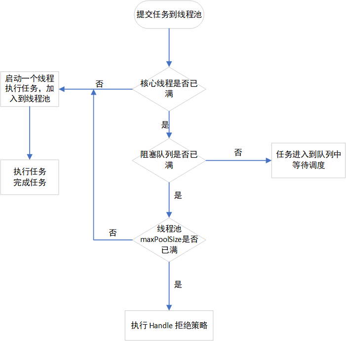

[toc]

线程的创建与销毁，涉及到了系统调用，比较消耗系统资源。因此引入线程池技术，避免频繁地创建和销毁线程。

通常，线程池的创建需要用到 `Executors` 类，其本质是 `new ThreadPoolExecutor` 对象。如创建一个固定大小的线程池 `newFixedThreadPool`

```java
public static ExecutorService newFixedThreadPool(int nThreads) {
    return new ThreadPoolExecutor(nThreads, nThreads,
                                  0L, TimeUnit.MILLISECONDS,
                                  new LinkedBlockingQueue<Runnable>());
}
```


# ThreadPoolExecutor

先来看看 `ThreadPoolExecutor`带全参数的构造方法

```java
public ThreadPoolExecutor(int corePoolSize,
                          int maximumPoolSize,
                          long keepAliveTime,
                          TimeUnit unit,
                          BlockingQueue<Runnable> workQueue,
                          ThreadFactory threadFactory,
                          RejectedExecutionHandler handler)
```

1. corePoolSize：线程池的核心线程数。即使线程池中没有任何任务，也会有核心线程数等候任务；
2. maximumPoolSize：最大的线程数。无论提交了多少任务，线程池中最多工作的线程数为 maximumPoolSize。
3. keepAliveTime：线程的存活时间。当线程池的线程数大于  corePoolSize，如果超过了 keepAliveTime 时长还没有可执行任务，那么线程退出。
4. unit：keepAliveTime 的单位。如 `newFixedThreadPool` 给的单位是 `TimeUnit.MILLISECONDS`。
5. workQueue：阻塞队列，提交任务时会被放在这个队列中；
6. threadFactory：线程工厂，用来执行创建线程的工厂类；
7. handler：拒绝策略。由于线程边界和队列容量的限制，执行会被阻塞式被使用。


> corePoolSize 是指在默认情况下线程池的大小，即使没有任务执行，也会创建一定大小的线程。
>
> maximumPoolSize 是指可以使线程池中的线程最大达到这个数。


# 流程

## 图形流程



1. 当任务被提交到线程池时，首先会判断当前线程数量的数量是否满足**小于 corePoolSize**。如果**满足小于**，那么则创建线程来执行提交的任务；
2. 当前线程数量的数量**不满足小于 corePoolSize**，那么将任务放到 workQueue 阻塞等列中。如果阻塞队列**还没未满**，那么任务会被放入队列中等待；
3. 如果如果阻塞队列**已满**，那么就判断当前线程数量与maximumPoolSize的大小。如果当前线程数量**小于maximumPoolSize**，那么就创建线程执行任务；否则调用 Handle 的拒绝任务策略。


## 源码流程

阅读源码，就以 1.8 的 jdk 为例，找到 `ThreadPoolExecutor` 的 `execute`。

```
 public void execute(Runnable command) {
        if (command == null)
            throw new NullPointerException();
        /*
         * Proceed in 3 steps:
         *
         * 1. If fewer than corePoolSize threads are running, try to
         * start a new thread with the given command as its first
         * task.  The call to addWorker atomically checks runState and
         * workerCount, and so prevents false alarms that would add
         * threads when it shouldn't, by returning false.
         *
         * 2. If a task can be successfully queued, then we still need
         * to double-check whether we should have added a thread
         * (because existing ones died since last checking) or that
         * the pool shut down since entry into this method. So we
         * recheck state and if necessary roll back the enqueuing if
         * stopped, or start a new thread if there are none.
         *
         * 3. If we cannot queue task, then we try to add a new
         * thread.  If it fails, we know we are shut down or saturated
         * and so reject the task.
         */
        // ctl 主池控制状态，其封装量线程状态和有效线程个数两个参数的对象。
        int c = ctl.get();
        // 如果当前有效线程的个数小于 corePoolSize，那么就可以调用 addWorker。
        if (workerCountOf(c) < corePoolSize) {
            if (addWorker(command, true))
                return;
            c = ctl.get();
        }
        // 如果线程正在运行，且 workQueue 队列已满
        if (isRunning(c) && workQueue.offer(command)) {
            int recheck = ctl.get();
            // 如果当前线程未运行，且任务已经被移除，就直接执行拒绝策略
            if (! isRunning(recheck) && remove(command))
                reject(command);
            //如果还有一个线程可以消费当前任务，那么就可以执行 addWorker。
            else if (workerCountOf(recheck) == 0)
                addWorker(null, false);
        }
        // 如果调用 addWorker，也执行拒绝策略
        else if (!addWorker(command, false))
            reject(command);
    }
}
```


再来看看 addWorker

```java
private boolean addWorker(Runnable firstTask, boolean core) {
    ...
    boolean workerStarted = false;
    boolean workerAdded = false;
    Worker w = null;
    try {
        w = new Worker(firstTask);
        // 创建一个线程
        final Thread t = w.thread;
        if (t != null) {
            final ReentrantLock mainLock = this.mainLock;
            mainLock.lock();
			...
            if (workerAdded) {
                // 线程启动
                t.start();
                workerStarted = true;
            }
        }
    } 
    ...
    return workerStarted;
}
```


因为 `t.start`  会执行线程，线程内容在 run 方法中。

```java
public void run() {
    runWorker(this);
}

final void runWorker(Worker w) {
    Thread wt = Thread.currentThread();
    Runnable task = w.firstTask;
    w.firstTask = null;
    w.unlock(); // allow interrupts
    boolean completedAbruptly = true;
    try {
        // 从 workerQueue 读取任务
        while (task != null || (task = getTask()) != null) {
            w.lock();
            // If pool is stopping, ensure thread is interrupted;
            // if not, ensure thread is not interrupted.  This
            // requires a recheck in second case to deal with
            // shutdownNow race while clearing interrupt
            if ((runStateAtLeast(ctl.get(), STOP) ||
                 (Thread.interrupted() &&
                  runStateAtLeast(ctl.get(), STOP))) &&
                !wt.isInterrupted())
                wt.interrupt();
            try {
                beforeExecute(wt, task);
                Throwable thrown = null;
                try {
                    // 执行 task 的线程方法。
                    task.run();
                } catch (RuntimeException x) {
                    thrown = x; throw x;
                } catch (Error x) {
                    thrown = x; throw x;
                } catch (Throwable x) {
                    thrown = x; throw new Error(x);
                } finally {
                    afterExecute(task, thrown);
                }
            } finally {
                task = null;
                w.completedTasks++;
                w.unlock();
            }
        }
        completedAbruptly = false;
    } finally {
        processWorkerExit(w, completedAbruptly);
    }
}
```

