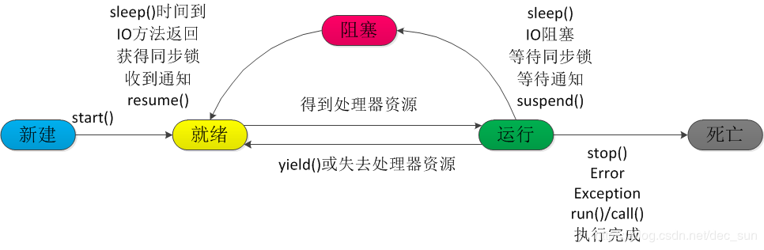
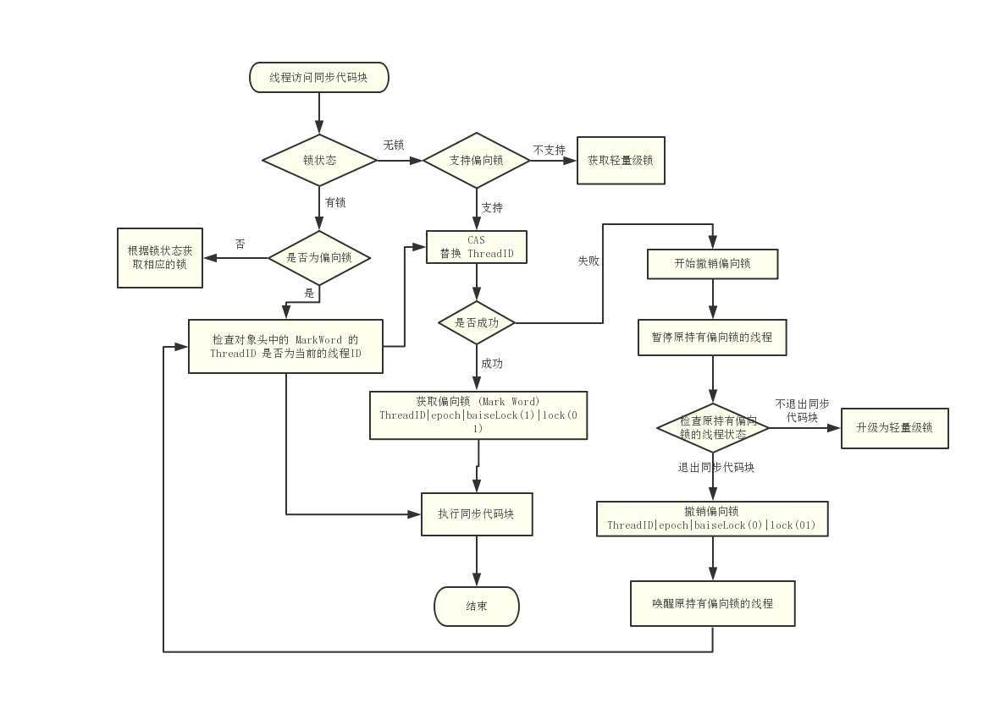
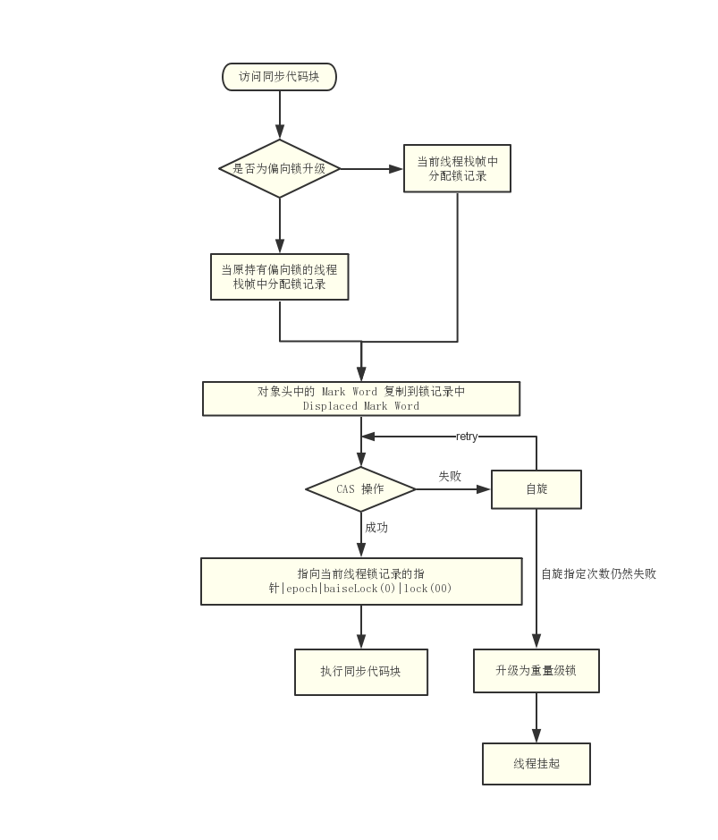

[toc]
并行：多个任务可以同时执行；
并发：多个任务在一个极短的时间间隔交替执行，但是这依然给人一种多个任务同时执行的感觉。

并行一定是并发的，但是并发不是并行。并行基本可以看作是一种理想情况下的操作。


# 线程创建

线程创建实际上有三种方式：

1.  继承 Thread 类
2.  实现 Runnable 接口
3.  实现 Callable 接口

```
public static void main(String[] args) {

  //第一种方法，直接继承 Thread
  new Thread(){
      @Override
      public void run() {
          System.out.println("myThread: "+this.getName());
      }
  }.start();

  // 第二种方法，实现 Runnable 接口
  Runnable ra = new Runnable() {
      public void run() {
          System.out.println("myThread: "+this.toString());
      }
  };
  new Thread(ra).start();

  // 第三种方法，实现 Callable 接口
  Callable<String> ca = new Callable<String>() {
      public String call() throws Exception {
          return "this is Callable";
      }
  };
  FutureTask<String> ft= new FutureTask<String>(ca);
  new Thread(ft).start();
  
  try {
       String result = ft.get();
       System.out.println("result: "+result);
  } catch (Exception e) {
      e.printStackTrace();
  }
}
```

总结：Thread，Runnable，Callable，其实都是需要调用 Thread.start 来执行。其中 Thread，Runnable 没有返回值，Callable 有返回值。如果需要获取返回值，就需要使用 Callable 来创建线程。


# 线程的状态


1.  新建状态： new Thread()
2.  就绪状态 ：new Thread().start()，此时线程仅仅开始要启动了，还需要 JVM 进行调度来执行。
3.  运行状态：由 JVM 调度后，对应着线程已经获取了 CPU  资源，开始执行 run 的方法体。
4.  阻塞状态：线程放弃了 CPU 的使用权，暂时停止运行了
5.  死亡状态：线程正常结束或非正常结束

- sleep()：Thread 的静态方法，调用该方法会让当前线程睡眠指定时间，并让出 CPU 资源，但是不放弃对象锁。。当 sleep() 超时，线程才进入就绪状态。而在 sleep() 指定时间内，线程处于阻塞状态。

- join ()：Thread 的方法，t.join()，使当前线程进入阻塞状态，直到 t 线程完成后，当前线程才开始再继续。

- yeild()：Thread 的静态方法，t.yeild()，会使 t 线程从运行状态转到就绪状态，让优先级更高的线程获得 CPU来执行，但是不能保证 t 线程就一定不会进入到运行状态。

- wait()：属于 Object 的方法，调用 wait() 会使线程放弃对象锁，进入等待此对象的等待锁定池，只有针对此对象调用 notify() 后本线程才进入对象锁定池准备获取对象锁进入运行状态。

| sleep                                                        | yeild                                                        | wait                                                         | join                                                     |
| ------------------------------------------------------------ | ------------------------------------------------------------ | ------------------------------------------------------------ | -------------------------------------------------------- |
| 调用线程在给定时间内处于阻塞状态。当超过给定时间，调用线程就进入到了就绪状态。不会释放同步监视器 | 调用线程直接进入到就绪状态，等待 JVM 的调度。不会释放同步监视器 | 导致调用线程等待。调用线程会释放掉它所占有的“锁标志”，从而使别的线程有机会抢占该锁。 | 等待调用join方法的线程结束后，当前或其他线程再继续执行。 |
| 属于 Thread 的静态方法                                       | 属于 Thread 的静态方法                                       | 属于 Object 的方法                                           | 属于 Thread 的非静态方法                                 |
|                                                              |                                                              | 需要其它线程调用 nofity 和 notifyAll 来唤醒等待线程。但是不能保证一定唤醒的就是等待线程。 |                                                          |
*注：这里所谓的调用线程就是 t.method()，t 认为是调用线程。* 


# 线程池

线程池就是将多个线程对象放在一个容器中，当使用的时候就不用 new 线程而是直接去池中拿出线程就可。同时线程的频繁创建与销毁是十分浪费资源的，因而需要使用线程池。
1. 减少创建和销毁线程的次数；
2. 根据系统的承压能力，调整线程池在工作线程的数目，防止消耗过多的内存。

```
ExecutorService es = Executors.newFixedThreadPool(5);
  while (true){
      es.execute(new Runnable() {
          public void run() {
              System.out.println(Thread.currentThread().getName() + " is running");

              try {
                  Thread.sleep(2000);
              } catch (InterruptedException e) {
                  e.printStackTrace();
              }
          }
      });
  }
```

- newCachedThreadPool
用来处理大量短时间工作任务的线程池。它会试图缓存线程并重用，当无缓存线程可用时，就会创建新的工作线程并添加到线程池中。如果线程闲置的时间超过了 60s，该线程就会被终止并被移除缓存。长时间保持空闲的线程池不会使用任何资源。
- newFixedThreadPool
创建一个可重用固定线程数的线程池，其背后使用的是无界的工作队列，任何时候最多只有指定个数的线程时活动的。如果任务数量超过了指定个数的活动队列数目，酱紫啊工作队列中出现等待空闲线程出现；如果有任务线程退出，将会有新的工作线程被创建，弥补指定的线程数目。
- newScheduledThreadPool
创建的是一个指定线程个数的计划线程池，可以进行周期性或定时的工作任务。
- newSingleThreadExecutor
返回一个线程池，该线程池的工作线程数目为 1。所以可以保证所有任务都可以被顺序执行。


## 线程池的作用

1. 降低资源消耗。通过重复利用已创建的线程降低线程创建和销毁造成的消耗；
2. 提高响应速度。当任务到达时，任务可以不需要等到线程创建就能立即执行；
3. 提高线程的可管理性。线程时稀缺资源，如果无限制的创建，不仅会消耗系统资源，，还会降低系统的稳定性，使用线程池可以进行统一的管理和分配，调优和监控。


# 同步锁
| 悲观锁                                                       | 乐观锁                                                       |
| ------------------------------------------------------------ | ------------------------------------------------------------ |
| 悲观锁采用相对保守的策略，在资源争用比较严重的时候比较合适。悲观锁在事务开始之前就去尝试获得写权限，事务结束后释放锁；也就是说对于同一行记录，只有一个写事务可以并行（加锁，只有我能操作）. | 乐观锁是在提交事务之前，大家可以各自修改数据，但是在提交事务的时候，如果发现在这个过程中，数据发生了改变，那么直接拒绝此次事务提交。（允许大家都操作，只是在提交事务中检测）乐观锁适合在资源争用不激烈的时候使用。 |
| 当前只能有写权限的用户可以操作, 而其他用户此时被拒绝. 如 synchronized (不允许写, 更不会执行) | 当前所有用户都可以操作, 但是在提交时会被拒绝. 如watch - multi - exec (允许写, 但不一定可以执行.) |

synchronized 是一种锁，它可以作用在类的实例方法，静态方法，代码块上。用来保证被修饰的实例方法，静态方法，代码块只能同时被一个对象来执行，其具有独占排他性，属于悲观锁，亦是可重入锁（递归锁）。这样就能保证在同一时间内只允许一个线程来访问了。


## 同步代码块
```
synchronized (obj){
    
}
```
在线程开始执行同步代码块之前，必须首先获得对同步监视器的锁定。当同步代码块执行完成后，线程会释放对同步监视的的锁定。

对于同步监视器，需要是可能被并发访问的共享资源充当同步监视器。因为同步监视的目的：阻止多个线程对同一个共享资源进行并发访问。当执行同步代码块时，线程会对当前代码块加锁，放置其他线程进行访问，然后再执行代码块内容，执行完成后就释放锁，其他线程就可以再次抢占独占代码块资源的修改。


## 同步方法
同步方法就是使用 synchronized 关键字进行修饰。对于同步的非静态方法而言，指定的同步监视器是当前对象 this，也就是当前调用该方法的对象。对于同步的静态方法而言，指定的同步监视器是当前的类，也就是对类进行加锁。

同步非静态方法 -- 对象锁
```
public synchronized void demo2(){
    
}
```
| 同一个对象在多个线程中访问多个同步非静态方法                 | 不同对象在多个线程中访问同一个同步非静态方法                 |
| ------------------------------------------------------------ | ------------------------------------------------------------ |
| 互斥。因为对象访问一个 synchronized 方法时，对象就被锁定了。需要等待执行完毕后才能被释放 | 不互斥。因为这仅仅是针对对象进行锁定，如果是不同的两个对象，可以访问同一个同步方法的。 |

同步静态方法 -- 类锁       

```
public static synchronized void demo2(){

}
```

| 用类直接在多个线程中调用多个不同的同步方法                   | 同一个对象在多个线程中分别访问一个同步静态方法和一个同步非静态方法 |
| ------------------------------------------------------------ | ------------------------------------------------------------ |
| 互斥。因为类访问一个 synchronized 静态方法时，类对象就被锁定了 | 不互斥，因为非静态方法是针对对象锁，而同步静态方法是针对类锁。两个之间不会锁定。 |


# 死锁

当多个线程相互等待其他线程释放同步锁时就会发生死锁。也就是说线程之间持有对方需要的锁而发生阻塞。

防止死锁
- 尽量使用 java.util.concurrent 并发类代替自己手写锁；
- 尽量降低锁的使用粒度，尽量不要将几个功能使用同一把锁；
- 尽量减少同步的代码块；
- 尽量使用 tryLock 的方法，设置超时时间，超时可以退出放置死锁。


# volatile 关键字

1. 保证不同线程对变量进行操作时的可见性。即一个线程修改了某个变量，那么这个变量对其它线程来说是可见的。
2. 禁止进行指令的重排序


## volatile 与 synchronized

| volatile                                   | synchronized                     |
| ------------------------------------------ | -------------------------------- |
| 仅能使用在变量级别                         | 可以在变量，方法和类中使用       |
| 仅能实现变量的修改可见性，并不能保证原子性 | 可以保证变量修改的可见性和原子性 |
| 不会造成线程阻塞                           | 可能造成线程阻塞                 |
| 标记的变量不会被编译器优化                 | 标记的变量可以被编译器优化       |


# 自旋锁

是指当一个线程在获取锁的时候，如果锁已经被其它线程获取，那么该线程将循环等待，然后不断的判断锁是否能够被成功获取，直到获取到锁才会退出循环。 

- 自旋锁存在的问题

1. 如果某个线程持有锁的时间过长，就会导致其它等待获取锁的线程进入循环等待，消耗CPU。使用不当会造成CPU使用率极高。 
2. 上面Java实现的自旋锁不是公平的，即无法满足等待时间最长的线程优先获取锁。不公平的锁就会存在“线程饥饿”问题。

- 自旋锁的优点
自旋锁不会使线程状态发生切换，一直处于用户态，即线程一直都是 active 的；不会使线程进入阻塞状态，减少了不必要的上下文切换，执行速度快；
非自旋锁在获取不到锁的时候会进入阻塞状态，从而进入内核态，当获取到锁的时候需要从内核态恢复，需要线程上下文切换。 


# 可重入锁

是指在同一个线程在外层方法获取锁的时候，再进入该线程的内层方法会自动获取锁，不会因为之前已经获取过还没释放而阻塞。Java 中 ReentrantLock 和 synchronized 都是可重入锁，可重入锁的一个优点是可一定程度避免死锁。

1. 可重入锁的一个优点是可一定程度避免死锁
2. AQS通过控制status状态来判断锁的状态，对于非可重入锁状态不是0则去阻塞；对于可重入锁如果是0则执行，非0则判断当前线程是否是获取到这个锁的线程，是的话把status状态＋1，释放的时候，只有status为0，才将锁释放。


# 偏向锁

偏向于第一个访问锁的线程，如果在运行过程中，同步锁只有一个线程访问，不存在多线程争用的情况，则线程是不需要触发同步的。

偏向锁不存在锁的释放，它只存在锁的撤销。

偏向锁可以提高带有同步但无竞争的程序性能。但是它并不一定总是对程序运行有利，如果程序中有大多数的锁总是被多个不同的线程访问，那么偏向锁就是多余的。

偏向锁的获取流程



# 轻量级锁

轻量级锁提升程序同步性能的依据是：对于绝大部分的锁，在整个同步周期内都是不存在竞争的（区别于偏向锁）。这是一个经验数据。如果没有竞争，轻量级锁使用CAS操作避免了使用互斥量的开销，但如果存在锁竞争，除了互斥量的开销外，还额外发生了CAS操作，因此在有竞争的情况下，轻量级锁比传统的重量级锁更慢。

轻量级锁的获取



# 重量级锁

重量级锁是依赖对象内部的monitor锁来实现的，而monitor又依赖操作系统的MutexLock(互斥锁)来实现的，所以重量级锁也称为互斥锁。