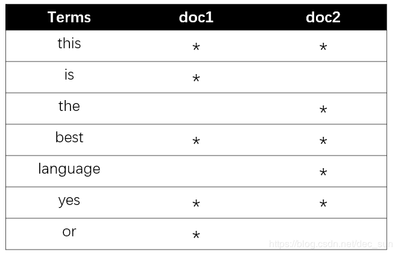
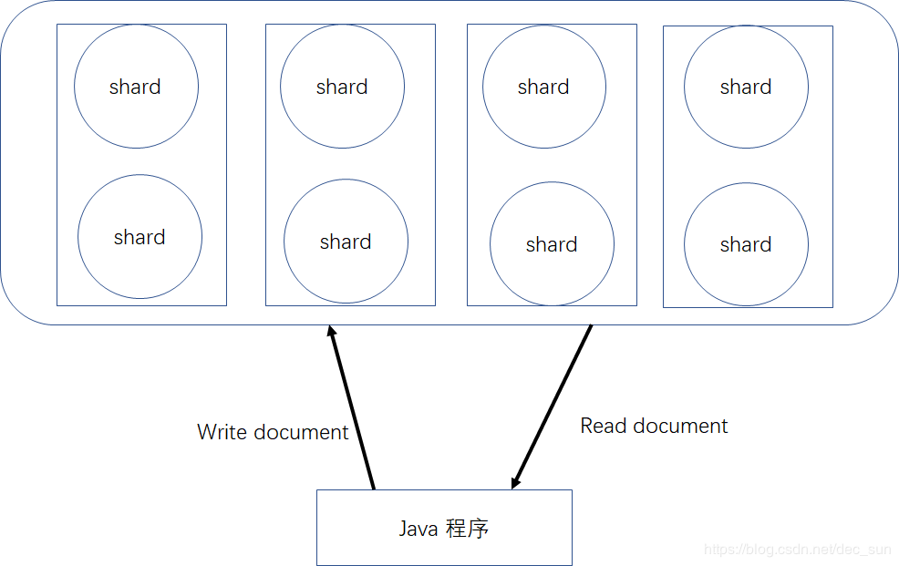
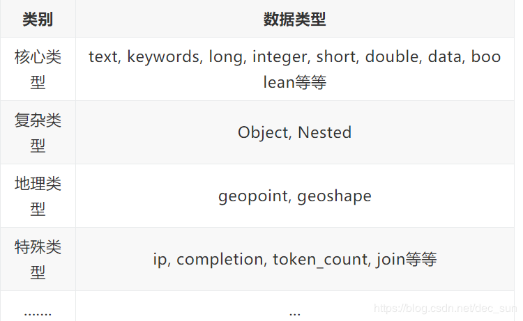

[TOC]

# 引入
Elasticsearch 是一个实时分布式搜索和分析引擎。它是由  java 编写的一种开源搜索引擎，通过对 Lucene 进行封装，隐藏 Lucene 的复杂性，使用 Lucene 做索引和搜索。其主要功能包括：分布式的搜索引擎和数据分析引擎；全文检索，结构化检索，数据分析；对海量数据进行近实时的处理。

## 特点
1. 可以作为一个大型分布式集群技术，处理 PB 级数；亦可以在单机上运行；
2. es 主要将全文检索、数据分析以及分布式技术，合并在一起；
3. 开箱即用，简单部署；
4. 主要进行全文检索、同义词处理、相关度排名，复杂数据分析，以及对海量数据的近实时处理。

# 安装与运行
平台：window 10， JDK1.8
软件：elasticsearch + kibana
步骤：解压即用。
开启：elasticsearch.bat + kibana.bat
chrome：localhost:9200，验证 es 启动成功。
				localhost:5601， 点击 Dev Tools 界面，GET _cluster/health，操作平台启动。


## 集群

ES 的集群搭建很简单，不需要依赖第三方协调管理组件，自身内部就实现了集群的管理功能。ES 集群由一个或多个 Elasticsearch 节点组成，每个节点配置相同的 cluster.name 即可加入集群，默认值为 “elasticsearch”。确保不同的环境中使用不同的集群名称，否则最终会导致节点加入错误的集群。

一个 Elasticsearch 服务启动实例就是一个节点（Node）。节点通过  node.name 来设置节点名称，如果不设置则在启动时给节点分配一个随机通用唯一标识符作为名称。

# 基础知识
- Index 索引
存储数据的行为就叫索引 index。

- Type 类型
包含一对相似结构的文档数据，一般一个 index 包含一个或多个 type，type 是 index 中的一个逻辑数据分类

-  Document 文档
es 中的最小数据单元，一个 document 可以是一条客户数据，一条订单数据等，通常使用 JSON 数据结构表示。

- Field 字段
每个 document 包含多个字段 field。

| ElasticSearch | database  |
| ------------- | --------- |
| Indexes       | Databases |
| types         | tables    |
| documents     | rows      |
| fields        | columns   |

```
/index/type/document
{
	"field_1":value_1
	"field_2":value_2
	"field_3":value_3
	"field_4":value_4
}

--------------------------------------
/shop/product /1
{
  "product_id": "1",
  "product_name": "高露洁牙膏",
  "product_desc": "高效美白",
  "category_id": "2",
  "category_name": "日化用品"
}
```

- Term 索引词
是一个能被索引的精确值。索引词 term 是可以通过 term 查询进行准确的搜索。

- Text 文本
文本是一段普通的非结构化文字。

- Analysis 分析
分析是将文本转换为索引词的过程，分析的结果依赖于分词器。

- Cluster 集群
包含多个节点，对外提供索引和搜索功能。每个节点属于哪个集群是通过一个配置来决定的。

- Node 节点
一个节点是一个逻辑上的独立服务，是集群的一部分，可以存储数据，参与集群的索引和搜索功能。

- Routing 路由
当存储一个文档的时候，会存储在唯一的主分片中，具体哪个分片是通过散列值进行选择。

- Shard 分片
单台机器无法存储大量数据，es 可以将一个索引中的数据切分为多个 shard，分布在多台服务器上存储。有了 shard 就可以横向扩展，存储更多数据，让搜索和分析等操作分布到多台服务器上去执行，提升吞吐量和性能。每个 shard 都是一个 lucene index。


- Replica 复制
任何一个服务器随时可能故障或宕机，此时 shard 可能就会丢失，因此可以为每个 shard 创建多个 replica 副本。replica 可以在 shard 故障时提供备用服务，保证数据不丢失，多个 replica 还可以提升搜索操作的吞吐量和性能。

- Mapping 映射
映射想关系型数据库中的表结构，每个索引都有一个映射，它定义了索引中的每个字段类型，以及一个索引范围内的设置。

- Source field 来源字段
这允许从搜索结果中访问原始对象，这个对象返回一个精确的 JSON 字符串，这个对象不显示索引分析后的其他任何数据。

- Id 主键
一个document 的文艺标识 ，如果没有提供 id，系统会自动生成一个。

## 倒排索引
ES 是以 Lucene为基础建立的开源可用全文搜索引擎，Lucene 能实现全文搜索主要是实现了倒排索引的查询结构。

**倒排索引** 是通过文档中的所有不重复的词与文档列表关联的结构组成。即如：<word,<doc1,doc2,...>>。这种由属性组来确定记录的位置的结构就是倒排索引。




词条（term）：索引中最小的存储和查询单元。

词典（term dictionary）：词条 term 的集合，搜索引擎通常索引单位是单词，单词词典是由文档集合中出现过的所有单词构成的字符串集合，单词词典内每条索引项即在单词本身的一些信息以及指向倒排列表的指针。

倒排表（post list）：一个文档通常由多个词组成，倒排表记录的是某个词在哪些文档里出现过以及出现的位置每条记录成为一个倒排项。

倒排文件（Inverted file）：所有单词的倒排列表往往顺序地存储在磁盘的某个文件里，这个文件被称为倒排文件。倒排文件是存储倒排索引的物理文件。

### 倒排索引结构

    （1）包含这个关键词的document list
    （2）包含这个关键词的所有 document 的数量：IDF（inverse document frequency）
    （3）这个关键词在每个document中出现的次数：TF（term frequency）
    （4）这个关键词在这个 document 中的次序
    （5）每个document的长度：length norm
    （6）包含这个关键词的所有document的平均长度

倒排索引不可变的好处

    （1）不需要锁，提升并发能力，避免锁的问题
    （2）数据不变，一直保存在os cache中，只要cache内存足够
    （3）filter cache一直驻留在内存，因为数据不变
    （4）可以压缩，节省cpu和io开销

倒排索引不可变的坏处：每次都要重新构建整个索引

## 容错
1. master 选举，自动选举另外一个  node 为 master node，承担起 master 的责任。在 old master node 宕机的那一刻，由于 primary 和 replica 不完全都是 active 的，所以此时是 red。
2. 新 master  node 将丢失掉 primary shard 的 replica shard 提升为 primary shard。此时 cluster status 会变成 yellow，因为虽然 primary shard 都已经 active，但是 replica shard 并非全部 active的；
3. 重启故障的 node，new master 会将缺失的副本都拷贝到该 node 上，而且该 node 会使用之前已有的 shard 数据，只会同步一个宕机之后发生过的修改。此时 cluster status 会变成 green，因为 primary shard 和 replica shard 都是 active 了。 

# document
## document 增删改操作内部流程
1. 当客户端选择任何一个 node 发送请求消息，这个 node 就是 coordinate node。
2. coordinate node 对 document 进行路由，将请求转发给 node （primary shard）。
3. 拥有指定 primary shard 的 node 实际处理请求，然后将数据同步到 replica node。
4. coordinate node 如果发现 primary node 和 replica node 都完成数据操作，就返回相应结果给客户端。

## quroum
Quroum 机制： 写之前必须确保大多数 shard 可用，处于 active 状态，才生效。
`availableNumber = (primary + number_of_replicas) / 2 ) + 1`

在分布式系统中，进行增删改操作时，需要保证数据的一致性。在 es 中，进行数据操作时，可以采用
`put /index/type/id?consistency=quorum`

one：要求写操作只要有一个primary shard是active活跃可用的，就可以执行
all：要求写操作，必须所有的 primary shard 和 replica shard 都是活跃的，才可以执行
quorum：默认的值，要求所有的 shard 中，必须是超过半数的 shard 都是活跃的，才可以执行

 - [ ] 当 quorum 不齐全时设置 wait，默认1分钟。`timeout，100，30s`。
等待期间，期望活跃的 shard 数量可以增加，最后实在不行，就会timeout。这样写操作就失败了。
我们其实可以在写操作的时候，加一个 timeout 参数，比如说 put /index/type/id?timeout=30，这个就是说自己去设定 quorum 不齐全的时候，es 的 timeout 时长，可以缩短，也可以增长。

##  document 查操作内部流程
1、客户端发送请求到任意一个 node，成为 coordinate node。
2、coordinate node 对 document 进行路由，将请求转发到对应的 node，此时会使用 round-robin 随机轮询算法，在 primary shard 以及其所有 replica 中随机选择一个，让读请求负载均衡。
3、接收请求的 node 返回 document 给 coordinate node。
4、coordinate node 返回 document 给客户端。
5、特殊情况：document 如果还在建立索引过程中，可能只有 primary shard 有，任何一个 replica shard 都没有，此时可能会导致无法读取到 document，但是 document 完成索引建立之后，primary shard 和 replica shard 就都有了。

在分布式系统之，查操作可以在多个 shard（一个 primary shard 和 多个 replica shard） 中查询，保证读请求的负载均衡。而增删改都是在 primary 进行操作后，然后同步操作到 replica shard 上的。


## es 与 json格式
在 es 操作中，可以发现 es 并非使用了标准的 json 格式。

采用标准的 json 格式，可读性非常高，es 拿到那种标准格式的 json 串以后，要按照下述流程去进行处理：
1. 将 json 数组解析为 JSONArray 对象，这个时候就会在内存中出现一份一模一样的拷贝，一份数据是 json 文本，一份数据是 JSONArray 对象
2. 解析 json 数组里的每个 json，对每个请求中的 document 进行路由
3. 为路由到同一个 shard 上的多个请求，创建一个请求数组
4. 将这个请求数组序列化
5. 将序列化后的请求数组发送到对应的节点上去

由于采用标准的 json 格式，会有一分数据拷贝，这样会导致占用更多的内存；占用更多的内存可能就会积压其他请求的内存使用量，此时就可能会导致其他请求的性能急速下降；占用内存更多，就会导致 java 虚拟机的垃圾回收次数更多，更频繁，每次要回收更多的垃圾对象，耗费更多的时间。

es 中的类似于 json 格式的优点:
1. 不用将其转换为 json 对象，不会出现内存中的相同数据的拷贝，直接按照换行符切割 json
2. 对每两个一组的 json，读取 meta，进行 document 路由
3. 直接将对应的 json 发送到 node上去
4. 最大的优势在于，不需要将json数组解析为一个JSONArray对象，形成一份大数据的拷贝，浪费内存空间，尽可能地保证性能。

# type
Type 是一个 index 中用来区分类似的数据。类似的数据，但是可能有不同的 fields，而且有不同的属性来控制索引的建立。

field 的 value，在底层的 Lucene 中建立索引的时候，全部都是 opaque bytes 类型。因为 Lucene 没有 type的概念。在 Document 中，实际上将 type 作为一个 document 的 field 来存储，即 _type，es 通过 _type 进行 type 的过滤和筛选。

一个 index 中的多个 type，实际上是放在一起存储，因此一个 index 下，不能有多个 type 重名而类型或者其他设置不同的。

`GET /ecommerce/_mapping/`

# 操作
## 增删改查
| 增   | 删     | 改       | 查   |
| ---- | ------ | -------- | ---- |
| PUT  | DELETE | POST/PUT | GET  |

- 检查集群健康状态
`GET /_cluster/health?v`：快速检查集群的健康状况 
`GET /_cat/health?v` ：快速查看集群的索引
`PUT /test_index?pretty`：创建索引
`DELETE /test_index?pretty`：删除索引


- [ ]  集群的健康状态：
green：每个索引的primary shard和replica shard都是active状态的

yellow：每个索引的primary shard都是active状态的，但是部分replica shard不是active状态，处于不可用的状态

red：不是所有索引的primary shard都是active状态的，部分索引有数据丢失了
| green              | yellow               | red                          |
| ------------------ | -------------------- | ---------------------------- |
| 分片与副本正常工作 | 部分副本没有正常工作 | 部分分片及其副本没有正常工作 |

在 red 状态， ES 可以继续使用，但是其提供的搜索结果可能是不正确的，需要尽快修复集群。


| epoch      | timestamp | cluster       | status | node.total | node.data | shards | pri  | relo | init | unassign | pending_tasks | max_task_wait_time | active_shards_percent |
| ---------- | --------- | ------------- | ------ | ---------- | --------- | ------ | ---- | ---- | ---- | -------- | ------------- | ------------------ | --------------------- |
| 1567181133 | 00:05:33  | elasticsearch | yellow | 1          | 1         | 21     | 21   | 0    | 0    | 21       | 0             | -                  | 50.0%                 |


### 新增文档
```
PUT /index/type/id
{
  "json数据"
}
-------------------------------------------------------------------------
PUT /ecommerce/product/1
{
    "name" : "gaolujie yagao",
    "desc" :  "gaoxiao meibai",
    "price" :  30,
    "producer" :      "gaolujie producer",
    "tags": [ "meibai", "fangzhu" ]
}

-------------------------------------------------------------------------
es 会自动建立index和type，不需要提前创建，而且 es 默认会对 document 每个 field 都建立倒排索引，让其可以被搜索
```

### 修改替换
PUT 修改替换需要带上所有的 field，才能去修改信息。
```
PUT /ecommerce/product/1
{
    "name" : "jiaqiangban gaolujie yagao",
    "desc" :  "gaoxiao meibai",
    "price" :  30,
    "producer" :      "gaolujie producer",
    "tags": [ "meibai", "fangzhu" ]
}
```

POST 修改替换只需要将相关的 field 的信息进行修改即可。
```
POST /ecommerce/product/1/_update
{
  "doc": {
    "name": "jiaqiangban gaolujie yagao"
  }
}
```

### 检索查找指定 id
```
GET /index/type/id
-------------------------------------------------------------------------
GET /ecommerce/product/1
```

### 删除指定 id

```
DELETE /index/type/id
-------------------------------------------------------------------------
DELETE /ecommerce/product/1
```

## 搜索
### query string search

```
-- query string search
GET /index/type/_search ：搜索 index/type 下的所有 document

---
took：耗费了几毫秒
timed_out：是否超时，这里是没有
_shards：数据拆成了5个分片，所以对于搜索请求，会打到所有的primary shard（或者是它的某个replica shard也可以）
hits.total：查询结果的数量，3个document
hits.max_score：score的含义，就是document对于一个search的相关度的匹配分数，越相关，就越匹配，分数也高
hits.hits：包含了匹配搜索的document的详细数据
---

GET /ecommerce/product/_search?q=name:yagao&sort=price:desc：根据“问号”之后的条件进行搜索。

适用于临时的在命令行使用一些工具，比如 curl，快速的发出请求，来检索想要的信息；但是如果查询请求很复杂，是很难去构建的。

在生产环境中，几乎很少使用query string search
```

### query DSL
```
-- query DSL(domain Specified Language)
用 json 的格式来构建查询语法，比较方便，可以构建各种复杂的语法

GET /ecommerce/product/_search
{
  "query": { "match_all": {} }
}

---
GET /ecommerce/product/_search
{
    "query" : {
        "match" : {
            "name" : "yagao"
        }
    },
    "sort": [
        { "price": "desc" }
    ]
}

-- 分页查询
GET /ecommerce/product/_search
{
  "query": { "match_all": {} },
  "from": 1,
  "size": 1
}

-- 显示指定 fields
GET  /ecommerce/product/_search
{
  "query": {"match_all": {}},
  "_source":["name","price"]
}
```

### query filter
```
--  query filter 过滤
GET /ecommerce/product/_search
{
  "query":{
    "bool": {
      "must": {
        "match":{
          "name":"yagao"
        }
      },
      "filter": {
        "range": {
          "price": {
            "gt": 25
          }
        }
      }
    }
  }
}

filter，仅仅只是按照搜索条件过滤出需要的数据而已，不计算任何相关度分数，对相关度没有任何影响
query，会去计算每个 document 相对于搜索条件的相关度，并按照相关度进行排序
```
### full-text search
```
-- 全文检索，会进行分词处理， 将  "producer" : "yagao producer" 进行分词，得到 yagao 和 producer，所以可以检索到包含它俩中一个或两个的结果。
 GET /ecommerce/product/_search
{
  "query": {
    "match": {
      "producer" : "yagao producer"
    }
  }
}
````

### phrase search
```
-- 短语搜索， 不会进行分词处理后搜索，所以搜索的结果相对少。

GET /ecommerce/product/_search
{
  "query":{
    "match_phrase": {
      "producer" : "yagao producer"
    }
  }
}
```
1. 搜索请求发送到某一个 coordinate node，构构建一个 priority queue，长度以 paging 操作 from 和 size 为准，默认为 10；
2. coordinate node 将请求转发到所有 shard，每个 shard 本地搜索，并构建一个本地的 priority queue；
3. 各个 shard 将自己的 priority queue 返回给 coordinate node，并构建一个全局的 priority queue。

一次请求要打到所有 shard 的一个 replica/primary 上去，如果每个 shard 都有多个 replica，那么同时并发过来的搜索请求可以同时打到其他的 replica 上去。

### highlight search
```
-- 高亮，对  query 的关键词进行高亮
GET /ecommerce/product/_search
{
  "query": {
    "match": {
      "name" : "yagao"
    }
  },
  "highlight": {
    "fields": {
      "name" : {}
    }
  }
}
```

### 聚合操作
```
-- 聚合操作
计算每个tag下的商品数量
GET /ecommerce/product/_search
{
  "aggs": {
    "group_by_tags": {   // 对 aggs 进行命名，可以自己命名
      "terms": {"field":"tags"}  // 查询某个字段里含有多个关键词的文档
    }
  }
}

-- 将文本 field 的 fielddata 属性设置为 true。
PUT /ecommerce/_mapping/product
{
  "properties": {
    "tags":{   // 将 field 的 tags 进行属性的修改
      "type": "text",
      "fielddata": true
    }
  }
}

-- 隐藏列表显示， size：对列表结果进行显示大小的处理。
-- 如果 size=0，那么列表就不会显示，只会显示结果。

GET /ecommerce/product/_search
{
  "size":0,  // 列表显示的条数
  "aggs": {
    "group_by_tags": { // 对 aggs 进行命名
      "terms": {"field":"tags"}  // 查询某个字段里含有多个关键词的文档
    }
  }
}

-- 对名称中包含 yagao 的商品（过滤），计算每个tag下的商品数量（聚合）

GET /ecommerce/product/_search
{
  "size":0,
  "query": {
    "match": {
      "name": "yagao"
    }
  }, 
  "aggs": {
    "group_by_tags": { 
      "terms": {"field":"tags"}  
    }
  }
}

-- 先 tag 分组，再算每组的平均值，计算每个tag下的商品的平均价格

GET /ecommerce/product/_search
{
  "size": 0, 
  "aggs": {
    "group_by_tags": {
      "terms": {
        "field": "tags"
      },
      "aggs": {
        "avg_price": {
          "avg": {
            "field": "price"
          }
        }
      }
    }
  }
}

-- 计算每个tag下的商品的平均价格，并且按照平均价格降序排序
GET /ecommerce/product/_search
{
  "size": 0, 
  "aggs": {
    "group_by_tags": {
      "terms": {
        "field": "tags"
        , "order": {
          "avg_price": "desc"
        }
      },
      "aggs": {
        "avg_price": {
          "avg": {
            "field": "price"
          }
        }
      }
    }
  }
}

-- 按照指定的价格范围区间进行分组，然后在每组内再按照tag进行分组，最后再计算每组的平均价格

GET /ecommerce/product/_search
{
  "size": 0,
  "aggs": {
    "group_by_price": {
      "range": {
        "field":"price",
        "ranges": [
          {
            "from": 0,
            "to": 20
          },
          {
            "from": 20,
            "to": 40
          },
                    {
            "from": 40,
            "to": 50
          }
        ]
      },
      "aggs": {
        "group_by_tags": {
          "terms": {
            "field": "tags"
          },
          "aggs": {
            "average_price": {
              "avg": {"field": "price"}
            }
          }
        }
      }
    }
  }
}
```

# document 核心元数据

 - _index元数据
	1. 代表一个document存放在哪个index中
	2.  类似的数据放在一个索引，非类似的数据放不同索引：product index（包含了所有的商品），sales index（包含了所有的商品销售数据），inventory index（包含了所有库存相关的数据）。如果你把比如product，sales，human resource（employee），全都放在一个大的index里面，比如说company index，不合适的。
	3.  index中包含了很多类似的document：类似是什么意思，其实指的就是说，这些document的fields很大一部分是相同的，你说你放了3个document，每个document的fields都完全不一样，这就不是类似了，就不太适合放到一个index里面去了。
	4. 索引名称必须是小写的，不能用下划线开头，不能包含逗号：product，website，blog

 - _type元数据
	1. 代表document属于index中的哪个类别（type）
	2. 一个索引通常会划分为多个type，逻辑上对index中有些许不同的几类数据进行分类：因为一批相同的数据，可能有很多相同的fields，但是还是可能会有一些轻微的不同，可能会有少数fields是不一样的，举个例子，就比如说，商品，可能划分为电子商品，生鲜商品，日化商品，等等。
	3. type名称可以是大写或者小写，但是同时不能用下划线开头，不能包含逗号

 - _id元数据
	1. 代表document的唯一标识，与index和type一起，可以唯一标识和定位一个document
	2. 我们可以手动指定document的id（put /index/type/id），也可以不指定，由es自动为我们创建一个id


## 手动指定 document id
1. 根据应用情况，是否满足手动指定 document id。

一般来说，是从某些其他的系统中，导入一些数据到 es 时，会采取这种方式，就是使用系统中已有数据的唯一标识，作为 es 中 document 的 id。

```
put /index/type/id
-----
PUT /test_index/test_type/2 
{
  "test_content": "my test"
}
```
## 自动生成 document id
如果数据存储就是 es 的一种，也就是说数据产生出来后，本来就没有 id，就直接放到 es 一个存储，那么就需要使用自动生成 id 的方式来处理了。

```
--- 自动生成document id

post /index/type

POST /test_index/test_type
{
  "test_content": "my test"
}
```
自动生成的 id，长度为 20 个字符，URL 安全 ，base64 编码，GUID，分布式系统并行生成时不可能会发生冲突。

## source 元数据
_source元数据：在创建一个 document 的时候，使用的那个放在 request body 中的 json 串，默认情况下，在 get 的时候，会原封不动的给我们返回回来。

通过 `get /test_index/test_type/1` 来获取的结果，所示即为 source 元数据。
```
{

  "_source": {  // _source 元数据
    "test_field1": "test field1",
    "test_field2": "test field2"
  }
}
```

通过制定返回来获取 field。

```
GET /test_index/test_type/1?_source=test_field1,test_field2
```

## document 全量替换

1. 语法与创建文档是一样的，如果 document id 不存在，那么就是创建；如果 document id 已经存在，那么就是全量替换操作，替换 document 的 json 串内容
2. document 是不可变的，如果要修改 document 的内容，第一种方式就是全量替换，直接对 document 重新建立索引，替换里面所有的内容
3. es 会将 old document 标记为 deleted，然后新增我们给定的一个 document，当我们创建越来越多的 document 的时候，es 会在适当的时机在后台自动删除标记为 deleted 的 document

## document 强制创建
1. 创建文档与全量替换的语法是一样的，有时我们只是想新建文档，不想替换文档，如果强制进行创建呢？
2. `PUT /index/type/id?op_type=create`
3. `PUT /index/type/id/_create`

## document 删除
1. DELETE /index/type/id
2. 不会理解物理删除，只会将其标记为 deleted，当数据越来越多的时候，在后台自动删除

先标记，在必要的时候才被自动删除。

# 分布式系统
ES 是一个分布式、可扩展、近实时的搜索与数据分析引擎。

## 集群

ES 集群的搭建不需要依赖第三方协调管理组件，自身内部就实现了集群的管理功能。ES 集群由一个或多个 ES 节点组成，每个节点配置相同的 cluster.name 即可以假如集群，默认值为 “elasticsearch”。确保不同的环境中使用不同的集群名称，否则最终会导致节点假如错误的集群。

一个 ES 服务启动实例就是一个 node，节点通过 node.name 来设置节点名称，如果不设置则在启动时就给节点分配一个随机通用唯一标识符作为名称。




在 ES 集群中，master 节点不会承载所有的请求，因此就不会造成一个单点瓶颈。

master 节点的作用：管理 ES 集群的元数据；维护索引元数据；
在默认情况下，集群会自动选择出一个节点，自动作为 master 节点。

当进行集群扩容是，集群会自动进行负载均衡，这样每个节点可以承载更少的 shard，就能保证 shard 获得更多的 IO/CPU/Memory 资源，使得每个 shard 的性能更加良好。

比如：有 6 个 shard，3 个 primary，3 个 replica，2 个 node，这样 每个 node 上有 3 个 shard，当增加一个节点时，此时集群有 3 个节点，那么集群进行负载均衡，可能会将两个 shard 分配到新的 node 上。这样，3 个 node，每个 node 拥有两个 shard。

## 容错过程
当集群中有节点出现宕机时，一定会出现 shard 丢失的问题。因此集群需要进行负载处理，保证集群可以正常的运行。

1. 在节点有宕机发生后，就需要 master 选举。集群自动动选举 node 成为 new master，承担相应的责任；
2. new master 将丢失的 primary shard 的某个 replica shard 提升为 primary shard，此时集群的 status 变成 yellow，即 primary shard 都是 active，但是少了 replica shard，所以 replica shard 不全是 active的；
3. 重启宕机的 node，new master 将缺失的副本拷贝到该 node，而且该 node 会使用之前已有的 shard 数据，只是同步一下宕机时缺失的数据。集群状态就变成了 green，因此 primary 和 replica 都是 active 的。

## shard & replica
**Shard**是 ES 通过水平拆分的方式将一个索引上的数据拆分出来分派到不同的数据块上，拆分出来的数据库块称为 “分片”。

在一个多分片的索引中写入数据时，通过路由来确定具体写入到哪一个分片中，所以在创建索引的时候需要制定分片的数量，并且分片的数量一旦被确定就不能再修改了。

ES 通过分片的功能使得索引在规模上和性能上都得到提升，每个分片都是 Lucene 中的一个索引文件。每个分片必须有一个主分片（primary shard）和（零或）多个 replica shards。

分片的数量和分片的副本数量可以通过创建索引时的 settings 来配置，ES 默认一个索引创建 3 个分片和一个副本。

```
--- 设置 test_index 索引的 primary shard 和 replica shard。
PUT /test_index
{
   "settings" : {
      "number_of_shards" : 3,
      "number_of_replicas" : 1
   }
}
```

**Replica** 是对分片的拷贝，每个主分片都有一个或多个副本分片，当主分片异常时，副本可以提供数据的查询等操作。*主分片和对应的副本分片是不会在同一个节点上的*，因此副本的最大值为 n-1（集群的节点为 n）。

对于文档的创建、更新和删除请求等写操作，必须在主分片上完成之后才能被拷贝到相关的副本分片上。一旦所有副本分片都报告写成功才会向协调节点 coordinate node 报告，协调节点 coordinate node 再向客户端报告成功。


*分片和副本不是越多越好*。这是因为每个分片都相当于一个 Lucene 的索引文件，会占用一定的文件句柄、内存以及 CPU 资源，并且分片间的数据同步也会占用一定的网络带宽。

```
1. 每个 index 包含多个 shard。

2. 每个shard 都是一个最小工作单元，承载部分数据，lucene 实例，完整的建立索引和处理请求能力。

3. 增减节点时，shard 会自动在 nodes 中负载均衡

4. primary shard 和 replica shard， 每个 document 肯定只存在于某一个 primary shard 以及其对应的 replica shard 中，不可能存在于多个 primary shard。

5. replica shard 是 primary shard 的副本，负责容错，以及承当读请求负载。

6. primary shard 的数量在创建索引的时候就固定了，replica shard 的数量可以随时修改。

7. primary shard 的默认数量是 5，replica 默认是 1，默认有 10 个shard，5 个 primary shard，5 个 replica shard。

8. primary shard 不能和自己的 replica shard 放在同一个节点上。但是可以与其他 primary shard 的 replica shard 放在一个节点上。
```

## 集群的写操作
写索引只能写在主分片上，然后在同步到副本分片。对于有多个主分片的系统上，文档的写入是可以通过 hash 来判断将该文档写到哪个分片上。

`shard = hash(routing) % number_of_primary_shards`

`routing` 是一个不可变值，默认是文档的 _id， routing 通过 hash 生成新值，然后与 primary shard 的总数相除，其余数就是 shard id。这样该文档即可以被写到相应分片上了。 

这也就说明了，为什么分片一旦被确定就并不能再修改。如果分片数量发生了变化，那么之前的路由值都将无效，文档可能就无法被找到了。

当一个写请求被发送到集群，最终通过协调节点 coordinate node 来进行协调处理， coordinate node 根据路由公司计算出文档需要写到的分片，然后转发写请求到该分片进行数据的写操作。 

 coordinate node 在写操作时主要进行协调处理，判断写操作于分片的关系，然后转发请求到对应的分片进行真正的写操作。

每当有新增的数据时，就将其先写入到内存中，在内存和磁盘之间是文件系统缓存，当达到默认的时间（1秒钟）或者内存的数据达到一定量时，会触发一次刷新（Refresh），将内存中的数据生成到一个新的段上并缓存到文件缓存系统 上，稍后再被刷新到磁盘中并生成提交点。

```
PUT /index/type/id?routing=user_id
POST /_refresh
POST /nba/_refresh
```

## 增删改的内部过程
1. 客户端选择一个 node 发送请求，这个 node 就是 coordinate node；
2. coordinate node 对 document 进行路由，将请求转发给对应的 node；
3. 实际的 node  上的primary shard 进行请求处理后，将数据同步到 replica shard；
4. coordinate node，如果发现 primary shard 和 replica node 都完成了数据处理后，将返回响应给客户端。

## 查询的内部过程
1. 客户端发送请求到任意一个 node，这个 node 就是 coordinate node；
2. coordinate node 进行路由，将请求转发给对应的 node。此时会使用 round-robin 随机轮询算法，在primary shard 以及其所有的 replica shard 上随机选择，让读请求负载均衡；
3. 接收到请求的 node 返回 document 给 coordinate node；
4. coordinate node 返回 document 给客户端；
5. 在document 还在进行建立索引过程中，可能只有 primary shard 有对应的结果，任何一个 replica shard 都还没有同步，此时可能会导致无法读取到 document，但是 document 一旦完成索引的建立，primary shard 和 replica shard 就都存在了。 

# 并发冲突
es 的操作流程：
1. 首先 get document 的数据，显示到网页，并将该数据缓存到内存；
2. 当网页发生了对该数据进行了操作，那么直接基于内存中的数据，进行数据计算操作；
3. 然后将结算结果会写到 es。

但是当有多个线程对一个数据进行操作时，如果线程 A 对该数据进行了操作，但是数据还未回写到 es，线程 B 就获取的旧数据了，这个时候线程 B 就是针对旧数据进行的操作，所以导致了并发冲突。

## 悲观锁
悲观锁是一种常见的锁，就是对一类数据进行加锁，这时，数据就对于线程而言就是独享，其他线程无法对该线程进行操作。如 MySQL。

优点：
方便，直接加锁，对应用程序而言，透明，不需要做任何额外操作；

缺点：
并发能力低，同一时间只有一条线程可以对数据进行操作；

## 乐观锁
乐观锁不会对数据加锁。在写操作时，对数据进行版本的判断，如果版本判断是一致的，那么就可以对数据进行修改。否则如版本不相等，线程需要重新从 es 中获取数据再次进行数据的操作。

优点：
并发能力高，不给数据加锁，大量线程都可以进行并发操作；

缺点：
麻烦，每次进行更新操作时，都需要进行版本号的比对，然后可能需要重新加载数据，再次修改再写。这个过程可能需要重复很多次；

es 内部采用多线程异步并发修改时，是基于自己的 _version 版本号进行乐观锁并发控制的。

### es 乐观锁并发控制
插入一条 document。
```
PUT /ecommerce/product/20
{
  "name":"xiaoheiren yagao",
  "desc":"youxiao fangzhu liangbai",
  "price":60,
  "producer":"heiren producer",
  "tags":["fangzhu","liangbai"]
}
```
查看结果

```
{
  "_index": "ecommerce",
  "_type": "product",
  "_id": "20",
  "_version": 1,      --> 版本号
  "result": "created",
  "created": true
}
```
第一次创建一个 document 的时候，它的  _version 内部版本号就是 1；以后，每次对这个 document 执行修改或者删除操作，都会对这个 _version 版本号自动加 1；哪怕是删除，也会对这条数据的版本号加 1。

在进行 document 的删除操作时，可以发现 _version 版本号进行了 +1，如果再次创建 这个 document，可以发现 _version 又一次 +1。所以从侧面印证了在进行 delete 操作时，不是立即对 documet 进行删除。

```
DELETE  /ecommerce/product/20


{
  "found": true,
  "_index": "ecommerce",
  "_type": "product",
  "_id": "20",
  "_version": 2,     --> 即使 delete 操作也是 version +1
  "result": "deleted"
}
```

### 并发控制之 version
```
-- 并发控制需要加上 version来进行操作，如果 localversion = modversion，则表示可以修改本地数据，如果 localversion != modversion，则 mod 数据将会被丢弃。

1. 创建
PUT /test_index/test_type/3
{
  "test_fields":"test test"
}

2. 获取
GET /test_index/test_type/3

3. 添加数据，注意 version 版本号
PUT /test_index/test_type/3?version=1
{
  "test_fields":"test test 3"
}

4. 添加数据，设置不同的 version 来分析实践。

?version=1   --> 版本管理

PUT /test_index/test_type/3?version=1
{
  "test_fields":"test test 4"
}
```

_version = version 才可以进行数据的更新。

### 并发控制之 external version
es 提供了一个 feature，就是说，你可以不用它提供的内部 _version 版本号来进行并发控制，可以基于你自己维护的一个版本号来进行并发控制。举个列子，加入你的数据在mysql里也有一份，然后你的应用系统本身就维护了一个版本号，无论是什么自己生成的，程序控制的。这个时候，你进行乐观锁并发控制的时候，可能并不是想要用es内部的 _version 来进行控制，而是用自己维护的那个 version 来进行控制。

```
localVersion < modVersion 才会修改数据（）

?version=1&version_type=external

_version，只有当你提供的 version与es中的_version一模一样的时候，才可以进行修改，只要不一样，就报错；

当 version_type=external 的时候，只有当你提供的version比es中的_version大的时候，才能完成修改

es，_version=1 if ? version=1 --> 才能更新成功 : 更新失败
es，_version=1 if ? version>1&version_type=external --> 更新成功 ：更新失败

---
PUT /test_index/test_type/3?version=5&version_type=external
{
  "test_fields":"test test 6"
}
```

_version 必须小于 version 才可以进行数据的更新。


### 总结
version：用户设置的版本号；
_version：ES 保存的版本号；

| version                       | external version                |
| ----------------------------- | ------------------------------- |
| version=_version 可以进行修改 | version > _version 可以进行修改 |

# partial update
- 数据更新的一般操作：
1. 应用程序先发起一个 get 请求，获取到 document，展示到前台界面，供用户查看和修改
2. 用户在前台界面修改数据，发送到后台
3. 后台代码，会将用户修改的数据在内存中进行执行，然后封装好修改后的全量数据
4. 然后发送 PUT 请求，到 es 中，进行全量替换
5. es 将老的 document 标记为 deleted，然后重新创建一个新的 document

partial update 就是只需要传递必要修改的 field，不需要将全量 field 的数据全部发送。

```
post /index/type/id/_update 
{
   "doc": {
      "要修改的少数几个 field 即可，不需要全量的数据"
   }
}

ES 在进行 partial update 的执行过程，与全量替换方式基本相同：
1、ES 内部先获取 document；
2、ES 将传过来的 field 更新到 document 的 json 中；
3、ES 将 old  document 标记为 deleted；
4、ES 将修改后的 new document 创建出来；

---- 实践
PUT /test_index/test_type/10   --> 添加一条 document
{
  "test_field1": "test1",
  "test_field2": "test2"
}

POST /test_index/test_type/10/_update  --> partial update
{
  "doc": {
    "test_field2": "updated test2"
  }
}
```
特点：
1. 所有查询 、修改和写操作，都发生在 es 中的一个 shard 内部，避免了所有的网络数据传输开销，大大提升性能；
2. 减少了查询和修改中的时间间隔，可以有效减少并发冲突；

## partial update 乐观锁并发控制
documet 在首次进行创建时，其 _version = 1 ,做任何操作，其 _version 都会被更新。这也包括 partial update。每次 partial update 时，_version 就会更新。所以写操作时，就会比对 _version 值是否满足乐观锁的并发控制即可。


# 脚本
ES 是支持脚本的，可以基于 groovy 脚本实现各种各样的复杂操作 groovy 脚本。

## 内置脚本
```
PUT /test_index/test_type/11   --> 默认创建一个索引
{
  "num": 0,
  "tags": []
}

-- 每次执行一次 POST，num +1
POST /test_index/test_type/11/_update   --> 内置脚本实现
{
   "script" : "ctx._source.num+=1"
}
```

## 外部脚本
在 config\scripts 目录下创建一个 groovy 类型的文件即可。

```
-- test-add-tags.groovy，添加一个 tag，
ctx._source.tags+=new_tag

-- 执行
POST /test_index/test_type/11/_update
{
  "script": {
    "lang": "groovy", 
    "file": "test-add-tags",
    "params": {
      "new_tag": "tag1"
    }
  }
}

-- 删除操作
ctx.op = ctx._source.num == count ? 'delete' : 'none'

POST /test_index/test_type/11/_update
{
  "script": {
    "lang": "groovy",
    "file": "test-delete-document",
    "params": {
      "count": 1
    }
  }
}
```

# 批量查询
就是一条一条的查询，比如说要查询100条数据，那么就要发送100次网络请求，这个开销还是很大的。如果进行批量查询的话，查询100条数据，就只要发送1次网络请求，网络请求的性能开销缩减100倍
```
-- 批量查询指定的 document

GET /_mget
{
   "docs" : [
      {
         "_index" : "test_index",
         "_type" :  "test_type",
         "_id" :    1
      },
      {
         "_index" : "test_index",
         "_type" :  "test_type",
         "_id" :    2
      }
   ]
}

-- 批量查询 index 下不同的 type
GET /test_index/_mget
{
   "docs" : [
      {
         "_type" :  "test_type",
         "_id" :    1
      },
      {
         "_type" :  "test_type",
         "_id" :    2
      }
   ]
}

-- 查询同一个 index 下同一个 type
GET /test_index/test_type/_mget
{
   "ids": [1, 2]
}
```

# bulk 增删改
（1）delete：删除一个文档，只要1个json串就可以了
（2）create：PUT /index/type/id/_create，强制创建
（3）index：普通的put操作，可以是创建文档，也可以是全量替换文档
（4）update：执行的partial update操作

bulk api 对 json 的语法，有严格的要求，每个json串不能换行，只能放一行，同时一个json串和一个json串之间，必须有一个换行。

bulk操作中，任意一个操作失败，是不会影响其他的操作的，但是在返回结果里，会告诉你异常日志

bulk request会加载到内存里，如果太大的话，性能反而会下降，因此需要反复尝试一个最佳的bulk size。一般从1000~5000条数据开始，尝试逐渐增加。另外，如果看大小的话，最好是在5 ~ 15MB之间。

```
POST /_bulk
//删除一个文档，只要1个json串
{ "delete": { "_index": "test_index", "_type": "test_type", "_id": "3" }}       
     
// PUT /index/type/id/_create，强制创建
{ "create": { "_index": "test_index", "_type": "test_type", "_id": "12" }}         
{ "test_field":    "test12" }

// 普通的put操作，可以是创建文档，也可以是全量替换文档
{ "index":  { "_index": "test_index", "_type": "test_type", "_id": "2" }}    
{ "test_field":    "replaced test2" }	                    

// 执行的partial update操作
{ "update": { "_index": "test_index", "_type": "test_type", "_id": "1", "_retry_on_conflict" : 3} }  
{ "doc" : {"test_field2" : "bulk test1"} }

---- 实践
POST /test_index/_bulk
{ "delete": { "_type": "test_type", "_id": "3" }} 
{ "create": { "_type": "test_type", "_id": "12" }}
{ "test_field":    "test12" }
{ "index":  { "_type": "test_type" }}
{ "test_field":    "auto-generate id test" }
{ "index":  { "_type": "test_type", "_id": "2" }}
{ "test_field":    "replaced test2" }
{ "update": { "_type": "test_type", "_id": "1", "_retry_on_conflict" : 3} }
{ "doc" : {"test_field2" : "bulk test1"} }
```
bulk api对json的语法，有严格的要求，每个json串不能换行，只能放一行，同时一个json串和一个json串之间，必须有一个换行。

bulk request 会加载到内存里，如果太大的话，性能反而会下降，因此需要反复尝试一个最佳的 bulk size。一般从 1000~5000 条数据开始，尝试逐渐增加。另外，如果看大小的话，最好是在5 ~ 15MB之间。

# es 搜索引擎初识
## _search
`GET /_search`

```
{
  "took": 3,           // 整个搜索请求花费了多少毫秒
  "timed_out": false,  //是否超时
  "_shards": {         // shard 分片的结果， 默认情况下来说，一个搜索请求，shard上去，
    "total": 33,         // 会打到一个index的所有primary shard上去，
    "successful": 33,   //  每个primary shard都可能会有一个或多个replic shard，
    "failed": 0           // 所以请求也可以到primary shard的其中一个replica 
  },
  "hits": { 默认查询数据的结果，_score降序排序
    "total": 21,
    "max_score": 1,  // 本次搜索的所有结果中，最大的相关度分数是多少，越相关，_score分数越大，排位越靠前
    "hits": [
      {
        "_index": ".kibana",
        "_type": "config",
        "_id": "5.2.0",
        "_score": 1,
        "_source": {
          "buildNum": 14695
        }
      },
```

timeout：默认无 timeout，latency 平衡 completeness，手动指定timeout，timeout 查询执行机制.

timeout=10ms，timeout=1s，timeout=1m
`GET /_search?timeout=10m`

timeout 机制，指定每个 shard 只能在 time时间范围内，将搜索到的数据，直接返回给 client 程序，而不是等到所有数据都完全被搜索出来后在返回。这样就可以保证client 不必要把时间浪费在搜索上。

## multi 搜索
```
所有索引，所有type下的所有数据都搜索出来
/_search

指定一个index，搜索其下所有type的数据
/index1/_search

同时搜索两个index下的数据
/index1,index2/_search

按照通配符去匹配多个索引
/*1,*2/_search

搜索一个index下指定的type的数据
/index1/type1/_search

可以搜索一个index下多个type的数据
/index1/type1,type2/_search

搜索多个index下的多个type的数据
/index1,index2/type1,type2/_search

可以代表搜索所有index下的指定type的数据
/_all/type1,type2/_search：_all
```
es 在进行搜索时，不仅在 primary shard 上执行，同时也在 replica shard 上进行搜索操作。这样可以解决单点瓶颈的问题。

1. 客户端发送一个搜索请求，会将请求打到所有的 primary shard 上去执行，因为每个 shard 都包含部分数据，所以每个 shard 上都可能会包含搜索请求的结果；
2. 但是如果存在 replica shard，那么请求也将被打到 replica shard 上去执行。

## 分页
```
size，from

GET /_search?size=10
GET /_search?size=10&from=0
GET /_search?size=10&from=20
```
在搜索过程中个，会在多个 shard 上返回结果。比如需要搜索 100 ~ 200 条数据，那么就是从每个 shard 中拿到 100 ~200 之间的数据给 coordinate node。然后 coordinate node 会将这些数据进行排序，进行相关分数的处理，得到一份新的数据（new data）。这样返回的结果其实就是 coordinate node 进行排序后数据中（new data）的 100 ~ 200 之间的数据。这个过程叫作 deep paging。

所以在搜索过程中 ，coordinate node 上保存了大量的数据，还需要进行数据的排序和相关度的计算，需要消耗大量的网络带宽，内存，cpu。

## query 查询
```
?q=field:search content

---
GET /test_index/test_type/_search?q=test_field:test
GET /test_index/test_type/_search?q=+test_field:test  // 必须包含
GET /test_index/test_type/_search?q=-test_field:test  // 不能包含
```

在 ES 中使用：

```
GET /test_index/test_type/_search?q=test

直接搜索所有的 field ，任意一个 field 包含指定的关键字就可以被搜索出来。也就是采用了 _all 元数据。

_all： 在建立索引时，插入一条 document，它里面包含了多个 field，此时 es 会自动将多个 field 的 value，全部用字符串的方式串联起来，变成一个字符串，作为 _all field 的 value，同时建立索引。

例如：
{
  "name": "jack",
  "age": 26,
  "email": "jack@sina.com",
  "address": "guamgzhou"
}

被转化为 "jack 26 jack@sina.com guangzhou"，作为这一条 document 的_all field的值，同时进行分词后建立对应的倒排索引。
```
## 映射
映射 Mapping 是用于定于 ES 中索引的字段的存储类型，分词方式和是否存储等信息，相当于数据库中的 schema，用于描述文档中的字段和属性。

ES 可以动态进行映射处理，也就是不指定类型在创建索引时对字段进行动态识别。也可以在创建索引之前就指定字段类型，也就是动态映射。



[datatypes ：https://www.elastic.co/guide/en/elasticsearch/reference/current/mapping-types.html](https://www.elastic.co/guide/en/elasticsearch/reference/current/mapping-types.html#mapping-types)

text 用于索引全文值的字段，这些字段是可以被分词的，它们通过分词器传递，以被索引之前将字符串转换为单个术语的列表。分析过程允许 ES 搜索每个单词中每个完整的文本字段。Text 不可用于排序，很少用于聚合。例如：“空调机” 这个字段，在索引时就可能被分成 “空”，“调”，“机” 三个词，只要某一个词与它们对应就可以了（“洗衣机” 有一个 “机”，即能被匹配到）。 ---- full text

keyword 用于索引结构化内容的字段，通过用于过滤，排序和聚合。keyword 字段只能按其确切值进行搜索。如 “空调机”，就必须在被搜索的文档中出现这个词，不然无法被检索出。 ---- exact value

```
PUT test_index  // index name
{
  "mappings": {
    "test_type": { // type name
      "properties": {
        "title":    { "type": "text"},
        "name":     { "type": "text"},
        "age":      { "type": "integer"},
        "created":  {"type":   "date",
          "format": "strict_date_optional_time||epoch_millis"
        }
      }
    }
  }
}

--- 查看 mapping
GET /website/_mapping/article
```

### 动态映射 dynamic mapping
1. 定制 dynamic 策略

```
--- true：遇到陌生字段，就进行dynamic mapping
--- false：遇到陌生字段，就忽略
--- strict：遇到陌生字段，就报错
PUT /my_index
{
  "mappings": {
    "my_type": {
      "dynamic": "strict",  
      "properties": {
        "title": {
          "type": "text"
        },
        "address": {
          "type": "object",
          "dynamic": "true"
        }
      }
    }
  }
}

由于是 strict 的 mapping 模式，如果在创建索引时，增加了新字段就会报错。
PUT /my_index/my_type/1
{
  "title": "my article",
  "content": "this is my article",
  "address": {
    "province": "guangdong",
    "city": "guangzhou"
  }
}
如果没有 content 这个字段，那么就可以正常创建索引了。
```

2. 定制 dynamic mapping template

```
PUT /my_index
{
    "mappings": {
        "my_type": {
            "dynamic_templates": [
                { "en": {
                      "match":              "*_en", 
                      "match_mapping_type": "string",
                      "mapping": {
                          "type":           "string",
                          "analyzer":       "english"
                      }
                }}
            ]
}}}

上例创建了一个 en 的 dynamic mapping template，他需要匹配 en 的字段，类型是 string, 其分词器是 english。

PUT /my_index/my_type/1
{
  "title": "this is my first article"
}
title没有匹配到任何的dynamic模板，默认就是standard分词器，不会过滤停用词，is会进入倒排索引，用is来搜索是可以搜索到的

PUT /my_index/my_type/2
{
  "title_en": "this is my first article"
}
title_en匹配到了dynamic模板，就是english分词器，会过滤停用词，is这种停用词就会被过滤掉，用is来搜索就搜索不到了
```
3. 定制 default mapping template

```
PUT /my_index
{
    "mappings": {
        "_default_": {
            "_all": { "enabled":  false }
        },
        "blog": {
            "_all": { "enabled":  true  }
        }
    }
}
```

### exact&full
如果对一个 String field 进行排序，结果不一定是正确的。因为分词后是多个分词，在进行排序就不是希望得到的结果。

通常解决的方案：将一个 string field 建立两次索引，一次是分词，用来进行 full search；一次是不分词，用来进行 exact search。

```

PUT /website 
{
  "mappings": {
    "article": {
      "properties": {
        "title": {
          "type": "text",
          "fields": {
            "raw": {
              "type": "string",
              "index": "not_analyzed"
            }
          },
          "fielddata": true
        },
        "content": {
          "type": "text"
        },
        "post_date": {
          "type": "date"
        },
        "author_id": {
          "type": "long"
        }
      }
    }
  }
}


GET /website/article/_search
{
  "query": {
    "match_all": {}
  },
  "sort": [
    {
      "title.raw": {
        "order": "desc"
      }
    }
  ]
}
```

## scroll 滚动查询
使用 scoll 滚动搜索，可以先搜索一批数据，然后下次再搜索一批数据，以此类推，直到搜索出全部的数据来 scoll 搜索会在第一次搜索的时候，保存一个当时的视图快照，之后只会基于该旧的视图快照提供数据搜索，如果这个期间数据变更，是不会让用户看到的。

采用基于_doc进行排序的方式，性能较高。

每次发送 scroll 请求，我们还需要指定一个 scoll 参数，指定一个时间窗口，每次搜索请求只要在这个时间窗口内能完成就可以了

```
GET /test_index/test_type/_search?scroll=1m
{
  "query": {
 
  }
}

------
GET /test_index/test_type/_search?scroll=1m
{
  "query": {
    "match_all": {}
  },
  "sort": ["_doc"],
  "size": 2
}
```

通过 scroll 操作，结果将返回一个 scroll_id, 下一次再发送scoll请求的时候，必须带上这个scoll_id。

```
GET /_search/scroll
{
  "scroll": "1m",
  "scroll_id": 
"DnF1ZXJ5VGhlbkZldGNoAwAAAAAAAAEnFnU1aWNyNWVGU2wtb1hIbkhHTWZYQncAAAAAAAABKBZ1NWljcjVlRlNsLW9YSG5IR01mWEJ3AAAAAAAAASYWdTVpY3I1ZUZTbC1vWEhuSEdNZlhCdw=="
}
```

scoll，看起来挺像分页的，但是其实使用场景不一样。分页主要是用来一页一页搜索，给用户看的；scoll主要是用来一批一批检索数据，让系统进行处理的

### 基于scroll 的零停机重建索引
一个 field 的设置是不能被修改的，如果要修改一个 field，那么应该重新按照新的 mapping，建立一个 index，然后将数据批量查询出来，重新用 bulk api 写入 index 中。而在批量查询的时候，建议采用 scroll api，并且采用多线程并发的方式来 reindex 数据，每次 scoll 就查询指定日期的一段数据，交给一个线程即可。

1. 对旧索引创建别名，指向旧索引

```
PUT /my_index/_alias/goods_index
```

2. 新建索引，调整 mapping
```
PUT /my_index_new
{
  "mappings": {
    "my_type": {
      "properties": {
        "title": {
          "type": "text"
        }
      }
    }
  }
}
```

3. 从旧索引中批量查询数据

```
GET /my_index/_search?scroll=1m
{
    "query": {
        "match_all": {}
    },
    "sort": ["_doc"],
    "size":  1
}
```
4. 采用 bulk api 将 scoll 查出来的一批数据，批量写入新索引

```
POST /_bulk
{ "index":  { "_index": "my_index_new", "_type": "my_type", "_id": "2" }}
{ "title":    "2017-01-02" }
```

5. 将旧索引别名切换指向到 my_index_new

```
POST /_aliases
{
    "actions": [
        { "remove": { "index": "my_index", "alias": "goods_index" }},
        { "add":    { "index": "my_index_new", "alias": "goods_index" }}
    ]
}

```

6. 直接通过 索引别名来查询

```
GET /goods_index/my_type/_search
```

# 索引管理
- 创建索引
```
PUT /my_index
{
    "settings": { ... any settings ... },
    "mappings": {
        "type_one": { ... any mappings ... },
        "type_two": { ... any mappings ... },
        ...
    }
}

-----
PUT /my_index
{
  "settings": {
    "number_of_shards": 1,
    "number_of_replicas": 0
  },
  "mappings": {
    "my_type": {
      "properties": {
        "my_field": {
          "type": "text"
        }
      }
    }
  }
}
```

- 修改索引

```
PUT /my_index/_settings
{
    "number_of_replicas": 1
}
```

- 删除索引

```
DELETE /my_index
DELETE /index_one,index_two
DELETE /index_*
DELETE /_all
```

# 分词器
exact value，在建立倒排索引的时候，分词的时候，是将整个值一起作为一个关键词建立到倒排索引中的；

full text，会经历各种各样的处理，分词，normaliztion（时态转换，同义词转换，大小写转换），才会建立到倒排索引中

分词器是由一个分解器（tokenizer）、零个或多个词元过滤器（token filters）组成。

在 ES 中，索引分析模块是可以通过注册分词器来进行配置的，分词器的作用是当一个文档被索引的时候，分词器从文档中提取出若干个词元（token）来支持索引的存储和搜索。

索引分析模块包括分词器（analyzer）。分解器（tokenizer）和词元过滤器（token filters）。如果没有明确定义分析模块，系统会用内置的分词器、分解器和过滤器。

- 修改分词器的设置

```
--- 停用词：在文本中出现的频率非常高，其所携带的信息基本不会对文本造成影响
--- 在进行分词过程中，停用词一般都会被过滤掉，不会被索引。
--- 停用词的出现可以加快建立索引，减小索引库的大小。
--- 只能创建 index 时手动建立 mapping，或者新增 field mapping。但是不能 update field mapping。

--- 创建
PUT /website
{
  "mappings": {
    "article": {
      "properties": {
        "author_id": {
          "type": "long"
        },
        "title": {
          "type": "text",
          "analyzer": "english"
        },
        "content": {
          "type": "text"
        },
        "post_date": {
          "type": "date"
        },
        "publisher_id": {
          "type": "text",
          "index": "not_analyzed"
        }
      }
    }
  }
}

--- 新增
PUT /website
{
  "mappings": {
    "article": {
      "properties": {
        "author_id": {
          "type": "text"
        }
      }
    }
  }
}


--- 启用 english 停用词
PUT /my_index
{
  "settings": {
    "analysis": {
      "analyzer": {
        "es_std": {   ---> 分词器名称
          "type": "standard",    ---> 分词器类型
          "stopwords": "_english_"  ---> 停用词
        }
      }
    }
  }
}

--- 检测分词器
GET /my_index/_analyze
{
  "analyzer": "standard", 
  "text": "a dog is in the house"
}

--- 检测分词器：采用了english 的停用词，即 a， is ，the，in 等会被过滤掉，不会被索引。
GET /my_index/_analyze
{
  "analyzer": "es_std",
  "text":"a dog is in the house"
}

-- 自定义分词

PUT /my_index
{
  "settings": {
    "analysis": {
      "char_filter": {
        "&_to_and": {    ---> 设置过滤的名称
          "type": "mapping",
          "mappings": ["&=> and"]  ---> 将 & 映射成 and。
        }
      },
      "filter": {
        "my_stopwords": {        ---> 设置停用词的名称
          "type": "stop",  
          "stopwords": ["the", "a"]   ---> 自定义停用词
        }
      },
      "analyzer": {
        "my_analyzer": {
          "type": "custom",
          "char_filter": ["html_strip", "&_to_and"],
          "tokenizer": "standard",
          "filter": ["lowercase", "my_stopwords"]
        }
      }
    }
  }
}

--- 验证
GET /my_index/_analyze
{
  "text": "tom&jerry are a friend in the house, <a>, HAHA!!",
  "analyzer": "my_analyzer"
}

--- 将 my_index 的分词器设置成 my_analyzer
PUT /my_index/_mapping/my_type
{
  "properties": {
    "content": {
      "type": "text",
      "analyzer": "my_analyzer"
    }
  }
}
```

# root object
root object 是某个 type 对应的 mapping json，包括 properties， metadata(_id, _source, _type) , settings（analyzer），其他 settings 等。

```
1. 创建 my_index2
PUT /my_index2
{
  "mappings": {
    "my_type":{
      "properties": {}
    }
  }
}

2. 创建 my_type
PUT /my_index2/_mapping/my_type2
{
  "properties": {
    "title":{
      "type": "text"
    }
  }
}

（1）查询的时候，直接可以拿到完整的 document，不需要先拿 document id，再发送一次请求拿 document
（2）partial update 基于_source 实现
（3）reindex 时，直接基于 _source 实现，不需要从数据库（或者其他外部存储）查询数据再修改
（4）可以基于 _source 定制返回 field
（5）debug query 更容易，因为可以直接看到 _source
```

# document 写入原理
1. 数据写入buffer
2. commit point
3. buffer 中的数据写入新的 index segment
4. 等待在 os cache 中的 index segment 被 fsync 强制刷到磁盘上
5. 新的 index sgement 被打开，供 search 使用
6. buffer 被清空

每次 commit point 时，会有一个 .del 文件，标记了哪些 segment 中的哪些 document 被标记为 deleted 了。

搜索时候，会依次查询所有的 segment，从旧的到新的，比如被修改过的 document，在旧的 segment 中，会标记为 deleted，在新的 segment 中会有其新的数据


## 再次优化的写入流程
1. 数据写入 buffer 缓冲和 translog 日志文件
2. 每隔一秒钟，buffer 中的数据被写入新的 segment file，并进入 os cache，此时 segment 被打开并供 search 使用
3. buffer 被清空
4. 重复1~3，新的 segment 不断添加，buffer 不断被清空，而 translog 中的数据不断累加
5. 当 translog 长度达到一定程度的时候，commit 操作发生
5-1. buffer 中的所有数据写入一个新的 segment，并写入os cache，打开供使用
5-2. buffer 被清空
5-3. 一个 commit ponit 被写入磁盘，标明了所有的 index segment
5-4. filesystem cache 中的所有 index segment file 缓存数据，被 fsync 强行刷到磁盘上
5-5. 现有的 translog 被清空，创建一个新的 translog


## 每次 merge 操作的执行流程
1. 选择一些有相似大小的 segment，merge 成一个大的 segment
2. 将新的 segment flush 到磁盘上去
3. 写一个新的 commit point，包括了新的 segment，并且排除旧的那些 segment
4. 将新的 segment打开供搜索
5. 将旧的 segment 删除

# Java API

1、maven依赖

```
<dependency>
    <groupId>org.elasticsearch.client</groupId>
    <artifactId>transport</artifactId>
    <version>5.2.2</version>
</dependency>
<dependency>
    <groupId>org.apache.logging.log4j</groupId>
    <artifactId>log4j-api</artifactId>
    <version>2.7</version>
</dependency>
<dependency>
    <groupId>org.apache.logging.log4j</groupId>
    <artifactId>log4j-core</artifactId>
    <version>2.7</version>
</dependency>
```
2. log4j2.properties

```
appender.console.type = Console
appender.console.name = console
appender.console.layout.type = PatternLayout
rootLogger.level = info
rootLogger.appenderRef.console.ref = console
```

3. EmployeeCRUDApp.java

```*java
public class EmployeeCRUDAPP {

    public static void main(String[] args) throws Exception {
        Settings settings = Settings.builder()
                .put("cluster.name","elasticsearch").build();

        TransportClient client = new PreBuiltTransportClient(settings)
                .addTransportAddress(new InetSocketTransportAddress(InetAddress.getByName("localhost"), 9300));

//        createEmployee(client);
//        getEmployee(client);
//        updateEmployee(client);
        deleteEmployee(client);
        client.close();
    }


    private static void createEmployee(TransportClient client) throws Exception {
        IndexResponse response = client.prepareIndex("company","employee","1")
                .setSource(XContentFactory.jsonBuilder()
                .startObject().field("name", "jack")
                .field("age", 27)
                .field("position", "technique")
                .field("country", "china")
                .field("join_date", "2017-01-01")
                .field("salary", 10000)
                .endObject()).get();

        System.out.println(response.getResult());
    }

    private static void getEmployee(TransportClient client){
        GetResponse response = client.prepareGet("company", "employee", "1").get();
        System.out.println(response.getSourceAsString());
    }

    private static void updateEmployee(TransportClient client) throws IOException {
        UpdateResponse response = client.prepareUpdate("company", "employee", "1")
                .setDoc(XContentFactory.jsonBuilder().startObject()
                .field("position","technique manager")
                .endObject()).get();

        System.out.println(response.getGetResult());
    }

    private static void deleteEmployee(TransportClient client){
        DeleteResponse response = client.prepareDelete("company", "employee", "1").get();
        System.out.println(response.getResult());
    }
}
```