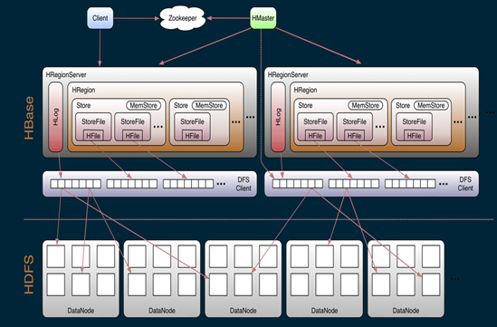

[toc]

# 入门

1. 没有主键, 有相当于是主键的行键: rowkey
2. 没有数据库概念 database, 有替代的 namespace 的概念, 所有的表都是在一个 namespace 下的.
3. 有表的拟凹和字段的概念
4. 新概念列簇, 每个列簇中才包含了字段, 给相同属性的列划分一个组, column family
5. 在建表的时候至少要指明一个列簇, 可以不给字段
6. 版本控制, 可以存储多个版本 version (相当于可以存储多个值)
7. 空值不占空间 (RDBMS 中的null占空间), 表可以设计的非常稀疏.
8. 每个单元中的数据可以有多个版本, 默认情况下版本号自动分配, 是单元格插入时的时间戳
9. 数据类型单一


## 特点

列式数据库以列为单位聚合数据，然后将列值顺序存入磁盘。这种存储不同于行式存储的传统数据库，行式存储数据连续地存储整行。

列式存储的出现的前提：行数据中不是所有的数据值都是必须的，这个在分析数据库中比较常见。列式存储更有利于压缩，因为同一列的数据类型是相似的，比较行存储的结构更利于数据压缩，减少 IO。

1. 列式存储：按列存储；
2. 海量存储：无单机存储量限制，分布式存储；
3. 极易扩展：自动分区，非常容易根据数据量自动扩展；
4. 高并发：支持高并发，随机快速读写；
5. 稀疏：支持超宽列，不必每列都包含内容，可以为空值。


## 命令

```
--启动 shell 命令行 
hbase shell

/*t1: table name;   f1, f2, f3: 列簇*/
DDL操作:
--查看 namespace
list_namespace

--创建 namespace
create_namespace 'ns1'
         
--描述 namespace
describe_namespace 'ns1'

--删除 namespace
drop_namespace 'ns1'

--创建表:  
create 't1', 'f1','f2','f3'   
create 'table1', 'tab1_id', 'tab1_add', 'tab1_info' 

--描述表  
desc 't1'

--删除表 
disable 't1' -> drop 't1'

--禁用  
disable tableName
disable_all

--启动  
enable tableName
enable_all

--修改
alter 't1', NAME => 'f1', VERSIONE=>5   // => 是等于的意思

DML操作:
--添加数据
put 't1', '2018_1001','f1:name','jack'    //2018_1001 时间戳 rowkey.

--查询数据
get 't1', '2018_1001', 'f1'
scan 't1'

--删除数据 
delete 't1', '2018_1001', 'f1:name'

--修改数据，使用put 来完成
put 'tableName','rowkey', 'ColumnFamily:columnName',"columnValue"

eg:
创建一个有一个 f1 列簇的表, f1 列簇中有 name, age, class 等列.
create 'student02','_id','name','age'                 # 创建
create 'ns1:t2',{NAME => 'f1',VERSIONS => 5}

----------------------------------------------------------------
desc 'ns1:t2'   = describe 'ns1:t2'                   # 描述
disable 'ns1:t2' -> drop 'ns1:t2' -> enable 'ns1:t2'

----------------------------------------------------------------
alter 'ns1:t2', NAME=>'f3', VERSIONS=>10              # 添加
put 'ns1:t2', '2018_1002', 'f1:name','jack'
put 'ns1:t2', '2018_1002', 'f1:age',19
put 'ns1:t2', '2018_1002', 'f1:class','class01'
put 'ns1:t2', '2018_1001', 'f1:name','maggie'
put 'ns1:t2', '2018_1001', 'f1:age',20
put 'ns1:t2', '2018_1001', 'f1:class','class02'

------------------------------------------------------------------
scan 'ns1:t2'                                       # 显示
get 'ns1:t2', '2018_1001', 'f1:name'
scan 'ns1:t2',{STARTROW => '2018_1002'}
scan 'ns1:t2',{STARTROW => '2018_1001',STOPROW => '2018_1002'}

------------------------------------------------------------------
delete 'ns1:t2','2018_1001','f1:name'                 # 删除
count 'ns1:t2'                                    # 记录
```


# 原理

- 命名空间

命名空间 namespace 指对一组表的逻辑分组，类似关系型数据库中的 database。便于对业务进行划分。


- 表

与关系型数据库中的表的概念类似，是数据行逻辑上的集合。


- 行 row

由多列字段值构成的一条数据实例，与关系型数据库类似。


- 列 column

单个字段。在 HBase 中，支持超宽的列，而且每个单元格中的数据可能有多个版本，默认为时间戳。同时 HBase 中的 null 空值是不占空间，因此表可以设计的非常稀疏。


- 列簇 columnFamily

在 HBase 中，多个列可以构成一个列簇，列簇的列是存储在一起的，便于快速检索。


- 分区 region

HBase 表按照 rowKey 被水平划分到多个 Region 上。


- 行键 rowkey

RowKey 用于唯一标识 HBase 中的表的行，有点类似于 MySQL 中的 id，但是又不仅仅是 id。


- HLog 结构


sequenceid 是一个store 级别的自增序列号, 在region 恢复和 HLog 过期清除扮演相当重要的角色.  

产生 -> 滚动 -> 过期 -> 删除


- HLog 的生命周期

1. 产生:  不关闭 HLog 的情况下所有涉及到数据的变更都会产生 HLog。

2. 滚动:  通过 hbase.regionServer.logroll.period 控制默认滚动时间。

   ​     	  通过 hbase.regionserver.maxlogs 控制 HLog 的个数。

   ​    	   滚动的目的是防止单个 HLog 文件过大, 方便后续的过期和删除。

3. 过期:  HLog 的过期依赖于对sequenceid 的判断

   将 HLog 的 sequenceid 和 HFile 最大的 sequenceid(刷新到最新的位置) 进行比较, 如果比刷新的 Sequenceid 小,  那么这个 HLog 会被移动到 .oldlogs 目录中.

4. 删除:   如果 HBase 开启了 replication。当 replication 执行完一个 HLog 时, 会删 zookeeper 上的对应 HLog 节点.

   在HLog 被移动到 .oldlogs 目录中, HBase 默认 60s 检查 .oldlogs 目录下的所有HLog, 确认对应的 zookeeper 的 HLog 节点是否被删除. 如果 zookeeper 上不存在对应的 HLog 节点, 那么直接删除对应的 HLog.

   

# 架构




- HMaster

HMaster 负责 RegionServer 的管理，DDL操作( 数据定义语言DDL用来创建数据库中的各种对象-----表、视图、索引、同义词、聚簇 )。

1. 对 RegionServer 的管理

   1. 负责分配 Region 给 RegionServer；

   2. 在 RegionServer 启动、恢复和负载均衡的时候负责重新分配 Region；

   3.   监控和管理集群中的 RegionServer 实例；

2. DDL 管理
   1. 负责表的创建，修改和删除接口


- zookeeper


HBase 使用 zookeeper 作为分布式协调服务来维护集群中的服务状态。为了保证共享状态的一致性，zookeeper 的台数必须是 2*n+1。其主要作用：

1. 作为分布式服务的协调器，维护集群中服务器的状态；
2. HMaster 和每个 RegionServer 定期发送心跳给 zookeeper，用于检查服务器是否可用，并在失效时通知；
3. 当 Active HMaster 失效时，通知备用 HMaster 成为 Active HMaster；
4. 当某个 RegionServer 失效时，通知 HMaster 执行恢复任务；
5. 维护元数据表（META Table）的路径，帮助 Client 查询 Region。


- RegionServer

一个 HBase 集群中通常包含多个 RegionServer，它主要负责 Region 中数据的读写和管理


WAL（HLog）： Write Ahead Log 的缩写，每个 RegionServer 都包含一个 WAL 文件，主要存储那些还未持久化的新数据，主要用于失效情况下恢复数据。

Block Cache：块缓存，主要缓存那些经常被访问的数据。

MemStore：写缓存，用于存储还未被提交的写数据。Region 中每个列簇都有一个 MemStore。

HFile：HFile 存储在 HDFS 上，是 HBase 数据的存储文件。MemStore 中的数据超过一定的大小后就被提交到 HFile。


- Region

一个 Region 包含了开始 key 和结束 Key 之间的所有行。HBase 的表可以划分为多个 Region，列簇中所有列都被存在一个 Region 上。每个 Region 默认为 256M，一个 RegionServer 大约可以管理 1000 个 Region。


## 物理模型


# HBase 的核心流程

## 读流程


1. Client 首先从 zookeeper 读取 HBase 的元数据表所在位置；
2. 本地缓存元数据表，确定待检索的 rowkey 所在的 RegionServer；
3. 根据所在的 RegionServer，Client 向 RegionServer 发送读请求；
4. RegionServer 收到请求，将查询结果返回给客户端。


### 读合并

HBase 中一行数据中的 cell 可能位于不同的地方，比如可能数据已经写入到 BlockCache，或者是缓存在MemSotre，亦或是存储在硬盘的 HFile 中。当读取 HBase 中的某一行时，为了返回相应的数据行，需要从 MemStore，BlockStore 和 HFile 中的数据进行读写合并操作。


### 读放大

由于多次 Flush，一个 MemStore 对应的数据可能存储在多个不同的 HFile 中，因此读操作时，HBase 需要读取多个 HFile 来获取想要的数据。这在一定层度上会影响 HBase 的性能。


## 写流程


当 Client 发出写请求之后：

1. Client 首先范围 zookeeper，通过相关信息找到 RegionServer；

1. 连接 RegionServer，将数据写到 WAL（HLog）中，WAL 主要用于数据恢复；
2. 一旦数据被写入到 WAL 之后，接着将数据更新到 MemStore，这时会向 Client 发送 ACK 确认；
3. MemStore 达到一定的阈值之后，将数据刷盘到磁盘的 StoreFile。


### 小合并

HBase 会自动选取一些较小的 HFile 文件合并为几个较大的 HFile，这个过程称为**小合并**。小合并通过 Merge Sort 的形式将较小的 HFile 合并为较大的文件，从而减少 HFile 的数量，以提高 HBase 的性能。


### 大合并

**大合并**会合并以及重写 Region 中的所有 HFile，每个列簇的内容写入一个 HFile。这个过程中，会丢弃已经删除和过期的 cell。这会提高读的性能。因为大合并需要重写所有的文件，在这个过程中必然会引入很多磁盘 IO 和网络带宽的消耗。

大合并可以自动地调度，由于存在写放大。因此它通常放在空闲时间段执行。


### Region Split

 

在开始的时候一张表对应一个 Region。但随着 Region 中数据的增多，它会分割为两个子 Region，每个子 Region 分别存原 Region 一半的数据，同时 Split 的操作会被通知到 HMaster。


### Region Flush


当 MemStore 积累到一定阈值的数据时，整个数据集就被写入到一个新的 HFile 中，整个过程被称为 HBase Region。


### HBase HFile 索引


当 HFile 打开的时候，HFile 的索引就被加载并存放在块缓存中（BlockCache）。


# Java API

# 热点问题

热点问题中的记录是根据 rowkey 按字典顺序排序的，这样可以通过 rowkey 快速访问一条记录，或者通过 start key 和 end key 快速地获取一个范围内的数据。


## Rowkey 的数据原则

- **RowKey长度原则**

Rowkey是一个二进制码流，Rowkey的长度被很多开发者建议说设计在10~100个字节，不过建议是越短越好，不要超过16个字节。

原因如下：

1. 数据的持久化文件HFile中是按照KeyValue存储的，如果Rowkey过长比如100个字节，1000万列数据光Rowkey就要占用100*1000万=10亿个字节，将近1G数据，这会极大影响HFile的存储效率；

2. MemStore将缓存部分数据到内存，如果Rowkey字段过长内存的有效利用率会降低，系统将无法缓存更多的数据，这会降低检索效率。因此Rowkey的字节长度越短越好。

3. 目前操作系统是都是64位系统，内存8字节对齐。控制在16个字节，8字节的整数倍利用操作系统的最佳特性。

- **RowKey散列原则**

如果Rowkey是按时间戳的方式递增，不要将时间放在二进制码的前面，建议将Rowkey的高位作为散列字段，由程序循环生成，低位放时间字段，这样将提高数据均衡分布在每个Regionserver实现负载均衡的几率。如果没有散列字段，首字段直接是时间信息将产生所有新数据都在一个RegionServer上堆积的热点现象，这样在做数据检索的时候负载将会集中在个别RegionServer，降低查询效率。

- **RowKey唯一原则**

必须在设计上保证其唯一性。


## 热点问题方案

在某一时间内，HBase 读写集中在少部分 Region 上，负载明显过大，其他 Region 闲置，这就是热点现象。


- 解决方法

RowKey 设计，预分区，列簇设计。


## 预分区

没有预分区的情况下，HBase 默认只有一个 region，当数据量增大到一定的程度时进行 split 操作，将当前 Region 分成两个 Region。当时这样会有两个问题：**热点问题**，如果有大量的数据往一个 Region 写入，会导致数据的热点问题；**split** 的操作会消耗大量的集群 IO 资源。

所以需要在创建表的时候，多创建一些空的 Region，并确定 Region 的 startRowKey 和 EndRowKey。同时需要注意 **RowKey 的设计**能够相对均匀地分散到各个 Region

```
create 'tableName','columnFamily',{SPLITS=>['10','20','30','40']}

splits 后面的数组是分区分割的 rowkey，将上面的表 tableName 表划分为 5 个分区，StartRowKey 和 EndRowKey 分别为：
	region01：0~10
	region02:10~20
	region03:20~30
	region04:30~40
	region05:40~

也可以把分区信息放在文件中，创建时通过导入文档即可。
create 't3', 'f1', SPLITS_FILE => '/opt/moduels/hbase/splits.txt'

在进行预分区操作时，必须清楚 Rowkey 的散列情况，而不是胡乱的进行分区创建。
```


# 垃圾回收


# 内存管理

 

```
--Regionserver内存分两部分：menstore与blockcache
	读取：Memstore -> BlockCache -> storefile
	hfile.block.cache.size

--写入:  Memstore -> storefile
	hbase.hregion.memstore.flush.size
	heapsize * hbase.regionserver.global.memstore.upperLimit 	
	heapsize * hbase.regionserver.global.memstore.lowerLimit
	hbase.hregion.majorcompaction 
	hbase.hregion.max.filesize     

--BlockCache分级
	Single / Multi / InMemory  //1：2：1
	InMemory用于保存Meta元数据信息,不是很重要的信息不需要放在InMemory

--本地MemStore缓存
	hbase.hregion.memstore.mslab.enabled //默认ture    

--Compact
	minor compaction
	轻量级,删除仅打标记
	major compaction
	重量级,真正删除
	hbase.hregion.majorcompaction //一般禁用改为0,默认7天

--Split
	hbase.hregion.max.filesize //默认10G,建议调大,保证手动执行split
```


# 单机安装 HBase

前提：安装好 hadoop， 以及 ZooKeeper， 开启


1. 解压 hbase-0.98.6-hadoop2-bin.tar.gz
   
```
tar -zxf hbase-0.98.6-hadoop2-bin.tar.gz -C /opt/app/
```

   

2. 修改hbase-env.sh
   
   ```
   export JAVA_HOME=/opt/moduels/jdk1.7.0_67
   export HBASE_MANAGES_ZK=false  /*是否启用 hbase自带的ZooKeeper*/
   ```
   
   
   
3. 修改hbase-site.xml
   
    ```
    <property >
        <name>hbase.tmp.dir</name>
        <value>/opt/app/opt/app/hbase-0.98.6-hadoop2/data/tmp</value> <!--手动mkdir tmp目录-->
    </property>
    <property >
        <name>hbase.rootdir</name>
        <value>hdfs://node01:8020/hbase</value>  <!--端口号与hadoop保持一致-->
    </property>
    <property >
          <name>hbase.cluster.distributed</name>
          <value>true</value>
    </property>
    <property>
        <name>hbase.zookeeper.quorum</name>
    	<value>node01</value>     <!--配置zookeeper-->
    </property>
    ```
    
    
    
4. 修改 regionservers
        删去 localhost。

       添加主机名，如 node01
    
5. 替换jar包

   ```
   /opt/app/hbase-0.98.6-hadoop2/lib  删掉 hadoop zookeeper 的jar包（大约16个），用本地hadoop，zookeeper 版本的jar来替换（大约15个）。所以jar包个数不一定相等
   ```

   

6. 将$HBASE_HOME 写到 /etc/profile

7. 启动， 用 jps 查看是否有 HMaster， HRegionServer 进程 

   ```
   hbase-daemon.sh start master
   hbase-daemon.sh start regionserver
   ```

   

8. hbase shell， 进入hbase。
   http://node01:60010/master-status   <!--web ui-->