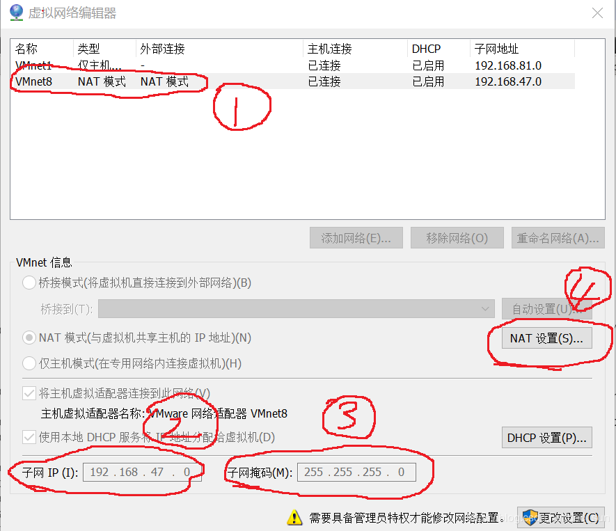
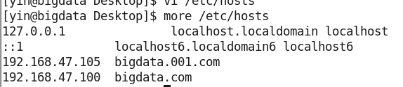

[TOC]
# 简介

Hadoop 是适合大数据的**分布式存储**和**计算平台**，实现在大量计算机组成的集群中对**海量数据**进行**分布式计算**。其核心组件包括有：HDFS（Hadoop Distributed File System，存储），MapReduce（计算），YARN（调度）。

分布式系统的工作：
1. 分布式文件系统可以存储海量数据；
2. 一次写入，多次读取。

Hadoop 的主要模块：
- Hadoop Common， 为其他 Hadoop 模块提供基础设置
- Hadoop HDFS， 高吞吐量的分布式文件系统
- Hadoop MapReduce，分布式离线并行计算框架
- Hadoop YARN，2.0 版本后的调度框架，主要负责任务调度和资源管理

# HDFS 分布式文件系统


如图所示。HDFS 主要有 **NameNode**，**Secondary NameNode**，**DataNode** 等组成。
**NameNode**：主节点，用于存储管理文件系统树以及所有文件目录的元数据。
**Secondary NameNode**：主要是监控 HDFS 状态的辅助后台程序，定期同步元数据与日志，当 NameNode 崩溃时，可以依靠 Secondary NameNode 恢复数据。
**DataNode**：从节点，主要存储和提取数据数据，读写请求直接来源于客户端 Client 或 NameNode。同时 DataNode 会定期汇报自己节点所存储的数据信息给 NameNode。
**机架**：由多个 DataNode 节点组成。如图有两个机架，每个机架有 9 个 DataNode。当进行数据备份时，可以在本机架或者其它机架上的 DataNode 中进行数据备份，这样有利于容灾。

NameNode 可以看做是检索信息，DataNode 可以看做是存储系统。


## HDFS 写入过程
1. Client 向 HDFS写入数据时， Client 客户端发送消息给 NameNode，表示要将数据文件写入到 HDFS；
2. NameNode 收到消息进行一定的处理，发消息给 Client 和给定写入的 DataNode，一方面让 Client 将数据写入到给定的 DataNode，另一方面让给定的 DataNode 将写入的数据备份到其他 DataNode 中；
3. Client 与 DataNode 进行通信，并向数据发送到给定的 DataNode 来保存数据；
4. 给定的 DataNode 保存完数据后，会将数据备份到其他指定的 DataNode；
5. DataNode 完成备份操作后，就发消息给 Client 和 NameNode，这样 Client 就能确认数据传输完毕了，NameNode 就能确认数据的存储节点了。


## HDFS 读取过程

1. Client 向 HDFS 读取数据时，Client 首先询问 NameNode 应该从哪读取文件；
2. NameNode 发送**数据块**信息给 Client
3. Client 检查数据块信息，联系相关的 DataNode 请求数据。
4. DataNode 返回文件给 Client，读取完毕后，关闭连接。完成读操作。


## 操作命令

```
bin/hdfs dfs -mkdir -p /user/root/lee
bin/hdfs dfs -put etc/hadoop/core-site.xml /user/root/lee
bin/hdfs dfs -text /user/root/lee/core-site.xml
bin/hdfs dfs -get /user/root/lee/core-site.xml /home/cniao/core-site.xml
bin/hdfs dfs -ls /user/root/lee
bin/hdfs dfs -cat /user/root/lee/core-site.xml
bin/hdfs dfs -cp /user/root/lee/core-site.xml /user/root/lee2
bin/hdfs dfs -mv /user/root/lee/core-site.xml /user/root/lee2
bin/hdfs dfs -rm /user/root/lee/core-site.xml 
```

#  MapReduce 离线计算框架


MapReduce 是一个分布式运算程序的变成框架，是开发 “基于 Hadoop 数据分析应用” 的核心框架，其核心功能是将编写的业务逻辑代码合自带默认组件整合成一个完整的分布式运算程序，并发运行在 Hadoop 集群上。

大数据的核心思想是：分而治之，把海量数据划分成多组，分配给各个子任务来完成，再将结果合并输出。

MapReduce 计算将计算过程分为：Map 和 Reduce。
- Map 并行处理输入数据
- Reduce 对 Map 结果进行汇总。
- Map 与 Reduce 之间的桥梁是 Shuffle。

工作流程
1. **split 数据拆分**：输入到 MapReduce 数据被划分成固定大小的块，input splits。拆分后的数据会以 <LongWritable, Text> 键值对的形式输入到 Map 阶段，进行第一阶段的处理；
2. **Map阶段**：每个被拆分的数据被传递给映射函数进行处理并产生输出值。
3. **Shuffle阶段**：这个阶段主要是将 Map 输出的数据进行合并，再将合并后的结果发送到 Reduce 阶段。从而降低 Reduce 阶段的开销。Shuffle 阶段的数据会保存到本地磁盘上而不是 HDFS，所以这个阶段是一个比较耗时的操作。
4. **Reduce 阶段**：shuffle 阶段的输出值通过 Reduce 映射函数输出最终结果。

Map 的输出结果写入到本地磁盘。是因为 Map 输出的是中间结果，中间结果还需要通过 Reduce 处理后才能得到最终结果。而一旦作业完成，Map 的输出结果就可以删除，存放在 HDFS 上是没有必要的。


## 案例述流程


以 WordCount 为例，来描述 MapReduce 的工作流程。

1. 进入 MapReuce 之前， HDFS 进行 split 数据，将大量数据拆分成小数据来处理；
2. 将拆分后的数据进入到 Map，通过映射函数，数据将以 <key, value> 形式进行输出，其中 key，表示 word，value 是 word 的出现次数的表示；
3. 数据进入 shuffle，进行混排，最大化的将相同 key 的数据归类在一起，形成 <key,list(value)>，以方便数据传输，减轻 Reduce 的计算压力
4. Reduce 获取的是 <key, list(value)> 数据，然后通过映射函数，可以计算出 list(value) 的大小，即可以计算出 wordCount 希望的结果。

```
public class WordCount extends Configured implements Tool{
	
	// 1. Map class, 继承基类Mapper
    // KEYIN       即LongWritable     行的偏移量 
    // VALUEIN     即Text             输入内容 
    // KEYOUT      即Text             输出行中出现的单词
    // VALUEOUT    即IntWritable      行中出现的单词的次数，固定值1
	// 参数：偏移量+内容->内容+计数
	public static class WordCountMapper extends Mapper<LongWritable, Text, Text, IntWritable>{
		
		private Text mapOutputKey = new Text();
		private IntWritable mapOutputValue = new IntWritable();
		
		@Override
		protected void map(LongWritable key, Text value, Context context)
				throws IOException, InterruptedException {
			// 将读取输入文件变成：偏移量+内容
			String linevalue = value.toString();  
			
			// 根据" "去切分我们的单词,并处理
			String[] strs=linevalue.split(" ");
			
			for (String str : strs) {
				// key:单词 value：1
				mapOutputKey.set(str);
				mapOutputValue.set(1);
                // 数据写入, 并输出map
				context.write(mapOutputKey, mapOutputValue);
				//System.out.println("<"+mapOutputKey+","+mapOutputValue+">");
			}
		}
	}
	
	// 2. Reducer class
    // KEYIN          即Text               行中出现的单词           与map的KEYOUT一致
    // VALUEIN        即IntWritable        示出现的单词的次数       与map的VALUEOUT一致.
    // KEYOUT         即Text               行中出现的不同单词
    // VALUEOUT       即IntWritable        行中出现的不同单词的总次数
	// 参数：内容+计数->内容+计数
	public static class WordCountRecucer extends Reducer<Text, IntWritable, Text, IntWritable>{
		private IntWritable outputValue = new IntWritable();
		@Override
		protected void reduce(Text key, Iterable<IntWritable> values,
				Context context) throws IOException, InterruptedException {
			// 汇总
			int sum = 0;
			for(IntWritable value:values) {
				sum+=value.get();
				//System.out.println(value.get()+" ");
			}
			outputValue.set(sum);
			context.write(key, outputValue);
		}
	}
	
	// 3. job class 任务控制器
	public int run(String[] args)throws Exception{
		// 获取我们的配置
		Configuration conf =new Configuration(); 
		Job job=Job.getInstance(conf, this.getClass().getSimpleName());
		
		// 设置input与output
        // 指定输入路径
		Path inpath = new Path(args[0]);
		FileInputFormat.addInputPath(job, inpath);
        // 指定输出路径
		Path outpath = new Path(args[1]);
		FileOutputFormat.setOutputPath(job, outpath);
			
		// 设置map与reduce
		// 需要设置的内容 类+输出key与value
		job.setMapperClass(WordCountMapper.class);
        //map输出的<k,v>类型
		job.setMapOutputKeyClass(Text.class);
		job.setMapOutputValueClass(IntWritable.class);
        
		job.setReducerClass(WordCountRecucer.class);
        //reduce输出的<k,v>类型
		job.setOutputKeyClass(Text.class);
		job.setOutputValueClass(IntWritable.class);
		// 把job提交给jobtracker运行
		boolean issuccess = job.waitForCompletion(true);
		return issuccess?0:1;
		}
	
	public static void main(String[] args) throws Exception {
		// 参数
		args = new String[] {
				"hdfs://node01:8020/user/root/mapreduce/input", //输入数据路径
				"hdfs://node01:8020/user/root/mapreduce/output" //输出数据路径
		};
		//跑我们的任务
		int status =new WordCount().run(args);
		System.exit(status);
	}
}
```


# YARN

Yarn 是 Hadoop 2.0 出现的新的资源管理系统。基本设计思想：将 Hadoop 1.x 中的 JobTracker 拆分成两个独立的服务：
1. 一个全局的资源管理器 ResourceManager； 
2. 每个应用程序特有的 ApplicationMaster。


- yarn 是资源调度框架，通用的资源管理系统，为上层应用提供统一的资源管理和调度。

客户端提交任务到 RM( RM 的组件 ASM），然后 Scheduler 在获得了集群各个节点的资源后，为每一个应用启动一个 AM，用于执行任务。每个 AM 启动一个或多个 Container 用于执行的任务。


1. client 向 RM 提交应用程序；
2. RM 启动一个  container，用于运行 AM；
3. AM 启动后向 RM 反向注册，与 RM 保持心跳；
4. AM 向 RM 申请 Container 的数目；
5. RM 将相关信息返回给 AM；
6. AM 通过信息来进行相关 NM 的通信并启动对应的 Container 的数目；
7. AM 对 Container 进行监控，而 Container 会将运行期间的消息发送个 AM；
8. client 就可以实时的获知任务的运行情况了；
9. 当任务结束，AM 向 RM 进行注销，并释放 Container； 
10. 
- 主节点：ResourceManager ， RM
作用：处理客户端请求；调度应用管理器；集群整体的资源分配。
- 从节点：NodeManager， NM
作用：单节点的资源管理；处理主节点/应用管理器的命令。
- 应用管理器：ApplicationMaster， AM
作用：数据切分；应用程序的资源申请；分配资源给内部任务，任务监控与容错。
- 容器：Container
作用：任务运行环境的抽象，封装了任务所需的所有资源；资源隔离的效果。
- 客户端：Client
作用：提交作业，查询作业的运行已经结束作业。


## 组件

**ResourceManager** 负责整个系统的资源管理和分配； 

**ApplicationMaster** 负责单个应用程序的管理。

Yarn 采用了 master / slave 结构。在整个框架中，ResourceManager 为 master，NodeManager 为 slave。ResourceManager 负责对各个 NodeManager 上资源进行同一管理和调度。当用户提交一个应用程序时，需要提供一个用以跟踪和管理整个程序的 ApplicationMaster，它负责向 ResourceManager 申请资源，并要求 NodeManager 启动可以占用一定资源的任务。由于不同的 ApplicationMaster 被分配到不同的节点上，因此它们之间不会相互影响。

Tips: 一个应用程序就会有一个 ApplicationMaster，用来负责应用程序的管理。

Yarn 的成员：*ResourceManager， NodeManager，ApplicationMaster* 和 *container* 等。


**ResourceManager，RM**：全局的资源管理器，这个资源管理器在集群中只存在一个，负责整个系统的资源管理和分配，包括处理客户端请求，启动、监控 ApplicationMaster、监控 NodeManager，资源的分配和调度。它主要由两个组件构成：*调度器（schedule）*和 *应用程序管理器（Applications Manager,ASM）*。
**调度器，schedule**：纯粹的资源调度。
**应用程序管理器 ，Applications Manager, ASM**：管理整个集群的所有应用程序。

**ApplicationMaster，AM**：管理 Yarn 内运行的应用程序的每个实例。主要任务：数据切分，为应用程序申请资源并进一步分配给内部任务，任务监控容错与重启。

**NodeManager，NM**：NodeManager 在集群中有多个，负责每个节点上的资源的使用。主要任务：单个节点上的资源管理和任务，处理来自于 RM 的命令，处理来自于 AM 的命令，定时向 RM 汇报节点上资源的使用情况和 Container 的运行状态。

**Container**：Container 是 Yarn 中动态的资源抽象，它封装了某个节点上的多维度资源，当 AM 向 RM 申请资源时，RM 为 AM 返回的资源便是用 container 表示的。主要任务：对 task 环境的抽象，描述一系列信息，任务运行资源的集合（cpu，内存，IO），任务运行环境。


## 资源管理

1. 资源调度由 ResourceManager 来完成，隔离由 NodeManager 来完成；
2. 隔离：ResourceManager 分配资源给任务后，NodeManager 按需给任务提供资源，并保证资源的独占性；
3. 资源包括：内存，CPU，IO；
4. 资源对任务的影响：内存不足，任务失败，CPU不足，任务缓慢。


## 内存管理

1. Yarn 只能用节点上分配的可用内存
2. 参数：cpu管理，（虚拟cpu，为弥补物理cpu计算能力不同而引入的概念）
3. 参数：虚拟CPU数。


## 流程

1. 客户端 Client 向 RM 提交一个作业，RM 为这个作业分配一个 Container；
2. RM 与 NM 进行通信，要求 NM 启动一个 Container，这个 Container 同时会启动一个 AM，AM启动后会向 RM 进行注册，这样 Client 就可以通过 RM 查询作业的运行情况了；
3.  AM 会向 RM 请求作业所需的资源，申请到之后就到相应的 NM 上运行 Client 提交的作业；
4. NM 会把作业运行在启动的 Container 上。


> 这里以下图为例，从 MapReduce 请求 Yarn 进行资源计算；

1. MR 作为一个客户端，需要运行应用程序；

2. 客户端 MR 向 RM 申请进行作业资源；

3. MR 的资源文件被 copy 到 HDFS；

4. MR 向 RM 提交作业；

5. RM 向 NM 请求启动 Container，启动 AM；

6. AM 初始化之后，向 RM 申请运行资源（cpu，内存，IO）；

7. 资源分配后，AM 在对应的 NM上启动 Container 来进行 MR 作业。

  

  

| RM                                               | AM                                                                                                               | NM                                    | Container                                                    |
| ------------------------------------------------------------ | ----------------------------------------------------- | ------------------------------------- | ------------------------------------------------------------ |
| 资源分配与应用管理，负责所有应用程序的资源调度。 | 管理应用程序实例，监控作业任务。负责对应的应用程序的调度和管理。 | RM 中的一个组件，主要负责整个集群的所有应用程序的管理 | 实例节点，可以启动 AM 和 Container 等 | 作业任务实际运行的容器，其实就是一组被抽象的资源组成的的运行环境 |


# HDFS 文件格式

**面向行**：同一行的数据存储在一起，即连续存储

- SequenceFile， MapFile， Avro DataFile。采用这种方式，如果要访问行的一小部分数据，需要将整行读入内存，推迟序列化一定程度上可以缓解这个问题，但是从磁盘读取整行数据的开销是无法避免的。**面向行的存储适合整行数据需要同时处理的情况**

**面向列**：整个文件被切割为若干列数据，每一列数据一起存储。

- Parquet, RCFile, ORCFile. 面向列的格式使得读取数据时，可以跳过不需要的列，**适合于只处于行的一小部分字段的情况**。但是这种格式的读写需要更多的内存空间，因为需要缓存行在内存中。同时不适合流式写入，因为一旦写入失败，当前文件无法恢复，而面向行的数据在写入失败时，可以重新同步到最后一个同步点，所以 Flume 采用的是面向行的存储方式。

**SequenceFile**: 一种二进制文件，它将数据以 <key, value> 的形式序列化到文件中，用于解决大量小文件的问题。这种二进制文件内部使用 Hadoop 的标准的 Writeable 接口实现序列化和反序列化。在 Hive 中的 SequenceFile 继承自 Hadoop API 的 SequenceFile，不过它的 Key 为空，使用 value 存放实际的值，这样是为了避免 MR 在运行 map 阶段的排序程。

**MapFile** 是 SequenceFile 的变种，是排序后的 SequenceFile， 索引记录每一个 Record 的值与偏移量，且作为一个单独的文件存储。文件被访问的时候，索引被载入内存，通过映射关系快速定位到 Record 位置， 用于快速查找。存放数据的文件根据 Key 定义的顺序排列。MapFile 的记录必须按照顺序写入，否者会抛出 IOException。

**RCFile**：是Hive推出的一种专门面向列的数据格式。遵循“先按h行划分,再垂直划分”的设计理念，首先将表分为几个行组，对每个行组内的数据进行按列存储，每一列的数据都是分开存储。

当查询过程中, 如果它并不关心的列, 它会在IO上跳过这些列。需要说明的是, RCFile 在 map 阶段从远端拷贝仍然是拷贝整个数据块, 并且拷贝到本地目录后 RCFile 并不是真正直接跳过不需要的列跳到需要读取的列,  而是通过扫描每一个 row group 的头部定义来实现的, 但是在整个 HDFS Block 级别的头部并没有定义每个列从哪个 row group 起始到哪个 row group 结束。所以在读取所有列的情况下, RCFile 的性能反而没有 SequenceFile 高。


# MapReduce

# Hadoop 伪分布式安装 

-  环境：虚拟机VM  Centos 6.7 
-  Java：jdk-7u67-linux-x64.tar.gz 
-  Hadoop:  hadoop-2.5.0.tar.gz 
-  IP/Host: 192.168.47.100/bigdata.001.com


## 设置虚拟机IP/Host

虚拟机  ->  编辑  ->  虚拟网络编辑器

1. 虚拟机设置为NAT模式。
2. 查看虚拟机的网段。


如图所示：网段是：192.168.47.* ，其中192.168.47.0/2这两个IP不可作为该虚拟机的IP地址。192.168.47.2 作为该虚拟机的DNS。




3. 可视化j界面来设置IP，如下图所示。

   


当然，也可以通过编辑  /etc/sysconfig/network-scripts/ifcfg-XXX来进行配置IP。


4. hostname 在 /etc/hosts 与IP进行关联

   ​	/etc/sysconfig/network 中修改hostname。




完成上述操作，重启Centos，可以通过hostname来查看Centos的hostname是否配置成功。

并且可以将虚拟机的Centos的IP写到windows中的hosts中，这样就可以在实体机window中ping通虚拟机Centos。


## 前期准备

### 禁用防火墙和 selinux

在配置 Hadoop 时，必须禁用selinux，

```
 vi  /etc/sysconfig/selinux

# SELINUX= can take one of these three values:
#       enforcing - SELinux security policy is enforced.
#       permissive - SELinux prints warnings instead of enforcing.
#       disabled - SELinux is fully disabled.
SELINUX=disabled
```


同时需要关闭防火墙

```
看状态service iptables status
设置关闭service iptables stop
自启关闭chkconfig iptables off
```


## 安装Oracle Java

查看自带的JDK

```
rpm -qa | grep java
```


卸载自带的JDK

```
rpm -e --nodeps 卸载内容（卸载多文件使用空格）
```


解压JDK

```
tar -zxf jdk-7u67-linux-x64.tar.gz -C /opt/moduels/
```


配置java环境

```
vi /etc/profile  打开文件，并将下列三行添加到文件中。
     ##JAVA_HOME
     export JAVA_HOME=/opt/moduels/jdk1.7.0_67
     export PATH=$JAVA_HOME/bin:$PATH

source /etc/profile   加载全局变量文件，使其生效。
java -version   验证java是否安装成功
```


------

## Hadoop之HDFS

-  解压 Hadoop压缩包, 这里选取 /opt/moduels 作为hadoop安装目录

```
 tar -zxf hadoop-2.5.0.tar.gz -C /opt/moduels/
```

解压完成后，可以删除 hadoop目录下的 /share/doc 文件夹


- 修改 etc/hadoop/hadoop-env.sh， mapred-env.sh 和 yarn-env.sh 制定java安装路径。

```
export JAVA_HOME=/opt/moduels/jdk1.7.0_67
```


- 修改 etc/hadoop/core-site.xml

```
//默认文件系统访问入口，1.x系列端口号为9000
//hadoop.tmp.dir为hadoop系统生成文件的临时目录

     <configuration>
        <property>
            <name>fs.defaultFS</name>
            <value>hdfs://bigdata.001.com:8020</value><!--可以用IP来代替主机名-->
        </property>
        <property>
            <name>hadoop.tmp.dir</name>
            <value>/opt/moduels/hadoop-2.5.0/data/tmp</value>
        </property>
     </configuration>
```


- 修改 hdfs-site.xml

```
//修改副本数量, 表示hadoop会备份的数量, 如果当前改为1, 那么之后的所有副本都是是 1, 之前的不会改变.
    <configuration>
        <property>
                <name>dfs.replication</name>
                <value>1</value>
        </property>
    </configuration>
```


- 修改 slaves，配置本机的主机名。如果有其他内容，可以全部都删去。

```
    //从节点机器位置主机名
    bigdata.001.com
```


- 格式化 namenode

```
命令：bin/hdfs namenode -format
查看结果：data/tmp文件夹生成文件  （hadoop.tmp.dir 配置的路径）
//只能格式化一次，如果有需求，将tmp文件夹下内容删除再格式化  
//多次格式化会导致集群ID不一致，手动修改集群ID也可以修复多次格式化问题

可以通过下列两个路径下的文件进行对比
/opt/app/hadoop-2.5.0/data/tmp/dfs/data/current
```


- 启动namenode和datanode

```
命令：
  sbin/hadoop-daemon.sh start namenode 
  sbin/hadoop-daemon.sh start datanode
验证：
  在 Centos 命令窗口使用jps查看进行。
```


- 打开浏览器，查看相关界面是否存在。存在即表示hdfs配置成功

```
http://bigdata.001.com:50070/
http://192.168.47.105:50070/
```


```
SecondaryNameNode 配置

​    //文件操作记录会进行存储为编辑日志edits文件
​    //namenode格式化之后生成镜像文件，namenode启动时会读取镜像文件
​    //SecondaryNameNode用于合并这两个文件，减少namenode启动时间
​    文件地址：hadoop-2.5.0/data/tmp/dfs/name/current
​    流程：SecondaryNameNode读取两种文件 -> 合并为fsimage文件 -> 生成新的edits文件 
```


- 修改hdfs-site.xml文件，指定 secondarynamenode 机器位置和交互端口号：50090

```
       <property>
            <name>dfs.namenode.secondary.http-address</name>
            <value>192.168.47.105:50090</value>
        </property>
```


- 启动

```
sbin/hadoop-daemon.sh start secondarynamenode
```


- 访问验证

```
检验：jps
外部访问界面：http://lee.cniao5.com:50090
```


## Hadoop配置——YARN与MapReduce

- 修改mapred-site.xml.template //.template表示不生效

```
mv mapred-site.xml.template mapred-site.xml
```


- 修改mapred-site.xml

```
//使MapReduce运行YARN上面
    <configuration>
        <property>
            <name>mapreduce.framework.name</name>
            <value>yarn</value>
        </property>
    </configuration>
```


- 修改yarn-site.xml

```
    //MapReduce运行服务
    <configuration>
        <!-- Site specific YARN configuration properties -->
        <property>
                <name>yarn.nodemanager.aux-services</name>
                <value>mapreduce_shuffle</value>
        </property>
    </configuration>


    //resourcemanager 默认为启动的机器
    //伪分布式可以不进行配置，配置一般使用主机名
    <configuration>
        <property>
            <name>yarn.resourcemanager.hostname</name>
            <value>192.168.47.105</value>
        </property>
    </configuration>
```


- 启动

```
命令：
sbin/yarn-daemon.sh start resourcemanager
sbin/yarn-daemon.sh start nodemanager 

//MapReduce不需要启动
//使用jps查看

外部管理界面
    192.168.47.105：8088
```


## MapReduce历史服务器

-  修改mapred-site.xml

```
        //内部交互地址
        <property>
            <name>mapreduce.jobhistory.address</name>
            <value>192.168.47.105:10020</value>
        </property>
        //外部交互地址
        <property>
            <name>mapreduce.jobhistory.webapp.address</name>
            <value>192.168.47.105:19888</value>
        </property>
```


- 启动

```
sbin/mr-jobhistory-daemon.sh start historyserver
    
检验：jps
//历史服务器需要重启HDFS与YARN
```


- 验证

```cs
使用单词统计进行检验
      创建input文件夹  bin/hdfs dfs -mkdir -p mapreduce/input
      上传统计文件    bin/hdfs dfs -put /opt/datas/file.input /user/root/mapreduce/input
 
//输出目录不需要提前存在，任务运行完自动创建，防止任务结果覆盖

//在yarn运行job时候都必须要打jar包

单词统计命令
      bin/yarn jar share/hadoop/mapreduce/hadoop-mapreduce-examples-2.5.0.jar wordcount /user/root/mapreduce/input /user/root/mapreduce/output
                         (jar包中的类)  (需要计算文件的路径)      (得到结果的路径, 只能使用一次)


查看结果
   //_SUCCESS表示成功 结果在part-r-00000

   bin/hdfs dfs -text /user/root/mapreduce/output/part-r-00000
```


## 命令与操作

```
使用命令
     /user/root 是hadoop 内部创建的一个根目录地址，可以在浏览器上看到
     创建： bin/hdfs dfs -mkdir -p /user/root/lee
     上传： bin/hdfs dfs -put etc/hadoop/core-site.xml /user/root/lee
     读取： bin/hdfs dfs -text /user/root/lee/core-site.xml
     下载： bin/hdfs dfs -get /user/root/lee/core-site.xml /home/cniao/core-site.xml 


service iptables stop
chkconfig iptables off
rpm -qa | grep java
rpm -e --nodeps
tar -zxf jdk-7u67-linux-x64.tar.gz -C /opt/moduels/
sbin/hadoop-daemon.sh start namenode 
sbin/hadoop-daemon.sh start datanode
bin/hdfs dfs -mkdir -p /user/root/lee
bin/hdfs dfs -put etc/hadoop/core-site.xml /user/root/lee
bin/hdfs dfs -text /user/root/lee/core-site.xml
bin/hdfs dfs -get /user/root/lee/core-site.xml /home/cniao/core-site.xml
sbin/hadoop-daemon.sh start secondarynamenode
sbin/yarn-daemon.sh start resourcemanager
sbin/yarn-daemon.sh start nodemanager
sbin/mr-jobhistory-daemon.sh start historyserver
bin/yarn jar share/hadoop/mapreduce/hadoop-mapreduce-examples-2.5.0.jar wordcount /user/root/mapreduce/input /user/root/mapreduce/output
bin/hdfs dfs -text /user/root/mapreduce/output/part-r-00000
```


## 可能存在的问题

```
集群ID不一致
   删除data/tmp，重新格式化

进程启动失败
  这个问题需要分析log，log位置/logs

尽量用IP来代替主机名

yum update  报错
处理： /etc/sysconfig/network-scripts/ifcfg-eth0 的文件进行修改，在最下边加上：
	DNS1=8.8.4.4
	DNS2=8.8.8.8
重启： service network restart

ssh 连接不上
处理：yum install openssh-server   -> service sshd start  ->  chkconfig sshd on
```


