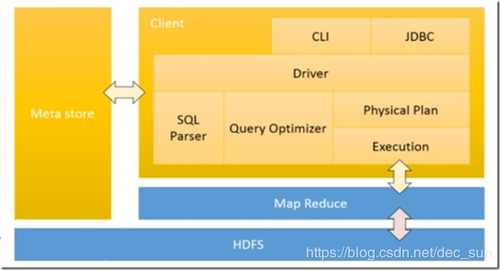

[toc]

# 简介

Hive 是一个离线数据数据仓库工具，用于解决海量结构化数据的日志的数据统计，其作用将结构化的数据文件映射成一张数据库表，并能提供简单的 SQL 的查询功能。Hive 的本质是将 HQL 语句转化为 MapReduce，所以其依赖于 HDFS，但是计算处理却依赖于 MapReduce。

1. hive 是通过类 SQL 来分析数据，从而避免写 java 程序代码；
2. hive 不具备存储数据的功能，其主要依赖 hdfs存储数据，这点与 mysql 不同；
3. hive 仅是将数据映射成一张张表；
4. hive 适合于离线数据分析，而不适合实时数据分析；
5. hive 不支持对数据的修改与添加，所有的数据都在加载时就已经被确定好。


## ETL

抽取：extract

转换：transform

加载：load


## HQL 与 SQL 的区别

|   比较   |          HQL          |   SQL    |
| :------: | :-------------------: | :------: |
| 数据存储 |      HDFS，HBase      | Local FS |
| 数据格式 |      用户自定义       | 系统决定 |
| 数据更新 |        不支持         |   支持   |
|   索引   |          有           |    有    |
|   执行   |       MapReduce       | Executor |
| 执行延迟 |          高           |    低    |
| 可扩展性 | 高（UDF，UDAF，UDTF） |    低    |
| 数据规模 |   大（数据大于 TB）   |    小    |
| 数据检查 |       读时模式        | 写时模式 |


- 使用索引

```
hive.optimize.index.filter：自动使用索引
hive.optimize.index.groupby：使用聚合索引优化GROUP BY操作
```


## Hive 架构


- 用户接口（Client）：主要包含 CLI （commad language interface），JDBC 或 ODBC，WEBUI；
- 元数据（metastore）：包括表名，表所属的数据库，表的拥有者，列 / 分区字段，表的类型，表的数据所在目录等内容；
- HDFS & MapReduce：Hive 使用 HDFS 进行存储，使用 MapReduce 进行计算；
- 解释器：将 SQL 字符串转化成抽象语法树 AST；
- 编译器：将 AST 编译成逻辑执行计划；
- 优化器：将逻辑执行计划转化成可执行的物理计划，如 MR / Spark

Hive 所有的数据都是存储在 HDFS 文件系统中，由于 HADOOP 由 Java 编写， Hive 中的数据类型也是源于 Java。 Hive 的所有 SQL 分析操作都转换成 MapReduce 中的 Job 任务来处理。所以 Hive 是 HADOOP 的数据仓库，运行 hive 也必须启动 hadoop来支撑存储，否则 hive 启动失败！


## Hive SQL 的解析过程

1. 根据 Antlr 语法解析规则，将 SQL 转化为抽象语法树AST；
2. 遍历 AST，生成基本查询单元 QueryBlock；

3. 遍历 QueryBlock，生成 OperatorTree;
4. 优化 OperatorTree；
5. OperatorTree 生成 MR job；
6. 使用物理优化器对 MR job任务进行优化。


HQL ->AST -> Operator Tree -> MR Job


# 基本操作

##  hive操作
```
--启动 hive
./bin/hive

--如果启动失败，可以是因为 hive service 需要启动，需要先执行吓一条命令
./bin/hive  --service metastore & 

--帮助
./bin/hive --help

--指定默认连接的数据库
hive --database dbName  
eg：hive --database db01

--在 linux 终端中执行 SQL 或者 HQL 语句
hive -e '命令'
eg: hive -e 'show databases'

--在 linux shell 命令中执行一个写有 SQL 语句的文件
hive -f /opt/app/hive.sql (hive.sql是sql语句文件)

--使当前 shell 配置临时生效
hive --hiveconf hive.cli.print.current.db=false
```


##  数据库操作

```
--查看数据库
show databases;

--使用数据库
use dbname

--创建 db01 数据库
create database if not exists db01; 

--在 hdfs 上指定目录 “dblocate” 来数据库的目录
create database if not exists db02 LOCATION '/dblocate';  

如果不指定目录，那么数据库的目录为：hdfs: /user/hive/warehouse/。这也是 hive 创建数据库的默认存储路径。

--如果数据库为空，那么可以采用此命令来删除
drop database db01;

--如果数据库不为空，那么需要采用添加CASCADE方式来删除
drop database db01 CASCADE;
```


## 表操作

```
--建表之前需要指定数据库
use databaseName；

--与 mysql 一样，创建一个 student 的表，包括两个字段： num，name
create table if not exists student(
     num int,
     name string
  );   (第一种创建表方式)
  
--设置分隔符, 即导入的数据,以该分隔符一一对应相应的column.所以这个属性需要根据数据来设置.
row format delimited fields terminated by '\t'  


create table if not exists student(
     num int,
     name string
) row format delimited fields terminated by '\t' stored as textfile;  

/*
stored as textfile： 默认为 textfile，文件数据是纯文本
stored as SEQUENCE：数据需要压缩
*/


--创建一个与 tb01 一模一样的表，拷贝 tb01 的数据结构
create table tb_name like tb01; (第二种创建表方式)

--根据子查询的结果直接来创建表 tb02，并将结果给 tb02；
create table table02 as select name from tb01; (第三种创建表方式)

--根据 tb01 表来创建一个新表 tb02 -- 复制表结构，
create table tb02 like tb01;  (第二种创建表方式)

--删除表
drop table if exists tb01;

--清空表内容, 但保留表结构
truncate table tb01;

--查看表
show tables in databaseName;

--修改表的名称
alter table tableName rename to newTableName;

--增加列
alter table tableName add columns(col type[int,string]);

--替换全部的列
alter table tableName replace columns(col1 type1, col2 type2, col3 type3);

--修改列
alter table tableName change oldColName newColName type;

--加载数据
/*加载数据, local 表示从本地路径,  必须根据表的格式来处理数据, 特别是 row format delimited fields terminated by '\t' 的属性, 比如 '\t',  数据之间必须是制表符. 否则显示 null。 [overwrite，覆盖重写，之前的 hive 的数据不存在被覆盖了]*/
load data local inpath '/opt/datas/student.txt' [overwrite] into table tb01;

--去掉 local，数据时从 hdfs 上加载
load data inpath '/student.txt' into table student;
虽然都是加载数据，但是他们的操作是不同的：本地加载为复制，HDFS加载为数据文件移动到对应的表目录下

--查询数据
select * from tb01;

--描述表信息
desc tableName

--查看函数
show functions

--描述函数
desc function methodName；
```


## hive 的临时参数设置

```
set hive.cli.print.current.db=false;  # 否显示当前数据库名 
set -v     # 显示所有设置
set hive.cli.print.header=true  # 显示表头

--查看本地目录信息，使用感叹号 + hdfs操作符就能操作 hdfs 的部分操作了。
hive -> !ls /;  (hive 终端)

--查看 HDFS 目录信息
hive -> dfs -ls / ;
```


## 基本数据类型

| 数据类型  | 长度                             | 范围                                       | 案例                |
| --------- | -------------------------------- | ------------------------------------------ | ------------------- |
| Tinyint   | 1字节的整数                      | -128 ~ 127                                 | 12                  |
| SmallInt  | 2字节的整数                      | -32768 ~ 32767                             | 255                 |
| Int       | 4字节的整数                      | -2147483648 ~ 2147483647                   | 250000              |
| BigInt    | 8字节的整数                      | -9223372036854775808 ~ 9223372036854775807 | 2500000000          |
| Boolean   | bool类型                         | true，false                                | TRUE                |
| Float     | 4字节单精度浮点型                |                                            | 3.1211              |
| Double    | 8字节双精度浮点型                |                                            | 3.1123123           |
| String    | 字符串                           |                                            | “absec”             |
| TimeStamp | 时间戳，格式 yyyy-mm-dd hh:mm:ss | 支持 unix timestamp                        | 2019-02-03 02:21:39 |
| Binary    | 二级制                           |                                            | 0 or 1              |
| Date      | 日期，格式 yyyy-mm-dd            | 可用 String 代替                           |                     |
| Decumal   | 任意精度数字                     |                                            | 10                  |
| Varchar   | 字符串                           | 字符串长度只能为 1 ~ 65355                 | “abcdfs”            |
| Char      | 字符串                           | 长度 1 ~ 255                               | "bacdf"             |


# 表

## 内部表

内部表是未被 “external” 修饰的表，其由 hive 管理。内部表由于存储了元数据以及存储数据，所以删除内部表，存储数据与元数据也会被删除。并且内部表被创建得路径在 hive 的默认仓库目录，即 “ /user/Hive/warehouse/”，同时也可以通过 location 指定位置。

```
create external table student06(
	id int,
    name string,
    age int) row format delimited fields terminated by '\t';
```


## 外部表

外部表是被 “external” 修饰的表，其由 HDFS 管理。删除外部表仅仅会删除元数据，但是存储数据不会被删除。用户在创建外部表时，可以自己指定表的路径：

```
create external table student06(
	id int,
    name string,
    age int)
    location '/dblocation02';
```


## 内、外部表总结

| 内部表                                            | 外部表                                         |
| ------------------------------------------------- | ---------------------------------------------- |
| 目录由 hive创建在默认的目录下，亦可以自己指定位置 | 目录由用户自己创建表时自己用 location 来指定   |
| 删除表时，表的元数据与表的数据目录都会被删除      | 删除表时，只删除表的元数据而表的数据不会被删除 |

一般来源的数据会在不同的平台上进行处理，所以为了方便映射，就可以采用**外部表**来进行映射，这样即使删除掉了表，也不会删除数据，也就不会影响数据在其他平台上的处理了。


## 分区表

分区表是在系统下创建文件夹目录，把分类数据放在不同的目录里面，可以加快查询速度。

如： 创建一个以 age 分区的表，
```xml
--通过按 age 字段来进行分区
/*
partition 分区字段不会在创建表的表结构字段中给出。
partition 的维度并不是实际数据的某一列，具体分区分标志是由插入内容时给定的，
当要查询某一分区的内容时可以采用 where 语句*/
create table student08(
	num int,
    name string
    )PARTITIONED BY (age string) ROW FORMAT DELIMITED FIELDS TERMINATED BY "\t";
    
那么分区表的结构就是
.../student08/age=10
.../student08/age=8

-- 创建有两个字段的分区表,age,class
create table student08(
	num int,
    name string
    )PARTITIONED BY (age string,class string) ROW FORMAT DELIMITED FIELDS TERMINATED BY "\t";
 
那么分区表的结构就是
.../student08/age=10/class=one
.../student08/age=8/classs=three
.../student08/age=10/class=two
.../student08/age=8/classs=four


    
-- 导入分区数据，将 stud.txt 的数据导入，其分区为 ‘age=7’，这个在装载是指定的。
LOAD DATA INPATH '/stud.txt' OVERWRITE INTO TABLE student08 PARTITION (age='7');
LOAD DATA INPATH '/stud.txt' OVERWRITE INTO TABLE student08 PARTITION (age='9',class='two');

-- 访问一个分区
select * from student08 s where s.age >= '7' AND s.age <'8';
select * from student08 s where s.age = '9' AND s.class='three';

--增加表分区
alter table student08 add partition(age='9') partition(age='15');

--查看表分区
show partition tableName;

--导入分区数据
insert into student08 partition(age='11');

select * from student08 where age='9';

--删除表分区：子目录和数据都会被删除
alter table tableName drop partition(age='11');
```


分区表中，表目录里面有多个子目录。如果要**针对不同时间，格式**等要求创建表，那么可以创建分区表，没有必要创建多个表。

分区表的数据是存放在不同的子目录中。在查询的时候，既可以针对子目录进行扫描，也可以针对全表进行扫描。

创建分区表后，分区目录是看不到子目录，只有在导入数据才可以看到。


- 分区与分桶

|                             分区                             |                             分桶                             |
| :----------------------------------------------------------: | :----------------------------------------------------------: |
| Hive 可以在创建表的时候指定分区空间，这样在查询时可以更好地提高查询效率，分区在 hdfs 路径表示为一个目录，目录是分区的字段 | 分桶是比分区更小的粒度划分数据，Hive 是指针对某一系列进行分桶，Hive 采用对列进行 hash(column)，然后除以同桶的个数求余来决定记录存放在哪个桶中。分桶可以更快地提高查询效率。 |

分区针对得是字段，分桶针对的是字段值。


## 分桶表

```
create table tableName(
id int,
name string
)clustered by(id) into n bucket;

分桶可以看出在创建时需要创建对应的字段，然后根据创建好的字段进行分桶操作，同时需要设置桶的个数，这样在进行 hash 操作时，可以数据导入时，就会根据分桶字段将数据放到不同的桶中。
```


# 数据的导入与导出

## load

1. 从本地导入，实际是将文本 copy 到表目录中
```
load data local inpath 'local_path' into table tb_name; 
```
2. 从 HDFS 导入，实际是将文本剪切到表目录中。
```xml
load data inpath 'hdfs_path' into table tb_name;

--overwrite: 覆盖, 用于临时表
load data inpath 'hdfs_path' overwrite into table tb_name;
```


两者的不同主要是本地导入，需要加 “local” 关键字；不加 “local”，就是 HDFS 的导入加载。同时 load 默认采用的追加的方式进行数据的导入，如果需要覆盖，则需要加上 ‘overwrite’


## as 查询输出

1. 将从 tb1 的查询结果保存到 tb 上
```
create table tb_name as select * from tbl_name;
create table tb as select * from tb1
```


## insert into 追加，导出

1. 将从 tb1 上查询的结果追加到 tb 上
```
insert into table tb_name select * from tb1_name;
```

2. 将从 tb1 上查询的结果覆盖到 tb 上。注意：这里有一个 overwrite 关键字。
```
insert overwrite table tb_name select * from tb1_name;
```

3.  将 tb 上查询到的数据导出到 hdfs 上

```
insert overwrite directory 'hdfs_path' select * from tb_name;
```

4. 将 tb 上查询到的数据导出到本地上
```
insert overwrite [local] directory 'path' select * from tb_name; //导出到本地
insert overwrite [local] directory 'path' row format delimited fields terminated by '\t' select * from tb_name; //数据之间会有制表空格

insert overwrite directory  '/bb'  select * from student08;
insert overwrite local directory '/bb' select * from student08;  // 导出到本地
```

5. 对部分手动输入数据进行导入

```
insert into table tb01 values(col01,col02,...);
```


## location 导入

1. 将指定的本地文件导入到外部表中，或者管理表中对数据的指定
```
/*其实就是将文件导入到相应的表目录中，这样 Hive 就可以通过对其进行映射得到一张表*/
dfs -put local_file_path hdfs_table_name;

--其实是 hdfs 的操作
dfs -put /opt/app/dep2.txt /user/hive/warehouse/dept

hdfs -put local_path hdfs_path;   // hdfs 提交文件
hdfs -get hdfs_path local_path;   //导出到本地
hive -e                           //将输出重定向保存到本地文件
hive -f                          //将输出重定向保存到本地文件
```


## import & export

```
export table tb_name to 'hdfs_path';    //将数据导出来, 必须是一个空目录
import table tb_name from 'hdfs_path'; //将数据导入到数据库
```


## Sqoop

涉及到 sqoop。


## 总结

hive 有 3 种导出方式： insert directory， sqoop，hive -e hql > out.txt

hive 有 3 种导入方式：load data， as（查询导入） insert into。


# 查询

## 聚合函数

|     函数      |            描述             |
| :-----------: | :-------------------------: |
|   count(*)    | 计算总行数，包括 NULL 值行  |
|   sum(col)    |    计算指定行的值的总和     |
|   avg(col)    |   计算指定行的值的平均数    |
|   min(col)    |   计算指定行的值的最小值    |
|   max(col)    |   计算指定行的值的最大值    |
| variance(col) | 计算 col 中的一组数值的方差 |
| var_samp(col) |    计算 col 中的样本方差    |


```
--limit n:返回 n 行数据
select * from student01 limit 2;

-- 列别名使用 as 或者直接加一个列名
select count(*) AS countCol from student08;
select count(*) contCol from student08;

-- case ... when ... then 选择处理当列的查询结果
select name,salary, case
						when salary < 500 then 'low'
						when salary >=500 and salary < 700 then 'middle'
						when salary > 700 then 'high'
                        else 'very high'
                        end as salaryDes from student08;
                       
--WHERE ... AND/OR ... 
select * from student08 where age='10' AND name='json'

--LIKE/RLIKE 匹配操作
select * from student08 where name like '%chi%'

--GROUP BY 按照一个或者多个列对**结果**进行分组
select year(ex_year). avg(ex_score) from student08 GROUP BY YEAR(ex_year);

-- HAVING:对 GROUP BY 语句产生的的分组进行条件任务
select year(ex_year),ave(ex_score) from student08 where ex_class='english' AND age='10' GROUP BY year(ex_year) HAVING avg(ex_score) >50;
/*可以通过子嵌套来进行转换*/

-- (INNER) JOIN ... ON ... :只支持等值查询
select * from student02 a JOIN student01 b ON a.name=b.name;
/*在进行 join 操作时，应该将小表放在前面。因为每次进行 join 操作时，需要对浅表进行缓存，然后再扫描后面的表进行计算*/

-- LEFT/RIGHT OUTER JOIN ... ON ...


**排序**

-- ORDER BY & SORT BY ... ASC/DESC
ORDER BY 是全局排序，所有数据会通过一个 reducer 来进行处理，这样就可以保证了数据的整体有序了。
SORT BY 是局部排序，每个 reducer 进行处理的数据都是有序的，但是整体而言，却不一定了。
select ex_year,ex_name,ex_age ex_score from student08 ORDER BY ex_age DESC, ex_score ASC;

select ex_year,ex_name,ex_age ex_score from student08 SORT BY ex_age DESC, ex_score ASC;
/*由于 ORDER BY 操作会导致运行时间过长，如果属性是 hive.mapred.mode 的值是 strict，必须采用 LIMIT 来进行限制。默认情况下 hive.mapred.mode 是 nonstrict*/

-- 

DISTRIBUTE BY ...:控制着 map 的输出在 reducer 中是如何划分的。因为 MR 在 shuffle 阶段是通过 key 来进行输出到 reducer 的。
select s.grade,s.class,s.name,s.score from student08 s DISTRIBUTE BY s.class SORT BY s.score DESC;

-- CLUSTER BY：如果 DISTRIBUTE BY 和 SORT BY 的参数相同，那么就可以用 CLUSTER BY,默认采用降序。
select * from student08 s CLUSTER BY s.class;
select s.grade,s.class,s.name,s.score from student08 s DISTRIBUTE BY s.class SORT BY s.class;

-- UNION ALL：对两个具有相同列的表进行合并
select *  from student01 UNION ALL select * from student02;
```

| order by |   sort by    |    distribute by    |              cluster by              |
| :------: | :----------: | :-----------------: | :----------------------------------: |
| 全局排序 | 分区局部排序 | 对 map 输出进行分区 | 与 sort by +distribute by 的功能相同 |


## 窗口函数

 hive 中的窗口函数和 sql 中的窗口函数相类似,都是用来做一些数据分析类的工作,一般用于 olap 分析。

```
OVER:指定分析函数工作的数据窗口大小，随着数据的变化而发生变化。子句理解成开窗子句，即打开一个窗口，窗口内包含多条记录
CURRENT ROW:当前行
n PRECEDING:往前 n 行数据
n FOLLOWING:往后 n 行数据
UNBOUNDED:起点
LAG(col,n) : 往前第 n 行数据
LEAD(col,n): 后第 n 行数据
NTILE(n):将有序数据平分均配到 n 个桶中。
/*ntile(num) over([partition_by_clause]  order_by_clause) as aliasRow */

first_value: 组内排序后，截止到当前行，第一个值 
last_value: 组内排序后，截止到当前行，最后一个值
```

```
聚合函数+over()
聚合函数+over(partition by ... )
聚合函数+over(partition by ... order by ...)
聚合函数+over(partition by ... order by ...) rows between A and B，A/B

dense_rank over(partition by ... order by ...)   eg:1,2,3,3,4 
rank over(partition by ... order by ...)         eg:1,2,3,3,5
row_number over (partition by ... order by ...) eg：1,2,3,4,5

lag(colname,num,default) over(partition by ... order by ...) :前几行
lead(colname,num,default) over (partition by ... order by ...):后几行

first_value(colname) over(partition by ... order by ...):分组排序后第一行
last_value(colname) over(partition by ... order by ...):分组排序后最后一行


ntile(3) over() :对全局数据切片
ntile(3) over(partition by ...):对分组之后的数据切片
ntile(3) over(order by ...):对数据按照升序后切片
ntile(3) over(partition by ... order by ...):对数据分组并按照升序后切片

UNBOUNDED PRECEDING 起点
UNBOUNDED FOLLOWING 终点
CURRENT ROW 当前行
数字+PRECEDING 前几行
数字+FOLLOWING 后几行
```


### over 的用法

方式：,aggFunction over() from

​			eg：select *, sum(num) over() from table;

**over(partiton by / order by)**：如果只使用partition by子句, 未指定order by的话,我们的聚合是分组内的聚合；使用了order by子句, 未使用window子句的情况下, 默认从起点到当前行. 

```
-- 窗口包括所有行，sum 通过 over 进行窗口计算，由于over 没有任何参数，所以是所有行。
select *, sum() over() overID from table;
/*通过对所有行进行窗口计算，所有 sum 始终都是所有行的总和*/

-- 窗口只有一行，sum 通过 over 进行窗口计算，但是是通过 id 来进行区分的，而 id 相同只有一个。
select *, sum(num) over(order by id) overID from table;
/*通过对 id 进行窗口计算求总和，每次来一个 id，就进行累计，就得到当前 id 的总和*/


-- 窗口只有多行，根据 name 来分区
select *, sum(num) over(partition by name) from table;
/*由于是通过分区 name 来进行总和计算，所有 sum 的值总是相同 name 叠加的总和*/

-- 窗口只有多行，根据 name 来分区，再根据 id 来排序
select *, sum(num) over(partition by name order by id) from table;
/*通过对分区的 name，和每次来的 id 进行计算，所有一个分区内，第一个值的和=当前num，第二值的和=num+num*/

-- 创建显示一行，窗口向前或向后各一行来进行计算
/*over( order by id range between 1 preceding and 1 following ) range 代表范围 preceding 向前 following 向后 窗口范围当前行前后一行*/
SELECT id,name,num, sum(num) over(order by id range between 1 preceding and 1 following) sum1 from table。
/*也就是说 sum 的计算结果是通过当前行+前一行+后一行的值 */

-- over(order by id range between CURRENT ROW AND 1 following ) 窗口范围当前行和后面一行
select * sum(num) over(order by id range between CURRENT ROW AND 1 FOLLOWING) sum1 from table;
/*sum 是通过 id 来进行窗口计算，所有sum=当前行+下一行*/
```


### ELSE

```
-- row_number的用途非常广泛，排序最好用它，它会为查询出来的每一行记录生成一个序号，依次排序且不会重复，注意使用row_number函数时必须要用over子句选择对某一列进行排序才能生成序号。
select name,course,row_number() over(partition by course order by score desc) rank from student;

-- rank 函数用于返回结果集的分区内每行的排名
select name,course,rank() over(partition by course order by score desc) rank from student;

-- dense_rank函数出现相同排名时，将不跳过相同排名号，rank值紧接上一次的rank值
select name,course,dense_rank() over(partition by course order by score desc) rank from student;
```


|  row_number  |                          rank                          |                          dense_rank                          |
| :----------: | :----------------------------------------------------: | :----------------------------------------------------------: |
| 结果行号递增 | 用于分区内的排名值，如果两条 rank 相同，就排名值相同。 | 用于分区内的排名值，如果两条 rank 相同，那就排名制相同，然后排名值再依然递增。 |


## 排序

```
ORDER BY colName ASC/DESC
hive.mapred.mode=strict时需要跟limit子句
hive.mapred.mode=nonstrict时使用单个reduce完成排序
SORT BY colName ASC/DESC ：每个reduce内排序
DISTRIBUTE BY(子查询情况下使用 )：控制特定行应该到哪个reducer，并不保证reduce内数据的顺序
CLUSTER BY ：当SORT BY 、DISTRIBUTE BY使用相同的列时


-- 合并小文件
hive.merg.mapfiles=true：合并map输出
hive.merge.mapredfiles=false：合并reduce输出
hive.merge.size.per.task=256*1000*1000：合并文件的大小
hive.mergejob.maponly=true：如果支持CombineHiveInputFormat则生成只有Map的任务执行merge
hive.merge.smallfiles.avgsize=16000000：文件的平均大小小于该值时，会启动一个MR任务执行merge。
```


# 视图

视图可以保存一个查询并向对待表一样进行查询操作。

```
-- 创建
CREATE VIEW viewShort AS select * from student s where s.aga > 20;

-- 操作
select * from viewShort;
```


# Hive 函数分析

COUNT,  SUM,  MIN,  MAX,   AVG

lag 和 lead 有三个参数，第一个参数为列名，第二个参数是偏移的 offset，第三个参数是超出记录窗口时的默认值。
LEAD(col, n, DEAFAULT)  //用于统计窗口内往上第 n 行值

```
select lead(age) over(order by name) from student02;
select lead(age,2,0) over(order by name) from student02;
```
LAG(col, n, DEAFULT) //用于统计窗口内往下第 n 行值.
```
select lag(age) over(order by name) from student02;
select lag(age,2,0) over(order by name) from student02;
```


# 常用 HQL

```
过滤: where / limit / distinct (唯一查询) / between and / is null / is not null / case when then

is null = isnull()
is not null = isnotnull()

select * from tb_name where name = 'add';
select * from tb_name limit 10, 1    // (从10开始(但不包括10), 选取 1 个)—
selct * from tb_name limit 2    //(选取 2 个);

select distinct name from tb_name;   //唯一的name取出
select * from tb_name where name between 'aaa' and 'bbb'
select * from tb_name where name is null;
select * from tb_name where name is not null;

select * , (case sex when 1 then 'man' when 2 then 'women' else '' end) from tb_name;
select *, (case name when 'zhang01' then 'xxxx' when 'zhang02' then 'zzzz' else '' end) from student02;

聚合: count / sum / avg / max / min / group by / having (必须有 group by) 
select avg(col1 * col2) from tb_name;
select sum(col1) from tb_name;
select count(*) from tb_name where col1 >100;
select min(col1 * col2) from tb_name;
select max(col1 * col2) from tb_name;

select * from tb_name group by col_name;
select name,num,collect_set(age) from student02 group by name;

SELECT student_class,COUNT(ALL student_name) AS 总人数 FROM t_student GROUP BY (student_class);

select * from tb_name having col1 >20 

select age, collect_set(name,num) from student02 group by age  having age > 8;

SELECT student_class,AVG(student_age) AS 平均年龄 FROM t_student GROUP BY (student_class) HAVING AVG(student_age)>20; 
   
--多表之间 inner join / 多表之间 left join / 多表之间 right join / 多表之间 full join
select * from tb1_name inner join tb2_name on tb1.colname = tb2.colname;  //两表的交集.

// LEFT JOIN产生表1的完全集，而2表中匹配的则有值，没有匹配的则以null值取代。
select colname(s) form tb1_name left join tb2_name on tb1.colname = tb2.colname; 

--RIGHT JOIN产生表2的完全集，而1表中匹配的则有值，没有匹配的则以null值取代
select colname(s) form tb1_name right join tb2_name on tb1.colname = tb2.colname;

--FULL OUTER JOIN产生1和2的并集。但是需要注意的是，对于没有匹配的记录，则会以null做为值 
select colname(s) form tb1_name full join tb2_name on tb1.colname = tb2.colname;  

--导入
load data local inpath '/a1.txt' into table student08 partition(age='11');
load data local inpath '/a1.txt'  overwrite into table student08 partition(age='15'); // 覆盖
load data inpath '/a.txt' into table student08;  // 从 hdfs 上的 a.txt 导入

-- 插入新字段
ALTER TABLE tableName ADD COLUMNS(colName colType,...)

```


# Hive 运行参数

// 设置每个 reduce 处理的数据量 
hive.exec.reducers.bytes.per.reduce=\<number>

// 设置最大能够运行的 reduce 个数
hive.exec.reducer.max=\<max>

// 实际 reduce 的个数
mapreduce.job.reduces=\<number>

// 设置 reduce 开启条件
hive.fetch.task.conversion=none,more,min


# 排序方式

- order by 全局排序
order by 会对查询的全局结果进行排序。最终 map 数据的数据汇聚到一个 reduce 中去执行。如果数据量很大，那么这个操作是相当漫长的。所以在 hive 操作中尽量少用 order by，除非数据量很小。

```
select * from student08 order by age;
```

- sort by  局部排序
sort by 是一个局部排序，也就是说在每个 partition 中进行排序，保证每个 partition 中的数据是有序的。但是对于全局而言，其又不一定是有序的。

```
select * from student08 sort by age;
```

- distribute by 分区
distribute by 是指定输出结果怎样划分到各自的 reduce 分区中。

```
--指定 age 字段相同的结果被划分到同一个 reduce分区中
select * from student08 distribute by age；
```

-  cluster by = sort by + distribute by
cluster by 具有 sort by 与 distribute by 的两重功能。能将相同字段进行 sort by 排序和distribute by 分区。

```
select * from student08 cluster by age;
select * from  student08 distribute by age sort by age;
```


# 自定义函数 UDF

1.  配置环境      pom / hive-site.xml
2.  自定义类继承 org.apache.hadoop.hive.ql.exec.UDF
     定义 public Object evaluate(Object args) 方法
3.  导出 jar 包并植入本地环境 linux 的 localpath 目录下
4.  关联 jar。进入hive， add jar localpath;
5.  创建临时函数 create temperary function 函数名 as '包名.类名';
6.  执行

```
public class UserInfoParser extends UDF{
	public String evaluate(String field,int index){
		String replaceAll = field.replaceAll("\\|", " ");
		String[] split = replaceAll.split(" ");
		return split[index-1];
	}
}

// 创建临时函数 
create temporary function functionName as 'packageName.className';
```


同时 Hive 还提供了一个 GenericUDF 类，GenericUDF 是更为复杂的抽象概念，但是其提供了支持更好的 null 值处理同时可以处理一些标准的 UDF 无法支持的编程操作。


# 虚拟列

虚拟列并不是在表中真正存在的列，其用意是为了将 hive 中的表进行分区，这对每日增长的海量数据存储而言非常有用的。

其种类有两种：
1. 这行数据属于哪个文件   ----    INPUT\_\_FILE\_\_NAME
2. 块的偏移量，类似于每行的存储地址 ---- BLOCK\_\_OFFSET\_\_INSIDE\_FILE

```
hive.exec.rowoffset：是否提供虚拟列

select *, INPUT__FILE__NAME from student;
select *, BLOCK__OFFSET__INSIDE__FILE from student;
```


# 压缩

Hive 压缩的目的是：减少磁盘 IO 与网络 IO

- 配置方式
   1. 将 snappy 文件解压缩到 hadoop/lib/native
   2. 使用 hadoop checknative 检验是否可用

- snappy 文件的处理
   1. 参照 hadoop 源码下的 building.txt 进行编译
   2. 下载 snappy 库文件 http://google.github.io/snappy/
   3. 安装 snappy，将相关 jar 放在 lib 库中
   4. 编译


## 常见压缩总结

1. 压缩格式：bzip2, gzip, lzo, snappy
2. 压缩比：bzip2 > gzip > lzo
3. 压缩速度：bzip2 < gzip < lzo


## 压缩格式与 hive 命令

```
zlib       ->      org.apache.hadoop.io.compress.DefaulCodec
gzip       ->      org.apache.hadoop.io.compress.GzipCodec
Bzip2      ->      org.apache.hadoop.io.compress.BZip2Codec
Lzo        ->      com.hadoop.compression.lzo.LzoCodec
Lz4        ->      org.apache.hadoop.io.compress.Lz4Codec
Snappy     ->      org.apache.hadoop.io.compress.SnappyCodec
```


## 压缩方案

压缩方案
```
MapReduce 配置 map 端压缩:
mapreduce.map.output.compress=true
mapreduce.map.output.compress.codec=org.apache.hadoop.io.compress.SnappyCodec
```
```
MapReduce 配置 Reduce 端压缩:
mapreduce.output.fileoutputformat.compress=true
mapreduce.output.fileoutputformat.compress.codec=org.apache.hadoop.io.compress.SnappyCodec
```
```
Hive 配置压缩
hive.exec.compress.intermediate=true
mapred.map.output.compression.codec=org.apache.hadoop.io.compress.SnappyCodec
mapred.output.compression.type=BLOCK
```
```
任务中间压缩
hive.exec.compress.intermediate=true
hive.intermediate.compression.codec=org.apache.hadoop.io.compress.SnappyCodec
hive.intermediate.compression.type=BLOCK
```


# Thrift 服务

```
--启动
./bin//hive --service hiveserver2
```


# 时间处理

1. 自定义 UDF 函数
2. 时间函数
     1. 标准日期格式：2017-12-31 00:00:00
     2. Unixtimestamp：1970-01-01 00:00:00至今的总秒数
     ```
     //需标准格式   
      select unix_timestamp("2017-12-31 00:00:00");
      select from_unixtime(1486543750); 
      select unix_timestamp('201712331 00:00:00','yyyyMMdd HH:mm:ss');
     ```


# 数据倾斜

数据倾斜造成的原因：当到达 reduce 端数据如果在某一个 key 上分布特别多的话，就会造成单个节点处理时间异常增多，从而导致整体任务消耗严重。

| 关键词         | 情况                                          | 后果                                           |
| -------------- | --------------------------------------------- | ---------------------------------------------- |
| join           | 其中一个表较小，但 key 集中                   | 分发到某一个或几个 reduce 上的数据远高于平均值 |
|                | 大表与大表，但是分桶的判断字段 0 值或空值过多 | 这些控制都是由一个 reduce 处理，非常慢         |
| group by       | 维度过小，某值的数量过多                      | 处理某值的 reduce 非常耗时                     |
| count distinct | 某特殊值过多                                  | 处理此特殊值的 reduce 耗时                     |

- 数据倾斜的具体原因：
	1. key 分布不均匀
	2. 业务数据本身的特征
	3. 建表时考虑不周
	4. 某些 sql 语句本身就有数据倾斜

- 数据倾斜的具体表现：
	任务进度长时间维持在 99%，查看任务监控页面，发现只有少量 reduce 子任务未完成，因为其处理的数据量和其他 reduce 差异过大。
	单一 reduce 的记录数与平均记录数差异过大，通常可能达到 3 倍甚至更多，最长时长远大于平均时长。


## 方案

- 调节参数

```
hive.groupby.skewindata=true
hive.map.aggr=true

生成的查询计划会有两个 MRJob。第一个 MRJob 中，Map 的输出结果集合会随机分布到 Reduce 中，每个 Reduce 做部分聚合操作，并输出结果，这样处理的结果是相同的 GroupBy Key 有可能被分发到不同的 Reduce 中，从而达到负载均衡的目的；第二个 MRJob 再根据预处理的数据结果按照 GroupBy Key 分布到  Reduce 中（这个过程可以保证相同的 GroupBy Key 被分布到同一个 Reduce 中），最后完成最终的聚合操作。
```


 - SQL 语句调节

1. 当进行 join 操作是，做好相应的裁剪和过滤，保证两表的数据量相对较小
2. 大小表进行 join 时，可以保证小表在前面，先进入内存，在 Map 端完成 Reduce
3. 大表 join 大表，给非空的 key 编程 key_randonNumber，这样可以将倾斜数据分到不同的 reduce 上。
4. count distinct 时，将值为空的情况单独处理。如果是计算 count distinct，可以不用处理，直接过滤，在最后结果中加 1。如果还有其他计算，需要进行 group by，可以先将值为空的记录单独处理，再和其他计算结果进行 union。

```
select * from log a where a.user_id is null;
select * from users a left outer join logs b on a.user_id=cast(b.user_id as string)
```

- 表的设计


# [优化处理](https://www.cnblogs.com/yshb/p/3147710.html)

- 表拆分
	大表拆分成小表，分区表，外部表，临时表

	分区表是在一个或多个维度上对数据进行分类存储，一个分类（分区）对应一个子目录。在这样的存储方式中，如果筛选的条件中有分类字段，那么 hive 只需要遍历相应的子目录下的文件即可，而不用全局遍历。提高查询的时间。
	
	
	
- MR 优化
	所谓的 MR 优化，就是针对 map 和 reduce 的操作进行优化处理。因此就涉及到了 map 优化和 reduce 优化。
	
	map 端：
  hadoop 源码中有一个计算公式, 决定了 map 的个数：		   	  min(max_split_size,max(min_split_size,block_size))
	
	```
	min_split_size默认值0         （最小分片大小) 
	block_size，block_size         默认是128
	max_split_size                 默认值256（最大分片大小）
	```
一个在实际的生产环境中 HDFS 一旦 format 格式化之后, `block_size` 大小不会去修改的，可以通过 `max_split_size` 和 `min_split_size` 来影响map的个数。
	
	reduce 端
	在 reduce 端可以调整 reduce task 的个数 `set mapred.reduce.tasks=number`。
	
	


- 并行执行
	hive sql 在底层会运行 MR job，每个 job 就是一个 stage，这些 job 是顺序执行的，但是针对有些互相没有依赖关系的独立的 job, 可以选择并发的执行 job，这样就能提高并行度，节约运行时间。
	
	```
  hive.exec.parallel=true #参数控制在同一个sql中的不同的job是否可以同时运行
  hive.exec.parallel.thread.number=8   # 对于同一个sql来说同时可以运行的job的最大值, 该参数默认为8. 此时最大可以同时运行8个job.
  ```
  一般在工作中会选择去开启该功能，需根据实际的集群的状况和服务器的性能合理的设置线程数目。
	

但是在系统资源匮乏时，启用并行反而会导致各 job 抢占资源而导致整体的执行性能下降，这点需要注意。
	
	
- JVM重用
	hive 的操作涉及到 MR job，每一个 MR job 是由一系列的 map task 和 reduce task 组成，每个 map 或 task task 会启动一个 JVM 进程，一旦 task 执行完毕，JVM 就会退出。如果不听的启动或关闭 JVM，JVM 的运行将是一个比较耗时的操作，因此，可以采用 JVM 重用来处理。
    MR默认JVM运行, 开启 JVM 开启多个任务 `mapreduce.job.jvm.num.tasks=number`  也就是说，每个 JVM 在执行 number 个任务后才退出，这样可以节省 JVM 的操作时间。
	 	```
	 	set mapreduce.job.jvm.num.tasks = 10;```
	 	


- 推测执行
  当某个任务出现迟迟不结束的情况, 开启推测执行会开启一个一模一样的任务, 其一但完成关闭另一个.
  分为 map 端的推测和 reduce 端的推测，但过多的消耗资源, 可能会出现重复写入的情况。

  ```
  mapred.map.tasks.speculative.execution=true
  mapred.reduce.tasks.speculative.execution=true
  hive.mapred.reduce.tasks.speculative.execution=true;
  ```


- [本地模式](https://blog.csdn.net/u013980127/article/details/53998324)
hive 在集群上查询时，默认是在集群上的多台机器上运行，需要集群上的机器协调运行。这对于查询大数据量是有好处的，但是当查询的数据量较小时，就没有必要启动集群方式来进行查询处理了，毕竟集群涉及到了网络，多点协调等问题，对于小数据量而言可能更耗资源。因此可以只是用本地模式来进行 hive 操作。

	要求：
	```
	hive.exec.mode.local.auto = true          	
	hive.exec.mode.local.auto.input.files.max    =>   数据大小不能超过 128 MB
	hive.exec.mode.local.input.files.max    =>   map 不能超过 4 个
	reduce 的个数不能超过 1 个
	```

	同时可以针对查询进行不执行 MR 来进行处理，参数：`hive.fetch.task.conversion = more`，表示在 select，where，limit 操作时，都直接进行数据抓取操作，而不涉及 MR 计算的操作，这样执行的效率更快更高。

	```
	set hive.fetch.task.conversion= more;
	select * from student08 where age is not null;
	```


# Hive 安装

## 前期准备

### Hadoop 安装

```xml
在安装 Hive 时，需要先搭建好 hadoop， 并保证 HDFS， YARN已经启动成功。
hadoop-daemon.sh start namenode 
hadoop-daemon.sh start datanode
hadoop-daemon.sh start secondarynamenode
yarn-daemon.sh start resourcemanager
yarn-daemon.sh start nodemanager
mr-jobhistory-daemon.sh start historyserver

本次安装使用的 Hive 版本：apache-hive-1.2.2-bin
```


### MySQL 安装

```xml
1. 检查 mysql 是否安装
   yum list installed |grep mysql

2. 卸载 mysql 
   yum -y remove mysql-libs.x86_64
   rpm -qa | grep mysql

3. 安装 mysql
   yum install -y mysql-server mysql  mysql-devel

4. 检查 mysql 版本
   rpm -qi mysql-server

5. 启动 mysql 数据库
   service mysqld start
   service mysqld restart

6. 设置开机启动
   chkconfig --list | grep mysqld
   chkconfig mysqld on

7. 设置 mysql 的用户
   // root 用户， 密码：123456
   mysqladmin -u root password '123456' 
   
8. 登录
   mysql -u root -p

9. 查看 databases 数据库
  show databases；

10. 创建 Hive 的数据库，用于存储 hive 的元数据
    create database hive; //javax.jdo.option.ConnectionURL的端口后的字段保持一致

11. 查看是否创建成功
    show databases；
   
12. 用户授权
    //仅允许用户 root 从 192.168.47.188 的主机连接到 mysql 数据库，'123456' 是 root 的密码
    GRANT ALL PRIVILEGES ON *.* TO 'root'@'192.168.47.188' IDENTIFIED BY '123456' WITH GRANT OPTION;
    //允许 root 用户从任意主机连接到 mysql 服务器。
     GRANT ALL PRIVILEGES ON *.* TO 'root'@'%' IDENTIFIED BY '123456' WITH GRANT OPTION;

13. 刷新权限
    flush privileges;

注： ERROR 1045 (28000):Access denied for user 'root'@'node01' (using password: YES)
    <!-- https://blog.csdn.net/chengyuqiang/article/details/61213396 -->
    // 查询用户表
    select user,host,password from mysql.user;
    // 删除用户表中的 host=node01 用户
    delete from mysql.user where host='node01';
    // 删除密码为空的记录
    delete from mysql.user where user is null;
    delete from mysql.user where password='';
   
    grant all privileges on *.* to root@'%' identified by '123456' with grant option;
    flush privileges;
    
    mysql -h node1 -uroot -p123456 //可以直接进去表示权限问题处理成功。
   
    删除用户信息，防止分布式环境下登陆失败
    delete from user where host='127.0.0.1';

14. mysql 已经安装成功, 并启动
    service mysqld start
```


## Hive 配置

```
 1. 解压安装 Hive。
    tar -zxvf apache-hive-1.2.2-bin.tar.gz -c /opt/app

2. 配置 Hive 环境变量：
   vi /etc/profile
   添加:
       export HIVE_HOME=/opt/app/hive-0.13.1-cdh5.3.6
       export PATH=$HIVE_HOME/bin:$PATH

3. 生效
   source /etc/profile

4. 进入 ./hive-0.13.1-cdh5.3.6/conf
   cp hive-default.xml.template hive-site.xml
   cp hive-env.sh.template hive-env.sh

5. 修改 hive-env.sh
   例如：
       # Set HADOOP_HOME to point to a specific hadoop install directory
        HADOOP_HOME=/opt/app/hadoop-2.5.0
       # Hive Configuration Directory can be controlled by:
        export HIVE_CONF_DIR=/opt/app/hive-0.13.1-cdh5.3.6/conf

6. 修改 hive-site.xml
   a. 保持 hive.metastore.warehouse.dir的值为 /user/hive/warehouse，保持不变
   <property>
   <name>hive.metastore.warehouse.dir</name>
   <value>/user/hive/warehouse</value> <!--hdfs上的目录, 非本地-->
   <description>location of default database for the warehouse</description>
   </property>

   b. javax.jdo.option.ConnectionURL -> jdbc:mysql://192.168.47.188:3306/hive?createDatabaseIfNotExist=true
   <property>
   <name>javax.jdo.option.ConnectionURL</name>
   <value>jdbc:mysql://192.168.47.188:3306/hive?createDatabaseIfNotExist=true</value> <!--这里hive 是数据库中的创建的hive-->
   <description>JDBC connect string for a JDBC metastore</description>
   </property>
  
   c. javax.jdo.option.ConnectionDriverName -> com.mysql.jdbc.Driver (mysql 驱动)
   <property>
   <name>javax.jdo.option.ConnectionDriverName</name>
   <value>com.mysql.jdbc.Driver</value>
   <description>Driver class name for a JDBC metastore</description>
   </property>

   d. javax.jdo.option.ConnectionUserName -> mysql 用户名
   <property>
   <name>javax.jdo.option.ConnectionUserName</name>
   <value>root</value>
   <description>username to use against metastore database</description>
   </property>
  
   e. javax.jdo.option.ConnectionPassword -> mysql 密码
   <property>
   <name>javax.jdo.option.ConnectionPassword</name>
   <value>123456</value>
   <description>password to use against metastore database</description>
   </property>

   f. hive.metastore.uris ->  端口
   <property>
   <name>hive.metastore.uris</name>
   <value>://node01:9083</value>
   <description> URI for the remote metastore. Used by metastore client to connect to remote metastore.</description>
   </property>


7. 创建tmp 目录
   cd /opt/app/hive-0.13.1-cdh5.3.6
   mkdir tmp

8. hive-site.xml ->  hive.exec.local.scratchdir -> /opt/app/hive-0.13.1-cdh5.3.6/tmp/${user.name}
  <property>
  <name>hive.exec.local.scratchdir</name>
  <value>/opt/app/hive-0.13.1-cdh5.3.6/tmp/${user.name}</value>
  <description>Local scratch space for Hive jobs</description>
  </property>

9. (可选)hive.metastore.schema.verification设置成false(可选)：如果初始化元数据库出现认证问题，可以设置此参数，再次初始化。


10. 目录的配置
   hdfs dfs -mkdir /tmp     //基于hdfs, 非本地的目录.hive的默认临时文件目录
   hdfs dfs -mkdir -p /user/hive/warehouse  //基于hdfs, 非本地的目录. hive的warehouse默认目录
   hadoop fs -chmod g+w   /tmp   //为hdfs中的tmp目录授权
   hadoop fs -chmod g+w   /user/hive/warehouse  //为hdfs中的目录授权

11. 上传mysql 驱动包  -> lib 库
    cp mysql-connector-java-5.1.45-bin.jar /opt/app/hive-0.13.1-cdh5.3.6/lib/

12. 初始化 Hive 元数据库
    schematool -dbType mysql -initSchema  --verbose 
    //如果一个系统中有两个hive共用一个mysql, 那么需要重新创建hive database(见安装mysql的步骤10). 否则, 新的hive 进行该操作时,会报错.

14. 检测hive 是否安装成功
    直接在命令行输入 hive：
    注意：此时hdfs和yarn必须是启动运行状态。


额外内容:
  <property>
    <name>hive.cli.print.header</name>
    <value>true</value> <!--在 select 结果中显示列名->
    <description>Whether to print the names of the columns in query output.</description>
  </property>

  <property>
    <name>hive.cli.print.current.db</name>
    <value>true</value>  <!--在hive 中可以显示当前数据库-->
    <description>Whether to include the current database in the Hive prompt.</description>
  </property>
```


## 安装可能出现的问题

```xml
问题 1
[ERROR] Terminal initialization failed; falling back to unsupported
java.lang.IncompatibleClassChangeError: Found class jline.Terminal, but interface was expected
        at jline.TerminalFactory.create(TerminalFactory.java:101)
        at jline.TerminalFactory.get(TerminalFactory.java:158)
        at jline.console.ConsoleReader.<init>(ConsoleReader.java:229)
        at jline.console.ConsoleReader.<init>(ConsoleReader.java:221)
        at jline.console.ConsoleReader.<init>(ConsoleReader.java:209)
        at org.apache.hadoop.hive.cli.CliDriver.getConsoleReader(CliDriver.java:773)
        at org.apache.hadoop.hive.cli.CliDriver.executeDriver(CliDriver.java:715)
        at org.apache.hadoop.hive.cli.CliDriver.run(CliDriver.java:675)
        at org.apache.hadoop.hive.cli.CliDriver.main(CliDriver.java:615)
        at sun.reflect.NativeMethodAccessorImpl.invoke0(Native Method)
        at sun.reflect.NativeMethodAccessorImpl.invoke(NativeMethodAccessorImpl.java:57)
        at sun.reflect.DelegatingMethodAccessorImpl.invoke(DelegatingMethodAccessorImpl.java:43)
        at java.lang.reflect.Method.invoke(Method.java:606)
        at org.apache.hadoop.util.RunJar.main(RunJar.java:212)
            
hadoop目录下存在老版本jline：
/hadoop-2.6.0/share/hadoop/yarn/lib：
-rw-r--r-- 1 root root   87325 Mar 10 18:10 jline-0.9.94.jar
将 hive 的 jline jar包复制到 该目录中, 并可以备份并且移除 $HADOOP_HOME/share/hadoop/yarn/lib/ 下的jline-0.9.94.jar文件，
            
问题 2
Exception in thread "main"java.lang.RuntimeException: java.lang.IllegalArgumentException:java.net.URISyntaxException: Relative path in absolute URI:${system:java.io.tmpdir%7D/$%7Bsystem:user.name%7D
        atorg.apache.hadoop.hive.ql.session.SessionState.start(SessionState.java:444)
        atorg.apache.hadoop.hive.cli.CliDriver.run(CliDriver.java:672)
        atorg.apache.hadoop.hive.cli.CliDriver.main(CliDriver.java:616)
        atsun.reflect.NativeMethodAccessorImpl.invoke0(Native Method)
        atsun.reflect.NativeMethodAccessorImpl.invoke(NativeMethodAccessorImpl.java:57)
        atsun.reflect.DelegatingMethodAccessorImpl.invoke(DelegatingMethodAccessorImpl.java:43)
        atjava.lang.reflect.Method.invoke(Method.java:606)
        atorg.apache.hadoop.util.RunJar.main(RunJar.java:160)
Caused by: java.lang.IllegalArgumentException:java.net.URISyntaxException: Relative path in absolute URI:${system:java.io.tmpdir%7D/$%7Bsystem:user.name%7D
        atorg.apache.hadoop.fs.Path.initialize(Path.java:148)
        atorg.apache.hadoop.fs.Path.<init>(Path.java:126)
        atorg.apache.hadoop.hive.ql.session.SessionState.createSessionDirs(SessionState.java:487)
        atorg.apache.hadoop.hive.ql.session.SessionState.start(SessionState.java:430)
        ... 7more
Caused by: java.net.URISyntaxException:Relative path in absolute URI:${system:java.io.tmpdir%7D/$%7Bsystem:user.name%7D
        atjava.net.URI.checkPath(URI.java:1804)
        atjava.net.URI.<init>(URI.java:752)
        atorg.apache.hadoop.fs.Path.initialize(Path.java:145)
        ... 10more
            
1.查看hive-site.xml配置，会看到配置值含有"system:java.io.tmpdir"的配置项
2.新建文件夹/home/grid/hive-0.14.0-bin/iotmp
3.将含有"system:java.io.tmpdir"的配置项的值修改为如上地址
https://blog.csdn.net/zwx19921215/article/details/42776589
            
 
问题 3
错误Name node is in safe mode的解决方法  ->   bin/hadoop dfsadmin -safemode leave
            
      
问题 4
Exception in thread "main" java.lang.RuntimeException: java.net.ConnectException: Call From node01/192.168.47.188 to node01:8020 failed on connection exception: java.net.ConnectException: Connection refused; For more details see:  http://wiki.apache.org/hadoop/ConnectionRefused
	at org.apache.hadoop.hive.ql.session.SessionState.start(SessionState.java:522)
	at org.apache.hadoop.hive.cli.CliDriver.run(CliDriver.java:677)
	at org.apache.hadoop.hive.cli.CliDriver.main(CliDriver.java:621)
	at sun.reflect.NativeMethodAccessorImpl.invoke0(Native Method)
	at sun.reflect.NativeMethodAccessorImpl.invoke(NativeMethodAccessorImpl.java:57)
	at sun.reflect.DelegatingMethodAccessorImpl.invoke(DelegatingMethodAccessorImpl.java:43)
	at java.lang.reflect.Method.invoke(Method.java:606)
	at org.apache.hadoop.util.RunJar.main(RunJar.java:212)
Caused by: java.net.ConnectException: Call From node01/192.168.47.188 to node01:8020 failed on connection exception: java.net.ConnectException: Connection refused; For more details see:  http://wiki.apache.org/hadoop/ConnectionRefused
	at sun.reflect.NativeConstructorAccessorImpl.newInstance0(Native Method)
	at sun.reflect.NativeConstructorAccessorImpl.newInstance(NativeConstructorAccessorImpl.java:57)
	at sun.reflect.DelegatingConstructorAccessorImpl.newInstance(DelegatingConstructorAccessorImpl.java:45)
	at java.lang.reflect.Constructor.newInstance(Constructor.java:526)
	at org.apache.hadoop.net.NetUtils.wrapWithMessage(NetUtils.java:783)
	at org.apache.hadoop.net.NetUtils.wrapException(NetUtils.java:730)
	at org.apache.hadoop.ipc.Client.call(Client.java:1415)
	at org.apache.hadoop.ipc.Client.call(Client.java:1364)
	at org.apache.hadoop.ipc.ProtobufRpcEngine$Invoker.invoke(ProtobufRpcEngine.java:206)
	at com.sun.proxy.$Proxy19.getFileInfo(Unknown Source)
	at sun.reflect.NativeMethodAccessorImpl.invoke0(Native Method)
	at sun.reflect.NativeMethodAccessorImpl.invoke(NativeMethodAccessorImpl.java:57)
	at sun.reflect.DelegatingMethodAccessorImpl.invoke(DelegatingMethodAccessorImpl.java:43)
	at java.lang.reflect.Method.invoke(Method.java:606)
	at org.apache.hadoop.io.retry.RetryInvocationHandler.invokeMethod(RetryInvocationHandler.java:187)
	at org.apache.hadoop.io.retry.RetryInvocationHandler.invoke(RetryInvocationHandler.java:102)
	at com.sun.proxy.$Proxy19.getFileInfo(Unknown Source)
	at org.apache.hadoop.hdfs.protocolPB.ClientNamenodeProtocolTranslatorPB.getFileInfo(ClientNamenodeProtocolTranslatorPB.java:707)
	at org.apache.hadoop.hdfs.DFSClient.getFileInfo(DFSClient.java:1785)
	at org.apache.hadoop.hdfs.DistributedFileSystem$17.doCall(DistributedFileSystem.java:1068)
	at org.apache.hadoop.hdfs.DistributedFileSystem$17.doCall(DistributedFileSystem.java:1064)
	at org.apache.hadoop.fs.FileSystemLinkResolver.resolve(FileSystemLinkResolver.java:81)
	at org.apache.hadoop.hdfs.DistributedFileSystem.getFileStatus(DistributedFileSystem.java:1064)
	at org.apache.hadoop.fs.FileSystem.exists(FileSystem.java:1398)
	at org.apache.hadoop.hive.ql.session.SessionState.createRootHDFSDir(SessionState.java:596)
	at org.apache.hadoop.hive.ql.session.SessionState.createSessionDirs(SessionState.java:554)
	at org.apache.hadoop.hive.ql.session.SessionState.start(SessionState.java:508)
	... 7 more
Caused by: java.net.ConnectException: Connection refused
	at sun.nio.ch.SocketChannelImpl.checkConnect(Native Method)
	at sun.nio.ch.SocketChannelImpl.finishConnect(SocketChannelImpl.java:739)
	at org.apache.hadoop.net.SocketIOWithTimeout.connect(SocketIOWithTimeout.java:206)
	at org.apache.hadoop.net.NetUtils.connect(NetUtils.java:529)
	at org.apache.hadoop.net.NetUtils.connect(NetUtils.java:493)
	at org.apache.hadoop.ipc.Client$Connection.setupConnection(Client.java:606)
	at org.apache.hadoop.ipc.Client$Connection.setupIOstreams(Client.java:700)
	at org.apache.hadoop.ipc.Client$Connection.access$2800(Client.java:367)
	at org.apache.hadoop.ipc.Client.getConnection(Client.java:1463)
	at org.apache.hadoop.ipc.Client.call(Client.java:1382)
	... 27 more

jps 查看是否 namenode 已经挂了. 重启namenode 可能会出现 namenode is in safe mode -> hadoop dfsadmin -safemode leave


问题五
ogging initialized using configuration in jar:file:/opt/apps/hive122/lib/hive-common-1.2.2.jar!/hive-log4j.properties
Exception in thread "main" java.lang.RuntimeException: java.lang.RuntimeException: Unable to instantiate org.apache.hadoop.hive.ql.metadata.SessionHiveMetaStoreClient
	at org.apache.hadoop.hive.ql.session.SessionState.start(SessionState.java:522)
	at org.apache.hadoop.hive.cli.CliDriver.run(CliDriver.java:677)
	at org.apache.hadoop.hive.cli.CliDriver.main(CliDriver.java:621)
	at sun.reflect.NativeMethodAccessorImpl.invoke0(Native Method)
	at sun.reflect.NativeMethodAccessorImpl.invoke(NativeMethodAccessorImpl.java:62)
	at sun.reflect.DelegatingMethodAccessorImpl.invoke(DelegatingMethodAccessorImpl.java:43)
	at java.lang.reflect.Method.invoke(Method.java:498)
	at org.apache.hadoop.util.RunJar.run(RunJar.java:226)
	at org.apache.hadoop.util.RunJar.main(RunJar.java:141)
Caused by: java.lang.RuntimeException: Unable to instantiate org.apache.hadoop.hive.ql.metadata.SessionHiveMetaStoreClient
	at org.apache.hadoop.hive.metastore.MetaStoreUtils.newInstance(MetaStoreUtils.java:1523)
	at org.apache.hadoop.hive.metastore.RetryingMetaStoreClient.<init>(RetryingMetaStoreClient.java:86)
	at org.apache.hadoop.hive.metastore.RetryingMetaStoreClient.getProxy(RetryingMetaStoreClient.java:132)
	at org.apache.hadoop.hive.metastore.RetryingMetaStoreClient.getProxy(RetryingMetaStoreClient.java:104)
	at org.apache.hadoop.hive.ql.metadata.Hive.createMetaStoreClient(Hive.java:3005)
	at org.apache.hadoop.hive.ql.metadata.Hive.getMSC(Hive.java:3024)
	at org.apache.hadoop.hive.ql.session.SessionState.start(SessionState.java:503)
	... 8 more
Caused by: java.lang.reflect.InvocationTargetException
	at sun.reflect.NativeConstructorAccessorImpl.newInstance0(Native Method)
	at sun.reflect.NativeConstructorAccessorImpl.newInstance(NativeConstructorAccessorImpl.java:62)
	at sun.reflect.DelegatingConstructorAccessorImpl.newInstance(DelegatingConstructorAccessorImpl.java:45)
	at java.lang.reflect.Constructor.newInstance(Constructor.java:423)
	at org.apache.hadoop.hive.metastore.MetaStoreUtils.newInstance(MetaStoreUtils.java:1521)
	... 14 more
Caused by: MetaException(message:Could not connect to meta store using any of the URIs provided. Most recent failure: org.apache..transport.TTransportException: java.net.ConnectException: 拒绝连接 (Connection refused)
	at org.apache..transport.TSocket.open(TSocket.java:187)
	at org.apache.hadoop.hive.metastore.HiveMetaStoreClient.open(HiveMetaStoreClient.java:421)
	at org.apache.hadoop.hive.metastore.HiveMetaStoreClient.<init>(HiveMetaStoreClient.java:236)
	at org.apache.hadoop.hive.ql.metadata.SessionHiveMetaStoreClient.<init>(SessionHiveMetaStoreClient.java:74)
	at sun.reflect.NativeConstructorAccessorImpl.newInstance0(Native Method)
	at sun.reflect.NativeConstructorAccessorImpl.newInstance(NativeConstructorAccessorImpl.java:62)
	at sun.reflect.DelegatingConstructorAccessorImpl.newInstance(DelegatingConstructorAccessorImpl.java:45)
	at java.lang.reflect.Constructor.newInstance(Constructor.java:423)
	at org.apache.hadoop.hive.metastore.MetaStoreUtils.newInstance(MetaStoreUtils.java:1521)
	at org.apache.hadoop.hive.metastore.RetryingMetaStoreClient.<init>(RetryingMetaStoreClient.java:86)
	at org.apache.hadoop.hive.metastore.RetryingMetaStoreClient.getProxy(RetryingMetaStoreClient.java:132)
	at org.apache.hadoop.hive.metastore.RetryingMetaStoreClient.getProxy(RetryingMetaStoreClient.java:104)
	at org.apache.hadoop.hive.ql.metadata.Hive.createMetaStoreClient(Hive.java:3005)
	at org.apache.hadoop.hive.ql.metadata.Hive.getMSC(Hive.java:3024)
	at org.apache.hadoop.hive.ql.session.SessionState.start(SessionState.java:503)
	at org.apache.hadoop.hive.cli.CliDriver.run(CliDriver.java:677)
	at org.apache.hadoop.hive.cli.CliDriver.main(CliDriver.java:621)
	at sun.reflect.NativeMethodAccessorImpl.invoke0(Native Method)
	at sun.reflect.NativeMethodAccessorImpl.invoke(NativeMethodAccessorImpl.java:62)
	at sun.reflect.DelegatingMethodAccessorImpl.invoke(DelegatingMethodAccessorImpl.java:43)
	at java.lang.reflect.Method.invoke(Method.java:498)
	at org.apache.hadoop.util.RunJar.run(RunJar.java:226)
	at org.apache.hadoop.util.RunJar.main(RunJar.java:141)
Caused by: java.net.ConnectException: 拒绝连接 (Connection refused)
	at java.net.PlainSocketImpl.socketConnect(Native Method)
	at java.net.AbstractPlainSocketImpl.doConnect(AbstractPlainSocketImpl.java:350)
	at java.net.AbstractPlainSocketImpl.connectToAddress(AbstractPlainSocketImpl.java:206)
	at java.net.AbstractPlainSocketImpl.connect(AbstractPlainSocketImpl.java:188)
	at java.net.SocksSocketImpl.connect(SocksSocketImpl.java:392)
	at java.net.Socket.connect(Socket.java:589)
	at org.apache..transport.TSocket.open(TSocket.java:182)
	... 22 more
)
	at org.apache.hadoop.hive.metastore.HiveMetaStoreClient.open(HiveMetaStoreClient.java:468)
	at org.apache.hadoop.hive.metastore.HiveMetaStoreClient.<init>(HiveMetaStoreClient.java:236)
	at org.apache.hadoop.hive.ql.metadata.SessionHiveMetaStoreClient.<init>(SessionHiveMetaStoreClient.java:74)
	... 19 more

这种情况，可能是 hive service 没有启动，就需要 hive 每次需要启动
./bin/hive --service metastore &
./bin/hive --service hiveserver2 -p 10012& (DBevar 默认是10012)
```

