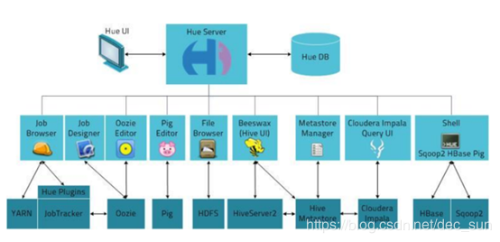

[toc]
# 简介
使用浏览器进行查询，浏览和展示数据。

下载地址：http://gethue.com/category/release/
文档地址：http://archive.cloudera.com/cdh5/cdh/5/hue-3.7.0-cdh5.3.6/manual.html#_install_hue



# 配置
1. 预安装软件

```
yum install ant asciidoc cyrus-sasl-devel cyrus-sasl-gssapi gcc gcc-c++ krb5-devel libtidy libxml2-devel libxslt-devel make mysql mysql-devel openldap-devel python-devel sqlite-devel openssl-devel gmp-devel libffi-devel –y
```

2. 解压 Hue
3. 编译：make apps
4. 配置

```
# webserver

#安全相关
secret_key=jFE93j;2[290-eiw.KEiwN2s3['d;/.q[eIW^y#e=+Iei*@Mn<qW5o
http_host=localhost
time_zone=Asia/Shanghai
```

5. 添加用户： adduser hue
6. 修改 hue 包下文件的权限 `chown -R hue.hue /usr/share/hue`
7. 启动：`build/env/bin/supervisor`


## 与 HDFS 集成
1. hdfs-site.xml
```
#  hdfs-site.xml，允许web交互

<property>
      <name>dfs.webhdfs.enabled</name>
      <value>true</value>
</property>
```

2. core-site.xml， 允许 hue 中的用户和组作为代理

```
# core-site.xml

<property>
      <name>hadoop.proxyuser.hue.hosts</name>
      <value>*</value>
</property>
<property>
      <name>hadoop.proxyuser.hue.groups</name>
      <value>*</value>
</property>
```

3. hue.ini

```
# hue.ini

fs_defaultfs=hdfs://localhost:8020
webhdfs_url=http://localhost:50070/webhdfs/v1
hadoop_conf_dir=/opt/cdh/hadoop-2.5.0-cdh5.3.6/etc/Hadoop
```

4. 重启 hue 与 hdfs

## 与 Yarn 集成
1. hue.ini

```
# hue.ini

resourcemanager_host=localhost
resourcemanager_port=8032
submit_to=True
resourcemanager_api_url=http:// localhost:8088
proxy_api_url=http://localhost:8088
history_server_api_url=http://localhost:19888
```

# 与 HIVE 集成
1. 配置 hiveserver2，通过 hiveserver2 与 hive 相关联。修改 hive-site.xml

```
# hive-site.xml

<property>
      <name>hive.server2.thrift.port</name>
      <value>10000</value>
</property>
<property>
      <name>hive.server2. thrift.bind.host </name>
      <value>localhost</value>
</property>
```

2. 启动 hiveserver2：`Bin/hiveserver2`
3. 配置远程 metastore，因为元数据存储再 mysql 中，若 mysql 在本地环境，下面的配置可以省略。

```
# hive-site.xml

<property>
      <name>hive.metastore.uris</name>
      <value>thrift://localhost:9083</value>
</property>
```

4. 启动：`bin/hive --service metastore`
5. hue.ini

```
# hue.ini

hive_server_host= localhost
hive_server_port=10000
hive_conf_dir= /opt/cdh/hive-0.13.1-cdh5.3.6 /conf
```

## 与RDBMS集成
1. 配置SQLite

```
nice_name=SQLite
name=/opt/cdh/hue-3.7.0-cdh5.3.6/desktop/desktop.db
engine=sqlite
```

2. 配置Mysql

```
nice_name= "My SQL DB"
host= localhost
port=3306
user=root
```