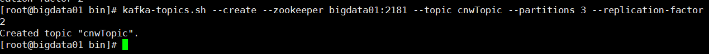

[TOC]

# Kafka 简介

Apache Kafka 是一个发布/订阅消息系统。kafka官方定位是：一个分布式流处理系统。

Kafka 分布式流处理平台，包括 Kafka Core、Kafka connect、Kafka REST Proxy、KafKa Stream  四大模块，提供了 Producer API、Consumer API、Stream API、Connector API。

Kafka 中的数据具有持久化、有序存储、且可以重复读取等特点。此外，数据分布存储在系统中，可以提供数据可靠性和系统的扩展性。


# 消息队列的重要作用

主要基于：解耦，异步，削峰。

- [ ] 解耦

A 系统向 BCD 三个系统发送数据，如果加入 E 系统或者 C 系统不需要数据，如果 A 系统与其他系统严重耦合，那么会导致 A 系统无法针对性对系统进行发送消息。因此可以使用一个消息中间件，A 系统先将消息发送到消息中间件，其他系统需要消息，可以到消息中间件中去进行消息。这样 A 系统与其他消费系统进行了解耦。A 系统仅需考虑向消息中间件发送消息。而其他消费系统仅需消费消息中间件的消息。


- [ ] 异步

在采用消息中间件后，A 系统仅需将消息发送到消息中间件。这样 在 A 系统上花费的时间，仅仅是从 A 系统发送消息到消息中间件的时间，这样大大降低了 A 系统的压力。如果不采用消息中间件，则 A 系统就需要等待其他系统完成消费后才结束，这样对 A 系统的压力很大，且相对更耗时。


- [ ] 削峰

如果 A 系统在高峰期的请求数过多，可能导致 A 系统崩溃，可以在 A 系统之前增加一个消息中间件，这样用户的请求写到消息中间件，然后 A 系统仅需要从消息中间件拉取压力之下的请求数逐渐进行操作，直至完成消息中间件中的请求。大进小出，保证 A 系统不至于崩溃。


# 消息队列的缺点

	1. 系统可用性降低
	2. 系统复杂性增加
	3. 数据一致性


# Kafka集群架构


Broker：kafka 节点，须由 Kafka 进行调控。
Producer：生产者，用于生成消息。
Consumer：消费者，用于获取消费消息。


## Kafka 相关术语

 - Broker：一台 Kafka 服务器就是一个 Broker。一个集群由多个 Broker 组成，一个 Broker 可以容纳一个或多个 topic。
 - Topic：一类消息。例如 page View 日志、click 日志等都可以以 Topic 的形式存在。可以将其理解为一个队列。
 - Producer：消息生产者，向 Broker 推送消息的客户端。
 - Consumer：消息消费者，向 Broker 拉取消息的客户端。
 - Consumer Group (CG)：这是 Kafka 用来是实现一个 Topic 消息的广播（发送给所有 Consumers）和单播（发送给任意一个 Consumer）的手段。一个 Topic 可以有多个 CG。Topic 会将消息发送到所有 CG ，但是每个 CG 中只有一个 Consumer 可以单独地消费一个消息队列（partition），而不能在一个 CG 中有一个以上的 Consumer 消息相同的消息队列。
 - Partition：为了实现扩展性，一个非常大的 Topic 可以分布到多个 Broker 上，一个 Topic 可以分成多个 Partition，每个 Partition 都是一个有序的队列。Partition 中的每条消息都会被分配一个有序的ID(offset)。 Kafka 可以保证一个 Partition 能有序的将消息发送给一个 Consumer，不能保证一个 Topic（多个 Partition 组成）的顺序。
 - Offset：每个 Partition 都由一系列有序的、不可变的消息组成，这些消息被连续的追加到 Partition 中。Partition 中的每个消息都由一个连续的序列号叫做 Offset，是 Partition 用于标识消息。


## Message 和 Batch

Kafka 中的数据单位是 **message**。对比数据库而言，可以将消息看做是数据库中的记录。对Kafka 而言，一个消息就是一个字节数组，字节数组中的数据没有特定的格式或者意义。消息有一个可选的元数据信息 -- 为 Key。Key 也是一个字节数组，与消息一样，没有特别的含义。Key 用于将消息写入特定的 Partition。当需要将数据推送到特定的 Partition 时就需要用到 Key。最简单的方式是生成键的 Hash 值，然后基于 Hash 值和 Partition 总数取模，以取模的结果来为该消息选择对应的 Partition。保证具有相同 Key 的消息可以写入到相同的 Partition 。

为了提高效率，消息以批量 (Batch) 的形式写入 Broker。批量（Batch）消息是指消息的集合，这些消息会发送到同一个 Topic 的 Partition。如果每次发送一条消息而消费一条，将导致过多的网络开销。因此需要将消息收集到一个批次后然后发送这个批次（batch）消息再被消费，可以减少网络开销。所以延迟和吐吞量的关系是：**批次数据越大，延迟越高，批次可以进行压缩，以更高效的速度传输**。


## Schema

消息对 Kafka 来说只是字节数组，但是在传输消息时，建议给消息增加额外的结构，便于消费端理解。这个结构就是消息的 Schema。可以根据业务场景来选择合适的 Schema，如 JSON、XML。但是 json、xml 格式的 Schema 缺乏强类型处理和 Schema 版本间的兼容。在许多 Kafka 开发中倾向于使用 Apache Avro ---- 一 个序列化框架，最初开发的目的就是为了 Hadoop。Avro 提供了一个压缩的序列化格式。消息模式和消息负载分离，Schema 变化时，不需要修改已有代码。其强大的数据类型和模式演化，向后和向前兼容。

在 Kafka 中，一致的数据格式是非常重要的。这样可以实现读写消息的解耦。如果没有实现解耦，订阅消息的客户端必须经常更新，以兼容处理新旧消息的数据格式。


## Topic 和 Partition

Kafka 中的消息分类存储在各自的 Topic 中，Topic 包含一系列的 Partition。一个 Partition 是一个 Log 日志，消息只能以追加（append）方式写入到 Log 中，以从头到尾的顺序进行顺序读取。需要注意的是：一个 Topic 包括多个 Partition，能保证在一个 Partition 的消息的时间顺序，但是不能保证整个 Topic 的消息的时间顺序。


如上图，展示了一个 Topic，其拥有三个 Partition，新写入的消息在每个 Partition 的结尾（end）处追加。Partition 为 Kafka 提供了冗余和伸缩性。每个 Partition 可以位于不同的 Broker 节点（server节点）上。也就是说：一个 Topic 可以在多台服务器上水平扩展，以此来提供超过单节点服务器的性能服务。


## Producer 和 Consumer

Kafka 客户端就是使用 Kafka 集群的用户程序，其有两种基本类型的客户端：Producer 生产者和Consumer 消费者。还有高级客户端 API --- Kafka Connect API 用于数据集成和 Kafka Stream API 用于流处理。高级客户端 API 使用 Producer 和 Consumer 作为构建块，在其之上提供更高级的功能。

Producer 创建新消息。在其它消息系统中，Producer 也被称为 Publisher 或者 Writer。一般情况下，一个消息会被生产到一个特定的 Topic 上。默认情况下，Producer 不关心消息发送到哪个 Partition 上，Producer 会使消息在所有 Partition 中均匀分布（负载均衡，保证 Partition 上的消息均匀分布）。在某些情况下，Producer 可以通过 key 的情况将消息发送到特定的 Partition 上（可以使用 Key 或自定义Partitioner 来生成 Key 的 hash 值，从而将消息映射到一个指定的 Partition 上）。

Consumer 读取消息。在其它消息系统中可能被称为 Subscriber 或 Reader。Consumer 可以订阅一个或多个 Topic 中的消息，以消息产生的顺序来读取（从 begin 读取到 end ）。Consumer 通过消息的 Offset 来跟踪消费的消息。Offset 是另一个元数据消息，是一个持续增加的整数值（类似于一个消息队列中的地址），Kafka 将消息添加到 Topic 中时，会为消息添加 Offset 元数据信息。通过存储每个 Partition 中最后消费的消息的 Offset 到 Zookeeper 或者 Kafka 中，Consumer可以通过 Offset 来停止消费消息或者重新消费消息。

(注：由于 Zookeeper 并不适合大批量的频繁写入操作，新版 Kafka 已推荐将 consumer 的位移信息保存在 Kafka 内部的 topic 中，即 __consumer_offsets topic，并且默认提供了kafka_consumer_groups.sh 脚本供用户查看 consumer 信息。)

Consumer 一般不是单独存在的。一般是由一个或多个 Consumer 组成的 Consumer Group(CG) 的。CG 用来消费一个 Topic 消息。CG 可以保证一个 Partition 只会被 CG 中的一个 Consumer 来消费。


如上图所示，CG 拥有是三个 Consumer，来消费一个 Topic 中的消息。其中 Consumer0 和 Consumer2 分别各自消费一个 Partition，Consumer1 消费剩余的两个 Partition。Consumer 与 Partition 之间的映射关系叫做 Partition 的 Ownership。

Tips： 一个 Consumer group 内的 Consumer 消费 topic 中的 partition 是互斥的。一个 partition 只能保证 Consumer group 内的一个 consumer 来消费。


## Broker 和 Cluster

一个 Kafka Server 叫做一个 Broker。Broker 接收 Producer 发送的消息，为消息设置 Offset，并将消息存储在磁盘上。Broker 同时为 Consumer 服务，响应 Consumer 读取 Partition 中消息的请求，并将写入磁盘的消息返回给 Consumer。根据特定硬件和其性能特点。单个 Broker 可以轻松处理数千个分区和每秒数百万条消息。

Kafka Broker 被设计成 Cluster 的组成部分。一个 Cluster 的 Brokers 中的某个 Broker 将成为集群的 Controller （从活动状态的集群成员中自动选举）。Controller 负责执行管理造作，包括为 Broker 分配 Partition、监控 Broker 是否可用。一个 Partition 属于一个 Broker，该 Broker 是这个 Partition 的 Leader。一个 Partition 可以存在于多个 Brokers 上（partition 的副本）。


副本的设计，可以实现 Partition 中 Message 的冗余，如果一个 Broker 不可用，另一个 Broker 可以接管 Leader 角色，成为新的 Leader。

注意：所有 Consumer 和 Producer 在这个 Partition 上的操作，都必须连接在 Leader 上。

Apache Kafka 的一个关键特性是 retention（消息保留时间，Topic 消息的持久时间与用户设置 retention 有关）。即消息在一段时间内的持久存储。Kafka Broker 为 Topic 配置了一个默认的保留设置：要么保留一段时间（如：7天），或直到 Topic 中的消息达到一定的大小（如：1G）。**一旦达到其中某一个设置（时间或大小）上限**，消息过期并被删除，因此保留配置是任何时候可用的最小数据量。

可以为不同的 Topic 设置不同的保留值。例如，用户跟踪 Topic 中的消息可能会保留几天，而应用程序 Topic 中的度量消息可能只保留几个小时。Topic 还可以配置为日志压缩，这就意味着 Kafka 将只保留使用特定键生成的最后一条消息。这对于只对最后一次更新感兴趣的应用非常有用。--- retention.ms


# Kafka 基本操作

 1.  启动 Kafka 集群，前提需启动 Zookeeper。
```xml
bin/kafka-server-start.sh  config/server.properties
```

 2. 创建 Topic 并制定 Partition 数量和副本数量，zookeeper 的默认端口号为 `2181`
```xml
kafka-topics.sh --create --zookeeper bigdata01:2181 --topic cnwTopic --partitions 3 --replication-factor 2
```


可以看到这里提示已经成功创建一个 topic。 

 3. 查看 cnwTopic 的状态，这是通过查询 zookeeper 上的元数据

```xml
kafka-topics.sh --describe --zookeeper bigdata.001.com:2181 --topic cnwTopic
```


注意观察，这里有三个 partition。每个 partition 的 leader 在不同的 Broker 上。同时能看到每个 Partition 都会在其它两个 Broker 有副本。

 4. 启动消息生产者，kafka Broker 的默认端口号是 `9092`，可以通过 server.properties 进行修改。
```xml
kafka-console-producer.sh --topic cnwTopic --broker-list bigdata.001.com:9092[,bigdata.002.com:9092,bigdata.003.com:9092]
```


 5. 启动消息消费者，可以看到当 Producer 发送消息时，Consumer 可以接收到那个消息。

```
kafka-console-consumer.sh --bootstrap-server bigdata01:9092 --topic cnwTopic [--from-beginning]
```


## 其它命令

1. 帮助命令
```xml
kafka-topics.sh --help
```

2. 查看 Zookeeper 上的元数据信息
```xml
kafka-topics.sh --list --zookeeper bigdata01:2181
```

3. 删除 Topic
```xml
kafka-topics.sh --delete --topic cnwTopic --zookeeper bigdata01:2181
```


# Kafka 开发之 Producer 实践

无论将 Kafka 作为消息队列，亦或是消息总线，或是一个数据存储平台，都需要通过生产者 Producer 向 Kafka 写入数据，通过消费者 Consumer 读取 Kafka 的数据。


## Producer 生产者

有很多场景需要将消息写入 Kafka：记录用户动作、用于审计或分析；存储日志消息；与其他应用程序异步通信；在写入数据库之前缓冲信息等等。

不同的场景意味着不同的需求：每条消息是否很重要？可以接受消息的丢失？可以接受偶尔收到重复的消息？对消息时延和吐吞量有严格的要求?

不同的场景会有不同的需求，因而会影响 Producer API 的使用方式以及配置方式。虽然 Producer API 非常简单，但是在发送消息时，其底层发生了很多事情。


如上图展示了发送消息到 Kafka 的主要步骤。

1. 从上图中，从创建一个 ProducerRecord 开始，ProducerRecord 包含消息要发送到【哪个 Topic 和消息】的内容，也可以声明一个 Key 和 Partition。一旦将 ProducerRecord 发送，Producer 要做的就是序列化 Key 和 Value 对象为二进制数组，这样才可以通过网络发送。
2. 接着，数据发送到一个 Partitioner，此时如果在 ProducerRecord 中声明了一个 Partitioner 分区，Partitioner 仅仅将我们自定义的 Partition 返回；如果没有声明 Partition，Partitioner 将会选择一个 Partition。<font color=red>如果没有设置 key，那么就进行随机选择 Partition 分】；如果设置了 key，那么就根据 Key 来选择 Partition 分区</font>。一旦选择了 Partition 分区，Producer 就知道这个消息要发送到哪个 Topic 和哪个 Partition 分区了。
3. 接着，Producer 将这个消息加入到一个消息批次（batch）中 ，这个消息批次（batch）会发送到<font color=red>相同的 Topic 和 Partition</font>。此时会开辟一个独立的线程来负责发送者批消息到合适的 kafka Broker。
4. 当 Broker 收到消息，会收到一个响应信息。如果这个消息成功写入 Kafka，Broker 会响应一个RecordMetadata 对象（包括 topic、partition、以及消息在 partition 中的 offset）。如果 Broker 没有将消息写入 Kafka，将会响应一个错误。当 Producer 收到这个错误，可以尝试多次重新发送消息，直到放弃。


## 创建 KafkaProducer 对象

发送消息到 Kafka，首先需要创建 KafkaProducer 对象。KafkaProducer 对象有三个必备的属性：

 - bootstrap.servers --- Kafka Brokers 的 host:port 列表。此列表中不要求包含集群中的所有 Brokers，Producer 会根据连接上的 Broker 查询到其他 Broker。但是列表一般至少需要两个 Broker，因为一个 Broker 连接失败，还可以连接另外一个 Broker。
 - key.serializer --- 类的完整名称，此类用于序列化发送消息的 key。Kafka Broker 期望的消息是二进制数组。Producer 接口使用了参数化类型来定义 key.serializer，以发送任何 Java 对象。这就意味着，Producer 必须知道如何将这些 Java 对象转换为二进制数组 byte arrays。key.serializery 应该设置为一个类，这个类实现了 org.apache.kafka.common.serialization.Serializer 接口，Producer 使用这个类可以将 key 对象序列化为 byte array。Kafka 客户端中包括有 ByteArraySerializer，StringSerializer 和 IntegerSerializer 三种类型的序列化器，如果发送常用类型的消息，不需要自定义序列化器。

 注意：即使发送的消息只包含 value 的消息，也需要设置 key.serializer。

 - value.serializer --- 类的完整名称，此类用户序列化发送的消息的 value。与 key.serializer 含义相同，其值可以与 key.serializer 相同，也可以不同。

创建一个 KafkaProducer 对象。

```java
// 创建一个properties对象，用来封装 Producer 的属性。
private Properties kafkaProps = new Properties();

// 将Kafka Broker的 [host:name]进行封装。
kafkaProps.put("bootstrap.servers", "bigdata01:9092,bigdata02:9092");

//因为要发送字符串类型的消息，所以设置字符串类型的消息key和value序列化器
kafkaProps.put("key.serializer", "org.apache.kafka.common.serialization.StringSerializer"); 
kafkaProps.put("value.serializer", "org.apache.kafka.common.serialization.StringSerializer");

//创建KafkaProducer对象，设置String泛型，传入properties对象
producer = new KafkaProducer<String, String>(kafkaProps); 
```

可以看出，通过设置 Properties 对象对参数进行封装，可以完成对 Producer 对象的控制。
[ Kafka 官网文档](http://kafka.apache.org/11/documentation.html#producerapi)  -->   3.3 Producer Configs


Producer 发送消息主要有三种方法，这里直接使用 Kafka 官网提供的案例代码：

 - [ ] Fire and Fogret  -- 发送即忘，无需考虑可能的失败情况
此方法用来发送消息到 Broker，不关心消息是否成功到达。即抱有一种无所谓的心态。
http://kafka.apache.org/090/javadoc/

```java
 Properties props = new Properties();
 props.put("bootstrap.servers", "localhost:9092");
 props.put("acks", "all");
 props.put("retries", 0);
 props.put("batch.size", 16384);
 props.put("linger.ms", 1);
 props.put("buffer.memory", 33554432);
 props.put("key.serializer", "org.apache.kafka.common.serialization.StringSerializer");
 props.put("value.serializer", "org.apache.kafka.common.serialization.StringSerializer");

 Producer<String, String> producer = new KafkaProducer<>(props);
 for (int i = 0; i < 100; i++)
    // Kafka的Fire and forget。
     producer.send(new ProducerRecord<String, String>("my-topic", Integer.toString(i), Integer.toString(i)));

 producer.close();
```
1. Producer 对象的 send 方法接收一个 ProducerRecord 对象，所以先创建一个 ProducerRecord 对象。ProducerRecord 有多个构造方法。这里使用了两个参数的构造函数：String 类型的 Topic 和String 类型的 Value，其中 value 的类型必须与 value.serializers 一致。当然还有三个参数的构造函数：new ProducerRecord("Topic","key","value")。
2. 使用 Producer 的 send 方法发送 ProducerRecord 对象，在前面的 Producer 架构图中显示，消息会先放到缓冲区，然后启动一个独立线程发送到 Broker。send 方法返回一个包含 RecordMetadata  的 Future 对象，这里忽略返回值，不关注消息发送是否成功。这类发送消息的方法一般是在允许消息丢失的场景下使用。
3. 虽然忽略了消息发送到 Kafka 的异常，但是在消息发送到 Kafka 之前，还有可能发生异常。如序列化消息失败异常 SerializationException，缓冲区用尽异常 BufferExhaustedException（配置了 producer 信息，指定在缓冲区满时，不是阻塞，而是抛出异常的情况）、发送中断异常 InterruptException。


- [ ] 同步发送（Synchronous Send） ---  发送一个消息，send() 方法返回一个 Future 对象。使用此方法是线程安全的，该对象的 get() 会阻塞方法，直到等待结果返回。

```java
 byte[] key = "key".getBytes();
 byte[] value = "value".getBytes();
 ProducerRecord<byte[],byte[]> record = new ProducerRecord<byte[],byte[]>("my-topic", key, value)
 // 同步发送，get()阻塞返回结果
 producer.send(record).get();
```
这里使用 Future.get() 方法来等待消息发送结果，直到收到 Kafka 的响应。当 Broker 返回错误时，Future 对象会抛出异常，所以我们可以在程序中捕获异常。如果没有异常，我们会得到 RecordMetadata 对象，从中可以获取到消息的 offset 等消息

如果在发送数据到 Kafka 之前有任何错误，如果 Kafka Broker 返回一个非重试的异常，或者如果我们耗尽了重试次数，我们将收到一个异常。


**Kafka 有两类错误：**

1. 一类是 Retriable（重试类）错误，这类错误通过再次发送消息可以解决，例如连接错误（重试可能会连接成功）和  “ no-leader “ 错误（新的leader选举成功后成功）。重试次数是可以配置的，只有在重试次数用完后，错误依然存在的情况下，客户端才会收到重试类错误。
2. 另一类错误是非重试类错误，就是说不能通过重试来解决的异常。例如：“message size too large” 错误，此时 KafkaProducer 将不会重试，直接返回异常。


- [ ] 异步发送（Asynchronous Send）--- 以回调函数的形式调用 Send()，当收到 Broker 的响应时，会触发回调函数（Callback() ）执行。

此时，我们可以不用知道什么时候发送消息失败，只需要将抛出的异常或者写入错误日志文件中，已备后续分析。

为了能够异步发送消息，并且能处理错误，这种场景需要为 Producer 添加一个 callback 回调函数。
```java
ProducerRecord<byte[],byte[]> record = new ProducerRecord<byte[],byte[]>("the-topic", key, value);
 producer.send(myRecord,
               new Callback() {
                   public void onCompletion(RecordMetadata metadata, Exception e) {
                       if(e != null)
                           e.printStackTrace();
                       System.out.println("The offset of the record we just sent is: " + metadata.offset());
                   }
               });
```

要是使用回调函数，需要实现一个 org.apache.kafka.clients.producer.Callback 接口。回调接口有一个方法 --- oncompletion().

如果 Kafka 返回一个错误，oncompletion() 将有一个非空异常。


- [ ] 在 0110 版本中，出现了 “[基于原子性与幂等性（ the idempotent producer and the transactional producer）](http://kafka.apache.org/0110/javadoc/org/apache/kafka/clients/producer/KafkaProducer.html)”的发送。

```
Properties props = new Properties();
props.put("bootstrap.servers", "localhost:9092");
props.put("transactional.id", "my-transactional-id");
Producer<String, String> producer = new KafkaProducer<>(props, new StringSerializer(), new StringSerializer());

producer.initTransactions();

 try {
 	 //开启事物
     producer.beginTransaction();
     for (int i = 0; i < 100; i++)
         producer.send(new ProducerRecord<>("my-topic", Integer.toString(i), Integer.toString(i)));
         // 事物提交
         producer.commitTransaction();
 } catch (Exception e) {
    
     producer.close();
 } catch (KafkaException e) {
     // For all other exceptions, just abort the transaction and try again.
     // 事物终止
     producer.abortTransaction();
 }
 
 producer.close();
```


上述案例都是采用单线程来演示的，但是在一个生产者对象 Producer 可以被多个线程用于发送消息。如果需要更好的吞吐量，可以添加更多使用相同的 Producer 线程，也可以向应用程序添加更多的 Producer 来实现更高的吞吐量。


## Producer 相关配置

Producer 有大量的配置参数，都记录在 Apache Kafka 文档中，许多都有合理的默认值，因此没有理由修改每一个参数。

然而，一些参数对内存使用、性能和 Producer 的可靠性有重要的影响。

### acks
**acks 参数控制了必须有多少个 partition 副本接收到消息**，Producer 才认为写入成功。这个参数消息丢失的可能性有重大影响。允许设置的参数值有三个：

 - acks=0：<font color=red>Producer 不会等待 Broker 的回复，Producer 会假定消息已经发送成功，立即返回。</font>
这意味着如果发生了错误，导致 Broker 没有收到发送的消息，Producer 将不知道这个情况，消息会被丢失。但是，由于 Producer 没有等待服务器的任何响应，它可以以网络支持的速度发送消息，因此可以实现非常高的吞吐量。
- acks=1：<font color=red>当 Leader Broker 收到消息时，Producer 将从 Broker 接收到消息成功的响应</font>。如果消息没有写入到 Leader 分区，比如 Leader down 掉了，新的Leader还尚未选举出来，此时 Producer 将收到一个 error 响应，并尝试重发此消息，以避免数据丢失。如果消息写入 Leader 分区，而恰好此时 Leader 突然 down 掉了，消息还未同步到其它 Follower 分区，如果有一个 Follower 分区被选举出来为 Leader（unclean leader election）。那么此时消息将会丢失。acks=1 时的吞吐量取决于消息是同步发送还是异步发送。
- acks=-1 / all：一旦所有处于同步状态的副本都收到消息，Producer 将收到来自于 Broker 的成功的响应。这是最安全的模式，因此这可以确保多个 Broker 接收到了这个消息，并且即使有部分 Broker 崩溃，这个消息也是继续存在。但是这种情况下，消息延时更高，因为这个模式下不止一个 Broker 在接收消息。


| acks=0  | 忽视消息是否发送成功。                           |
| ------- | ------------------------------------------------ |
| acks=1  | Leader 写入接收到消息就返回成功消息响应。        |
| akcs=-1 | 所有 Broker 都写入接收到消息就返回成功消息响应。 |


### 自定义分区器

创建的 ProducerRecord 对象包含一个 topic，key，value。在发送消息时，如果没有设置 key，那么 key=null。在真实项目中，key 的值一般都不会为 null。key 的作用有两个：
1. 可以用于存储消息的额外信息
2. 用来决定消息将被写到 topic 的哪个分区。

**所有具有相同 key 的消息将进入到相同的分区**。这意味着，如果一个 Consumer 进程只读取 topic 中分区的一个子集。那么此 Consumer 进程将读取单个 Key 的所有记录。

创建一个 Key-value 消息的方式：

```java
//为消息设置了 key 值
ProducerRecord<Integer, String> record =new ProducerRecord<>("testTopic", "key", "value"); 

//此时消息的key值为 null
ProducerRecord<Integer, String> record =new ProducerRecord<>("testTopic", "value");
```

**当 key 为 null 时且使用默认分区器时，消息将被发送到 topic 的一个可用分区。这是采用<font color=red>轮询算法</font>来选择分区而平衡分区之间的消息**。**如果消息存在一个 key，并且使用了默认分区器，Kafka 将对 key 求哈希值（也就是说 Kafka 模式使用哈希分区器），并将消息映射到特定的分区**。因为**相同的 key 总是映射到同一个分区**是十分重要的，Kafka 会使用 topic 中的所有分区来计算映射 --- 而不仅仅是可用的分区。

```java
-- org.apache.kafka.clients.producer.internals.DefaultPartitioner
    
public int partition(String topic, Object key, byte[] keyBytes, Object value, byte[] valueBytes, Cluster cluster) {
    List<PartitionInfo> partitions = cluster.partitionsForTopic(topic);
    int numPartitions = partitions.size();
    if (keyBytes == null) {
        // 如果 key 为空，就对 topic 进行相关处理。都是采用的是 hash 取余
        int nextValue = nextValue(topic);
        List<PartitionInfo> availablePartitions = cluster.availablePartitionsForTopic(topic);
        if (availablePartitions.size() > 0) {
            int part = Utils.toPositive(nextValue) % availablePartitions.size();
            return availablePartitions.get(part).partition();
        } else {
            // no partitions are available, give a non-available partition
            return Utils.toPositive(nextValue) % numPartitions;
        }
    } else {
        // hash the keyBytes to choose a partition
        return Utils.toPositive(Utils.murmur2(keyBytes)) % numPartitions;
    }
}
```

key 到分区的映射是一致的，只要 topic 中 partition 分区数量不变。因此只要分区的数量是常量，就可以被确定。但是，在向 topic 添加新分区时，就不再保证**相同 key 值发送到相同的 Partition 分区**--- 旧记录将保留在分区中，而新纪录被写入到另外的其它分区（这是由于前后的分区数量发生变化，相应同一个 key 的 hash 值也发生了变化）。如果 key 相当重要，那么就需要在创建足够分区的 topic，放置在后期再更改分区数量。


当然 Kafka 除了拥有 Hash 分区器，还可以自定义分区器。


**自定义分区器步骤：**

1. 继承 Partitioner 接口；
2. 实现 partition() 方法；
3. 使用  props.put("partitioner.class", "com.XXX.XXXPartitione"); // 包名

```
public class BananaPartitioner implements Partitioner{
   
    @Override
    public void configure(Map<String, ?> configs) {
        // TODO nothing
    }

    @Override
    public int partition(String topic, Object key, byte[] keyBytes, Object value, byte[] valueBytes, Cluster cluster) {
        // 得到 topic 的 partitions 信息
        List<PartitionInfo> partitions = cluster.partitionsForTopic(topic);
        int numPartitions = partitions.size();
        
        // 指定key=5时，partition为1。
        if(key.toString(),equal("5")){
              return 1;
        }
    
        String num = key.toString();
        return num.substring(0, 5).hashCode() % (num - 1);
    }

    @Override
    public void close() {
        // TODO nothing
    }
}
```
使用：

```
props.put("partitioner.class", "包名.BananaPartitioner ");
```


# Consumer 实践
开发 Consumer 程序与 Producer 程序不同，Consumer 程序涉及到另外一些重要的概念，理解这些概念是开发稳定的 Consumer 程序的前提。


## ConsumerGroup（消费组）

在 Producer 发送消息的频率不大的情况下，Consumer 可以及时读取 Broker 消息，并处理消息。但是如果 Producer 发送消息的频率很快，Consumer 无法及时处理，此时就会造成消息积压，进而产生了时延。随着时间的推移，积压的消息越来越多。此时，就需要扩大消费者的规模。就像多个Producer 可以向同一个 Topic 写入消息一样，多个 Consumer 也可以读取同一个 Topic 消息。每个 Consumer 只可以读取一部分消息，而不能重复读取其他 Consumer 已读取的消息。

在 Kafka 中，一个 Consumer 属于一个消费者组（Consumer Group，CG）。当多个 Consumer 属于同一消费者组，此时读取一个 Topic 中的消息，消费者组中的消费者可以读取某一个（或多个） Partition 中的消息。

**消费者组中的消费者可以读取 Topic 中的一个或多个 partition 消息，但是一个消费者组中的消费者不可以处理其它消费者已经处理过的消息**。

所以：如果一个 Topic 接收到的消息量很大，那么最好多创建几个 partition，以提高消息的吞吐量。


## Consumer 开发步骤

### 创建 KafkaConsumer 对象

类似于创建 KafkaProducer 对象。KafkaConsumer 的创建也需要：

1. 创建一个 Properties 对象，，用于设置需要传入的 KafkaConsumer 对象的配置参数（配置参数有是四个是必须存在的：bootstrap.servers、key.deserializer、value.deserializer 和一个重要参数  group.id）。

2. 传入参数，创建 KafkaConsumer

3. 订阅 Topic，并 poll。

  

  http://kafka.apache.org/090/javadoc/org/apache/kafka/clients/consumer/KafkaConsumer.html
```java
Properties props = new Properties();
props.put("bootstrap.servers", "localhost:9092");
// ConsumerGroup，当前Consumer属于哪个ConsumerGroup。
props.put("group.id", "test");
// 是否自动提交offset，默认为true。
props.put("enable.auto.commit", "true");
// 自动提交offset的事件间隔。
props.put("auto.commit.interval.ms", "1000");
// zk 会话超时。
props.put("session.timeout.ms", "30000");

props.put("key.deserializer", "org.apache.kafka.common.serialization.StringDeserializer");
props.put("value.deserializer", "org.apache.kafka.common.serialization.StringDeserializer");

KafkaConsumer<String, String> consumer = new KafkaConsumer<>(props);
// 订阅 Topic
consumer.subscribe(Arrays.asList("foo", "bar")); 

while (true) {
    // 获取消息，其使用ConsumerRecord来封装的。
    ConsumerRecords<String, String> records = consumer.poll(100);
    for (ConsumerRecord<String, String> record : records)
        System.out.printf("offset = %d, key = %s, value = %s", record.offset(), record.key(), record.value());
}
```


### Consumer 消费消息的三种语义

当一个 Consumer Group 首次创建时（即 Consumer 首次消费消息） ，消费消息的位置 offset 的初始值由 auto.offset.reset 参数设置。一旦消费者开始读取消息，其会根据应用程序业务逻辑的需求，定期提交offset（enable.auto.commit，auto.commit.interval.ms）。一个消费者组中的消费者消费一个 partition 中的消息，消费到哪个 offset 了，都会根据最后一次提交的 offset 确定。

如果一个 ConsumerA 在消费消息后，在提交 offset 之前 down 掉了，此时另一个 consumerB 在接替 ConsumerA 的工作时，就会重复消费部分 ConsumerA 已经消费过的消息，因为 ConsumerA 最后消费的消息的 offset 没有提交到 Broker。所以提交 offset 的操作越频繁，重复消费消息的可能性越小。

如果要 KafkaConsumer 手动提交 offset，那么首先禁用自动提交：props.put("enable.auto.commit", "false");

根据提交 offset 的时间不同，产生了三种消费语义：

 - 至少一个（at-least-once）：先消费，再提交。
 - 至多一个（at-most-once）：先提交，再消费。
 - 有且仅有一次（Exactly-once）：边消费边 offset 持久化，当 Consumer down掉了，Broker 可以读取持久化的 offset 信息来确定 offset。


#### 至少一次 （at-least-once）
至少一次： 是先消费，后提交 offset。因此，消息会存在重复消费的情况。如 ConsumerA 在消费一个 Topic 中的 partition 消息时，在处理完消息时，恰好 down 掉了，此时 offset 还未被提交，那么ConsumerB 在接替 ConsumerA 消费时，只能重复消费部分消息（前一次已经提交了 offset 开始到这次还未提交 offset 的消息）。所以出现了至少一次的消费消息的情况。

实现过程：
1. 设置 enable.auto.commit 为 false；
2. 消息处理（process()）完之后调用 consumer.commitSync()；

```java
Properties props = new Properties();
props.put("bootstrap.servers", "localhost:9092");
props.put("group.id", "test");
props.put("enable.auto.commit", "false");

props.put("key.deserializer", "org.apache.kafka.common.serialization.StringDeserializer");
props.put("value.deserializer", "org.apache.kafka.common.serialization.StringDeserializer");

KafkaConsumer<String, String> consumer = new KafkaConsumer<>(props);
consumer.subscribe(Arrays.asList("foo", "bar")); 
while (true) {}
	ConsumerRecords<String, String> records = consumer.poll(100);
	for (ConsumerRecord<String, String> record : records){
    	System.out.printf("offset = %d, key = %s, value = %s", record.offset(), record.key(), record.value());
	}
	process();    //先消费消息
	consumer.commitSync();  // 再提交offset
}
```
当然至少一次的实现方式不仅仅只有一种，可以看：
[一文精通 kafka 消费者的三种语义](https://blog.csdn.net/rlnLo2pNEfx9c/article/details/83629348) 
[Kafka client 消息接收的三种模式](https://blog.csdn.net/laojiaqi/article/details/79034798)


#### 至多一次（at-most-once）

最多一次：是在获取数据后，先提交 offset，然后再消费处理数据。因此消息可能存在丢失。例如：当 ConsumerA 在消费消息时，如果提交了 offset，恰好 ConsumerA down 掉了，此消息未被消费。但是先 ConsumerB 只能从当前的 offset 消费消息。因此就存在一部分消息的丢失。也就出现了消息可能只消费一次，或者一次都不会被消费的情况。

实现过程：
1. 设置 enable.auto.commit 为 false；
2. 消息处理（process()）完之前调用 consumer.commitSync()；

```
     Properties props = new Properties();
     props.put("bootstrap.servers", "localhost:9092");
     props.put("group.id", "test");
     props.put("enable.auto.commit", "false");
     props.put("key.deserializer", "org.apache.kafka.common.serialization.StringDeserializer");
     props.put("value.deserializer", "org.apache.kafka.common.serialization.StringDeserializer");
     KafkaConsumer<String, String> consumer = new KafkaConsumer<>(props);
     consumer.subscribe(Arrays.asList("foo", "bar")); 
     while (true) {}
         ConsumerRecords<String, String> records = consumer.poll(100);
         consumer.commitSync(); //先提交offset
         for (ConsumerRecord<String, String> record : records){
             System.out.printf("offset = %d, key = %s, value = %s", record.offset(), record.key(), record.value());
         }
         process();   //再消费消息
     }
```
当然至多一次的实现方式不仅仅只有一种，比如可以通过：
1. 设置 enable.auto.commit 为 true；
2. auto.commit.interval.ms 设置一个较长的时间值。 

具体可以看：
[一文精通 kafka 消费者的三种语义](https://blog.csdn.net/rlnLo2pNEfx9c/article/details/83629348) 
[Kafka client 消息接收的三种模式](https://blog.csdn.net/laojiaqi/article/details/79034798)


#### 有且仅有一次（Exactly-once）

有且仅有一次：说明当前消息仅仅会被消费一次。具体实现可以参看
[一文精通 kafka 消费者的三种语义](https://blog.csdn.net/rlnLo2pNEfx9c/article/details/83629348) 
[Kafka client 消息接收的三种模式](https://blog.csdn.net/laojiaqi/article/details/79034798)


# Kafka之相关参数配置
**replication factor 副本因子**
在 Topic 级别中，可以配置某个 Topic 的副本因子，在 Broker 级别可以配置默认的副本因子，作为自动创建的 Topic 的副本因子。

一般默认使用的 Topic 副本因子是 3，即每个 Partition 被复制成了 3 份，分别位于在 3 个不同的 Broker 上。用户可以更改这个配置，即使在创建 Topic 之后，也可以更改副本因子。

如果副本因子是 N，那么即使 Kafka 损失了 N-1 个副本的情况下，仍然可以保证此 Topic 的可靠读写操作。所以，副本因子值越大，可用性越高，可靠性越高。但是需要的存储空间也越大，因为每一个副本存在于不同的 Broker 上。

**unclean leader election （不洁的leader选举）**
此配置只在集群中的 Broker 级别有效。配置参数名称为 unclean.leader.election.enable ，默认值为 true。该设置允许不同步的副本作为 leader。如果为 false，则不允许不同步的副本作为 leader。因此该选项会导致数据的丢失或数据不一致的风险。

**minimum in-sync replicas 最小同步副本**
该配参数主要保证最少需要多少个同步副本工作。如果同步副本少于设置参数的个数，Producer 将会收到 NotEnoughReplicasException 异常信息。但是 Consumer 读取消息数据不受影响。

上述三个参数配置了 Broker 的可靠性。如果 Producer不可靠，那么系统依然不可靠。


所以对于Producer程序，需要：
1、使用正确的acks配置参数来匹配可靠性需求；
2、在代码或者配置项中正确处理异常。


# 消息的可靠性传输
- [ ] 消费者

  将 **offset 自动提交** 修改成 **offset 手动提交**，保证先消费在提交 offset。
  	

  - [ ] Broker
  
    保证写失败无限重试：retries=MAX
  
    保证副本大于 > 1：replication.factor = min(nums, 2)
    保证同步副本大于 > 1：min.insync.replicas  = min(nums, 2)


 - [ ] 生产者

   保证生产者的每条数据保证同步到 Follower后，才认为写成功：acks = all


# 保证消息的幂等性

幂等性：就是多次计算的结果是一致的。

对于 Kafka 而言，就是需要保证数据仅被消费一次。Kafka 有个 offset 的概念，就是每个消息写进去，都有一个offset，代表他的序号，然后 consumer 消费了数据之后，每隔一段时间，会把自己消费过的消息的 offset 提交一下，代表消息已经被消费了。如果 consumer 处理了消息，但是 offset 没来得及提交，系统挂了重启之后，少数消息会被再次消费一次。


## 保证消息的幂等性方法

- 在生产者发送每条数据时，数据增加唯一的 id，消费者在进行消费时，首先对 id 进行判断（消费者可以采用 Set 保存之前消费的消息的 offset，进行对比判断）。如果没有消费过，就处理；如果消费了就丢弃。

- 基于数据库的唯一键来约束和保证重复数据不会重复被插入，从而保证数据库不会出现脏数据。


# Kafka 如何保证可靠性

可靠性保证的是基础，基于这些基础之上构建我们的应用。比如关系型数据库的可靠性保证是 ACID，也就是原子性（Atomicity）、一致性（Consistency）、隔离性（Isolation）和持久性（Durability）。

Kafka 中的可靠性保证有如下四点：

- 对于一个分区来说，它的消息是有序的。如果一个生产者向一个分区先写入消息 A，然后写入消息 B，那么消费者会先读取消息 A 再读取消息 B。
- 当消息写入所有in-sync状态的副本后，消息才会认为**已提交（committed）**。这里的写入有可能只是写入到文件系统的缓存，不一定刷新到磁盘。生产者可以等待不同时机的确认，比如等待分区主副本写入即返回，后者等待所有in-sync状态副本写入才返回。
- 一旦消息已提交，那么只要有一个副本存活，数据不会丢失。
- 消费者只能读取到已提交的消息。

使用这些基础保证，我们构建一个可靠的系统，这时候需要考虑一个问题：究竟我们的应用需要多大程度的可靠性？可靠性不是无偿的，它与系统可用性、吞吐量、延迟和硬件价格息息相关，得此失彼。因此，我们往往需要做权衡，一味的追求可靠性并不实际。


# Kafka 消息队列高可用

1. Kafka 最基本的架构认识：多个 broker 组成，每个 broker 是一个节点；创建一个 topic，这个 topic 可以划分为多个 partition，每个 partition 可以存在于不同的 broker 上，每个 partition 就放一部分数据。这就是天然的分布式消息队列，就是说一个 topic 的数据，是分散放在多个机器上的，每个机器就放一部分数据。
2. Kafka 0.8 以后，提供了 HA 机制，就是 replica 副本机制。每个 partition 的数据都会同步到其他机器上，形成自己的多个 replica 副本。
3. 所有 replica 会选举一个 leader 出来，那么生产和消费都跟这个 leader 打交道，然后其他 replica 就是 follower。写的时候，leader 会负责把数据同步到所有 follower 上去，读的时候就直接读 leader 上数据即可。
4. 如果这上面没有某个 partition 的 leader，那么此时会重新选举一个新的 leader 出来，大家继续读写那个新的 leader 即可。
5. 写数据的时候，生产者就写 leader，然后 leader 将数据落地写本地磁盘，接着其他 follower 自己主动从 leader 来 pull 数据。一旦所有 follower 同步好数据了，就会发送 ack 给 leader，leader 收到所有 follower 的 ack 之后，就会返回写成功的消息给生产者。
6. 消费的时候，只会从 leader 去读，但是只有一个消息已经被所有 follower 都同步成功返回 ack 的时候，这个消息才会被消费者读到。


# Kafka 优化内存缓冲造成的频繁 GC

Producer 给 Broker 发送消息时，消息会先写入   一个内存缓冲中，然后直到多条消息组成一个 Batch，才会通过一次网络请求将 batch 消息发送到 Broker。


将多条消息组成一个 Batch，一次网络请求就是一个 Batch 或者是多个 Batch。这样每次网络请求都可以发送更多消息数据，避免一条消息一次网络请求。从而提高吞吐量，即单位时间内发送的数据量。


但是如果 Batch 的数据都已经通过网络请求发送到 Broker，Batch 的数据此时可还在 Producer 端的 JVM 的内存中，那么就需要避免任何变量去引用这些 Batch 对应的数据，然后尝试触发 JVM 自动回收掉这些内存垃圾。


JVM 每次进行垃圾回收时，会暂停其他工作线程来运行垃圾回收线程。


无论现存的垃圾回收器如何演进更新，其核心目标之一就是不断地缩减垃圾回收的时间。但是即使如何缩短，依然会对其他工作线程进行暂停。因此就需要避免频繁的 GC。


## 保证不会出现频繁 GC

在 Kafka 客户端内部，有一个非常优秀的机制 --- 缓冲池机制。简单来讲，就是每个 Batch 底层都对应一块内存空间，这个内存空间专门用来存放写入进去的消息。当一个 Batch 发送出去以后，再把内存空间给还回。


一旦使用了这个缓冲池机制以后，就不会涉及到频繁的大量内存的 GC 问题。


这个缓冲池占用了固定的内存大小，然后将这个内存区域划分为 N 个内存块，这样缓冲池里就有很多内存块了。在创建一个新 Batch 时，就从缓冲池取一个内存块，然后将这个 Batch 不断地进行消息的写入，当然由于每个内存块都有大小，所以肯定 Batch 底层的内存块大小也是被限定了。接着在 Batch 被发送到 Broker，此时 Batch 底层的内存块就可以直接还回缓冲池即可。


因此就可以不会涉及到垃圾回收，也就不会有 GC 的问题。正是这个设计思想让Kafka客户端的性能和吞吐量都非常的高。


如果缓冲池的内存资源都被占满了，缓冲池中更没有内存块，那么就阻塞写入操作，不让消息继续写入，直到缓冲池的内存块被释放，然后才能继续写入消息。


# Kafka 总结

| 单机吐吞量                                                   | topic数量对吞吐量的影响                                      | 时效性           | 可用性                                                       | 消息可靠性                              | 功能支持                                                     | 优点                                                         | 缺点                                                         |
| ------------------------------------------------------------ | ------------------------------------------------------------ | ---------------- | ------------------------------------------------------------ | --------------------------------------- | ------------------------------------------------------------ | ------------------------------------------------------------ | ------------------------------------------------------------ |
| 10万级别，这是 kafka 最大的优点，就是吞吐量高。一般配合大数据类的系统来进行实时数据计算、日志采集等场景。 | topic 从几十个到几百个的时候，吞吐量会大幅度下降。所以在同等机器下，kafka 尽量保证 topic 数量不要过多。如果要支撑大规模 topic，需要增加更多的机器资源 | 延迟在 ms 级以内 | 非常高，kafka 是分布式的，一个数据多个副本，少数机器宕机，不会丢失数据，不会导致不可用 | 经过参数优化配置，消息可以做到 0 丢失。 | 功能较为简单，主要支持简单的 MQ 功能，在大数据领域的实时计算以及日志采集被大规模使用，是事实上的标准。 | Kafka 的特点其实很明显，就是仅仅提供较少的核心功能，但是提供超高的吞吐量，ms 级的延迟，极高的可用性以及可靠性，而且分布式可以任意扩展。同时 kafka 最好是支撑较少的 topic 数量即可，保证其超高吞吐量。 | 而且 kafka 唯一的一点劣势是有可能消息重复消费，那么对数据准确性会造成极其轻微的影响，在大数据领域中以及日志采集中，这点轻微影响可以忽略。这个特性天然适合大数据实时计算以及日志收集 。 |


# 部署Kafka

本次安装基于CentOS 6.7
本次安装在VM虚拟机中clone出三台虚拟机进行处理

在安装Kafka之前，需要先[安装Zookeeper](https://blog.csdn.net/dec_sun/article/details/88084112)。

1. http://kafka.apache.org/downloads 下载
2. 将压缩包上传到三个节点的服务器上，并解压。 
3. 修改 config/server.properties

4.需要修改的包括：
	1)	broker.id，在三台节点上分别设置为0,1,2。记住必须保证每个节点上的broker.id唯一。

4. log.dirs，这个设置是存储kafka消息的。

可以将该目录设置在kafka下。

5. 配置Zookeeper的地址。如图，该配置添加了三个zk地址。

6. 修改listeners监听。根据不同的服务节点设置成对应的的IP:port.


7. 启动Zookeeper。
8. 启动Kafka集群

```
三个节点上执行命令：bin/kafka-server-start.sh  config/server.properties
```

