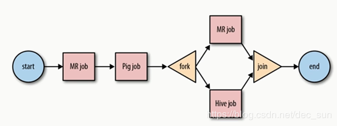

[toc]
# 简介
1)	 Oozie is a workflow scheduler system to manage Apache Hadoop jobs.
2)	 Oozie Workflow jobs are Directed Acyclical Graphs (DAGs) of actions.
3)	 Oozie Coordinator jobs are recurrent Oozie Workflow jobs triggered by time (frequency) and data availability.
4)	 Oozie is integrated with the rest of the Hadoop stack supporting several types  of Hadoop jobs out of the box (such as Java map-reduce, Streaming map-reduce, Pig, Hive, Sqoop and Distcp) as well as system specific jobs (such as Java programs and shell scripts).
5)	 Oozie is a scalable, reliable and extensible system.


同类型还有 azkaban ，zeus ，crontab
1.  Crontab：针对每个用户而言，简单调度，没有展示界面
2.  Azkaban：批量工作流任务调度器，出现了展示界面
3.  Zeus：阿里开源的框架，名字图标来自 dota，增加了任务调度界面，统计页面
4.  Oozie：功能强大，极适合数据仓库类的业务
5.  Cloudera 开发的基于工作流引擎的开源框架，能够对 Hadoop MR 和 Pig jobs 进行任务调度与协调，需要部署到 Java Servlet 容器运行（需要安装 JDK），通过 xml 文件格式来实现流程。Oozie 定义了控制流节点（类似与 Java 中 if 循环语句，包含开始结束，以及流程执行的路径）和动作节点（包含 mr，hdfs，pig，ssh，子流程）。


# 流程图

Oozie 的组件包括：workflow job，coordinate job，bundies job。


# 配置
下载地址：http://www.apache.org/dyn/closer.lua/oozie/
文档地址：http://oozie.apache.org/docs/4.0.0/index.html#Quick_Start

1. 解压
2. 配置 hadoop 的代理，修改 Hadoop 中修改 core-site.xml

```
# core-site.xml

  <property>
    <name>hadoop.proxyuser.[OOZIE_SERVER_USER].hosts</name>
    <value>[OOZIE_SERVER_HOSTNAME]</value>
  </property>
  <property>
    <name>hadoop.proxyuser.[OOZIE_SERVER_USER].groups</name>
    <value>[USER_GROUPS_THAT_ALLOW_IMPERSONATION]</value>
  </property>

[OOZIE_SERVER_USER]是安装使用oozie server的用户
[OOZIE_SERVER_HOSTNAME]是安装oozie server的主机名 （Centos 主机名）
[USER_GROUPS_THAT_ALLOW_IMPERSONATION]是用户的所属组

<!--<property> <!--如下配置-->
      <name>hadoop.proxyuser.root.hosts</name>
      <value>cdh</value>
    </property>
    <property>
           <name>hadoop.proxyuser.root.groups</name>
      <value>*</value>
     </property> -->
```

3. 重启 Hadoop
4. 解压 Hadooplibs，oozie 所需要的 hadoop 的依赖包

```
tar -zxf oozie-hadooplibs-4.0.0-cdh5.3.6.tar.gz -C ./
```

5. Oozie 主目录创建 libext 文件夹，将 Oozie 需要的 Hadoop jar 包拷贝到 libext 目录下

```
cp ozie-4.0.0-cdh5.3.6/hadooplibs/hadooplib-2.5.0-cdh5.3.6.oozie-4.0.0-cdh5.3.6/* libext/
```

6. 修改 oozie-site.xml，配置 share/lib 的访问库的

```
	<property>    
        <name>oozie.service.HadoopAccessorService.hadoop.configurations</name>
        <value>*= /opt/cdh/hadoop-2.5.0-cdh5.3.6/etc/hadoop </value>       
    </property>
```

7. 可选：将 extUS 拷贝到 libext

```
cp /opt/software/ext-2.2.zip libext/
```

8. 创建依赖库，第一次创建 create，其他更新 upgrade

```
例： sharelib create|upgrade -fs fs_default_name [-locallib sharelib]

bin/oozie-setup.sh sharelib create -fs hdfs://localhost:8020 -locallib 	oozie-sharelib-4.0.0-cdh5.3.6-yarn.tar.gz
```

9. 构建 war 包

```
bin/oozie-setup.sh prepare-war
```

10. 初始化 DataBase

```
bin/ooziedb.sh create -sqlfile oozie.sql -run DB Connection
```

11. 启动进程 Bootstrap

```
bin/oozied.sh start

Tips： pid位置，当进程关闭后，PID可能未清除，如果发生需要手动清理
/opt/cdh5/oozie-4.0.0-cdh5.3.6/oozie-server/temp/oozie.pid

外部界面
localhost:11000
```

# 示例
1.	 解压示例包，examples/apps/ 下面存放很多案例

```
tar -zxf oozie-examples.tar.gz -C ./
```
选用map-reduce

2.	编写 job.properties

```
nameNode=hdfs://localhost:8020
# jobTracker 即 Hadoop1 中的 resourcemanager
# yarn 端口号 8032
jobTracker= localhost:8032
queueName=default
examplesRoot=examples
# 这里的路径就是hdfs中的路径
oozie.wf.application.path=${nameNode}/user/${user.name}/${examplesRoot}/apps/map-reduce/workflow.xml
outputDir=map-reduce
```

3.	上传 jar 包至 hdfs，这里上传到当前路径

```
bin/hdfs dfs -put /opt/cdh/oozie-4.0.0-cdh5.3.6/examples
```

4.	运行，这里的 job.properties 使用的是本地的

```
bin/oozie job -oozie http://lee01.cniao5.com:11000/oozie -config examples/apps/map-reduce/job.properties -run
```
5.	Oozie 的管控，会将任务流先封装成 launcher 再执行我们的 action (所以有两个job)。


