[TOC]

# redis 模型
学习链接：
http://redis.cn/
http://redisdoc.com/
http://redisbook.readthedocs.io/en/latest/index.html

Redis 本质上是一个 key-value 类型的内存数据库，数据被加载到内存中进行操作，定期通过异步操作把数据库数据 flush 到硬盘上进行保存，这是一个纯内存的操作。

Redis 支持多种数据结构，并且单个 value 的最大限制为 1G，并可以对 key-value 数据设置 expire 时间。由于是内存型数据库，所以不能对海量数据进行高性能的读写。

Redis 是基于内存的、持久化、日志型数据库。其基于 C 语言进行了编写，因此可以在 linux 中采用 ps -ef |grep redis 来查看进程。

Redis 是单线程，内存型的模型，采用 IO 多路复用机制同时监听多个 socket，根据 socket 上的事件来选择对应的事件处理器来处理事件。

Redis 客户端对服务端的每次调用都经历了 '发送命令，执行命令，返回结果' 三个过程。在执行命令阶段，由于 Redis 是单线程来处理命令的，所有每一条到达服务端的命令不会立刻执行，所有的命令都会进入一个队列中，然后逐个被执行。并且多个客户端发送的命令的执行顺序是不确定的。但是可以确定的是不会有两条命令被同时执行，不会产生并发问题，这就是 Redis 的单线程基本模型。

1. Redis 是客户端是通过 socket 与系统进行通信的，当客户端与系统进行连接，系统将生成一个 AE_READABLE 事件。
2. Redis 的 **io 多路复用程序**会监听 serversocket，并将产生的事件与socket压入到队列中。
3. 而事件分派器从队列中取出事件，并将此事件交由对应的处理器。

	- 如果是客户端要连接 redis，那么会为 socket 关联连接应答处理器
	- 如果是客户端要写数据到 redis，那么会为 socket 关联命令请求处理器
	- 如果是客户端要从 redis 读数据，那么会为 socket 关联命令回复处理器
4. 将 socket 的 AE_READBLE 事件跟命令请求处理器关联；
5. 当客户端发送操作请求时，文件事件分派器会将操作请求分派到命令处理器上。在命令请求处理器中进行处理。并将该操作请求与 AE_WRITABLE 事件同命令回复处理器管理；
6. 当客户端需要读取请求数据时，会在 redis 上产生一个 AE_WRITABLE，然后命令回复处理器发送 ok 结果，并解除关联。

- Redis 单线程模型效率为什么高
1）纯内存操作
2）核心是基于非阻塞的 IO 多路复用机制
3）单线程，反而避免了多线程的频繁上下文切换问题


- [ ] 高性能
  就是把一些复杂操作耗时查出来的结果，如果确定暂时不会修改，并且可能会有很多读请求，那么直接将该结果放到缓存，后续只需要读取缓存结果即可。如果数据库变化了该结果结果，只需要更新缓存数据就可以了。
- [ ] 高并发
  以数据库 + 缓存例，如果高峰期请求数过大，容易导致数据库宕机。如果将很大一部分数据放到缓存，而不放在数据库。这样用户访问系统时，大部分请求就可以走缓存而不是数据库，这样能提高系统的并发量。因为缓存是基于内存的，这样可以支撑高并发。


# 持久化

redis 有两种持久化的方式：


## RDB 方式

在指定的时间间隔内，将内存中的数据集快照写入磁盘。实际的操作过程是 fork 一个子进程，先将数据集写入临时文件，写入成功后替换之前的文件。

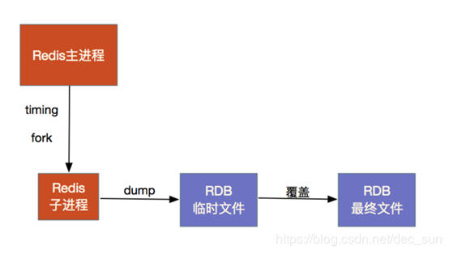

- 优点
1) 备份简单。保存了一定时间内的数据集，非常便于数据备份与容灾恢复；
2) 性能最大化。fork 出子线程来进行持久化工作，可以极大的避免服务进程执行 IO 操作；
3) RDB 的启动效率更高，恢复速度更快。

- 缺点
1) 无法避免数据的丢失。在系统 down 掉时，会出现最后数据丢失的问题；
2) 由于是 fork 子线程来协助数据持久化工作，如果数据较大时，可能导致整个服务器暂时停止服务。

- 配置

```
# 900 秒之内至少1个关键字发生变化，刷新快照到硬盘中.必须满足两者要求才会触发
save 900 1    

# 300 秒之内至少 10 个关键字发生变化，刷新快照到硬盘中.必须满足两者要求才会触发
save 300 10  

# 60 秒之内至少 10000 个关键字发生变化，刷新快照到硬盘中.必须满足两者要求才会触发
save 60 10000  

# 后台存储错误停止写。
stop-writes-on-bgsave-error yes 

# 使用 LZF 压缩 rdb 文件。
rdbcompression yes   

# 存储和加载 rdb 文件时校验。
rdbchecksum yes     

 # 设置 rdb 文件名。
dbfilename dump.rdb

# 设置工作目录，rdb 文件会写入该目录
dir ./                           
```
如果关闭 rdb 功能，需要屏蔽

```
# 900 秒之内至少1个关键字发生变化，刷新快照到硬盘中.必须满足两者要求才会触发
#save 900 1   

# 300 秒之内至少 10 个关键字发生变化，刷新快照到硬盘中.必须满足两者要求才会触发
#save 300 10  

# 60 秒之内至少 10000 个关键字发生变化，刷新快照到硬盘中.必须满足两者要求才会触发
#save 60 10000             
```


## [AOF](https://redisbook.readthedocs.io/en/latest/internal/aof.html)

AOF 持久化会将被执行的写命令写到 AOF 文件的末尾，以此来记录数据发生的变化。这样，我们在恢复数据的时候，只需要从头到尾的执行一下 AOF 文件即可恢复数据。

- 优点
1）AOF可以更好的保护数据不丢失，一般AOF会每隔1秒，通过一个后台线程执行一次fsync操作，最多丢失1秒钟的数据
2）AOF日志文件以 append-only 模式写入，所以没有任何磁盘寻址的开销，写入性能非常高，而且文件不容易破损，即使文件尾部破损，也很容易修复
3）AOF 日志文件即使过大的时候，出现后台重写操作，也不会影响客户端的读写。因为在 rewrite log 的时候，会对其中的内容进行压缩，创建出一份需要恢复数据的最小日志出来。再创建新日志文件的时候，旧日志文件还是照常写入。当新的 merge 后的日志文件 ready 的时候，再交换新老日志文件即可。
4）AOF日志文件的命令通过可读的方式进行记录，这个特性非常适合做灾难性的误删除的紧急恢复。


- 缺点
1）对于同一份数据来说，AOF日志文件通常比RDB数据快照文件更大
2）AOF开启后，支持的写QPS会比RDB支持的写QPS低，因为AOF一般会配置成每秒fsync一次日志文件，当然，每秒一次fsync，性能也还是很高的
3）以前AOF发生过bug，就是通过AOF记录的日志，进行数据恢复的时候，没有恢复一模一样的数据出来。所以说，类似AOF这种较为复杂的基于命令日志/merge/回放的方式，比基于RDB每次持久化一份完整的数据快照文件的方式，更加脆弱一些，容易有bug。不过AOF就是为了避免rewrite过程导致的bug，因此每次rewrite并不是基于旧的指令日志进行merge的，而是基于当时内存中的数据进行指令的重新构建，这样健壮性会好很多。


- 配置

```
# 是否需要日志，表示开启 aof 持久化
appendonly yes   

# 系统缓冲,统一写,速度快 / 系统不缓冲,直接写,慢,丢失数据少 / 折衷,每秒写 1 次
appendfsync no/always/everysec   

# 重写 aof 时是否同步最新数据
no-appendfsync-on-rewrite no/yes   

# 当前 aof 文件是上次重写是大N%时重写
auto-AOF-rewrite-percentage 100 

# aof 重写至少要达到的大小  
auto-AOF-rewrite-min-size 64mb            
```


## 选择

RDB和AOF到底该如何选择
1）不要仅仅使用RDB，因为那样会导致你丢失很多数据
2）也不要仅仅使用AOF，因为那样有两个问题：第一，通过AOF做冷备没有RDB做冷备来的恢复速度更快; 第二，RDB每次简单粗暴生成数据快照，更加健壮，可以避免AOF这种复杂的备份和恢复机制的bug
3）综合使用AOF和RDB两种持久化机制，用AOF来保证数据不丢失，作为数据恢复的第一选择; 用RDB来做不同程度的冷备，在AOF文件都丢失或损坏不可用的时候，还可以使用RDB来进行快速的数据恢复


# 应用场景与方式

1. 主从复制：master - slave 先行或星型连接。master 用于写数据，slave 用于读数据
2. 主从复制 + sentinel： master - slave 线性或星型连接。master 负责写数据，slave 负责读数据。当 master 失去响应后， slave 可以变成 master，负责写操作。


## 主从同步

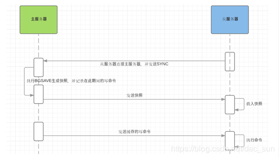

主从同步是 master 写操作的数据，都会异步复制到 slave。这里的同步是数据的同步，而 master - slave 的复制操作是异步的。

- 步骤
1. slave 连接  master，并发送 psync 同步码；
2. master 收到 psync 同步码，执行 bgsave 生成 snapshot（RDB），并在缓存区记录从当前开始执行的所有写命令；
3. master 在 bgsave 完成后，将 snapshot 发送到 slave ，slave 载入 snapshot 快照；
4. slave 载入 snapshot 快照到内存，将自己的数据状态更新至 master 执行 bgsave 命令是的数据状态；
5. master 发送完 snapshot 后， 向 slave 发送缓存区的写命令；
6. slave 执行写命令，将数据状态更新至与 master 当前一致的状态。


- 主从复制的优点
1. 读写分离。不仅可以提高服务器的负载能力，并且可以更具读操作请求的规模自由增加或减少从服务的数量；
2. 数据被赋予多份，即使一台服务器出现问题，也可以使用其它服务器的数据里来快速恢复。 


### 全量复制

slave 在收到数据后，将数据全部加载到内存中。

1）master执行bgsave，在本地生成一份rdb快照文件
2）master node将rdb快照文件发送给salve node，如果rdb复制时间超过60秒（repl-timeout），那么slave node就会认为复制失败，可以适当调节大这个参数
3）对于千兆网卡的机器，一般每秒传输100MB，6G文件，很可能超过60s
4）master node在生成rdb时，会将所有新的写命令缓存在内存中，在salve node保存了rdb之后，再将新的写命令复制给salve node
5）client-output-buffer-limit slave 256MB 64MB 60，如果在复制期间，内存缓冲区持续消耗超过64MB，或者一次性超过256MB，那么停止复制，复制失败
6）slave node接收到rdb之后，清空自己的旧数据，然后重新加载rdb到自己的内存中，同时基于旧的数据版本对外提供服务
7）如果slave node开启了AOF，那么会立即执行BGREWRITEAOF，重写AOF

rdb生成、rdb通过网络拷贝、slave旧数据的清理、slave aof rewrite，很耗费时间。如果复制的数据量在4G~6G之间，那么很可能全量复制时间消耗到1分半到2分钟


### 增量复制

slave 初始化后开始正常工作时，master 发送的写操作同步到 slave 的过程。

（1）如果全量复制过程中，master-slave网络连接断掉，那么salve重新连接master时，会触发增量复制
（2）master直接从自己的backlog中获取部分丢失的数据，发送给slave node，默认backlog就是1MB
（3）msater就是根据slave发送的psync中的offset来从backlog中获取数据的


##  哨兵运维监控

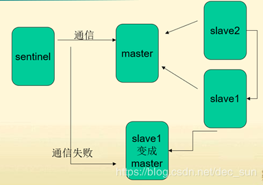

sentinel 哨兵模式用于监控  master 服务器，当 master 服务器失去响应，将 slave 切换为 master 进行服务。

哨兵本身也是分布式的，作为一个哨兵集群去运行，互相协同工作
1）故障转移时，判断一个master node是宕机了，需要大部分的哨兵都同意才行，涉及到了分布式选举的问题
2）即使部分哨兵节点挂掉了，哨兵集群还是能正常工作的，因为如果一个作为高可用机制重要组成部分的故障转移系统本身是单点的，

- sentinel 哨兵的作用
1）集群监控，负责监控 redis master 和 slave 进程是否正常工作
2）消息通知，如果某个 redis 实例有故障，那么哨兵负责发送消息作为报警通知给管理员
3）故障转移，如果 master node 挂掉了，会自动转移到 slave node 上
4）配置中心，如果故障转移发生了，通知 client 客户端新的 master 地址

`sentinel monitor <master-name> <ip> <redis-port> <quorum>` 是 sentinel.conf 中的配置文件。其中  `<quorum>` 确认 master down 的最少的哨兵数量。

`majority`是允许进行容灾转移的 sentinel 的数量，这个数量表示是 sentinel 中的绝大多数。比如：2个哨兵的majority就是2（2的majority=2，3的majority=2，5的majority=3，4的majority=2），2个哨兵都运行着，就可以允许执行故障转移。

例如，在一个仅有两个节点的系统中。如果一个节点挂掉，那么此时 sentinel 只剩下一个了，quorum=1，就可以确定该节点已经 down 掉了。但是两个节点的 majority = 2。但是此时只有一个 sentinel，因此系统就不允许进行故障转移。所以一般来说，哨兵模式至少需要 2个以上的节点，但不包括两个。


# 分布式锁

|                            悲观锁                            |                            乐观锁                            |
| :----------------------------------------------------------: | :----------------------------------------------------------: |
| 悲观锁采用相对保守的策略，在资源争用比较严重的时候比较合适。悲观锁在事务开始之前就去尝试获得写权限，事务结束后释放锁；也就是说对于同一行记录，只有一个写事务可以并行（加锁，只有我能操作） | 乐观锁是在提交事务之前，大家可以各自修改数据，但是在提交事务的时候，如果发现在这个过程中，数据发生了改变，那么直接拒绝此次事务提交。（允许大家都操作，只是在提交事务中检测）乐观锁适合在资源争用不激烈的时候使用。 |
| 当前只能有写权限的用户可以操作, 而其他用户此时被决绝. 如 synchronized (不允许写, 更不会执行) | 当前所有用户都可以操作, 但是在提交时会被拒绝. 如watch - multi - exec (允许写, 但不一定可以执行) |


# 分布式算法

## Hash 算法

根据存储节点, 以 hash 取余来分配每个数据项所属的 node 节点. 

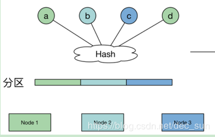

该算法使用节点数取余的方法，强烈依靠节点数目。当 node 节点数发生变化时，数据就需要进行迁移。


## 一致性 hash 算法

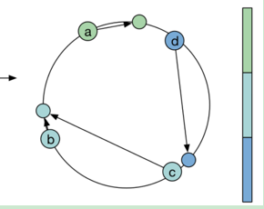

一致性 hash 算法引入了环的概念，即 node 节点与数据集都在一个封闭的圆环上进行分配，数据集总是被分配到 “顺势旋转，离最近 node 节点中”。这样能保证 node 节点数发生变化时，保证了数据的尽量少的迁移。


# Redis 过期策略

- 对 key 设置过期时间
  set key 的时候，都可以给一个 expire time，就是过期时间。我们自己可以指定缓存到期就失效。


- 文件配置

通过在 Redis 安装目录下的 redis.conf 配置文件中添加配置内存大小

```xml
//设置Redis最大占用内存大小为100M
maxmemory 100mb
```


- 动态配置内存大小

```xml
//设置Redis最大占用内存大小为100M
127.0.0.1:6379> config set maxmemory 100mb

//获取设置的Redis能使用的最大内存大小
127.0.0.1:6379> config get maxmemory
```


## 删除策略

定期删除 + 惰性删除

- 定期删除
redis 默认是每隔 100ms 就随机抽取一些设置了过期时间的 key，检查其是否过期，如果过期就删除。


- 惰性删除
在获取某个 key 的时候，redis 会检查一下 ，这个key如果设置了过期时间那么是否过期。如果过期了此时就会删除，不会给你返回任何东西。


- 内存淘汰
redis 的内存占用过多的时候，此时会进行内存淘汰。

|              |                                                              |
| ------------ | ------------------------------------------------------------ |
| 最大缓存     | Redis 允许通过 maxmemory 参数来设置内存最大值。              |
| 主键失效     | 作为一种定期清理无效数据的重要机制，在 Redis 提供的诸多命令中，EXPIRE、EXPIREAT、PEXPIRE、PEXPIREAT 以及 SETEX 和 PSETEX 均可以用来设置一条键值对的失效时间。而一条键值对一旦被关联了失效时间就会在到期后自动删除（或者说变得无法访问更为准确） |
| 淘汰策略     | 随着不断的向 redis 中保存数据，当内存剩余空间无法满足添加的数据时，redis 内就会施行数据淘汰策略，清除一部分内容然后保证新的数据可以保存到内存中。内存淘汰机制是为了更好的使用内存，用一定得 miss 来换取内存的利用率，保证 redis 缓存中保存的都是热点数据 |
| 非精准的 LRU | 实际上 Redis 实现的 LRU 并不是可靠的 LRU，也就是名义上我们使用 LRU 算法淘汰键，但是实际上被淘汰的键并不一定是真正的最久没用的 |


- 淘汰策略
为了更好地实现内存淘汰这个功能，必须为不同的应用场景提供不同的策略，其中默认的策略为 noeviction 策略：

| 淘汰策略 | 行为 |
|:-:|:-:|
| noeviction | 当内存使用达到阈值的时候，所有引起申请内存的命令会报错。|
| allkeys-lru | 在主键空间中，优先移除最近未使用的 key。 |
| allkeys-random | 在主键空间中，随机移除某个 key。 |
| volatile-lru | 在设置了过期时间的键空间中，优先移除最近未使用的 key。 |
| volatile-random | 在设置了过期时间的键空间中，随机移除某个 key。 |
| volatile-ttl | 在设置了过期时间的键空间中，具有更早过期时间的 key 优先移除。 |

如果 volatile-lru，volatile-random，volatile-ttl 这三种策略时，如果没有 key 可以被淘汰，则和 noeviction 一样返回错误。


- 获取当前内存淘汰策略

```
config get maxmemory-policy
```


- 修改 redis.conf 设置淘汰策略

```
maxmemory-policy allkeys-lru
```


- 动态修改淘汰策略

```
config set maxmemory-policy allkeys-lru
```


Redis 使用的是近似的 LRU 算法，近似 LRU 算法通过随机采样法淘汰数据，每次随机选出一定个数的 key，从里面淘汰最近最少使用的 key。这是因为通过近似 LRU 算法，不需要检测更多的 key，可以提高性能。


- 淘汰策略选择
1. 如果数据呈现幂律分布，也就是一部分数据访问频率高，一部分数据访问频率低，则使用 allkeys-lru。
2. 如果数据呈现平等分布，也就是所有的数据访问频率都相同，则使用 allkeys-random。
3. volatile-lru 策略和 volatile-random 策略适合将一个 Redis 实例既应用于缓存和又应用于持久化存储的时候，然而也可以通过使用两个 Redis 实例来达到相同的效果。
4. 将 key 设置过期时间实际上会消耗更多的内存，建议使用 allkeys-lru 策略从而更有效率的使用内存。


# 事务

事务可以一次执行多个命令， 并且有以下两个重要的保证：
1. 事务是一个单独的隔离操作：事务中的所有命令都会序列化、按顺序地执行。事务在执行的过程中，不会被其他客户端发送来的命令请求所打断。
2. 事务是一个原子操作：事务中的命令要么全部被执行，要么全部都不执行。

| mysql |       redis       |
| :---: | :---------------: |
| 开启  | start transaction |
| 语句  |     普通 sql      |
| 失败  |   rollback 回滚   |
| 成功  |      commit       |

在 mutil 后面的语句中, 语句出错可能有2种情况

    1:  语法就有问题. exec时,报错. 所有语句得不到执行
    2:  语法本身没错, 但适用对象有问题. 比如 sadd 操作set对象. Exec之后,会执行正确的语句,并跳过有不适当的语句.


# 数据类型

| 数据类型 |       可存储的值        |                             操作                             |
| :------: | :---------------------: | :----------------------------------------------------------: |
|  string  |  字符串，浮点数，整数   | 对整数和浮点数执行操作，第整个字符串或字符串的其中一部分进行操作 |
|   hash   | 包含键值对 的无序散列表 | 添加、获取、移除单个元素，检查一个元素是否存在于集合中，计算交、并、差集等 |
|   list   |          列表           | 从两端加入或者弹入元素，读取单个或多个元素。保留一定范围内的元素等 |
|   set    |          集合           |           添加、获取、移除元素，计算交，并，差集等           |
|   zset   |        有序集合         | 添加、获取、删除元素，根据分值范围或者成员来获取元素，计算键的排名 |


## 字符串

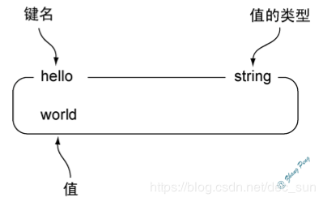
|                命令                |                             行为                             |
| :--------------------------------: | :----------------------------------------------------------: |
|           set key value            |                 将字符串值 value 关联到 key                  |
|              get key               |                返回与键 key 相关联的字符串值                 |
|          setnx key value           |    只在键 key 不存在的情况下， 将键 key 的值设置为 value     |
|       setex key second value       | 将键 key 的值设置为 value ， 将键 key 的生存时间设置 seconds 秒钟. set key value |
|   psetex key milliseconds value    |   和 SETEX 命令相似， 但它以毫秒为单位设置 key 的生存时间    |
|          getset key value          |  将键 key 的值设为 value ， 并返回键 key 在被设置之前的旧值  |
|             strlen key             |               返回键 key 储存的字符串值的长度                |
|          append key value          | 键 key 已经存在并且它的值是一个字符串， APPEND 命令将把 value 追加到 key 现有值的末尾 |
|     setrange key offset value      | 从偏移量 offset 开始， 用 value 参数覆写(overwrite)键 key 储存的字符串值 |
|       getrange key begin end       |             返回键 key 储存的字符串值的指定部分              |
|               keys *               |                        显示所有的 key                        |
|              incr key              |              返回键 key 在执行加一操作之后的值               |
|        incrby key increment        |         在加上增量 increment 之后， 键 key 当前的值          |
|     incrbyfloat key increment      |          为键 key 储存的值加上浮点数增量 increment           |
|              decr key              |                 为键 key 储存的数字值减去一                  |
|        decrby key decrement        |          减去增量 increment 之后， 键 key 当前的值           |
| mset key1 value1 key2 value2 ....  |                      同时为多个键设置值                      |
| msetnx key1 value1 key2 value2 ... |                                                              |
|         mget key1 key2 ...         |                                                              |


## Hash

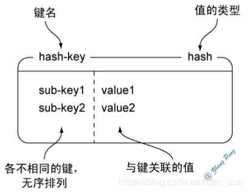

|                      命令                       |                             行为                             |
| :---------------------------------------------: | :----------------------------------------------------------: |
|              hset key field value               | 将哈希表 hash 中域 field 的值设置为 value。<key, <field,value>> |
|                 hget key field                  |                    返回哈希表中给定域的值                    |
|             hsetnx key field value              | 当且仅当域 field 尚未存在于哈希表的情况下， 将它的值设置为 value |
|                hexists key field                |         检查给定域 field 是否存在于哈希表 hash 当中          |
|                 hdel key field                  |             删除哈希表 key 中的一个或多个指定域              |
|                    hlen key                     |                返回哈希表 key 中 field 的数量                |
|                hstrlen key field                |  返回哈希表 key 中， 与给定域 field 相关联的值的字符串长度   |
|           hincrby key field increment           |                                                              |
|        hincrbyfloat key field increment         |                                                              |
|     hmset key field value [field value ...]     |                                                              |
|           hmget key field [field ...]           |                                                              |
|                    hkeys key                    |                                                              |
|                    hvals key                    |                 返回哈希表 key 中所有域的值                  |
|                   hgetall key                   |               返回哈希表 key 中，所有的域和值                |
| hscan  key cursor [MATCH pattern] [COUNT count] |                        hscan key01 3                         |


## 列表

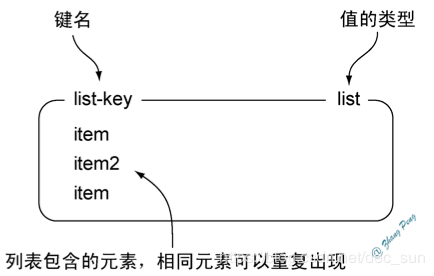
|                 命令                  |                             行为                             |
| :-----------------------------------: | :----------------------------------------------------------: |
|      lpush key value [value ...]      | 将一个或多个值 value 插入到列表 key 的表头(最后一个value 始终在表头) |
|           lpushx key value            | 将值 value 插入到列表 key 的表头，当且仅当 key 存在并且是一个列表 |
|      rpush key value [value ...]      |      将一个或多个值 value 插入到列表 key 的表尾(最右边)      |
|           rpushx key value            | 将值 value 插入到列表 key 的表尾，当且仅当 key 存在并且是一个列表 |
|               lpop key                |                 移除并返回列表 key 的头元素                  |
|               rpop  key               |                 移除并返回列表 key 的头元素                  |
|     rpoplpush source destination      | source destination 是 key，从 sourcce key 中pop 表头元素到 destination key |
|         lrem key count value          |     根据 count 的值，来移除 key 的与 value 相等的值元素      |
|               llen key                |                          key 的长度                          |
|           lindex key index            |             返回列表 key 中，下标为 index 的元素             |
|          linsert key BEFORE           |                      AFTER pivot value                       |
|         lset key index value          |        将列表 key 下标为 index 的元素的值设置为 value        |
|         lrange key start stop         |       一个列表，包含指定区间内的元素 了range key 0 -1        |
|         ltrim key start stop          |                 让列表只保留指定区间内的元素                 |
|      blpop key [key ...] timeout      |            阻塞式操作，如果timeout 超时就停止操作            |
|      brpop key [key ...] timeout      |                                                              |
| brpoplpush source destination timeout |                                                              |


## 集合

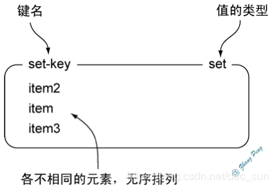

| 命令 | 行为 |
|--|--|
|sadd key member [member ...]    | 一个或多个 member 元素加入到集合 key 当中 |
|sismember key member   | 判断 member 元素是否集合 key 的成员 |
|spop key [coun                | 移除并返回集合中的一个随机元素  |
|srandmember key [count]    |  返回集合中的一个随机元素 |
|srem key member [member ...]    |  移除集合 key 中的一个或多个 member 元素 |
|smove source destination member  | 将 member 元素从 source 集合移动到 destination 集合 |
|scard key    | 集合中元素的数量 |
|smembers key    | 返回集合 key 中的所有成员 |
|sinter key         |  交集结果|
|sinterstore destination key    | 将交集保存到 destination 中 |
|sunion key [key ...]     |  并集成员的列表 |
|sunionstore destination key [key ...]   | 类似于 SUNION key [key …] 命令，但它将结果保存到 destination 集 合，而不是简单地返回结果集 |
|sdiff key [key ...]           | 一个包含差集成员的列表 |
|sdiffstore destination key [key ...]   |


## 有序集合

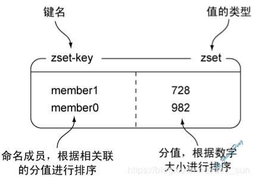
| 命令 | 行为 |
|:-:|:-:|
|zadd key score member [score member ...]   }| score 类似于 value，member 类似于 field ，添加 |
|zscore key member     | 返回有序集 key 中，成员 member 的 score 值 |
|zincrby key increment member  |  为有序集 key 的成员 member 的 score 值加上增量 increment |
|zcard key        | 返回有序集 key 的基数 |
|zcount key min max    |  返回 score 小于 max，大于 min 之间的结果集 |
|zrange key start stop    |  返回有序集 key 中，指定区间内的成员 |
|zrevrange key start stop      | 成员的位置按 score 值递减(从大到小)来排列 |
|zrangebyscore key min max    | 有序集 key 中，所有 score 值介于 min 和 max 之间 |
|zrevrangebyscore key max min  |  有序集 key 中， score 值介于 max 和 min 之间 score  大到小 |
|zrank key member     | 有序集 key 中成员 member 的排名 |
|zrevrank key member | 与上相反 |
|zrem key member     | 移除 member 的 score |
|zremrangebyrank key start stop   | 移除 start stop 之间的元素 |
|zremrangebyscore key min max  |移除 score 在 min max 之间的元素 |
|zrangebylex key min max   | 有序集合的元素会根据成员的字典序来进行排序 |
|zremrangebylex key min max       |                            移除 |
|zlexcount key min max        | 返回该集合中， 成员介于 min 和 max 范围内的元素数量 |
|zunionstore  destination numkeys ke   |  并集返回 |
|zinterstore destination numkeys key    | 交集返回 |


# 操作命令

|                命令                |                       行为                       |
| :--------------------------------: | :----------------------------------------------: |
|            BGREWRITEAOF            |                 后台进程重写AOF                  |
|               BGSAVE               |          后台保存rdb快照 （fork进程 ）           |
|                SAVE                |       保存rdb快照（数据量很大，堵塞线程）        |
|              LASTSAVE              |                   上次保存时间                   |
|                info                |            查看所有当前 redis 的信息             |
|              select 2              | 选择16个环境中的一个（正式环境和开发环境的隔离） |
|                quit                |                       退出                       |
| rename old_key(exists_key) new_key |                    key 重命名                    |
|               dbsize               |             当前数据库一共有多少key              |
|              flushall              |                     清空数据                     |


# 发布订阅

Redis 发布订阅(pub/sub)是一种消息通信模式：发送者(pub)发送消息，订阅者(sub)接收消息。
Redis 客户端可以订阅任意数量的频道。

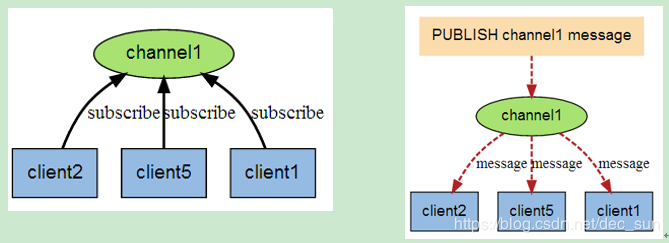

​	当有新消息通过 PUBLISH 命令发送给频道 channel1 时， 这个消息就会被发送给订阅它的三个客户端. 

|           命令           |                说明                |
| :----------------------: | :--------------------------------: |
|   SUBSCRIBE redisChat    |         订阅 redisChat频道         |
| PUBLISH redisChat string | 向 redisChat 频道发送 string 消息. |
|    PSUBSCRIBE redis*     |  订阅包含 redis 正则表达式的频道   |
|  PUBSUB channels redis*  |        查看订阅频道 redis.         |
| PUBSUB numsub redisChat  |   查看订阅 redisChat 频道的人数.   |


# 配置属性

- daemonize no
redis 默认不是以守护进程的方式运行，可以通过该配置项修改，使用 yes 启用守护进程

- pidfile /var/run/redis.pid
当 redis 以守护进程方式运行时，redis 默认会把 pid 写入 /var/run/redis/pid 文件，可以通过 pidfile 指定。

- port 6379
指定 redis 监听端口，默认端口为 6379

- tcp-backlog 511
TCP 接收队列长度，受 /proc/sys/net/core/somaxconn 和 tcp_max_syn_backlog 这两个内核参数的影响。

- bind 127.0.0.1
绑定主机地址

- timeout 300
当客户端闲置多长时间后关闭连接，如果指定为 0， 则表示关闭该功能。

- tcp-keepalive 60
如果非零，则设置 SO_KEEPALIVE 选项来向空闲连接的客户端发送 ACK。

- loglevel verbose
指定日志记录级别 debug，versbose，notice，warning。默认为 verbose。
debug：大量信息，主要用于调试。
verbose：精简后的有用信息
notice：适量的信息
warning：很重要或很严重的信息会被记录下来。

- logfile "./redis7003.log"
日志名

- databases 16
设置数据库的数量，可以使用 select dbid 命令在连接上指定数据库 id。

- save \<seconds> \<changes>
指定在多长时间内，有多少次更新操作，将数据同步到数据文件，可以多个条件配置。
默认配置文件中提供了三个条件：
save 900 1
save 300 10
save 60 10000
分别表示 900s 内有一个更改，300s内有 10 个更改以及 60s 内有 10000 个更改。只要出发一个条件就可以执行同步操作。

- stop-writes-on-bgsave-error yes
默认如果开启 RDB快照，并且最新的后台保存失败，Redis 将会停止接受写操作。这将使用户知道数据没有正确地持久化到硬盘，否则可能没人注意。

- rdbcompression yes
指定存储到本地数据库时是否压缩数据，默认是 yes，Redis 采用 LZF 压缩，如果为了节省 CPU 时间，可以关闭该选项，但会导致数据库文件变的很大。

- dbfilename dump.rdb
指定本地数据库文件名，默认值为 dump.rdb，除非非常紧要的数据，否则尽量不要开启数据持久化。

- dir ./
指定本地数据库存放的目录。

- slaveof \<masterip> \<masterport>
设置当本机为 slave 服务时，设置 master 服务的 ip 和 port， 在 Redis 启动时，它会自动从 master 进行数据同步。

-  masterauth \<master-password>
当 master 服务设置了密码保护时，slave 服务连接 master 的密码。

- requirepass foobared
设置 Redis 连接密码，如果配置了连接密码，客户端在连接 Redis 时需要通过 AUTH \<password> 命令提供密码，默认关闭

- slave-read-only yes
配置 salve 实例是否接受写操作。可写的 slave 实例可能对存储临时数据比较有用(因为写入 slave 的数据在同 master 同步之后将很容易被删除。

- repl-disable-tcp-nodelay no
是否在 slave 套接字发送 SYNC 之后禁用 TCP_NODELAY？ 如果选择 “yes”， Redis 将使用更少的 TCP 包和带宽来向 slaves 发送数据。但是这将使数据传输到 slave 上有延迟，Linux 内核的默认配置会达到 40 毫秒。如果选择了 "no" 数据传输到 slave 的延迟将会减少但要使用更多的带宽。

- slave-priority 100
slave 的优先级是一个整数展示在 Redis 的 Info 输出中。如果 master 不再正常工作了，哨兵将用它来选择一个 slave 提升为 master。优先级数字小的 slave 会优先考虑提升为 master，所以例如有三个 slave 优先级分别为10，100，25，哨兵将挑选优先级最小数字为 10 的 slave。0 作为一个特殊的优先级，标识这个 slave 不能作为 master，所以一个优先级为 0 的 slave 永远不会被# 哨兵挑选提升为 master。

- maxclients 128
设置同一时间最大客户端连接数，默认无限制，Redis 可以同时打开的客户端连接数为 Redis进 程可以打开的最大文件描述符数，如果设置 maxclients 0，表示不作限制。当客户端连接数到达限制时，Redis 会关闭新的连接并向客户端返回 max number of clients reached 错误信息。

- maxmemory \<bytes>
指定 Redis 最大内存限制，Redis 在启动时会把数据加载到内存中，达到最大内存后，Redis 会先尝试清除已到期或即将到期的 Key，当此方法处理后，仍然到达最大内存设置，将无法再进行写入操作，但仍然可以进行读取操作。Redis 新的 vm 机制，会把 Key 存放内存，Value 会存放在 swap 区。

- maxmemory-policy volatile-lru
最大内存策略：如果达到内存限制了，Redis如何选择删除key。可以在下面五个行为里选：
	```xml
	volatile-lru : 根据 LRU 算法删除带有过期时间的 key。
	allkeys-lru : 根据 LRU 算法删除任何 key。
	volatile-random : 根据过期设置来随机删除 key, 具备过期时间的 key。 
	allkeys-random : 无差别随机删, 任何一个 key。 
	volatile-ttl : 根据最近过期时间来删除（辅以TTL）, 这是对于有过期时间的 key 
	noeviction : 谁也不删，直接在写操作时返回错误。
	```
- appendonly no
指定是否在每次更新操作后进行日志记录，Redis 在默认情况下是异步的把数据写入磁盘。如果不开启，可能会在断电时导致一段时间内的数据丢失。因为 redis 本身同步数据文件是按上面 save 条件来同步的，所以有的数据会在一段时间内只存在于内存中。默认为 no。

- appendfilename appendonly.aof
指定操作日志文件名，目录为dir设置的目录，默认为 appendonly.aof

- appendfsync everysec
指定更新日志条件，共有3个可选值： 
	```xml
	no：表示等操作系统进行数据缓存同步到磁盘（快） 
	always：表示每次更新操作后手动调用fsync()将数据写到磁盘（慢，安全） 
	everysec：表示每秒同步一次（折衷，默认值）
	```
	
- vm-enabled no
指定是否启用虚拟内存机制，默认值为 no。VM 机制将数据分页存放，由 Redis 将访问量较少的页即冷数据 swap 到磁盘上，访问多的页面由磁盘自动换出到内存中。

- vm-swap-file /tmp/redis.swap
虚拟内存文件路径，默认值为 /tmp/redis.swap，不可由多个 Redis 实例共享

- no-appendfsync-on-rewrite yes
如果 AOF 的同步策略设置成 “always” 或者是 “everysec”，后台的存储进程会产生很多磁盘 IO 开销。某些 Linux 的配置下会使 Redis 因为 fsync() 系统调用而阻塞很久。
为了缓解这个问题，可以使用这个选项。它可以在 BGSAVE 和 BGREWRITEAOF 处理时阻止主进程进行 fsync()。这就意味着：如果有子进程在进行保存操作，那么 Redis 就处于 “不可同步” 的状态。在最差的情况下，其可能会丢掉 30s 的日志数据。
如果有延时时间问题，就将该属性设置为 “yes”，否则就保持为  “no”，这是保存持久化数据最安全的方式。

- auto-aof-rewrite-percentage 100
- auto-aof-rewrite-min-size 64mb
自动重写 AOF 文件。

- aof-load-truncated yes
如果 aof-load-truncated 设置成 yes，Redis 会自动发布一个 log 给客户端然后 load；
如果是 no，那么用户必须手动 redis-check-aof 修复 AOF 文件才可以。
这个选项仅仅用于当服务器尝试读取更多的数据但又找不到相应的数据时。

- lua-time-limit 5000
lua 脚本的最大执行时间，毫秒为单位。

- slowlog-log-slower-than 10000
Redis 慢查询日志可以记录超过指定时间的查询。

- slowlog-max-len 128
这个长度没有限制，但是会消耗内存，可以通过 SLOWLOG RESET 来回收内存。

- latency-monitor-threshold 0
Redis 延时监控系统在运行时会采样一些操作，以便收集可能导致延时的数据根源。通过 LATENCY 命令可以打印一些图样和获取一些报告，方便监控这个系统仅仅记录那个执行时间大于或等于预定时间的操作，这个预定时间是通过 latency-monitor-threshold 配置来指定的。当设置为 0 时，这个监控系统处于停止状态。

- notify-keyspace-events 
Redis 能通过 pub / sub 客户端关于键空间发生的事件，默认关闭。

- hash-max-ziplist-entries 512
- hash-max-ziplist-value 64
当 hash 只有少量的 entry 时，并且最大的 entry 所占空间没有超过指定的限制时，会用一种节省内存的数据结构来编码。

- list-max-ziplist-entries 512
- list-max-ziplist-value 64
与 hash 似，数据元素较少的 list，可以用另一种方式来编码从而节省大量空间。

- set-max-intset-entries 512
set 有一种特殊编码的情况：当 set 数据全是十进制 64 位有符号整型数字构成的字符串时。这个配置项就是用来设置 set 使用这种编码来节省内存的最大长度。

- zset-max-ziplist-entries 128
- zset-max-ziplist-value 64
与 hash 和 list 相似，有序集合也可以用一种特别的编码方式来节省大量空间。这种编码只适合长度和元素都小于限制的有序集合

- hll-sparse-max-bytes 3000
HyperLogLog 稀疏结构表示字节的限制。该限制包括 16 个字节的头。当 HyperLogLog 使用稀疏结构表示这些限制，它会被转换成密度表示。值大于16000是完全没用的，因为在该点密集的表示是更多的内存效率。建议值是3000左右，以便具有的内存好处, 减少内存的消耗。

- activerehashing yes
启用哈希刷新，每 100 个 CPU 毫秒会拿出 1 个毫秒来刷新Redis的主哈希表（顶级键值映射表）

- client-output-buffer-limit normal 0 0 0
- client-output-buffer-limit slave 256mb 64mb 60
- client-output-buffer-limit pubsub 32mb 8mb 60
客户端的输出缓冲区的限制，可用于强制断开那些因为某种原因从服务器读取数据的速度不够快的客户端

- hz 10
默认情况下，“hz” 的被设定为 10。提高该值将在 Redis 空闲时使用更多的 CPU 时，但同时当有多个 key 同时到期会使 Redis 的反应更灵敏，以及超时可以更精确地处理。

- aof-rewrite-incremental-fsync yes
当一个子进程重写 AOF 文件时，如果启用该选项，则文件每生成 32M 数据会被同步。

- vm-max-memory 0
将所有大于 vm-max-memory 的数据存入虚拟内存,无论 vm-max-memory 设置多小, 所有索引数据都是内存存储的,也就是说,当 vm-max-memory 设置为 0 的时候,其实是所有 value 都存在于磁盘。默认值为 0

- vm-page-size 32
swap 文件分成了很多的 page，一个对象可以保存在多个 page 上面，但一个 page 上不能被多个对象共享，vm-page-size 要根据存储的数据大小来设定的。如果存储很多小对象，page 大小最好设置为 32 或者 64bytes；如果存储很大大对象，则可以使用更大的 page，如果不确定，就使用默认值。

- vm-pages 134217728
设置 swap 文件中的 page 数量，由于页表是在放在内存中的，在磁盘上每 8 个 pages 将消耗 1byte 的内存。

- vm-max-threads 4
设置访问 swap 文件的线程数，最好不要超过机器的核数，如果设置为 0，那么所有对 swap 文件的操作都是串行的，可能会造成比较长时间的延迟。默认值为 4。

- glueoutputbuf yes
设置在向客户端应答时，是否把较小的包合并为一个包发送，默认为开启.

- hash-max-zipmap-entries 64
- hash-max-zipmap-value 512
指定在超过一定的数量或者最大的元素超过某一临界值时，采用一种特殊的哈希算法。

- activerehashing yes
指定是否激活重置哈希，默认为开启。

- include /path/to/local.conf
指定包含其它的配置文件，可以在同一主机上多个 Redis 实例之间使用同一份配置文件，而同时各个实例又拥有自己的特定配置文件。

- heapdir ./rdb/
指定内存映射文件路径。

- maxheap 1024000000
指定内存映射文件大小，如果设置了最大内存那么该文件的大小 = 1.5 * 最大内存大小。


# Redis 安装

## 单机安装

```
1. 下载
    wget http://download.redis.io/releases/redis-4.0.2.tar.gz

2. 解压
    tar xzf redis-4.0.2.tar.gz -C /opt/app

3. 编译
    cd /opt/app/redis-4.0.2/src -> make -j4 (需要安装 gcc yum install gcc 否则会报错) 
    make MALLOC=libc // jemalloc.h: No such file or directory 报错可以使用此编译
    ->  make install   //默认安装在当前目录下
    make PREFIX=/usr/local/redis install //安装到/usr/local/redis 目录下有个bin目录
4. cd ../utils -> cp redis_init_script /etc/rc.d/init.d/redis

5. 配置redis文件
    #!/bin/sh
    #chkconfig: 2345 80 90   //add this
    # Simple Redis init.d script conceived to work on Linux systems
    ---------------------------------------------------------------
    EXEC=/usr/local/redis/bin/redis-server  //修改为真实的目录下  redis-server 的目录
    CLIEXEC=/usr/local/redis/bin/redis-cli   //redis-cli 的目录
    PIDFILE=/usr/local/redis/pid/redis_${REDISPORT}.pid //指定目录
    CONF="/usr/local/redis/redis.conf"     //指定配置目录

6. cd /opt/app/redis-4.0.2 -> cp redis.conf /usr/local/redis/

7. vi redis.conf
   1) # IF YOU ARE SURE YOU WANT YOUR INSTANCE TO LISTEN TO ALL THE INTERFACES
      # JUST COMMENT THE FOLLOWING LINE.
      # ~~~~~~~~~~~~~~~~~~~~~~~~~~~~~~~~~~~~~~~~~~~~~~~~~~~~~~~~~~~~~~~~~~~~~~~~
      bind 0.0.0.0  //绑定端口号, 小心安全攻击，必须加上权限密码requirepass. 进入用AUTH password.

   2) # By default Redis does not run as a daemon. Use 'yes' if you need it.
      # Note that Redis will write a pid file in /var/run/redis.pid when daemonized.
      daem onize yes         //允许后台运行
      # requirepass 123456     //设置进入密码

8. chkconfig --add redis     //开机启动 
   chkconfig --list

9. cd /usr/local/redis/bin -> ./redis-cli
   ./redis-cli -h 192.168.161.150 -p 6379 -a password  //-h IP -h host

10. 加入到环境中
    vi /etc/profile -> export PATH="$PATH:/usr/local/redis/bin" -> source

11. 启动
    ./redis-server ../redis.conf

12. 使用客户端
    ./redis_cli
      redis-cli -h xxx -p 6379 -a xxx
```


##  集群配置之主从配置 

```xml
主从配置: 
	一台 host 作为 master, 其他 host 作为 slave. 当 master 死亡, slave 也不会转变成 master.
    一般 master 服务器需要采用 2*n + 1 的的策略进行配置, 即需要机器的数量有 (2*n + 1) * 2.
    这是由于基于选举机制, 当 master 主机有一半以上的同时同意某一要求时,可以更好的发挥选举机制. 如果是偶数, 那么就会有一种极端环境. 同时在底层实现中, 也是基于该选举方式来处理的.

1. 下载
    wget http://download.redis.io/releases/redis-4.0.2.tar.gz

2. 解压
    tar xzf redis-4.0.2.tar.gz -C /opt/app

3. 编译
    cd /opt/app/redis-4.0.2/src -> make -j4 (需要安装 gcc yum install gcc 否则会报错) 
    make MALLOC=libc // jemalloc.h: No such file or directory 报错可以使用此编译
    ->  make install   //默认安装在当前目录下

4. cd /opt/app/redis-4.0.2/ ->
   mkdir cluster-test -> 
   mkdir 7000 7001 7002 7003 7004 7005 ->
   cd /opt/app/redis-4.0.2/ -> 
   cp redis.conf cluster-test/7000 //复制redis.conf配置文件复制到 7000. 7001, 7002,7003,7004,7005 亦是如此.

5.  vi  cluster-test/7000/redis.conf          //7001, 7002,7003,7004,7005 亦是如此.
    daemonize    yes                          //redis后台运行
    pidfile  /var/run/redis_7000.pid          //pidfile文件对应7000,7001,7002,7003, 7004, 7005
    port  7000                                //端口7000, 7001,7002, 7003, 7004, 7005
    cluster-enabled  yes                      //开启集群  
    cluster-config-file  nodes_7000.conf      //集群的配置  配置文件首次启动自动生成 7000,7001,7002, 7003, 7004, 7005.该文件会生成在数据持久化文件目录下
    cluster-node-timeout  5000              
    appendonly  yes                           //aof日志开启  有需要就开启，它会每次写操作都记录一条日志

6. cd src/
   ./redis-server ../cluster-test/7000/redis.conf   //7001, 7002,7003,7004,7005 亦是如此.
   ps -ef |grep redis || ps aux |grep redis
        root      6733     1  0 10:12 ?        00:00:04 ./src/redis-server 0.0.0.0:7001 [cluster]        
        root      6747     1  0 10:12 ?        00:00:04 ./src/redis-server 0.0.0.0:7004 [cluster]        
        root      6752     1  0 10:12 ?        00:00:04 ./src/redis-server 0.0.0.0:7003 [cluster]        
        root      6757     1  0 10:12 ?        00:00:04 ./src/redis-server 0.0.0.0:7005 [cluster]        
        root      7435     1  0 10:36 ?        00:00:00 ./redis-server 0.0.0.0:7000 [cluster]         
        root      7451     1  0 10:37 ?        00:00:00 ./redis-server 0.0.0.0:7002 [cluster]   
   
    当前已经在单机上开启了六个 redis 实例. 此时可以针对六个实例搭建集群了

7. 安装ruby环境, 将为 redis-trib.rb 运行做准备
    wget https:// cache.ruby-lang.org/pub/ruby/2.3/ruby-2.3.1.tar.gz
    tar xvf ruby-2.3.1.tar.gz -C /opt/app
    cd ruby-2.3.1 -> ./configure -prefix=/usr/local/ruby 
    make; make install  //当前目录编译安装. 被指定到 /usr/bin/ruby
    cd /usr  -> cp bin/ruby /usr/local/bin  cp bin/gem /usr/local/bin

8. 下载rubygen redis依赖
    wget http:// rubygems.org/downloads/redis-3.3.0.gem
    gem install -lredis-3.3.0.gem //安装依赖
    gem list check redis gem //验证

9. 执行创建集群的脚本文件
   ./redis-trib.rb create --replicas 1 192.168.47.188:7000 192.168.47.188:7001 192.168.47.188:7002 192.168.47.188:7003 192.168.47.188:7004 192.168.47.188:7005
    ./redis-trib.rb check 192.168.47.188:7000   //验证
   注:ERR Slot 0 is already busy, 这是可能创建集群的脚本文件时会报的错误, 这是由于可能某些key没有被清楚干净, 进入redis-cli: flushall, cluster reset, 重置数据库.清空所有数据.

10. 打开client, 也就是说在执行上述操作时, redis一直是在后台运行的.
    ./redis-cli -c -p 7000     //7001, 7002,7003,7004,7005 亦是如此; -c 集群

11. 验证
    进入某一个master -> set key1 val1 -> 去slave去查看.

---------------------------------------------------------------------------------------------------------------------------------------------------------------------
设置密码之后如果需要使用redis-trib.rb的各种命令 
如：./redis-trib.rb check 127.0.0.1:7000，则会报错ERR] Sorry, can’t connect to node 127.0.0.1:7000 
解决办法：vim /usr/local/rvm/gems/ruby-2.3.3/gems/redis-4.0.0/lib/redis/client.rb，然后修改passord
class Client
    DEFAULTS = {
      :url => lambda { ENV["REDIS_URL"] },
      :scheme => "redis",
      :host => "127.0.0.1",
      :port => 6379,
      :path => nil,
      :timeout => 5.0,
      :password => "passwd123",   # 这里设置成 master 的password
      :db => 0,
      :driver => nil,
      :id => nil,
      :tcp_keepalive => 0,
      :reconnect_attempts => 1,
      :inherit_socket => false
    }

```


##  master - slave 复制配置  

```
master - slave 复制配置 (将 read 操作将给 slave)
    master:  8000
        关闭rdb快照
            #save 900 1       注释掉
            #save 300 10      注释掉
            #save 60 10000    注释掉
        开启 aof
            appendonly yes
        关闭只读
            slave-read-only no

    slave 8001 8002
        声明 slave-of
            # slaveof <masterip> <masterport>
            slaveof 127.0.0.1 8000
        配置密码[如果 master 有密码] masterauth abc
        slave 打开 rdb 快照功能
             save 900 1       
             save 300 10      
             save 60 10000   
        配置只读
             slave-read-only yes
        开启 aof 模式
             appendonly yes
                
    将 master, slave 的 logfile 打开.
    logfile "/opt/app/redis-4.0.2/lineNetwork/8000/8000.log"
                
先启动 master, 然后再启动 slave.
只有 master 可写, slave 只读.
```


##  哨兵 sentinel 模式 

```xml
哨兵模式, 当 master 死亡, slave将接替 master的工作.
1. 先完成主从复制配置的配置

2. vi sentinel.conf
    sentinel monitor mymaster 127.0.0.1 8000 1      //master对象

    # master 被当前 sentinel 实例认定为“失效”的间隔时间  
    # 如果当前 sentinel 与 master 直接的通讯中，在指定时间内没有响应或者响应错误代码，那么  
    # 当前sentinel就认为master失效(SDOWN，“主观”失效)  
    # <mastername> <millseconds>  
    # 默认为30秒, 这里设置为 60s. 
    sentinel down-after-milliseconds mymaster 6000  //时间
    sentinel failover-timeout mymaster 6000         //时间
    sentinel config-epoch mymaster 175              //时间
    sentinel leader-epoch mymaster 175              //时间
    sentinel known-slave mymaster 127.0.0.1 8000    //master对象

3. 启动. 首先启动 redis. 在启动sentinel
    ./src/redis-server sentinel.conf --sentinel

4. 验证. kill master , 查看是否存在 slave 切换到 master.
   Master->Slave->Sentinel，要确保按照这个顺序依次启动
```

