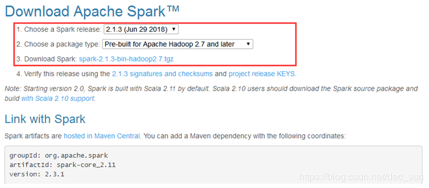
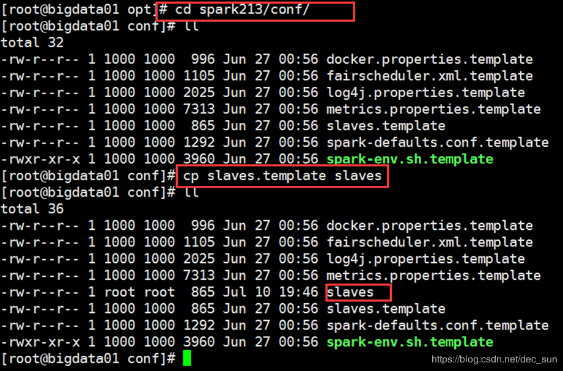
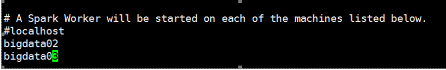
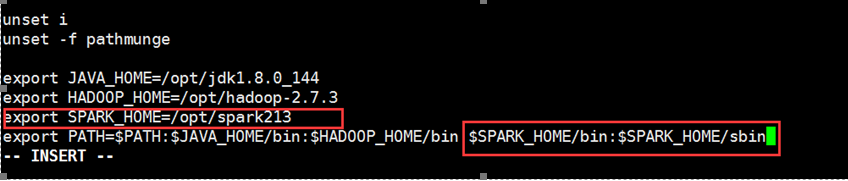
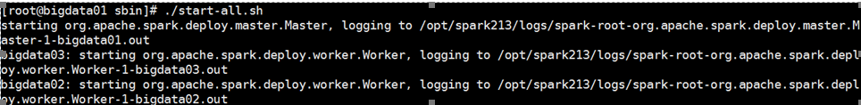
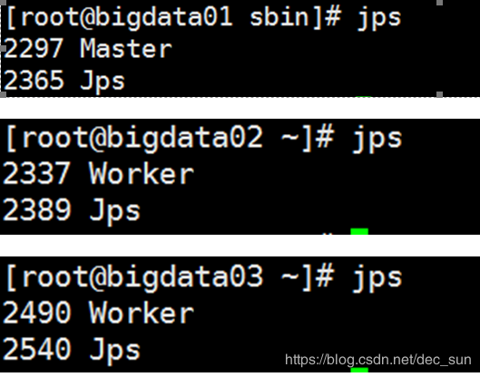
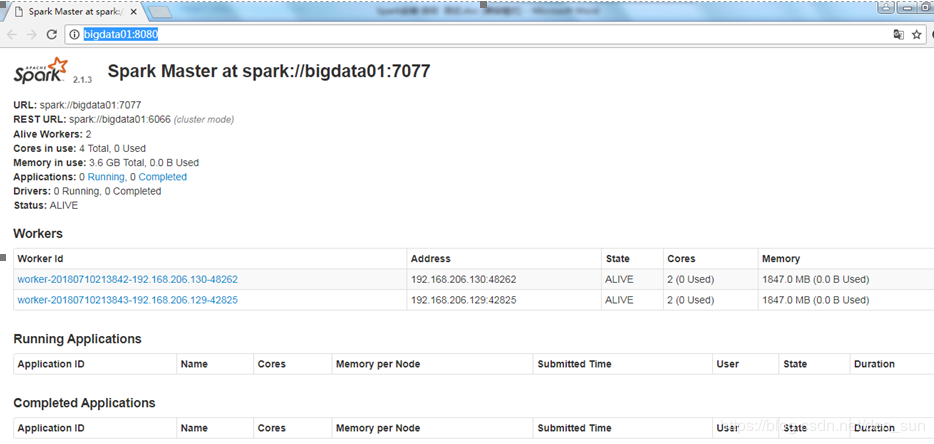
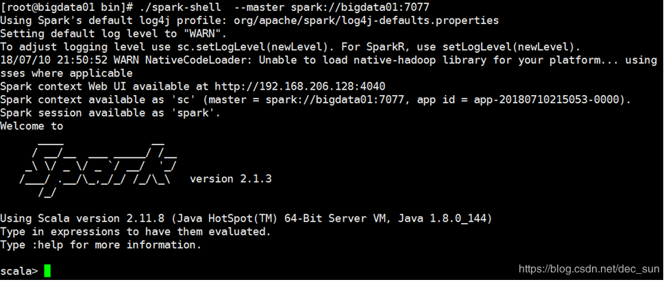

@[toc]
# 简介
Spark 是专为大规模数据处理而设计的快速通用的计算引擎，其是由 scala 语言编写而成。如下图所示，这是显示了 Spark standalone 应用程序上下文中所有的 Spark 组件。

Spark 应用程序是由一个 Driver（驱动程序）和一组 Executor 进程组成。

**Driver 进程**
负责运行 main 函数，其进程位于集群的一个节点上。其主要：
1. 维护有关 Spark 应用程序的信息；
2. 响应用户的程序与输入；
3. 分析、分配和调度 Executor 的工作。

**Executor 进程**
实际执行 driver 分配给他们的工作。Executor 主要负责两件事：
1. 执行由驱动程序分配给它的代码；
2. 将计算状态报告给驱动节点。


| 注意                                                         |
| ------------------------------------------------------------ |
| Spark 除了集群 cluster 模式之外，还具有本地 local 模式。driver 驱动程序和 executor 执行器是简单的进程，这意味着它们可以在同一台机器或不同的机器上运行。在本地 local 模式中，驱动程序和执行程序(作为线程)在您的个人计算机上运行，而不是集群。 |

## SparkDriver
上述已经介绍了 SparkDriver 主要负责包括

 - 维护有关 Spark 应用程序的信息；
 - 响应用户的程序或输入；
 - 分配和调度 Executor 的 task 和资源。

### SparkContext
Spark Driver 程序负责创建 SparkContext。SparkContext 在 spark shell 中对应的变量对象名为 sc。其用于连接 Spark 集群，是与 Spark 集群交互的入口。SparkContext 在 Spark 应用程序的开始实例化，并应用于整个程序。

### 应用程序执行计划（DAGScheduler）
Driver 程序的主要功能之一就是规划应用程序的执行。驱动程序接受所有 transformation 和 action 操作，并创建一个有向无环图（DAG）。
有向无环图 DAG 是由 tasks 和 stages 组成。task 是 Spark 程序中可调度工作的最小单位。stage 是 一组可以一起运行的 task。多个 stage 之间是相互依存的。

tips：因为是数据不动代码动，所以 DAG 其实是一系列的连续操作的集合。

### 应用程序的调度（TaskScheduler）
Driver 程序还协调 DAG 中定义的 stage 和 task 的运行。在调度和运行 task 时设计的主要 Driver 活动：
1. 跟踪可用资源以执行 task。
2. 调度任务，以便在可能的情况下，“接近”数据运行
3. 协调数据在 stage 之间的移动。

### SparkUI
Driver 驱动处理计划和编排 Spark 程序的执行之外。其还负责从应用程序返回结果。driver 程序在 4040 端口上自动创建了应用程序 UI。如果在同一个主机上启动后续应用程序，则会为应用程序 UI 使用连续的端口(例如 4041、4042 等等)。


## Executor
executor 的主要工作：
- 执行由驱动程序分配给它的代码（task）
- 将执行器 executor 的计算状态报告给 driver 节点

### Executor 和 Worker
Spark Executor 是运行来自 Spark DAG 的 task 进程。Executor 在 Spark 集群中的 worker 节点上获取 CPU 和内存等计算资源。Executor 专用于特定的 Spark 应用程序，并在应用程序完成而终止。在Spark 程序中，Spark Executor 可以运行成百上千的 task。

通常情况下，work 节点【有限个】 Executor，一个 Executor 进程可以运行【多个】 task。

Spark Executor 驻留在 jvm 中。Executor 的 jvm 分配了一个堆内存，这是一个用于存储和管理对象的专用内存空间。堆内存的大小由 Spark 配置文件 spark-default.xml 中的 spark.executor.memory 属性确定，或者由提交应用程序时 spark-submit 的参数 --executor-memory 确定。

Worker 和 Executor 只知道分配给它的 task，而 Driver 程序负责理解组成应用程序的完整 task 集合它们各自的依赖关系。

## Master 和 ClusterManager
Spark Driver 程序计划并协调运行 Spark 应用程序所需的 task 集。task 本身在 Executor 中运行，Executor 驻留在 worker 节点上。

Master 和 Cluster 是监控、分配、回收集群（ Executor 运行的节点）资源的核心进程，Master 和Cluster Manager 可以是各自独立的进程（Spark OnYarn），也可以组合成一个进程（Standalone 运行模式）。

# 总结
| master | worker | Driver | Executor | SparkContext | Job  | Stage | RDD  | Task |
| ------ | ------ | ------ | -------- | ------------ | ---- | ----- | ---- | ---- |
| 调试和管理 worker | 定期汇报，启动 Executor，执行task |负责任务的解析，生成 stage |该进程是一个JVM虚拟机, 负责运行 Spark Task | DAGScheduler：划分 stage 并生成程序运行的有向无环图。TaSkScheduler：负责具体 stage 内部的底层调度，具体 task 的调度、容错 | 一个 Action触发一个 Job | 一个Job包含一个或多个 Stage | 弹性分布式数据集 | 一个 Stage 包含一个或多个 Task，任务工作的基本单元 |

# RDD（Resilient Distributed Dataset，弹性分布式数据集）
RDD 是 Resilient Distributed Dataset --- 弹性分布式数据集的简称。它是 Spark 的基本数据结构，是一个不可变的对象集合，在集群的不同节点行进行计算。
- Resilient：即在 RDD lineage 的帮助下具有容错能力，能够重新计算由于节点故障而丢失或损坏的数据分区；
- Distributed： 数据分布在多个节点上。
- Dataset：数据集。数据可以通过外部加载收集，数据类型可以是JSON、CSV，文本或数据库等。

## 特点
1. 内存计算：计算的中间结果存储在内存中而不是磁盘；
2. 延迟计算：所有的 Transformation 都是惰性操作，它们不会立即计算结果，但是它们记住数据集的Transformation 操作，直到 action 的出现，才开始真正的计算；
3. 容错性：在故障时自动重建丢失的数据；
4. 不可变性：数据在计算过程中是不可变的，跨进程共享数据是安全的；
5. 分区性：分区 partition 是 Spark RDD 并行性的基本单元，每个分区都是数据的逻辑分区。在进行 RDD 操作时，实际上是对每个分区的数据进行操作。
6. 持久化：可以指定 RDD 的存储策略，来提高性能；
7. 数据本地性：数据不动代码动。降低数据的流动（磁盘，网络的限制），提高性能。

# 操作类型
- Transformation：lazy，不会立即计算；
- action：触发计算。

## Transformation 操作
Spark RDD transformation 操作是一个从现有的 RDD 生成新 RDD 的函数。如 map()，filter()，reduceByKey() 等。
- Transformation 操作都是延迟计算的操作；
- 有两种类型 Transformation：窄依赖、宽依赖。

### 窄依赖
诸如 map、filter 这样的操作，其数据来自于上一个单独的分区。即输出RDD分区中的数据，来自于父RDD中的单个分区。-- 输入、输出，分区数不变，两者的分区是一一对应的。
窄依赖有：map，flatmap，mapPartition，filter，sample、union 等。

### 宽依赖
在子 RDD 单个分区中计算结果所需的数据可能存在于父 RDD 的多个分区中，因此宽依赖也被成为  shuffle translation。
宽依赖有：intersection、distinct、reduceByKey、GroupByKey、join、cartesian、repartition、coalesce 等。

| 窄依赖                                                  | 宽依赖                                                       |
| ------------------------------------------------------- | ------------------------------------------------------------ |
| 一对一，父 RDD的一个分区最多仅能在一个子RDD的一个分区中 | 一对多或多对一，父 RDD 的分区的结果在子 RDD 的多个分区中，子 RDD 的一个分区的输入来源于多个父RDD的分区 |

## action 操作
Spark 中的 action 操作，返回 RDD 计算的最终结果，其结果是一个值，而不是一个 RDD。action 触发血缘关系中 RDD 上的 transformation 操作的真正计算，计算结果返回 Driver 或被写入数据库。

常见的 action：first、take、reduce、collect、count 等。

# RDD
## 创建 RDD
创建 RDD 有三种方式：
- 使用集合创建 RDD
```
val conf = new SparkConf().setMaster("local[2]")
val sc = new SparkContext(conf)

val list = List(1, 2, 3, 4, 5, 6)
val rddParallelize = sc.parallelize(list, 2)
val rddMake = sc.makeRDD(list, 2)
```
- 使用已有 RDD 创建 RDD
```
val conf = new SparkConf().setMaster("local[2]")
val sc = new SparkContext(conf)

val source: RDD[String] = sc.textFile("hdfs://node01:8020/dataset/wordcount.txt", 20)
val words = source.flatMap { line => line.split(" ") }
```
- 从外部数据源创建 RDD
```
val conf = new SparkConf().setMaster("local[2]")
val sc = new SparkContext(conf)

val source: RDD[String] = sc.textFile("hdfs://node01:8020/dataset/wordcount.txt")
```

Spark 的提交方式
```
./bin/spark-submit \
--class <main-class>
--master <master-url>
--deploy-mode <deploy-mode>
--conf <key>=<value>
...   # other options
<application-jar> \
[application-arguments]

eg：./bin/spark-sumit  --class packageName+className  --deploy-mode cluster/client
```

## spark 算子
### Transformation 算子
- map：将 RDD 中的数据【一对一】的转化为另外一种形式
```
sc.parallelize(Seq(1,2,3)).map(num => num * 10).collect()
```
- flatMap：将 RDD 中的数据按照方法中的方案进行拆解，返回一个集合
```

sc.parallelize(Seq("hello lily","hello lucy","hello tim"))
  .flatMap(line => line.split(" "))
  .foreach(s => print(s) 
```
- filter: 过滤出条件结果
```
sc.parallelize(Seq("hello lily","hello lucy","hello tim"))
  .filter(line => line.equals("hello lily"))
  .foreach(s => print(s))
```

- mapPartitions: 与 map 类似，但是是针对一个分区进行数据转换
```
sc.parallelize(Seq("hello lily","hello lucy","hello tim"))
  .mapPartitions(iter => {
    val list = ArrayBuffer[String]()
    while (iter.hasNext){
      val cur = iter.next()
      list.append(cur)
    }
    list.iterator;
  })
  .foreach(s => print(s))
```

- mapPartitionsWithIndex：与 mapPartitions 相似，只是多返回一个分区 index。
```
sc.parallelize(Seq("hello lily","hello lucy","hello tim"))
  .mapPartitionsWithIndex((index,iter) => {
    iter.toList.map(x => (index,x)).iterator
  })
  .foreach(s => println(s))
```
- sample：从一个数据集中抽样出来一部分, 常用作于减小数据集以保证运行速度, 并且尽可能少规律的损失。
```
sc.parallelize(Seq(1, 2, 3, 4, 5, 6, 7, 8, 9, 10))
 .sample(withReplacement = true, 0.6, 2)
 .collect()
```

- union: 两个 RDD 的【并集】
```
val rdd1 = sc.parallelize(Seq(1, 2, 3))
val rdd2 = sc.parallelize(Seq(4, 5, 6))
rdd1.union(rdd2).collect()
```

- intersection: 用于求得 【左侧集合】 和【 右侧集合】 的【交集】
```
val rdd1 = sc.parallelize(Seq(1, 2, 3, 4, 5))
val rdd2 = sc.parallelize(Seq(4, 5, 6, 7, 8))
rdd1.intersection(rdd2).collect()
```

- subtract：两个 RDD 的【差集】
```
val rdd1 = sc.parallelize(Seq(1, 2, 3, 4, 5))
val rdd2 = sc.parallelize(Seq(4, 5, 6, 7, 8))
rdd1.subtract(rdd2).collect()
```

- distinct：去重
```
sc.parallelize(Seq(1, 1, 2, 2, 3)).distinct().collect()
```

- reduceByKey：首先按照 Key 分组生成一个 Tuple, 然后针对每个组执行 reduce 算子。
```
sc.parallelize(Seq(("a", 1), ("a", 1), ("b", 1)))
  .reduceByKey( (curr, agg) => curr + agg )
  .collect()
```

- groupByKey：按照 Key 分组
```
sc.parallelize(Seq(("a", 1), ("a", 1), ("b", 1)))
 .groupByKey()
 .collect()
```

- combineByKey：对数据集按照 Key 进行聚合。`combineByKey(createCombiner, mergeValue, mergeCombiners, [partitioner], [mapSideCombiner], [serializer])`
```
createCombiner 将 Value 进行初步转换
mergeValue 在每个分区把上一步转换的结果聚合
mergeCombiners 在所有分区上把每个分区的聚合结果聚合
partitioner 可选, 分区函数
mapSideCombiner 可选, 是否在 Map 端 Combine
serializer 序列化器

val rdd = sc.parallelize(Seq(
  ("zhangsan", 99.0),
  ("zhangsan", 96.0),
  ("lisi", 97.0),
  ("lisi", 98.0),
  ("zhangsan", 97.0))
)

val combineRdd = rdd.combineByKey(
  score => (score, 1),
  (scoreCount: (Double, Int),newScore) => (scoreCount._1 + newScore, scoreCount._2 + 1),
  (scoreCount1: (Double, Int), scoreCount2: (Double, Int)) =>
    (scoreCount1._1 + scoreCount2._1, scoreCount1._2 + scoreCount2._2)
)

val meanRdd = combineRdd.map(score => (score._1, score._2._1 / score._2._2))

meanRdd.collect()
```

- aggregateByKey：聚合所有 Key 相同的 Value。`rdd.aggregateByKey(zeroValue)(seqOp, combOp)`
```
zeroValue 初始值
seqOp 转换每一个值的函数
comboOp 将转换过的值聚合的函数

val rdd = sc.parallelize(Seq(("手机", 10.0), ("手机", 15.0), ("电脑", 20.0)))
val result = rdd.aggregateByKey(0.8)(
  seqOp = (zero, price) => price * zero,
  combOp = (curr, agg) => curr + agg
).collect()
println(result)
```
- foldByKey：按照 Key 做分组去求聚合。`foldByKey(zeroValue)(func)`。
```
zeroValue 初始值
func seqOp 和 combOp 相同, 都是这个参数

sc.parallelize(Seq(("a", 1), ("a", 1), ("b", 1)))
  .foldByKey(zeroValue = 10)( (curr, agg) => curr + agg )
  .collect()
```

- mapValue：MapValues 只能作用于 Key-Value 型数据, 和 Map 类似, MapValues 只转换 Key-Value 中的 Value。
```
sc.parallelize(Seq(("a", 1), ("b", 2), ("c", 3)))
  .mapValues( value => value * 10 )
  .collect()
```

- join：两个 RDD 按照相同的 Key 进行连接
```
val rdd1 = sc.parallelize(Seq(("a", 1), ("a", 2), ("b", 1)))
val rdd2 = sc.parallelize(Seq(("a", 10), ("a", 11), ("a", 12)))

rdd1.join(rdd2).collect()
```

- cogroup：多个 RDD 协同分组, 将多个 RDD 中 Key 相同的 Value 分组。
```
val rdd1 = sc.parallelize(Seq(("a", 1), ("a", 2), ("a", 5), ("b", 2), ("b", 6), ("c", 3), ("d", 2)))
val rdd2 = sc.parallelize(Seq(("a", 10), ("b", 1), ("d", 3)))
val rdd3 = sc.parallelize(Seq(("b", 10), ("a", 1)))

val result1 = rdd1.cogroup(rdd2).collect()
val result2 = rdd1.cogroup(rdd2, rdd3).collect()
```

- cartesian： 生成两个 RDD 的笛卡尔积

- sortBy：排序
```
val rdd1 = sc.parallelize(Seq(("a", 3), ("b", 2), ("c", 1)))
val sortByResult = rdd1.sortBy( item => item._2 ).collect()
val sortByKeyResult = rdd1.sortByKey().collect()
```

- partitionBy：使用用传入的 partitioner 重新分区, 如果和当前分区函数相同, 则忽略操作

- coalesce：减少分区数
```
val rdd = sc.parallelize(Seq(("a", 3), ("b", 2), ("c", 1)))
val oldNum = rdd.partitions.length

val coalesceRdd = rdd.coalesce(4, shuffle = true)
val coalesceNum = coalesceRdd.partitions.length

val repartitionRdd = rdd.repartition(4)
val repartitionNum = repartitionRdd.partitions.length

print(oldNum, coalesceNum, repartitionNum)
```

- repartition：重新分区

- repartitionAndSortWithinPartitions：重新分区的同时升序排序。

### action算子
- count：返回 RDD 中的数据数量。

- take：从 RDD 返回 n 个元素。它试图减少访问的分区数量，但不能使用此方法来控制访问元素的顺序。

- top：如果 RDD 中的元素有序，那么可以使用 top 从 RDD 中提取前几个元素。
```
val data =sc.textFile("spark_test.txt").rdd
val mapFile = data.map(line => (line,line.length))
val res = mapFile.top(3)
res.foreach(println)
```
- countByValue：返回每个元素出现在 RDD 中的次数。

```
  val sc =new SparkContext(conf)
  val textFileRDD=sc.textFile("in/README.md")
  val flatMapRDD=textFileRDD.flatMap(line =>line.split(" "))
  val countValue=flatMapRDD.countByValue()
  countValue.foreach(t => println(t._1+" : "+t._2))
}
```

- reduce：将 RDD 中的两个元素作为输入，然后生成与输入元素相同类型的输出。

```
val rdd1 = sc.parallelize(List(20,32,45,62,8,5))
val sum = rdd1.reduce(_+_)
println(sum)
```

- collect：
collect 函数时将整个 RDDs 内容返回给 Driver。
```
val data = sc.parallelize(Array(('A',1),('b',2),('c',3)))
val data2 =sc.parallelize(Array(('A',4),('A',6),('b',7),('c',3),('c',8)))
val result = data.join(data2)
println(result.collect().mkString(","))
```

- foreach：对 RDD 的每个元素操作。

- foreachPartition：类似于 mapPartition，针对每个分区进行 foreach 操作。

- takeSample：类似于 sample, 区别在这是一个Action, 直接返回结果

- saveAsTextFile： 将结果存入 path 对应的文件中

- countByKey：求得整个数据集中 Key 以及对应 Key 出现的次数
```
val rdd = sc.parallelize(Seq(("手机", 10.0), ("手机", 15.0), ("电脑", 20.0)))
val result = rdd.countByKey()
println(result)
```

# 分区
## 分区的作用
在处理大数据时，由于数据量太大，以至于单个节点无法完全存储、计算。所以这些数据需要分割成多个数据块 block，以利用多个集群节点的存储、计算资源。


## partition 的相关属性
| 属性            | 描述                                                         |
| --------------- | ------------------------------------------------------------ |
| partitions      | 返回包含 RDD 所有分区引用的一个数组                          |
| partitions.size | 返回 RDD 的分区数量                                          |
| partitioner     | 返回一个分区：NONE、HashPartitioner、RangePartitioner、CustomerPartitioner |

spark 使用 partitioner 属性来确定分区算法，以此来确定哪些 worker 需要存储特定的 RDD 记录，如果 partitioner 的值为NONE，表示分区不是基于数据的特性，但是分布是随机的，并且保证了数据在各节点是均匀的。

### 查看 RDD Partition 信息
textFile 方法有一个可选的预设分区的参数，可以通过 partition.size 来查看。
```
println(textFileRDD.partitions.size)
```
注意：使用 textFile 方法读取数据，可以设置 partition 大小。


### RDD 的初始分区
* local:一个线程 -------- sc.defaultParallelism 值为 1
* local[*]:服务器 core 数量 ----- 本地 core 数量，如果 CPU core 为 8 个，那么 sc.defaultParallelism 的值为 8
* local[4]:  4个线程 ----- sc.defaultParallelism 的值为 4

如果 spark.default.parallelism 参数值的说明：

* 如果 spark-default.conf 或 sparkConf 中设置了 spark.default.parallelism 参数值，那么 spark.default.parallelism =设置值；
* 如果 spark-default.conf 或 SparkConf 中没有设置 spark.default.parallelism  参数值，那么：

>local 模式：
>local        -->    spark.default.parallelism = 1
>local[4]    -->    spark.default.parallelism = 4

> yarn 模式和 standalone 模式：spark.default.parallelism = max (所有executor使用的core总数，2)

由上述规则，确定 spark.default.parallelism 的默认值。
> 当 spark 程序执行时，会生成 sparkConf 对象，同时会生成以下两个参数值：
> sc.defaultParallelism = spark.default.parallelism
> sc.defaultMinParallelism = min(spark.default.parallelism, 2)

当sc.defaultParallelism 和 sc.defaultMinPartitions 确认了，就可以推算RDD的分区数了。

在项目中，在 spark-default.conf 文件中，spark.default.parallelism 属性值设置为 【executor-cores * executors 个数 * 3】。spark.default.parallelism 的设置值为：系统中所有 executCore 的 3 倍。

### 分区的设置
分区数量太少、太多都有一定的优点和缺点。因此，需要根据集群配置和需求进行明智的分区 core - partition - task。

* 分区太少的缺点
减少并发性 --- 缺少并行性的优点，可能存在空闲的 worker 节点
数据倾斜和不恰当的资源利用 --- 数据可能在一个分区上倾斜。一个 worker 可能比其他 worker 做的更多，因此
可能出现资源问题。

* 分区太多的缺点
任务调度可能比实际执行时间花费更多的时间。

因此，在分区的数量之间存在权衡。

* 可用 core 数量的 2 ~ 3 倍。Apache Spark 只为 RDD 的每个分区运行一个并发任务，最多可以同时集群中的核心数量个 task，分区数量至少与可用 core 数量相等。可以通过调用 sc.defaultParallelism 获得可用 core 值。单个分区的数据量大小最终取决于执行程序的可用内存。

* WebUI 上查看任务执行，至少需要 100+ms 时间。如果所用时间少于 100ms，那么应用程序可能会花跟多的时间来调度任务。。此时就是要减少 partition 的数量。

### 分区器
要使用分区器，首先要创建 PairRDD 类型的 RDD.
spark 有两种类型的分区器。一个是 HashPartitioner，另一个是 RangePartitioner。

#### HashPartitioner
HashPartitioner 基于 java 的 Object.hashCode() 方法进行分区。
```
val pairRDD=rdd.map(num =>(num,num))
pairRDD.saveAsTextFile("out/hashPartition4")
// 通过hash创建4个分区来保存输出。
pairRDD.partitionBy(new HashPartitioner(4)).saveAsTextFile("out/hashPartition42")
```

#### RangePartitioner
如果有可排序的记录，那么 RangePartitioner 将几乎在相同的范围内划分记录。RangePartitioner 是通过采用传入 RDD 的数据内容来确定的:

首先，RangePartitioner 将根据 Key 对记录进行排序。
然后，根据给定的值将记录划分为若干个分区。

```
在这里插入代码片
```

#### CustomPartitioner
可以通过扩展 Spark 中的默认分区器来定制需要的分区数量和应该存储在这些分区中的内容。

# 缓存
缓存和持久化是 RDD 计算过程中的一种调优技术。缓存和持久化可以保存中间计算结果，以便在后续的 stage 重用总使用，而不需要再次从头计算。这些中间结果以 RDD 的形式保存在内存中，或者磁盘中。

StorageLevel 描述了 RDD 是如何被持久化的，可以提供：
- RDD 持久化磁盘还是内存存储；
- RDD 持久化手使用了off-leap；
- RDD 是否需要被序列化；

## 存储级别
StorageLevel 的属性包括：
- NONE ： 默认
- DISK_ONLY：RDD 只是存储在磁盘，内存消耗低，CPU 密集型。
- DISK_ONLY_2：DISK_ONLY 的双备份方案
- MEMORY_ONLY：RDD 以非序列化的 Java 对象存储在 JVM 中。如果 RDD 的大小超过了内存大小，那么某些 partition 将不会缓存，下次使用时需要重新计算。这种存储级别比较消耗内存，但是不耗 CPU。数据只是存储在内存而不是磁盘。
- MEMORY_ONLY_2：MEMORY_ONLY 的双备份方案
- MEMORY_ONLY_SER：RDD 以序列化 Java 对象（每个partition一个字节数组）的形式存储。在这个级别，内存空间使用很低，CPU 计算时间高。（提高内存存储）
- MEMORY_ONLY_SER_2：MEMORY_ONLY_SER 的双备份方案
- MEMORY_AND_DISK：RDD 以非序列化的 Java 对象存储在 JVM 中，当 RDD 的大小超过了内存大小，多出来的 partition 将会缓存在磁盘中，后续计算如果用到这些多出来的 partition，会从磁盘上获取。这种存储级别比较耗内存，CPU 消耗一般。该存储同时利用了内存和磁盘两方面。
- MEMORY_AND_DISK_2：MEMORY_AND_DISK 的双备份方案
- MEMORY_AND_DISK_SER：与 MEMORY_ONLY_SER 类似，只是将大于内存的 partition 数据序列化到磁盘，而不是重新计算。内存消耗低，CPU 消耗高。
- MEMORY_AND_DISK_SER_2：MEMORY_AND_DISK_SER 的双备份方案

案例：
```
val lines = sc.textFile("README.md")
scala> lines.getStorageLevel
res0: org.apache.spark.storage.StorageLevel = StorageLevel(disk=false, memory=false, offheap=false, deserialized=false, replication=1)
```

RDD 可以被缓存 cache，使用 cache() 方法，也可以被持久化 persist，使用 persist() 方法。

cache() 和 persist() 方法的区别在于：cache() 等价于 persist(MEMORY_ONLY)，即 cache() 方法仅仅是 persist() 使用默认存储级别 MEMORY_ONLY 的一种情况。使用 persist() 方法可以设置不同的 storageLevel。

对于迭代算法，缓存和持久化是一个重要的工具。因为，在一个节点上缓存了 RDD 的某个 partition 到内存中，其就可以在下面的计算中重复使用，而不需要从头计算，可以使计算性能提高 10 倍。如果缓存中的某个 partition 丢失或者不可用，根据 SparkRDD 的容错特性，Spark 会从头计算这个 partition。

**什么时候需要对 RDD 进行持久化**，在 spark 计算中，多次使用同一个 RDD，如：使用 RDD 计算 count()、max()、min() 等 action 操作。而且这些操作可能会很耗内存，尤其是迭代算法（机器学习）。为了解决频繁重复计算的问题，此时就需要对 RDD 进行持久化。

spark自动监控每个节点的缓存，并以 LRU（最近最少使用）算法删除旧数据分区。LRU 算法保证了最常用的数据被缓存。并且可以使用 RDD.unpersist() 来手动删除缓存。

spark 会在 shuffle 操作中自动持久化一些中间数据（reduceByKey），即没有调用 persist 方法。这样做是为了避免在 shuffle 期间节点故障时重新计算整个输入。如果用户准备重用生成的 RDD，推荐显式调用持久化。


## 项目中如何选择存储级别
 spark 的存储级别是为了在内存使用和 CPU 效率之间不同的权衡，具体选择哪个存储级别，可以从以下方面考虑：
 - 如果 RDDs 数据适合默认存储级别（MEMORY_ONLY），那么就是用默认存储级别。此时，RDD 的运算速度最快。
 - 如果没有，可以尝试使用 MEMORY_ONLY_SER 并选择一个快速序列化库，以便使对象更节省空间，但访问速度仍然相当快。
 - 不要持久化到磁盘，除非计算数据集的函数很耗时，或者过滤了大量数据。因为，从磁盘读取分区，可能没有重新计算分区块。
 - 如果需要快速故障恢复，则使用副本存储级别。

# Checkpoint
Checkpoint 的主要作用是斩断 RDD 的依赖链, 并且将
数据存储在可靠的存储引擎中。

## 缓存与 Checkpoint
| 缓存                       | CheckPoint                                           |
| -------------------------- | ---------------------------------------------------- |
| 数据保存在本地的磁盘和内存 | 数据保存到 HDFS 这类可靠的存储上                     |
| 不可斩断 RDD 的依赖链      | 斩断 RDD 的依赖链                                    |
| 程序结束后立刻被清除       | 没有向上的依赖链, 所以程序结束后依然存在, 不会被删除 |

## 示例
```
val conf = new SparkConf().setMaster("local[6]").setAppName("debug_string")
val sc = new SparkContext(conf)
sc.setCheckpointDir("dir")  ①

val interimRDD = sc.textFile("dataset/access_log_sample.txt")
  .map(item => (item.split(" ")(0), 1))
  .filter(item => StringUtils.isNotBlank(item._1))
  .reduceByKey((curr, agg) => curr + agg)
  .cache()  ②

interimRDD.checkpoint()   ③
interimRDD.collect().foreach(println(_))
sc.stop()
```
①：在使用 Checkpoint 之前需要先设置 Checkpoint 的存储路径, 而且如果任务在集群中运行的话, 这个路径必须是 HDFS 上的路径。
②：应该在 checkpoint 之前先 cache 一下, 因为 checkpoint 会重新计算整个 RDD 的数据然后再存入 HDFS 等地方。
③：开启 Checkpoint。

# 共享变量
通常，spark 程序计算的时候，传递的函数是在远程集群节点上执行的，在函数中使用的所有变量副本会传递到远程节点，计算任务使用变量副本进行计算。这些变量被复制到每台机器上，对远程机器上的变量的更新不会返回到 driver 程序。

因此，跨任务支持通用的读写共享将是低效的。不过，spark 为两种常见的使用模式提供了两种有限功能的共享变量：广播变变量和累加器。

## 广播变量 Broadcast Variables

广播变量允许 spark 程序将【只读变量】缓存在每个节点上，而不是将它的副本与 task 一起发送出去。例如，可以使用广播变量以高效的方式为每个 worker 节点提供一个大型输入数据集的副本。广播变量是只读变量，对每个 worker 节点只需要传输一次。这样就可以从每个 task 的变量副本变成 executor 的变量副本。

广播变量不可以广播 RDD。并且广播变量副本只是一个只读变量，是不可以修改的。

```
val list1 = List(("zhangsan",20),("lisi",33),("wangwu",26))
val list2 = List(("zhangsan","spark"),("lisi","kafka"),("wangwu","hive"))

val rdd1 = sc.parallelize(list1)
val rdd2 = sc.parallelize(list2)

val rdd1Data = rdd1.collectAsMap()
val rdd1BC = sc.broadcast(rdd1Data)

val rdd3 = rdd2.mapPartitions(partition => {
      val bc = rdd1BC.value  //广播的变量
      for (
            (key, value) <- partition
                if (bc.contains(key))
            )yield (key, (bc.get(key).getOrElse(""), value))
    })
    rdd3.foreach(t => println("rdd3 = "+t._1+":"+t._2._1+":"+t._2._2))
    rdd3.foreach(println)

```

## 累加器（Accumulator）
累加器是只能累加的变量。在 task 中只能对累加器进行递增数值操作，而不能获取累加器的值。累加器的值只能在 driver 端获取。

累加器可用于 spark 任务计数场景或者 spark 任务求和场景。spark 内置了几种累加器，并支持自定义累加器。作为 spark 开发工程师，可以创建命名的或者未命名的累加器。如图所示，一个命名累加器显示在修改该累加器的 stage web ui 中。这里有一个 Accumulators 的列。


在使用累加器时，可以会遇到很多陷阱
- 由于执行一次 action，会执行一次累加器。所以如果程序中有多个 action 来执行，会多次累次运行累加器导致结果错误。
 - task 缓存数据被清理后，到下次再运行时，会重新计算，此时累加器会重复累加计算。
- task 数据被缓存后，累加器的数值也一并会被缓存。如果再出现一个 action，将导致累加器在之前的基础上进一步累加。

从上述陷阱可以理解，每次出现 action 时，executor 都是从头开始计算。而不是根据代码的位置来根据之前的代码来处理。如果有缓存，那么就是从缓存处开始处理，那么就可以不再重新开始计算了，也就提高了系统计算的性能，减少了一定的计算时间。

```
val list1 = List(("zhangsan",20),("lisi",33),("wangwu",26))
val list2 = List(("zhangsan","spark"),("lisi","kafka"),("wangwu","hive"))

val rdd1 = sc.parallelize(list1)
val rdd2 = sc.parallelize(list2)

val textFile = sc.textFile("in/README.md")
val acc = sc.longAccumulator("counterAcc")
    val mapRDD = textFile.map(line => {
          acc.add(1)
          (line, line.size)
    })

mapRDD.cache()     //缓存处理， 保证acc的数据再次执行时初始化为初始值，因为缓存也会保存acc的数值。
val count = mapRDD.count()

println("count= "+count)
println("acc.value=" +acc.value)

val count2 = mapRDD.count() //如果没有上面的缓存，那么累加器将在上一个count的基础上再次累加，那么其结果将是希望值的2倍。
println("count2= "+count2)
println("acc.value=" +acc.value)

```

### 自定义累加器
- 通过继承 AccumulatorV2 来创建新的累加器
- reset 方法用于把累加器重置为 0
- add 方法用于把其它值添加到累加器中
- merge 方法用于指定如何合并其他的累加器
- value 需要返回一个不可变的集合, 因为不能因为外部的修改而影响自身的值


```
class InfoAccumulator extends AccumulatorV2[String, Set[String]] {
  private val infos: mutable.Set[String] = mutable.Set()

  override def isZero: Boolean = {
    infos.isEmpty
  }

  override def copy(): AccumulatorV2[String, Set[String]] = {
    val newAccumulator = new InfoAccumulator()
    infos.synchronized {
      newAccumulator.infos ++= infos
    }
    newAccumulator
  }

  override def reset(): Unit = {
    infos.clear()
  }

  override def add(v: String): Unit = {
    infos += v
  }

  override def merge(other: AccumulatorV2[String, Set[String]]): Unit = {
    infos ++= other.value
  }

  override def value: Set[String] = {
    infos.toSet
  }
}

@Test
def accumulator2(): Unit = {
  val config = new SparkConf().setAppName("ip_ana").setMaster("local[6]")
  val sc = new SparkContext(config)

  val infoAccumulator = new InfoAccumulator()
  sc.register(infoAccumulator, "infos")

  sc.parallelize(Seq("1", "2", "3"))
    .foreach(item => infoAccumulator.add(item))

  // 运行结果: Set(3, 1, 2)
  println(infoAccumulator.value)

  sc.stop()
}
```
## 总结
广播变量一般用于 spark 程序的调优，如果不使用广播变量，不会导致计算结果出现错误，只会导致性能降低。同时广播变量是广播的变量而不是RDD。

累加器: 如果应该使用累加器的场景而不使用，将导致程序计算结果报错。

# 底层逻辑

| Master Daemon                  | Worker Daemon                                             | Executor Backend                                             |
| ------------------------------ | --------------------------------------------------------- | ------------------------------------------------------------ |
| 负责管理 Master 节点, 协调资源 | Spark 集群中的计算节点, 用于和 Master 交互并管理 Executor | Worker 是通过 Executor Backend 来进行控制的, Executor Backend 是一个进程(是一个 JVM 实例), 持有一个 Executor 对象 |

## 应用程序调度
### master 与 Driver位于同一个节点上


# 应用程序内存和CPU分配
**local模式** --- 不需要安装 spark，也不需要启动 spark 集群
**standalone模式** --- 需要安装 spark，需要启动 spark 集群。
**yarn模式** --- 需要安装 spark，但不需要启动 spark 进群。

在 spark-default.conf 文件中设置 spar k的资源配置，资源分配参数为 spark.xxx；如  spark.driver.cores。

有三种方式设置 spark 的配置属性，其优先级从高到低。

1. 在程序代码中通过 sparkConf 对象设置；
2. 通过 spark-submit 任务提交工具设置；
3. 通过 spark-default.conf 文件配置。

优先级：Spark-default.conf  <  spark-submit  –conf  <  SparkConf代码

```
spark-submit --master spark://bigdata01:7077 
--conf spark.executor.memory=1201m 
--conf spark.executor.cores=1 
--class sparkcore.learnTextFile /opt/sparkapp/learnTextFileCode.jar
```

如
> spark .executor.memory  8G
> spark.driver.memory 16G
> spark.driver.maxResultSize 8G
> spark.akka.frameSize 512

如在 spark-env.sh 中：

从 webUI 上可以看出，每个 worker 节点都启动了两个 executor，一个 core 核心和 900m 内存。

# Spark on yarn
Spark 支持可插拔的集群管理器（standalone，yarn），集群管理器负责启动 executor 进程。Spark 支持四种集群管理器模式：standalone，mesos，yarn，kubernets。前三种集群模式是由两个组件组成：master 和 slave。Master 服务（YARN ResourceManager, Mesos master，spark standalone master）决定应用程序 application 的运行情况：是否可以运行、何时运行、和在哪运行等。而 slave（YARN NodeManager，Mesos slave 和Spark standalone worker）是运行 executor 进程的。

>注：
>standalone：独立模式，自带完整的服务，可单独部署到一个集群中，无需依赖任何其他资源管理系统。
>Spark on yarn：Spark 使用了 yarn 管理器。Spark 运行在 YARN 上时，不需要启动 Spark 集群，只需要启动 YARN 即可！！ YARN 的 ResourceManager 相当于 Spark Standalone 模式下的 Master。

在 Yarn 上运行 Spark 作业时，每个 Spark executor 作为一个 YARN 容器（container）运行。Spark 应用程序的多个 task 在同一个容器（container）中运行。

standalone 和 spark on yarn 有两种提交方式：

client：Driver 运行在和 spark 同一个级进程中，如果关闭命令行窗口，相当于取消了程序的运行。可以从控制台看到程序输出的内容。

cluster：Driver 运行在 worker 节点（standalone）/ ApplicationMaster（yarn）进程中，如果提交后即退出，此时命令行窗口关闭，但不影响程序的运行，但是从控制台上看不到程序的输出内容。


## Spark on yarn 的配置
spark on yarn 不需要启动 spark 集群，只需要启动 YARN 即可。但是需要配置 
1. 在 etc/profile 中配置 spark 的环境变量：SPARK_HOME。
2. 在 spark-env.sh 文件中配置 HADOOP_CONF_DIR=/opt/hadoopXXX/etc/hadoop，关联 hadoop 的配置目录。

提交命令
```
./spark-submit 
--class sparkcore.learnTextFile 
--master yarn-cluster /opt/sparkapp/learnTextFile3.jar
```

查看输出：
```
yarn logs -applicationId application_1535409703247_0006
```

查看任务运行状态：
```
yarn application  -status  application_1469094096026_26612
```


## 资源分配
### CPU资源
spark 计算的关键抽象是 RDD，RDD 包括多个 partition，一个 partition 对应一个 task，对应一个 CPU core。一个 spark Job 的并行度依赖于 RDD  的 partitions 和可用的 CPU cores。

### 内存资源
spark 内存主要用于执行 job 和存储数据。执行内存(shuffle)的数据可以驱逐存储内存(storage)的数据，而存储内存的数据不可以驱逐执行内存数据。

- 执行内存主要用于 shuffle，join，sort 等操作。
- 存储内存用于缓存数据和集群内传播数据。

### 分配资源
当 spark 应用运行在 yarn 上，对于 yarn 而言，Spark 应用仅是一个应用，就像 MapReduce 应用一样，只是一个运行在 yarn 上的应用。

- ResourceManager： 管理集群资源；
- ApplicationMaster：负责从 ResourceManager 请求资源，进而将资源分配给每个集群节点上的 NodeManager。这样集群就可以执行 task 任务了。
Application 是属于某个特定 Application 的，执行 MapReduce 应用时，yarn 使用了MapReduce 框架特定的 Applicationmaster，当执行 Spark job 时，yarn 使用了 Spark 框架特定的 ApplicationMaster（运行yarn就使用了MR的AM，运行spark，就是用了spark的AM）。

Yarn 通过逻辑抽象单元 Container 来分配资源，Container 代表一个资源集 ---- CPU 和内存。当 Spark ApplicationMaster 从 ResourceManager 请求资源时，通过评估 job 的资源需求，然后请求一定数量的 Container 来完成 Job。基于集群可用资源，ApplicationMaster 会要求 worker 节点上的 NodeManager 运行一定数量 Container。

当运行 Spark on yarn 应用时，spark 位于 yarn 之上，使用相同的过程请求资源，yarn 用相同的方式将 container 分配给 spark Job，spark 所有的 executor 和 driver 都运行在 container 中。ApplicationMaster 负责 container 间的通信。

ApplicationMaster 运行在一个单独的 container 中，executor 也运行在 yarn container 中，一个 executor 运行在一个 container 中。在 MapReduce 应用资源分配过程中，一个 map/reduce task 运行在单独的 container 中，但是 Spark executor 中，Executor container 包含一个更细粒度的实体 --- task。每个 Executor 可以运行一个 task 集合，来完成实际任务。Spark 使用了 YARN 管理的两个关键资源：CPU 和内存。虽然磁盘 IO 和网络对应用程序性能有影响，但是 YARN 并不是真正关注磁盘 IO 和网络。

### 资源分配的限制
可以配置 YARN 属性参数来限制 YARN 可以使用的最大内存和 CPU core。Spark 的资源使用受限于这些配置属性。

**yarn.nodemanager.resouce.memory-mb**
该参数设置了分配集群中一个运行 NodeManager 节点上所有 container 的内存上限。此内存设置对 spark on yarn 同样有效。

**yarn.nodemanager.resouce.cpu-vcores**
该参数设置了集群中一个运行 NodeManager 节点上所有 containers 可以使用的最大 CPU 核心数。

1. yarn 以块的形式分配内存，内存块大小依赖于参数 yarn.scheduler.minimum-allocation-mb  ：yarn 可以为每个 container 请求分配的最小内存块大小。
2. yarn 以 core 的形式分配 CPU，core 的个数依赖参数 yarn.scheduler.minimum.allocation-vcores ： yarn 可以为每个 container 请求分配的最小 CPU core 数。


### 提交模式
**YARN-CLIENT**
spark Driver 运行在客户端 Client 进程中，YARN ApplicationMaster 进程代表向 YARN 请求资源。

Client 向 yarn 的 RM 申请 container，用于运行 AM，RM 在 NodeManager 上启动 container运行 AM，SparkContext 在 Client 端实例化，通知 AM，申请资源，AM 向 RM 申请资源，AM 在 NodeManager上 启动 container（executor），sparkContext 分配 task 给 executor，executor 启动线程池执行，运行完成后，driver 通知 RM 回收资源。

**YARN-CLUSTER**
spark driver 运行在 yarn 管理的 ApplicationMaster 进程中： client 将定期轮询 AM 以获取状态更新，并在控制台显示它们。一旦应用程序运行完毕，client 退出。

client 向 yarn 的 RM 请求 container，用于运行 AM，RM 在 NodeManager 上启动 container 运行 AM，AM 会实例化 SparkContext（driver），AM 向 RM 申请资源，AM 在 NodeManager 上启动 container（executor），sparkContext 分配 task 给 executor， executor 启动线程池执行，运行完成后，driver 通知 RM 回收资源。

spark on yarn 应用程序的 driver 职责：
1. 使用 spark 执行引擎，将应用程序分成 jobs，stages 和 tasks；
2. 为 executor 进程提供包依赖服务；
3. 与 yarn ResourceManager 交互，获取资源，分配给各个节点用于执行应用程序的 task。

一旦 driver 获取资源执行 spark Application， 其会创建一个执行计划：根据应用程序代码中的 action 和 transformation 生成一个有向无环图 DAG，并发送给 worker 节点。

driver 进程包括有两个组件。用来处理 task 分配：
1. DAGSchedule 进程将 DAG 划分为 task。
2. TaskSchedule 在集群各个节点间调度 task，一旦 TaskSchedule 完成了 task 分配， executor 开始执行 DAG 中的操作。如果 task 失败或者出现延迟，TaskSchedule 会重启失败的 task 或创建先 task 来替换延迟的 task。


#### Client模式下的 AM，Driver 资源分配
spark on yarn 模式，spark 应用程序对应的 AM 资源分配依赖于两个配置参数
| 参数配置             | 参数描述            | 默认值 | 案例                      |
| -------------------- | ------------------- | ------ | ------------------------- |
| spark.yarn.am.memory | AM 的 JVM 堆内存    | 512m   | spark.yarn,am.memory 777m |
| spark.yarn,am.cores  | AM 的可用 core 数量 | 1      | spark.yarn.cotes 4        |

由于 yarn 分配资源的单位是 container，那么 AM 运行所在的 container 的大小使用参数spark.yarn.am.memory 来设置。

在 Client 模式下，spark 为 AM 进程分配了一个一定量的堆外内存，配置参数为 spark.yarn.am.memoryOverhead 设置了堆外内存的大小。其默认值大小为 AM memory * 0.1 ，但是其最小值为 384m。

那么如果 AM  内存 spark.yarn.am.memory 设置为 777m，那么 777m * 0.1 = 77m <384m，所有堆外内存就是最小值 384m。AM container 的大小即为 777m + 384m = 1161m > 1024m，即为 AM 分配的内存大小应该是 2G， 


#### Cluster 模式下 AM，Driver 分配的资源
在 cluster 模式下，spark driver 运行在 yarn ApplicationMaster 进程中。所以，分配给 Am 的资源决定了 driver 的可用资源。
| 配置参数                    | 参数描述            | 默认值                     | 案例                       |
| --------------------------- | ------------------- | -------------------------- | -------------------------- |
| spark.driver.cores          | AM 可用的 core 数量 | 1                          | spark.driver.cores 2       |
| spark.driver.memory         | AM 的 JVM 堆内存    | 512m                       | spark.driver.memory 11665m |
| spark.driver.memoryOverhead | Driver 堆外内存     | driverMemory * 0.1 >= 384m |                            |

spark.driver.memoryOverhead 用于指定 cluster 模式下的堆外存大小。该属性默认值为分配给 ApplicationMaster 内存的 10%, 最小值为 384M。

在 cluster 模式中，当你配置 spark driver 的资源时，间接配置了 yarn AM 服务的资源，因为 driver 运行在 AM 中。

因为 1665+Max(384,1665*0.10)=1665+384=2049 > 2048(2G), 并且yarn.scheduler.minimum-allocation-mb=1024，所以 container 大小为：3GB 内存

### executor 的资源分配
spark 任务的真正执行的是在 worker 节点上，也就是说所有的 task 运行在 worker 节点。spark job 的大部分资源应该分配给 executor，相比而言，driver 的资源分配要小的多。

对于 spark executor 资源，yarn-client 和 yarn-cluster 模式使用相同的配置。
| 配置参数                      | 参数描述                     | 默认值                       | 对应              |
| ----------------------------- | ---------------------------- | ---------------------------- | ----------------- |
| spark.executor.instances      | 用于静态分配 executor 的数量 | 2                            | --num-executors   |
| spark.executor.cores          | 单个 executor 的 core 数量   | 1                            | --executor-cores  |
| spark.executor.memory         | 每个 executor 的堆内存大小   | 1G                           | --executor-memory |
| spark.executor.memoryOverhead | 每个 executor 的堆外存大小   | executorMemory * 0.1 >  384m |                   |

如果设置 spark.executor.memory 大小为 2G，那么将启动 2 个 container，大小为 3G，1core，-Xmx2048M 。

在 Spark 资源分配表述中，Executor 是 container 的同义词---即一个Executor，一个container。因此，Spark 的 Executor 的分配转换成了 yarn 的 container 的分配。当 Spark 计算出所需要的 Executor 数量，其与 AM 交互，AM 进而与 YARN RM 交互，请求分配 container。

spark.executor.memory 参数设置会影响下面两个地方：
- Spark 可以缓存的数据量；
- shuffle 操作可以使用的内存最大值

图展示了 spark executor 内存与 yarn 总内存 yarn.nodemanager.resource.memory-mb 的关系：

```
 ./bin/spark-submit --class org.apache.spark.examples.SparkPi \
--master yarn \
--deploy-mode cluster \
--driver-memory 4g \
--executor-memory 2g \
--executor-cores 1 \
--queue thequeue \
lib/spark-examples*.jar \
10
```

# 调优
Spark 应用程序的优化涉及到多个方面，包括 spark 应用程序调优、资源调优、网络调优、硬盘调优等。这里主要考虑  “spark 应用程序调优” 和 “资源调优”。

## 开发调优

### 避免重复创建 RDD，尽可能复用RDD
开发 Spark 应用程序时，一般的步骤是：首先基于某个数据源创建一个初始的 RDD，接着对此 RDD 执行某个算子操作，得到下一个 RDD，以此类推，最后调用 action 操作得到想要的结果。在此过程中，多个 RDD 形成了 RDD 的血缘关系链（lineage）

对于同一份数据，只应该创建一个 RDD。如果同一份数据被创建成多个 RDD，Spark 作业进行多次重复计算，增加了作业的性能开销。

```
//错误的做法
val rdd1 = sc.textFile("filePath")
rdd1.map(...)
val rdd2 = sc.textFile("filePath ")
rdd2.reduce(...)
//正确的做法
val rdd1 = sc.textFile("filePath")
rdd1.map(...)
rdd1.reduce(...)
```

### 对重复使用的 RDD 进行持久化
当一个 RDD 在之后的计算中，会被重复用到的话，那么就可以对 RDD 进行持久化操作，这样当再次执行 action 操作时，只会从持久化的 RDD 来开始执行，而不会从开始执行，这样就能节省性能开销。如果数据量太多而内存不足时，通过平衡时间与读写 IO 就需要考虑不同的持久化方式了。

### 尽量避免使用会触发 shuffle 操作的算子
在 Spark 作业运行过程中，最消耗性能的就是 shuffle 过程。shuffle 过程，就是将分布在集群中多个节点上的相同 key 的数据，拉取到同一个节点上，进行聚合或  join 等操作。

Spark shuffle，就是将数据按照 key 梳理好。shuffle 过程中，各个节点上的相同 key 数据都会先写入本地磁盘文件中，然后其它节点需要通过网络传输拉取到各个节点上的磁盘文件中的相同 key。相同 key 都被拉取到同一个节点进行聚合操作，此时有可能会因为某个节点上处理的 key 过多，导致内存不够存放，进而溢写到磁盘文件中。因此 shuffle 过程中，可能会发生大量的磁盘文件读写的IO操作，以及数据的网络传输操作。磁盘 IO 和网络数据传输是 shuffle 性能较差的主要原因。

因此在开发过程中，尽可能避免使用 reduceByKey、join、distinct、repartition 等会出发 shuffle 的算子，尽可能使用 map 类的非 shuffle 算子，尽可能使用广播变量来避免 shuffle、优先选用 reduceByKey、aggregateByKey、combineByKey 替换 groupByKey，因为  reduceByKey 算子内部使用了预聚合操作。

### 使用高性能算子
- 使用 mapPartition 代替 map
mapPartition 类算子，一次函数调用会处理一个 Partition 所有的数据，而不是一次函数调用处理一次（map）。但是有时如使用 mapPartition 会出现 OOM 的问题，因为每次函数调用就需要处理一个 Partition 中的所有数据，如果内存不够，会频繁 GC，可能出现 OOM 异常。

- 使用 foreachPartition 替换 foreach
使用 foreachPartition 函数一次调用会处理一个 Partition 的数据。而 foreach 函数一次调用只能处理一次。这就能提高系统性能。

- filter 之后使用 coalesce 算子
- 使用 repartitionAndSortWithinPartition 代替 reparation 与 sort 类操作。

### 将大变量广播出去
开发过程中出现了使用 “外部变量的场景”，就应该使用 Spark 的广播变量功能来提升性能。

在算子函数中使用到外部变量时，默认情况下，Spark会将该变量复制多个副本，通过网络传输到 task 中，此时每个 task 都有一个变量副本。如果变量本身较大，那么大量的变量副本在网络中传输的性能开销，以及在各个节点的 executor 中占用过多内存导致的频繁 GC 垃圾回收， 会极大地影响性能。使用 Spark 的广播功能，对该变量进行广播。广播后的变量，每个 Executor 只保留一份变量副本，而 Executor 中的 task 执行时共享该 Executor 中变量副本。这样，就可以大大减少变量副本的数量，从而减少网络传输的性能开销，并减少对  Executor 内存的占用开销，降低 GC 的频率。

### 使用 Kryo 序列化方式
在 Spark 系统中，主要涉及到三个地方的序列化：
1. 在算子函数中使用到外部变量时，该变量会被序列化后进行网络传输，此时需要对此变量进行序列化。
2. 将自定义的类作为 RDD 的泛型类型时，所有自定义类的对象，都会进行序列化。因此这种情况需要自定义的类必须实现 Serializable 接口。
3. 使用可序列化的持久化策略时，Spark 会将 RDD 中的每个 Partition 都序列化成一个大的字节数组。

序列化可以大大减少数据在内存，硬盘中占用的空间，减少网络数据传输的开销，但是使用数据中，需要将数据进行反序列化，会消耗 CPU，延长程序执行的时间，从而降低 spark 的性能。所以，序列化实际上利用了 “时间换空间” 的方式。

Spark 默认使 Java 序列化机制来进行序列化和反序列化。 Spark 同时支持使用 Kryo 序列化库，Kyro 序列化库中的性能比 Java 序列化库的性能更高些。但是 Kyro 不支持所有对象的序列化，同时 Kryo 需要用户在使用前注册需要序列化的类型，不够方便。


Kryo 相关配置：

步骤：
1. 设置 spark 序列化使用库

```
//使用Kryo序列化库
sparkconf.set("spark.serializer", "org.apache.spark.serializer.KryoSerializer");  
```

2. 在该库中注册用户定义的类型

```
//在Kryo序列化库中注册自定义的类集合
sparkconf.set("spark.kryo.registrator", MyKryoRegistrator.class.getName());
```

3. MyKryoRegistrator 类实现 KryoRegistrator 接口的 registerClasses方法。


可以查看默认序列化与Kyro序列化所占空间的差别
Kryo序列化：

默认序列化：


进一步压缩


**使用优化的数据结构**
Java 中，有三种类型比较耗费内存：
- 自定义对象：每个 java 对象都有对象头、引用等额外的信息，因此比较占用内存空间。
- 字符串：每个字符串内部都有一个字符数组以及长度等额外信息。
- 集合类型：集合类型内部通常使用内部类来封装集合元素。

因此在 Spark 编码实现中，特别是对于算子函数中的代码，尽量使用字符串替代对象对象，使用原始类型替代字符串，使用数组替代集合类型，这样可以尽可能地减少内存占用，从而降低 GC 频率，提升系能。

# 数据倾斜调优
## 现象
如果绝大多数 task 执行都非常快，但是个别 task 执行极慢。比如：总共有 100 个 task，99 个task 都在 1分钟内执行完成，只剩下一个 task 却要更多的时间。这样就可以确认发生了**数据倾斜**，另外，数据倾斜严重的话，就会发生 OOM 错误，导致 Application 失败。

## 原因
使用引起 shuffle 的算子，在进行 shuffle 时，必须将各个节点上相同的 key 拉取到某个节点上的一个 task 来进行处理，比如按照 key 进行聚合或 join 等操作。此时如果某个 key 对应的数据量特别大的话，就会发生数据倾斜。比如大部分 key 对应 10 条数据，但是个别 key 却对应了 100 万条数据，那么大部分 task 可能就只会分配到 10 条数据，然后在很短时间内就执行完成了，而个别的 task 可能分配到 100 万条数据，则可能需要运行很久。因此，整个 Spark 作业的运行进度是由运行时间最长的那个 task 决定的。

## 定位
 shuffle 导致了数据倾斜，常见导致 shuffle 的算子：distinct，groupByKey，reduceByKey，aggregateByKey，join，cogroup，reparation 等。因此可以在代码中直接找到相关的算子。

这些算子会产生 shuffle，shuffle 会划分 stage。所以，从 WebUI 中查看发生数据倾斜的 task 发生在哪个 stage中。无论是 spark standalone 模式还是 spark on yarn 模式的应用程序，都可以在 spark history server 中看到详细的执行信息。也可以通过 yarn logs 命令查看详细的日子信息。

定位了数据倾斜发生后，接着需要分析一个那个执行 shuffle 操作并且导致了数据倾斜的 RDD/Hive 表，查看一下其中 key 的分布情况。 这主要是为了之后选择哪种技术方案提供依据。查看 key 分布的方式：
1. 如果是 Spark SQL 中的 group by，join语句导致的数据倾斜，那么久查询 SQL 中使用的表的 key 分布情况。
2. 如果是对 Spark RDD 执行 shuffle 算子导致的数据倾斜，那么可以在 spark 作业中加入查看 key 分布的代码，比如 RDD.countByKey()。然后对统计出来的各个 key 出现的次数，collect/take 到客户端打印，就可以看到 key 的分布情况。

## 方法
### 过滤引起数据倾斜的 key
场景：如果发现导致倾斜的 key 就少数几个，而且对计算本身没有太大的影响，那么就适合采用此方法来处理。就比如前文所举例：只有一个 key 对应有 100w 条数据，但是其他数据比之少之又少，从而因为该 key 而导致数据倾斜。

思路：countByKey 确定数据量超多的某个 Key，使用 filter 方法过滤。SparkSQL中使用 where 方法过滤。

此方法实现简单，而且效果也比较好，可以完全避免数据倾斜。但是适用场景不多。在大多数实际情况下，导致倾斜的 key 还是很多，并不是只有少数几个。


### 提高 shuffle 操作的并行度
场景：无法使用过滤的方法来规避倾斜问题，只有面对数据倾斜的问题。

思路：执行 RDD shuffle 算子时，给 shuffle 算子传入一个参数，比如 reduceByKey(100)，该参数设置了这个 shuffle 算子执行时 shuffle read task 的数量。对于 spark Sql 中的 shuffle 类语句，比如 group by，join等，需要设置一个参数，即 spark.sql.shuffle.partititon，该参数代表了 shuffle.read.task 的并行度，该值默认是 200。

此方法虽然实现简单，但是该方法治标不治本。例如某个 key 对应的数据量有 100w，那么无论 task 数量增加多少，这个对应着 100w 数据的 key 肯定还会被分配到一个 task 中来处理，因此还是会发生数据倾斜。

### 对数据倾斜 key使用随机数，实现两阶段聚合
场景：对 RDD 执行 reduceByKey 等聚合类 shuffle 算子或者在 spark sql 中使用 group by 语句进行分配聚合时，比较使用这种方法。

思路：这个方案核心思路就是进行**两段聚合**，第一阶段是局部聚合，先给每个 key 都打上一个随机数，比如 10以内的随机数，此时原先一样的 key 就变成不一样了。比如 (hello, 1) (hello, 1) (hello, 1) (hello, 1)，就会变成 (1_hello, 1) (1_hello, 1) (2_hello, 1) (2_hello, 1)。
第二阶段，接着对打上随机数后的数据，执行 reduceByKey 等聚合操作，进行局部聚合，那么局部聚合的结果，就变成了 (1_hello, 2) (2_hello, 2)。然后将各个 key 的随机数去掉，就会变成 (hello,2)(hello,2)，再次进行全局聚合操作，就可以得到最终结果了。比如 (hello, 4)。

如果聚合类的 shuffle 算子导致的数据倾斜，能有效的处理倾斜，但是 join 类的 shuffle 算子就不适合了。

```
// 第1步，加随机前缀。
JavaPairRDD<String, Long> randomPrefixKeyRdd = pairRdd.mapToPair(
        new PairFunction<Tuple2<Long,Long>, String, Long>() {
            private static final long serialVersionUID = 1L;
            @Override
            public Tuple2<String, Long> call(Tuple2<Long, Long> tuple)
                    throws Exception {
                Random random = new Random();
                int prefix = random.nextInt(100);
                return new Tuple2<String, Long>(prefix + "_" + tuple._1, tuple._2);
            }
        });

// 第2步，局部聚合。
JavaPairRDD<String, Long> firstAggRdd = randomPrefixKeyRdd.reduceByKey(
        new Function2<Long, Long, Long>() {
            private static final long serialVersionUID = 1L;
            @Override
            public Long call(Long v1, Long v2) throws Exception {
                return v1 + v2;
            }
        });

// 第3步，去除key的随机前缀。
JavaPairRDD<Long, Long> removedrandomPrefixKeyRdd = firstAggRdd.mapToPair(
        new PairFunction<Tuple2<String,Long>, Long, Long>() {
            private static final long serialVersionUID = 1L;
            @Override
            public Tuple2<Long, Long> call(Tuple2<String, Long> tuple)
                    throws Exception {
                long originalKey = Long.valueOf(tuple._1.split("_")[1]);
                return new Tuple2<Long, Long>(originalKey, tuple._2);
            }
        });

// 第4步全局聚合。
JavaPairRDD<Long, Long> secondAggRdd = removedrandomPrefixKeyRdd.reduceByKey(
        new Function2<Long, Long, Long>() {
            private static final long serialVersionUID = 1L;
            @Override
            public Long call(Long v1, Long v2) throws Exception {
                return v1 + v2;
            }
        });

```

### 将 hash shuffle join 转换成 map join
场景：对 RDD 使用 join 类操作，或者是在 spark sql 中使用 join 语句时，而且 join 操作中的一个 RDD 或表的数据量比较小，比较适合此方案。

思路：不使用join算子进行连接操作，而使用 Broadcast 变量与 map 类算子实现 join 操作，进而完全规避 shuffle 类的操作，彻底避免数据倾斜的发生和出现。--其实这也是利用广播变量来处理。

```
var list1=List(("zhangsan",20),("lisi",22),("wangwu",26))
var list2=List(("zhangsan","spark"),("lisi","kafka"),("zhaoliu","hive"))
var rdd1=sc.parallelize(list1)
var rdd2=sc.parallelize(list2)

//这种方式存在性能问题，join引起shuffle。如何优化？
//rdd1.join(rdd2).collect().foreach( t =>println(t._1+" : "+t._2._1+","+t._2._2))

//使用广播变量对join进行调优 使用场景：join两边的RDD，有一个RDD的数据量比较小，此时可以使用广播变量，将这个小的RDD广播出去，从而将普通的join，装换为map-side join。
val rdd1Data=rdd1.collectAsMap()
val rdd1BC=sc.broadcast(rdd1Data)

val rdd3=rdd2.mapPartitions(partition => {
    val bc=rdd1BC.value
    for{
        (key,value) <-partition
         if(rdd1Data.contains(key))
     }yield(key,(bc.get(key).getOrElse(""),value))
})
```

对 join 操作导致的数据倾斜，效果非常好。因为不会发生 shuffle，也就不会发生数据倾斜。但是这种场景一般适合一个大 RDD 和 一个小 RDD的情况。


### 使用 Partitioner 优化 hash shuffle join
为了对两个 RDD 中的数据进行 join，Spark需要将两个 RDD 上的数据拉取到同一个分区。Spark 中 join 的默认实现是 shuffle hash join： 通过使用与第一个数据集相同的默认分区器对第二个数据集进行分区，从而确保每个分区上的数据将包含相同的 key，从而使两个数据集具有相同 hash 的键值位于同一个分区。虽然这个方法总是可以运行，但是此种操作比较耗费资源，因为需要进行一次 shuffle。

如果两个 RDD 都有一个已知的分区，则可以避免 shuffle，如果它们有相同的分区器，则可以使数据在本地被合并，避免网络传输。因此，建议在 join 两个 RDD 之前，调用 Partitionby方法，并且使用相同的分区器。

```
val partitioner=new HashPartitioner(10)
agesRDD.partitionBy(partitioner)
addressRDD.partitionBy(partitioner)
```

## 综合使用上述方法
如果只是处理较为简单的数据倾斜的场景，使用上述某一种方法即可以解决问题。但是如果要处理一个较为复杂的数据倾斜场景，那么需要将多种方法组合起来一起使用。

# 资源调优
对 Spark 的资源调优，其主要对 Spark 运行过程中各个使用资源的地方，通过调节各种参数来优化资源使用的效率，从而提升 Spark 作业的执行性能。

主要资源的参数调优，如 driver，executor 的内存，CPU core 进行设置。

# 附录A
| 组件            | 功能                                                         |
| --------------- | ------------------------------------------------------------ |
| Application     | Spark 应用程序，包含 Driver 功能代码和分布在集群中多个 worker 节点上运行的 Executor 代码 |
| Driver          | 运行 Application 的 main() 函数并创建 SparkContext，其创建 SparkContext 的目的是为了准备 Spark 应用程序的运行环境。在 Spark 中由 SparkContext 负责和 ClusterManager 通信，进行资源的申请、任务的分配和监控等。当 Executor 部分运行完毕后，Driver 负责将 sparkContext 关闭 |
| Cluster Manager | 资源调度管理                                                 |
| Executor        | 运行在 Worker 节点上的一个进程，该进程负责运行 Task，并且负责将数据存在内存或者磁盘上，每个 Application 都有各自独立的一批 Executor。 |
| Task            | 被送到 Executor上的工作任务，运行计算逻辑的地方。            |
| Job             | 包含多个 Task 组成的并行计算，由 Spark Action 生成，一个 Job 包含多个 RDD 及作用于 RDD 上的各种 transformation。 |
| stages          | 每个 Job 会被拆分很多组 Task，每组 task 被称为 Stage，也可称 TaskSet，一个作业分为多个 stage |
| Action          | 实际执行操作的出发操作                                       |
| Transformation  | 不立即执行，一个从现有的 RDD 生成新 RDD 的函数               |
| Worker Node     | 集群中任何可以运行 Application 代码的节点，类似于 yarn 中的 NodeManager 节点。在 standalone 模式中指的就是通过 slave 文件配置的 worker 节点，在 spark on yarn 模式中值得就是 NodeManager 节点 |
| Master Node     | standalone 模式下的集群管理器，负责资源的分配。相当于 yarn 模式下的 ResourceManager |

tips：executor 是进程级别，worker 是组件级别，task 是线程级别。


# 附录B--高可用配置HA
默认情况下，standalone 调度集群能够处理 worker 故障，其通过将计算任务转移到其他 worker 节点，再次开始计算。然而，调度器只是用了一个 master 来做调度决策，这可能会产生一个单点故障。如果 master 崩溃，就不能提交新的应用程序。为了克服这个问题，有两个高可用方案。

## standby Masters with Zookeeper
使用 Zookeeper 来提供 leader 选举和一些状态存储，可以在集群中启动多个连接到同一个 Zookeeper 实例的 master 服务器。其中一个将被选为 “leader”，其它的将保持 standby 状态。如果当前 leader 挂掉，将选举另一个 master 成为 leader ，回复旧 master 的状态，然后恢复调度工作。整个恢复过程需要 1 到 2 分钟。注意，这种延迟只影响调度新应用程序——在 master 故障转移期间已经运行的应用程序不受影响。

### 配置
为了启用这个恢复模式，可以在 spark-env.sh 中设置 SPARK_DAEMON_JAVA_OPTS，配置 spark.deploy.recoveryMode 和  spark.deploy.zookeeper.* 相关配置。[可参阅配置文档](http://spark.apache.org/docs/latest/configuration.html#deploy)。

可能的陷阱：如果集群中有多个 maser，但是没有正确地配置 master 来使用 Zookeeper，那么 master 将无法彼此发现，并认为自己都是 leader。这将不会导致一个健康的集群状态。

在设置了 Zookeeper 集群之后，启动高可用性就很简单了。只需要使用相同的 Zookeeper 配置在不同的节点上启动多个 master 进程。master 可以在任何时候添加和删除。

为了安排新的应用程序或将 worker 添加到集群中，它们需要知道当前 leader master 的 IP 地址。这可以通过简单地传递一个 master URL  列表来实现，以前在这些 master 列表中只传递一个 master  URL。例如：可以启动 SparkContext，指向 spark://host1:port1,host2:port2 。这将导致 SparkContext 尝试向两个 master 注册--- 如果 host1 宕机，这个配置仍然是正确的，因为系统将会找到新的 leader --- host2。

“注册到一个 master 服务器” 和 正常操作之间有一个重要的区别。在启动时，应用程序或 worker 需要能够找到并注册到当前的 master。但是一旦成功注册，master 就是在系统中（即存储在 Zookeeper）。如果发生故障转移，新 master leader 将联系所有以前注册的应用程序和 worker，通知它们 leader 的更改，因此它们在启动时甚至不需要知道新 master 的存在。

由于这个属性，可以在任何时候创建新 master，唯一需要担心的是：新应用程序和 worker 可以找到它进行注册，以防它成为 leader。

## 带有本地文件系统的单节点恢复
### 概述
zookeeper 是实现产品级高可用性的最佳方法，但如果只是想在 master 服务器宕机时重启它，那么文件系统模式可以解决这个问题。当应用程序和 worker 注册时，它们有足够的状态被写入到提供的目录中，以便在 master 进程重新启动时可以恢复它们。

### 配置
为了启用这个恢复模式，可以在 spark-env.sh 中设置 SPARK_DAEMON_JAVA_OPTS 的相关配置。

| 属性                           | 含义                                              |
| ------------------------------ | ------------------------------------------------- |
| spark.deploy..recoveryMode     | 将文件系统设置为启动单节点恢复模式                |
| spark.deploy.recoveryDirectory | spark将存储恢复状态的目录，从master的角度进行访问 |

这个解决方案可以与进程监视器/管理器一起使用，或者只是通过重新启动启用手动恢复。

虽然文件系统恢复看起来比不进行恢复要好得多，但是对于某些开发或实验目的的来说，这种模式可能不是最优的。特别是通过 kill master 来停止 master 不会清理它的恢复状态，所以无论何时启动一个新主，它都会进入恢复模式。如果需要等待所有以前注册的 worker/clienter 超时，这将使启动时间增加最多 1 分钟。

虽然不受官方支持，但可以将 NFS 目录挂载为恢复目录。如果原始 master 节点完全死亡，那么可以在另一个节点上启动一个主节点，它将正确地恢复所有以前注册的 worker / 应用程序（zookeeper 恢复）。然而，为了注册，未来的应用程序必须能够找到新的主程序。

# 附录C--应用程序的资源分配实战
如果在配置中设置 单个 executor  的 cores 数量超过了可申请 cores 的数量，程序没法启动运行。

例如：
```
spark-submit --master spark://bigdata01:7077 
--executor-memory 900m 
--executor-cores 6 
--class sparkcore.learnTextFile /opt/sparkapp/learnTextFile.jar
```

如果 worker 有足够的资源，对于同一个应用，会在每个 worker 节点上启动多个 executor。
```
spark-submit --master spark://bigdata01:7077 
--executor-memory 918m 
--executor-cores 1 
--class sparkcore.learnTextFile /opt/sparkapp/learnTextFile.jar
```


另一种参数赋值的方式 --conf PROP=VALUE
```
spark-submit --master spark://bigdata01:7077 
--conf spark.executor.memory=1201m 
--conf spark.executor.cores=1 
--class sparkcore.learnTextFile /opt/sparkapp/learnTextFile.jar
```

# 附录D -- 常见配置项
Spark 常用配置项，主要是对 Spark 运行过程中各个使用资源的地方，通过调整参数值，优化资源使用效率，提升 Spark 作业性能。

**num-executors**

该参数用于设置 Spark 作业需要使用多少个 Executor 进程来执行。Driver 向 Yarn 集群管理器申请资源时，Yarn 集群管理器会尽可能按照设置参数来在集群的各个 worker 节点上，启动相应数量的 Executor 进程。默认参数只会提供少量的 Executor 进程，此时 Spark 作业的运行速度是非常慢的。

该参数设置的太少，将无法充分利用集群资源；如果参数设置太多，大部分队列可能无法给与充分的资源。

**executor-memory(spark.executor.memory)**

该参数用于设置每个 Executor 进程的内存。Executor 内存的大小，很多时候直接决定了 Spark 作业的性能，而且跟常见的额 JVM OOM 异常，也有直接关系。

每个 Executor 进程的内存设置 4G ~ 8G 较为合适。但是这只是一个参考值，具体的设置还需要根据不同部门的资源队列来决定。如果有其他部门方向该内存资源，那么建议申请的内存大小最好不要超过总内存资源的 1/3 ~ 1/2，避免自己的 Spark 作业占用所有资源而导致其他作业无法运行。

**executor-cores（spark.executor.cores）**
该参数用于设置每个 Executor 进程的 CPU core 数量。这个参数决定了每个 Executor 进程并行执行 task 线程的能力。因为每个 CPU core 同一时间只能执行一个task线程，因此每个 Executor 进程的 CPU core 数量越多，越能快速地执行完分配给自己的所有 task 线程。

Executor 的CPU core 数量设置为 2~3 个比较合适，但是也必须根据不同部门的资源队列来决定。
如果与其他部门共享这个资源，那么建议申请的CPU core不能超过总CPU cores的 1/3 ~ 1/2左右，这样可以避免影响其他作业的运行。

**driver-memory**
该参数用于设置 driver 进程的内存。

Driver 的内存通常不需要设置，或者设置 1G 左右。但是如果需要设置 collect 算子将 RDD 的数据全部拉去到 Driver上进行处理，那么必须确保 Driver 的内存足够大，否则将出现 OOM 内存溢出的问题。

**spark.defaultparallelism**
该参数用于设置每个 stage 的默认 task 数量。

建议：spark 作业的默认 task 的数量为 500 ~ 1000 个较为合适。如果不设置这个参数，那么此时就会导致 spark 自己根据底层 HDFS 的 block 数量来设置 task 数量，默认是一个HDFS block 对应一个 task。通常来说，spark 默认设置的数量偏少的。如果 taks 数量偏少，就会导致 executor 没法提升性能。

例如：如果 task 只有一个或者几个，那么 90% 的 executor 进程可能根本没有 task 执行，只能浪费资源。

因此，建议该值设置为：num-executors * executor-cores 的 2~3 倍较为合适。

**spark.storage.memoryFraction**

该参数用于设置 RDD 持久化数据在 executor 内存中所占的比例，默认是 0.6。即 executor 中 60% 的内存用来保存持久化的 RDD 数据。

在 spark 作业中，如果有较多的 RDD 持久化操作，那么该值可以考虑提高些。也就是说提高 RDD 持久化所占内存的比例，保证持久化数据能够被容纳在内存中，避免内存不足的情况下缓存更多的数据到磁盘，降低性能能。

但是如果 spark 作业要进行比较多的 shuffle 操作，而持久化的操作比较少，那么这个参数值可以降低点，让 shuffle 操作所占用的内存提高，而 RDD 持久化的内存减少。
当在作业中频繁的出现 GC 操作，那么表示进行算子操作的内存是比较不够用的，那么需要降低该值。

**spark.shuffle.memoryFraction**

该参数用于设置 shuffle 操作中能过使用的 executor 内存的比例，默认是0.2。也就是说：executor 会默认分配  20% 的内存用于进行 shuffle 算子的操作。shuffle 操作在进行聚合时，如果发现使用的内存超过了 20% 的限制，那么多余的数据将会溢写到磁盘文件中。此时将会降低性能。

如果 spark 作业中的 RDD 持久化操作比较少，且 shuffle 操作比较多时，建议降低持久化操作 spark.storage.memoryFraction 的内存所占的比例，提高 shuffle 操作的内存所占的比例，避免 shuffle 过程中数据过多时内存不够用，溢写到磁盘，降低性能。
如果频繁的 GC 导致运行缓慢，意味着 task 执行用户代码的内存不够用，那么这个参数值依旧需要降低。

注：如果发生频繁的 GC，是因为 JVM 不够用了，因为 executor 就是运行在 JVM 中，那么就需要保证 JVM 的内存不被完全使用，因此需要降低 spark.storage.memoryFraction 或者 spark.shuffle.memoryFraction 的比例值。

而且还要知道 executor-memory 是系统分配个 executor 的内存大小，其值由 spark.storage.memoryFraction 和 spark.shuffle.memoryFraction，以及其它保留等所共同决定的。

在 standalone 模式下，因为 executor 是进程级别，对应一个 JVM 的进程。task 是线程级别。而 worker 表示实体的节点设备。一个 worker 节点可以有多个 executor 进程，一个 executor 进程可以有多个 task 线程。同时一个 task 线程对应一个 CPU core。

资源参数的调优，没有固定的参数值。需要根据项目的实际情况进行设置。


# Spark分布式安装
**规划**

|节点IP	|节点名称	| 节点备注|
|:-:|:-:|:-:|
|192.168.206.128 |	bigdata01 |	Master节点|
|192.168.206.129 |	bigdata02 |	Worker节点|
|192.168.206.130 |	bigdata03 | Worker节点配置集群节点间免密码登录。见《[完全分布式 Hadoop配置](https://blog.csdn.net/dec_sun/article/details/88084060)》 |


1.  在集群节点上安装 JDK8，设置 JAVA-HOME 环境变量;
2.  通过安装和配置 ssh 来保证集群之间的节点可以免密访问（删 .ssh目录 -> ssh ip -> 回车直到结束）；
3.  访问 Spark 官方网站 http://spark.apache.org/，点击 Download  Spark 按钮。选择 Spark 版本2.1.3以及对应的Hadoop版本2.7，点击 spark-2.1.3-bin-hadoop2.7.tgz 链接，下载 Spark。
    
4.  上传 spark-2.1.3-bin-hadoop2.7.tgz 到 Master 节点的 /opt 目录下；
5.  解压 spark-2.1.3-bin-hadoop2.7.tgz 到当前目录，并将解压后的目录重命名为 spark213，减少目录名的长度，方便后续路径配；
```
[root@bigdata01 opt]# tar -zxvf spark-2.1.3-bin-hadoop2.7.tgz
[root@bigdata01 opt]# mv spark-2.1.3-bin-hadoop2.7 spark213
```

6.   进入 /opt/spark213/conf 目录，拷贝目录中的 slaves.template 文件，并重命名为 slaves。
7.   编辑 slaves 文件，在 slaves 文件中，注释 localhost 行，增加集群规划中的 Worker 节点主机名。每行一个主机名，保存退出；

8.   分别拷贝 spark213 目录到 Worker 节点中的 /opt 目录。
```
[root@bigdata01 conf]# scp -r /opt/spark213  bigdata02:/opt/
[root@bigdata01 conf]# scp -r /opt/spark213  bigdata03:/opt/
```

9.   在 3 个集群节点中，分别设置SPARK_HOME环境变量。并运行source命令，使环境变量生效。
 
10.  启动Spark。在 Master 节点，进入 /opt/spark213/sbin 目录，运行 ./start-all.sh 命令：


11.  使用 jps 命令验证 Spark 是否启动成功。如果在 Master 节点，有 master 进程，在 Worker 节点，有 worker 进程，说明 Spark 启动成功。


12.  访问Spark UI界面，地址为：http://master-IP:8080


13.  运行 Spark 交互式控制台 --- spark-shell：运行 /opt/spark213/bin 目录中的 ./spark-shell  --master spark://bigdata01:7077 命令：
