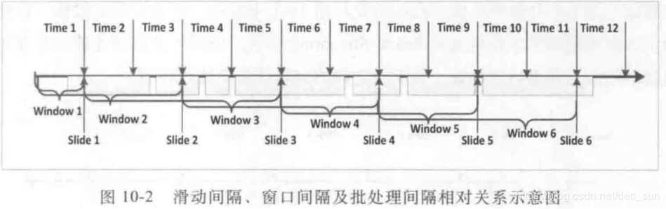
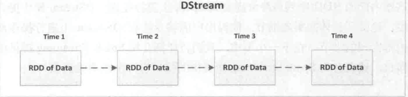
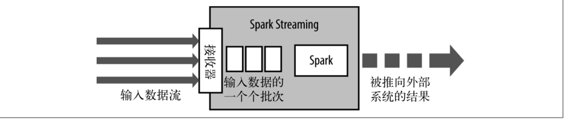
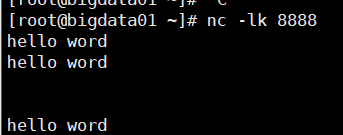

[TOC]

# Spark Streaming

Spark Streaming 是在 Spark 批处理基础上构建的流式框架。


## Duration 时间窗口

### Batch duration
批处理间隔，它是指 Spark streaming 以多少时间间隔为单位来提交任务逻辑。

Spark Streaming 在处理数据时是以 “一批” 为单位， Spark Streaming 系统需要设置时间间隔使得数据汇总到一定的量后再一并进行处理，这个时间就是 batch duration。此参数决定提交作业的频率和数据处理的时延。


### Slide duration

控制着计算的频率。用来控制对新的 DStream 进行计算的间隔。


### window duration

当前一个窗口处理数据的时间跨度。控制每次计算最近的多少个批次的数据。

在实际项目中，window duration 和 slide duration 的默认值时相同的，在自行设置中，必须保证其为 batch duration 的整数倍。


关于 Slide duration 和 window duration 的保证：

1.  因为每个 batch 内的数据可能被后面几个窗口间隔所处理，所以数据会保存在 Spark Streaming 系统中，不会立即被处理；
2. 窗口的重叠会带来重复计算，Spark Streaming 框架会进行优化，保证计算过的数据不会被重复计算；

注：在初始的几个窗口，可能数据是没有被填充满的，随着时间的推进，窗口会最终被填充满。


## DStream 

Spark Streaming 抽象了离散数据流 DStream（Discretized Stream），它包含一组连续的 RDD，这组连续的 RDD 代表了连续的流式数据。

DStream 是一组时间序列上的连续的 RDD 来表示的，每个 RDD 都包含特定时间间隔的数据流。用户对 DStream 上的各种操作最终都会映射到内部的 RDD 中。

在 Spark Streaming 中，作业产生后并不会立即被提交，而是需要等到 StreamingContext 启动后才会被依次提交 sc.start()，作业的提交间隔是由批处理间隔 slide duration 决定的。

Spark Streaming 作业最终会被翻译成 SparkCore 作业并提交和执行。DStream 在内部维护了相应的 RDD，对于 Dstreaming 的操作，无论是转换操作还是输出操作，最终都会被映射到 RDD 上。

案例：

代码 ——> 打包 ——> submit ——> 模拟

```
public class StreamingWindowApp {
    public static void main(String[] args) throws InterruptedException {
        SparkConf conf = new SparkConf()
                .setMaster("local[2]")
                .setAppName("StreamingWindowApp");
        JavaStreamingContext jssc = new JavaStreamingContext(conf, Durations.seconds(5));
        JavaReceiverInputDStream<String> lines = jssc.socketTextStream("localhost", 8888);

        JavaDStream<String> dStream = lines.flatMap(new FlatMapFunction<String, String>() {
            private static final long serialVersionUID = 1L;

            @Override
            public Iterator<String> call(String s) throws Exception {
                System.out.println(s+" ");
                return Arrays.asList(s.split(" ")).iterator();
            }
        });

        JavaPairDStream<String, Integer> wordCounts = dStream.mapToPair(new PairFunction<String, String, Integer>() {
            private static final long serialVersionUID = 1L;

            @Override
            public Tuple2<String, Integer> call(String s) throws Exception {
                return new Tuple2<>(s, 1);
            }
        }).reduceByKey(new Function2<Integer, Integer, Integer>() {
            private static final long serialVersionUID = 1L;

            @Override
            public Integer call(Integer v1, Integer v2) throws Exception {
                return v1 + v2;
            }
        });


        Thread.sleep(5000);
        wordCounts.print();

        jssc.start();
        jssc.awaitTermination();
        jssc.close();
    }
}

#提交
./spark-submit --class com.demo.streaming.StreamingWindowApp /root/monitoranalysis-1.0-SNAPSHOT-jar-with-dependencies.jar

#模拟实时数据
nc -lk 8888  ——> 输入
```



# StreamingContext

一个StreamingContext定义之后，必须做以下几件事情：

1. 通过创建输入DStream来创建输入数据源。
2. 通过对DStream定义transformation和output算子操作，来定义实时计算逻辑。
3. 调用StreamingContext的start()方法，来开始实时处理数据。
4. 调用StreamingContext的awaitTermination()方法，来等待应用程序的终止。可以使用CTRL+C手动停止，或者就是让它持续不断的运行进行计算。
5. 也可以通过调用StreamingContext的stop()方法，来停止应用程序。


## 要点：

1. 只要一个StreamingContext启动之后，就不能再往其中添加任何计算逻辑了。比如执行start()方法之后，还给某个DStream执行一个算子。
2. 一个StreamingContext停止之后，是肯定不能够重启的。调用stop()之后，不能再调用start()
3. 一个JVM同时只能有一个StreamingContext启动。在你的应用程序中，不能创建两个StreamingContext。
4. 调用stop()方法时，会同时停止内部的SparkContext，如果不希望如此，还希望后面继续使用SparkContext创建其他类型的Context，比如SQLContext，那么就用stop(false)。
5. 一个SparkContext可以创建多个StreamingContext，只要上一个先用stop(false)停止，再创建下一个即可。


要注意的是，如果你想要在实时计算应用中并行接收多条数据流，可以创建多个输入DStream。这样就会创建多个Receiver，从而并行地接收多个数据流。但是要注意的是，一个Spark Streaming Application的Executor，是一个长时间运行的任务，因此，它会独占分配给Spark Streaming Application的cpu core。从而只要Spark Streaming运行起来以后，这个节点上的cpu core，就没法给其他应用使用了。


使用本地模式，运行程序时，绝对不能用local或者local[1]，因为那样的话，只会给执行输入DStream的executor分配一个线程。而Spark Streaming底层的原理是，至少要有两条线程，一条线程用来分配给Receiver接收数据，一条线程用来处理接收到的数据。因此必须使用local[n]，n>=2的模式。


如果不设置Master，也就是直接将Spark Streaming应用提交到集群上运行，那么首先，必须要求集群节点上，有>1个cpu core，其次，给Spark Streaming的每个executor分配的core，必须>1，这样，才能保证分配到executor上运行的输入DStream，两条线程并行，一条运行Receiver，接收数据；一条处理数据。否则的话，只会接收数据，不会处理数据。


因此，基于此，特此声明，我们本系列课程所有的练习，都是基于local[2]的本地模式，因为我们的虚拟机上都只有一个1个cpu core。但是大家在实际企业工作中，机器肯定是不只一个cpu core的，现在都至少4核了。到时记得给每个executor的cpu core，设置为超过1个即可。


# SparkStreaming 与 Kafka 整合

SparkStreaming 从 Kafka 上获取数据有两种方式：Receiver，Direct。


## Receiver

Receiver 是使用 Kafka 的高层次 Consumer API 来实现的。默认开启一个 receiver 从 Kakfa 上获取数据，并将数据存储在 Spark Executor  的内存中，然后 SparkStreaming 启动的 job 会去处理那些数据。

然而，在默认的配置下，这种方式可能会以为底层的失败而丢失数据，如果要启动高可用机制，让数据零丢失，就必须启用 SparkStreaming 的预写日志机制（Writer Ahead Log），该机制会同步第将接收到的 Kafka 数据写入分布式文件系统上的预写日志中。所以， 即使底层节点出现了失败，也可以使用预写日志中的数据进行恢复。


```java
SparkConf conf = new SparkConf()
    .setMaster("local[2]")
    .setAppName("KafkaWordCount");

JavaStreamingContext jssc = new JavaStreamingContext(conf, Durations.seconds(5));

// 使用KafkaUtils.createStream()方法，创建针对Kafka的输入数据流
Map<String, Integer> topicThreadMap = new <String, Integer>HashMap();
//topicThreadMap 封装 topic 和分区数量
topicThreadMap.put("WordCount", 5);

JavaPairReceiverInputDStream<String, String> lines = KafkaUtils.createStream(
    jssc,
    "192.168.1.107:2181,192.168.1.108:2181,192.168.1.109:2181",
    "DefaultConsumerGroup",
    topicThreadMap);
```


### 要点

1. Kafka 中的 topic 的 partition，与 Spark 中的 RDD 的 partition 是没有关系的。     ，在KafkaUtils.createStream()中，提高partition的数量，只会增加一个Receiver中，读取partition的线程的数量。不会增加 Spark 处理数据的并行度。  
2. 可以创建多个Kafka输入DStream，使用不同的consumer group和topic，来通过多个receiver并行接收数据。
3. 如果基于容错的文件系统，比如HDFS，启用了预写日志机制，接收到的数据都会被复制一份到预写日志中。因此，在KafkaUtils.createStream()中，设置的持久化级别是StorageLevel.MEMORY_AND_DISK_SER  


## Direct

这种新的不基于 Receiver 的直接方式，是在 Spark 1.3 中引入的，从而能够确保更加健壮的机制。替代掉使用 Receiver 来接收数据后，这种方式会周期性地查询 Kafka，来获得每个 topic+partition 的最新的 offset，从而定义每个 batch 的 offset 的范围。当处理数据的 job 启动时，就会使用 Kafka 的简单 consumer api 来获取 Kafka 指定 offset 范围的数据。


### 优点：

1. 并行读取：如果要读取多个 partition，不需要创建多个输入 DStream 然后对它们进行 union 操作。Spark 会创建跟 Kafka partition 一样多的 RDD partition，并且会并行从 Kafka 中读取数据。所以在 Kafka partition 和 RDD partition 之间，有一个一对一的映射关系。
2. 高性能：如果要保证零数据丢失，在基于 receiver 的方式中，需要开启 WAL 机制。这种方式其实效率低下，因为数据实际上被复制了两份，Kafka 自己本身就有高可靠的机制，会对数据复制一份，而这里又会复制一份到 WAL 中。而基于 direct 的方式，不依赖 Receiver，不需要开启 WAL 机制，只要 Kafka 中作了数据的复制，那么就可以通过 Kafka 的副本进行恢复。
3. 一次且仅一次的事务机制：基于receiver的方式，是使用Kafka的高阶API来在ZooKeeper中保存消费过的offset的。这是消费Kafka数据的传统方式。这种方式配合着WAL机制可以保证数据零丢失的高可靠性，但是却无法保证数据被处理一次且仅一次，可能会处理两次。因为Spark和ZooKeeper之间可能是不同步的。

```java
SparkConf conf = new SparkConf()
    .setMaster("local[2]")
    .setAppName("KafkaDirectWordCount");
JavaStreamingContext jssc = new JavaStreamingContext(conf, Durations.seconds(5));

// 首先，要创建一份kafka参数map
Map<String, String> kafkaParams = new HashMap<String, String>();
kafkaParams.put("metadata.broker.list",
                "192.168.1.107:9092,192.168.1.108:9092,192.168.1.109:9092");

// 然后，要创建一个set，里面放入，你要读取的topic
// 这个，就是我们所说的，它自己给你做的很好，可以并行读取多个topic
Set<String> topics = new HashSet<String>();
topics.add("WordCount");

// 创建输入DStream
JavaPairInputDStream<String, String> lines = KafkaUtils.createDirectStream(
    jssc,
    String.class,
    String.class,
    StringDecoder.class,
    StringDecoder.class,
    kafkaParams,
    topics);
```

