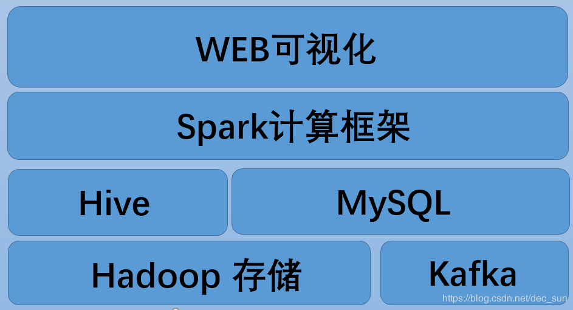
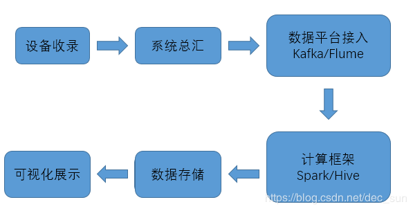
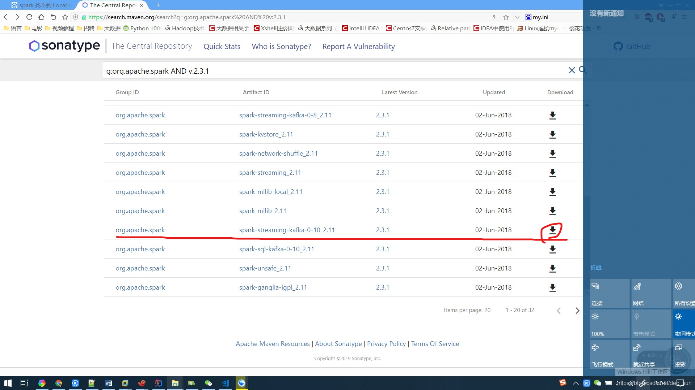

[TOC]

# 背景

目前，大城市都在建立 “天眼” 工程来对城市进行高效的管理和犯罪的查询。每天城市 “天眼”  系统可以监测到不计其数的数据，如此海量的数据，如何高效地管理、处理成为了整个系统的难点之一。


# 需求

## 首次收录分析

首次收录：在指定的路口，指定的时间范围内，搜索出整个区域中的所有对象，如果对象在这个时间范围内出现过，但是在之前一定时间范围内没有出现，即可以被认为是首次收录对象。

首次收录分析方法，可以用于多个领域。比如：在一个特定的时间段内，在指定的范围内，之前或之后有没有出现对象，这对某些领域有着很重要作用。


## 同行对象分析

同行对象是指在一定时间内与目标对象以一定的概率存在伴随关系的对象。可以根据目标对象出现的时间，经过的地方，找到同行对象。可以通过两种情况来判断两个对象是同行对象。

1.  如果两个对象在指定的时间内，在多个相同的地方一起出现了。 
2.  两个对象在通过某一地方时，两者的时间小于一定特定值。

同行对象的分析可以用于分析伴随对象与目标对象的关系。在某些领域有特殊的作用。


## 可疑对象分析

有时，需要分析一个对象是否与目标对象的关系。比如，有时目标对象在某一个时间段的某个地方出现了。但是与此同时，有一个相似的对象也在该时间段内的其他地方又出现了，要确认两者对象的关系，就可以通过现实逻辑来分析这个问题了。

1.  可以根据两个对象的出现的时间差和出现的地方来判断两者的关系。比如两个对象在大约 3 min 的时间内出现在两个距离 10km 的地方，那么肯定可以确定一个对象不是需要的目标。
2.  当然也可以完全获取两个对象的所有信息来进行对比。


## 行驶轨迹分析

可以获取目标对象在一定时间段的出现的所有位置（比如，监测到对象的设备的编号，或者是监测到对象的设备的经纬度），将这些位置信息在地图上展现出来就可以获取目标对象的轨迹了。并且可以预测目标对象的行驶轨迹了。


# 技术架构

每个传感设备每天可以获得大量的数据信息，无论从存储和处理等方面，传统的关系型数据库都无法满足业务需求，为了能够满足当前以及今后一定时间内业务的需要，本方案就采用流行的大数据技术。


## 技术架构

当前项目需求，可以对应如下图的技术架构。

1. HDFS + Hive 主要用于数据的转化，过滤，将数据映射成一个 Hive 表；
2. Kafka 可以作为实时计算的消息中间件，用来保证系统平台的高性能和高可用；
3. 数据经过 Spark 进行数据分析，将结果保存到 MySQL；
4. Web 可以通过 ECharts，HighCharts 进行数据的可视化展示。




## 数据流程

 


### 接入数据

实时数据的接入，通过 Flume + Kafka 与传感系统对接的方式，接入数据的流向有两个：

一、进入 Hive 数据仓库；

二、进入 SparkStreaming 用于实时计算布控。


###  存储数据

由于传感设备的收集的数据相当大，常见的关系型数据库已无法满足需求，所以采用 HDFS 存储全量数据，为了便于分析，使用 Hive 框架操作 HDFS 上的数据信息

存储空间的大小：一条记录的字节数 * 数据总条数 * 3 * 100 / 70  / 1024 / 1024 (m)。

> 3 个副本，70% 的存储；


### 数据分析

数据分析包括：离线分析和实时流处理分析。

1. 离线分析采用 spark + hive + mysql 的架构，Spark 读取 Hive 中的数据，按指定的业务逻辑进行计算，计算结果存入 mysql 数据库；

2. 实时流处理采用 kafka + spark + mysql 的架构，spark 读取 Kafka 中的数据，按指定的业务逻辑进行计算，计算结果存储 mysql 数据库。

**资源的分配**：使用 spark 分析，用于数据分析的集群内存总量要等于数据总量的 50%左右，内存越大，分析时间越短。---- 内存的总量 = 数据总量的 * 50%


### 展示分析结果

数据展示包括离线分析结果的展示和实时流处理分析结果的展示。

1. 离线分析结果存入到 mysql 数据库中所以，直接查询 mysql 数据库获取结果；

2. 实时流处理分析结果的展示，因为要实时展示布控的结果，需要实时获取布控结果。常见的实现方式：

   - 布控结果写入 Kafka， web 应用实时从 Kafka 中获取最新的消息；
   - 布控结果写入 mysql 数据库，web 应用定时查询数据库获取布控结果。

数据展示涉及到 spring，暂时不处理了。


# 平台搭建

1. hadoop，三台主机，完全分离式 ， https://blog.csdn.net/dec_sun/article/details/88084060
2. hive  一台主机，https://blog.csdn.net/dec_sun/article/details/88085014
3. Kafka 三台主机，https://blog.csdn.net/dec_sun/article/details/88870651


# 首次收录

确定传感设备获取指定时间区间内的数据，在与之前指定时间内，经过这些传感设备的对象集合，取两个集合的 join 运算。

## 离线计算

### 建表

首先创建之前时间段内的 Hive 表

```sql
-- hive 操作中，之前一段时间内的所有数据的表
CREATE EXTERNAL TABLE t_people(
ID string,
RSFZ string,
GRXB string,
PSQK string,
SSYZ string,
SSYS string,
XSYZ string,
XSYS string,
TGSJ timestamp,
SBBH string,
JWZB string)
row format delimited fields terminated by ',' lines terminated by '\n' location '/people' tblproperties ("skip.header.line.count"="1", "skip.footer.line.count"="1");

-- 将本地的 people01.csv 文件上传到 hdfs 上的 /people目录
bin/hdfs dfs -put /root/people01.csv /people

-- 在 hive 中检查数据，如果 hdfs 上已经被上传  csv 文件的话
select * from t_people limit 10;
```


同时创建一个当前时间段内获取的数据创建一个 Hive 表

```
-- 在 hive 中创建表，当前时间段内的数据表
CREATE EXTERNAL TABLE t_people_in (
ID string,
RSFZ string,
GRXB string,
PSQK string,
SSYZ string,
SSYS string,
XSYZ string,
XSYS string,
TGSJ timestamp,
SBBH string,
JWZB string) 
row format delimited fields terminated by ',' lines terminated by '\n' location '/people_in' tblproperties ("skip.header.line.count"="1");

-- 将本地的 people01.csv 文件上传到 hdfs 上的 /people_in 目录
bin/hdfs dfs -put /root/people02.csv /people_in

-- 在 hive 中检查数据，如果 hdfs 上已经被上传  csv 文件的话
select * from t_people_in limit 10;
```


同时在 MySQL 上创建一个数据表来保存结果数据。

```
-- 进入 test 数据库
use test

-- 创建表，在mysql 数据中处理
CREATE TABLE t_people_result (
RSFZ text,
TGSJ text,
JWZB text,
PSQK text,
SSYS text,
CJSJ text
)charset utf8 collate utf8_general_ci;
```


### 代码展示

离线方式。离线方式主要创建两个 RDD， 分别是一个时间内的数据集和一个指定时间段内的数据集。然后通过 RSFZ 关键字来进行 PairRDD 的处理。通过将指定时间段内的数据集（新数据集）与本地数据库中的数据进行左连接然后再过滤处理。或者是将本地数据库中的数据集与指定时间内的数据集进行右外连接，然后再进行过滤处理。这样就可以得到相应的数据。

```java
public static void main(String[] args) {
    SparkSession spark = SparkSession.builder()
        .enableHiveSupport()
        .appName("FirstPhoto")
        .master("local")
        .getOrCreate();
    JavaSparkContext jsc = new JavaSparkContext(spark.sparkContext());
    jsc.setLogLevel("ERROR");

    // 读取 HIVE 中 t_people 和 t_people_in 的数据，
    Dataset<Row> allData = spark.sql("select * from t_people");
    Dataset<Row> inData = spark.sql("select * from t_people_in");
    computeDS(allData, inData);

    secondRDD(spark);

    spark.close();
}

/**
 * 将数据转化为 DataFrame 来进行数据的处理。
 */
private static void computeDS(Dataset<Row> allData, Dataset<Row> inData) {
    Dataset<Row> joinResult = inData.join(allData,inData.col("RSFZ").equalTo(allData.col("RSFZ")),"left");

    Dataset<Row> filterResult = joinResult.filter(allData.col("RSFZ").isNull());
    Dataset<Row> selectResult = filterResult.select(inData.col("RSFZ")                                           ,inData.col("TGSJ"),inData.col("JWZB"));

}

// 使用 Spark SQL 来处理数据
private static void secondRDD(SparkSession spark){

    // 主要通过 SQL 语句来处理数据。
    Dataset<Row> resultDF = spark.sql("select t1.RSFZ as RSFZ,t1.TGSJ,t1.JWZB,t1.PSQK,t1.SSYS from t_people_in t1 LEFT OUTER JOIN " +
                                      "t_people t2 on t1.RSFZ=t2.RSFZ where t2.RSFZ is null");

    //创建时间戳，CJSJ：创建时间
    Dataset<Row> resultDF2 = resultDF.withColumn("CJSJ",functions.lit(new Timestamp(new Date().getTime())));

    //保存到数据库，
    resultDF2.write()
        .format("Jdbc")
        .option("url", "jdbc:mysql://bigdata01:3306/test?characterEncoding=UTF-8")
        .option("dbtable", "t_people_result")
        .option("user","root")
        .option("password","123456")
        .mode(SaveMode.Append)
        .save();
}
```


### 执行方式

```
./spark-submit 
--master spark://bigdata01:7077
--class com.monitor.firstrecord.FirstPhoto 
--deploy-mode client 
/root/monitoranalysis.jar
```


## 实时计算

### 启动 Kafka

实时数据处理，部分数据来源于 Kafka，部分是本地数据。所以获取它们的之间首次收录的数据，就是实时数据与本地数据进行左连接然后再过滤，就可以获取了。

实时计算需要启动 Kafka，这样 Spark 就可以从 Kafka 上获取数据了

```
-- 启动 zookeeper
bin/zkServer.sh start

-- 启动 kafka
nohup bin/kafka-server-start.sh  config/server.properties &
```


### 数据表的创建

```
-- hive 操作中。
CREATE EXTERNAL TABLE t_people (ID string,
RSFZ string,
GRXB string,
PSQK string,
SSYZ string,
SSYS string,
XSYZ string,
XSYS string,
TGSJ timestamp,
SBBH string,
JWZB string)
row format delimited fields terminated by ',' lines terminated by '\n' location '/people' tblproperties ("skip.header.line.count"="1", "skip.footer.line.count"="1");

-- 将本地的 people01.csv 文件上传到 hdfs 上的 /people目录
bin/hdfs dfs -put /root/people01.csv /people

-- 在 hive 中检查数据，如果 hdfs 上已经被上传  csv 文件的话
select * from t_people limit 10;


-- MySQL 进入 test 数据库
use test

-- 创建表，在mysql 数据中处理
CREATE TABLE t_people_result2 (
CJCJ text,
RSFZ text,
TGSJ text,
SBBH text,
CREATETIME text
)charset utf8 collate utf8_general_ci;
```


### 代码展示

实时方法。实时方式主要从 Kafka 获取实时数据流，然后再使用离线方式来进行数据的处理。

```java
public static void main(String[] args) throws InterruptedException {
    SparkSession spark = SparkSession.builder()
        .enableHiveSupport()
        .master("local[2]")
        .appName("FirstPhotoStreaming")
        .getOrCreate();

    JavaSparkContext jsc = new JavaSparkContext(spark.sparkContext());
    jsc.setLogLevel("ERROR");

    Dataset<Row>  allDF = spark.sql("select RSFZ from t_people");
    JavaRDD<Row> allRDD = allDF.javaRDD();
    JavaPairRDD<String,String> allPairRDD = allRDD.mapToPair(new PairFunction<Row, String, String>() {
        @Override
        public Tuple2<String, String> call(Row row) throws Exception {
            String idCard = row.getAs("RSFZ");
            return new Tuple2<String,String>(idCard,idCard);
        }
    });

    // 从 Kafka 获取数据
    String brokers = "bigdata01:9092";
    String topics = "peopledata";

    JavaStreamingContext ssc = new JavaStreamingContext(jsc, Durations.seconds(5));
    Collection<String> topicList = new HashSet<>(Arrays.asList(topics.split(",")));
    Map<String,Object> kafkaParams = new HashMap();

    kafkaParams.put("bootstrap.servers",brokers);
    kafkaParams.put("group.id","vcs_group");
    kafkaParams.put("auto.offset.reset","latest");
    kafkaParams.put("key.deserializer",                                                                 "org.apache.kafka.common.serialization.StringDeserializer");
    kafkaParams.put("value.deserializer",
                    "org.apache.kafka.common.serialization.StringDeserializer");

    Map<TopicPartition,Long> offsets = new HashMap<TopicPartition,Long>();
    
    JavaInputDStream<ConsumerRecord<String,String>> lines = 	                                                         KafkaUtils.createDirectStream(
                                                      ssc,
                                      LocationStrategies.PreferConsistent(),
                       ConsumerStrategies.Subscribe(topicList,kafkaParams,offsets)
    );
    
    // 从 Kafka 获取数据
    JavaPairDStream<String,String> pairDStream = lines.flatMap(new FlatMapFunction<ConsumerRecord<String,String>, String>() {
        @Override
        public Iterator<String> call(ConsumerRecord<String, String> message) throws Exception {
            List<String> result = new ArrayList<String>();
            String messageValue = message.value();
            Gson gson = new Gson();
            Type type = new TypeToken<List<Map<String,String>>>(){}.getType();

            List<Map<String,String>> listMap = gson.fromJson(messageValue,type);
            for(Map<String,String> map:listMap){
                StringBuilder sbTemp = new StringBuilder();
                sbTemp.append(map.get("RSFZ")).append("_");
                sbTemp.append(map.get("GRXB")).append(",");
                sbTemp.append(map.get("PSQK")).append(",");
                sbTemp.append(map.get("TGSJ")).append(",");
                sbTemp.append(map.get("SBBH")).append(",");
                sbTemp.append(map.get("JWZB")).append(",");
                result.add(sbTemp.toString());
            }
            return result.iterator();
        }
    }).mapToPair(new PairFunction<String, String, String>() {
        @Override
        public Tuple2<String, String> call(String s) throws Exception {

            return new Tuple2<String,String>(s.split("_")[0],s.split("_")[1]);
        }
    });


    JavaDStream<String> resultDStream = pairDStream.transform(new Function<JavaPairRDD<String, String>, JavaRDD<String>>() {
        @Override
        public JavaRDD<String> call(JavaPairRDD<String, String> pairRDD) throws Exception {
            JavaRDD<String> resultRDD = pairRDD.leftOuterJoin(allPairRDD).filter(new Function<Tuple2<String, Tuple2<String, Optional<String>>>, Boolean>() {
                @Override
                public Boolean call(Tuple2<String, Tuple2<String, Optional<String>>> v1) throws Exception {
                    Optional<String> opt = v1._2._2;
                    return !opt.isPresent();
                }
            }).map(new Function<Tuple2<String, Tuple2<String, Optional<String>>>, String>() {
                @Override
                public String call(Tuple2<String, Tuple2<String, Optional<String>>> t2) throws Exception {

                    return t2._1+","+t2._2._1;
                }
            });
            return resultRDD;
        }
    });


    //  rsfz,grzb,psqk,tgsj,tgsj,sbbh,latlon
    resultDStream.foreachRDD(new VoidFunction<JavaRDD<String>>() {
        @Override
        public void call(JavaRDD<String> rdd) throws Exception {
            rdd.foreachPartition(new VoidFunction<Iterator<String>>() {
                @Override
                public void call(Iterator<String> iter) throws Exception {
                    Connection conn = com.monitor.util.JdbcUtils.getConnection();
                    java.sql.PreparedStatement pstmt = null;

                    while(iter.hasNext()){
                        String data = iter.next();
                        //保存数据到mysql
                        String[] datas = data.split(",");
                        String rsfz = datas[0];
                        String grxb = datas[1];
                        String psqk = datas[2];
                        String tgsj = datas[3];
                        String sbbh = datas[4];
                        String latLon = datas[5];

                        SimpleDateFormat sdf = new SimpleDateFormat("yyyy-MM-dd hh:mm:ss");
                        Date tgsjDate = sdf.parse(tgsj);
                        String sql = "insert into t_people_result2 (CJCJ,RSFZ,TGSJ,SBBH,CREATETIME) values (?,?,?,?,?)";

                        pstmt = conn.prepareStatement(sql);
                        //设计时间戳，创建时间
                        long cjsj = System.currentTimeMillis();

                        pstmt.setString(1,cjsj+"_streaming");
                        pstmt.setString(2,rsfz);
                        pstmt.setTimestamp(3,new Timestamp(tgsjDate.getTime()));
                        pstmt.setString(4,sbbh);
                        pstmt.setTimestamp(5,new Timestamp(cjsj));
                        pstmt.executeUpdate();
                    }
                    com.monitor.util.JdbcUtils.free(pstmt,conn);
                }
            });
        }
    });


    ssc.start();
    ssc.awaitTermination();
    ssc.close();
```


### 执行方式

```
-- spark 执行
./spark-submit 
--master spark://bigdata01:7077
--class com.monitor.firstrecord.streaming.FirstPhotoStreaming 
--deploy-mode client 
/root/monitoranalysis.jar

-- kafka 实时流数据模拟
java -cp /root/monitoranalysis02.jar com.monitor.produce.PeopleProducer
```


项目代码展示：
https://github.com/yy1028500451/MonitorAnalysis/tree/master/src/main/java/com/monitor


## 总结

 在进行实时计算时，可能由于包版本的问题，

```
2019-05-01 14:51:33 INFO  ContextHandler:781 - Started o.s.j.s.ServletContextHandler@7df60067{/metrics/json,null,AVAILABLE,@Spark}
Exception in thread "main" java.lang.NoClassDefFoundError: org/apache/spark/streaming/kafka010/LocationStrategies
	at com.monitor.firstrecord.streaming.FirstPhotoStreaming.main(FirstPhotoStreaming.java:89)
	at sun.reflect.NativeMethodAccessorImpl.invoke0(Native Method)
	at sun.reflect.NativeMethodAccessorImpl.invoke(NativeMethodAccessorImpl.java:62)
	at sun.reflect.DelegatingMethodAccessorImpl.invoke(DelegatingMethodAccessorImpl.java:43)
	at java.lang.reflect.Method.invoke(Method.java:498)
	at org.apache.spark.deploy.JavaMainApplication.start(SparkApplication.scala:52)
	at org.apache.spark.deploy.SparkSubmit$.org$apache$spark$deploy$SparkSubmit$$runMain(SparkSubmit.scala:894)
	at org.apache.spark.deploy.SparkSubmit$.doRunMain$1(SparkSubmit.scala:198)
	at org.apache.spark.deploy.SparkSubmit$.submit(SparkSubmit.scala:228)
	at org.apache.spark.deploy.SparkSubmit$.main(SparkSubmit.scala:137)
	at org.apache.spark.deploy.SparkSubmit.main(SparkSubmit.scala)
Caused by: java.lang.ClassNotFoundException: org.apache.spark.streaming.kafka010.LocationStrategies
	at java.net.URLClassLoader.findClass(URLClassLoader.java:381)
	at java.lang.ClassLoader.loadClass(ClassLoader.java:424)
	at java.lang.ClassLoader.loadClass(ClassLoader.java:357)
	... 11 more

```
需要更新 spark-streaming-kafka。根据 spark 版本和 Kafka 版本来正确选择版本。并将该 jar 文件导入到 spark 的 jar 目录下。




# 同行对象

判断是否是同行对象，那么可以通过判断两个对象是否通过了多个相同的地方，这里使用经纬度来处理。当然也可以每个监测设备进行标记，当对象通过此监测设备时，能被此设备捕捉到。

思路：

1.  根据通过对象的 RSFZ 聚合被监测的对象通过指定时间内的所有地点并进行排序，处理后的数据为：
rsfz，[(tgsj3,  sbbh3), (tgsj2, sbbh2), (tgsj4, sbbh4), (tgsj5, sbbh5)]
2. 根据同行对象要通过的地点数量分段对象通过的地点，如上面数据被分解成：
sbbh3 -> sbbh2 -> sbbh4，（rsfz，[ sbbh3 tgsj3，sbbh2 tgsj2，sbbh4 tgsj4 ]）
sbbh2 -> sbbh4 -> sbbh5，（rsfz，[ sbbh2 tgsj2，sbbh4 tgsj4，sbbh5 tgsj5 ]）
3. 把通过相同地点序列的被监测对象聚合，
sbbh3 -> sbbh2 -> sbbh4，[(rsfz1，[sbbh3 tgsj3, sbbh2 tgsj2, sbbh4 tgsj4],（rsfz2, [sbbh3 tgsj3, sbbh2 tgsj2, sbbh4 tgsj4] ),(rsfz3, (sbbh3 tgsj3, sbbh2 tgsj2, sbbh4 tgsj4))]
4. 判断通过相同序列地方的被监测对象通过相同地方的时间差来确认是否满足同行的要求。


## 代码展示

```java
public static void main(String[] args) {
    SparkSession spark = SparkSession.builder()
        .enableHiveSupport()
        .appName("TogetherCompute")
        .master("local")
        .getOrCreate();

    JavaSparkContext jsc = new JavaSparkContext(spark.sparkContext());
    jsc.setLogLevel("ERROR");


    // 读取 HIVE 表 t_people_together 中的数据，并转化成 JavaPairRDD。
    Dataset<Row> allData = spark.sql("select * from t_people_together");
    JavaRDD<Row> allDataRDD = allData.javaRDD();

    JavaPairRDD<String, Tuple2<String, String>> allPairRDD = allDataRDD.mapToPair(new PairFunction<Row, String, Tuple2<String, String>>() {
        @Override
        public Tuple2<String, Tuple2<String, String>> call(Row row) throws Exception {
            String rsfz = row.getAs("rsfz");
            String tgsj = row.getAs("tgsj");
            String sbbh = row.getAs("sbbh");
            return new Tuple2<String, Tuple2<String, String>>(rsfz, new Tuple2<String, String>(tgsj, sbbh));
        }
    });

    // 数据根据 key 分组。
    JavaPairRDD<String, Iterable<Tuple2<String, String>>> groupDataRDD = allPairRDD.groupByKey();


    JavaRDD<Tuple2<String, Tuple2<String, String>>> flatDataRDD = groupDataRDD.flatMap(new FlatMapFunction<Tuple2<String, Iterable<Tuple2<String, String>>>, Tuple2<String, Tuple2<String, String>>>() {
        @Override
        public Iterator<Tuple2<String, Tuple2<String, String>>> call(Tuple2<String, Iterable<Tuple2<String, String>>> s2) throws Exception {
            List<Tuple2<String, Tuple2<String, String>>> result = new ArrayList<Tuple2<String, Tuple2<String, String>>>();
            List<Tuple2<String, String>> list = IteratorUtils.toList(s2._2.iterator());
            
            /**
             * 数据首先经过了 groupByKey，这是按照 key 来进行分组。
             * 然后再通过 flatMap 进行切割重组，这里是为了得到 <jwzb, gsfz,tgsj>
             * 这里按照每 3 个 latLon 作为一组,
             * 输出为 [jwzb,[gsfz,tgsj]]
             */

            for (int i = 0; i < list.size() - 2; i++) {
                StringBuilder sbTGSJ = new StringBuilder();
                StringBuilder sbSBBH = new StringBuilder();
                for (int j = 0; j < 3; j++) {
                    if (j + i < list.size()) {
                        sbTGSJ.append(list.get(j + i)._1).append(",");
                        sbSBBH.append(list.get(j + i)._2).append(",");
                    } else {
                        break;
                    }
                }

                result.add(new Tuple2<String, Tuple2<String, String>>(sbSBBH.toString(), new Tuple2<String, String>(s2._1, sbTGSJ.toString())));
            }

            return result.iterator();
        }
    });

    flatDataRDD.mapToPair(new PairFunction<Tuple2<String, Tuple2<String, String>>, String, Tuple2<String, String>>() {
        @Override
        public Tuple2<String, Tuple2<String, String>> call(Tuple2<String, Tuple2<String, String>> t2) throws Exception {
            return new Tuple2<String, Tuple2<String, String>>(t2._1, t2._2);
        }
    }).groupByKey().map(new Function<Tuple2<String, Iterable<Tuple2<String, String>>>, String>() {
        @Override
        public String call(Tuple2<String, Iterable<Tuple2<String, String>>> v1) throws Exception {
            Set<String> rsfzSet = new HashSet<String>();
            StringBuilder sbrsfz = new StringBuilder();

            String sbbh = v1._1;

            List<Tuple2<String, String>> list = IteratorUtils.toList(v1._2.iterator());
            for (int i = 0; i < list.size(); i++) {
                for (int j = i + 1; j < list.size(); j++) {
                    String tgsj1 = list.get(i)._2;
                    String tgsj2 = list.get(j)._2;

                    String rsfz1 = list.get(i)._1;
                    String rsfz2 = list.get(j)._1;

                    String[] times01 = tgsj1.split(",");
                    String[] times02 = tgsj2.split(",");

                    for (int k = 0; k < times01.length; k++) {
                        double subMinutes = TimeUtils.getSubMinutes(times01[i], times02[i]);
                        if (subMinutes <= 3) {
                            rsfzSet.add(rsfz1);
                            rsfzSet.add(rsfz2);
                        }
                    }
                }
            }
            for (String rsfz : rsfzSet) {
                sbrsfz.append(rsfz).append(",");
            }
            String resultStr = sbbh + "&" + (sbrsfz.toString());
            return resultStr;
        }
    }).filter(new Function<String, Boolean>() {
        @Override
        public Boolean call(String v1) throws Exception {
            return v1.split("&").length > 1;
        }
    }).foreach(new VoidFunction<String>() {
        @Override
        public void call(String s) throws Exception {

            String rsfz = s.split("&")[1];
            String tgsj = s.split("&")[2];
            String sbbh = s.split("&")[3];

            Connection conn = JdbcUtils.getConnection();

            PreparedStatement pstmt = null;
            String sql = "insert into t_people_result2 (CJSJ,RSFZ,TGSJ,SBBH) values (?,?,?,?)";

            pstmt = (PreparedStatement) conn.prepareStatement(sql);

            //添加时间戳。
            long cjsj = System.currentTimeMillis();
            pstmt.setString(1, cjsj + "");
            pstmt.setString(2, rsfz);
            pstmt.setString(3, tgsj);
            pstmt.setString(4, sbbh);
            pstmt.executeUpdate();
            JdbcUtils.free(pstmt, conn);
        }
    });
}

```


## 实操实现

打开Hive，并创建一个表

```
-- hive 
CREATE EXTERNAL TABLE t_people_together (ID string,
RSFZ string,
GRXB string,
PSQK string,
SSYZ string,
SSYS string,
XSYZ string,
XSYS string,
TGSJ string,
SBBH string,
JWZB string)
row format delimited fields terminated by ',' lines terminated by '\n' location '/people_together' tblproperties ("skip.header.line.count"="1", "skip.footer.line.count"="1");

-- 将本地的 people01.csv 文件上传到 hdfs 上的 /people_together 目录
bin/hdfs dfs -put /root/people01.csv /people_together

--查看
select * from t_people_together 
```


在 mysql 创建表

```
CREATE TABLE t_people_result2 (
CJCJ text,
RSFZ text,
TGSJ text,
SBBH text
)charset utf8 collate utf8_general_ci;
```

4. spark 执行
```
./spark-submit 
--master spark://bigdata01:7077 
--class com.monitor.together.TogetherCompute 
--deploy-mode client 
/root/monitoranalysis-1.0-SNAPSHOT.jar
```


## 实例代码

 https://github.com/yy1028500451/MonitorAnalysis/tree/master/src/main/java/com/monitor/together


# 可疑对象分析

可疑对象的处理，可以从他行迹的几个坐标距离，与时间差进行对比。如果符合逻辑，可以认为是当前对象是无可疑的。如果是可疑的，即将结果先保存起来，进入可疑对象库。

1.  通过获取时间段的数据；
2.  根据被监测对象的 RSFZ 聚合数据；(RSFZ: SBBH_TGSJ_JWZB)
3.  根据判定规则：处理每个监测对象的 RSFZ 的聚合数据，将符合负责的数据唯一标识放到累加器中；
4.  获取家属器的唯一标识，从表中查询相关记录，存入 mysql 中。

## 代码展示

```
public class VerifyCompute {
        String sql = "select * from t_alldata t where t.tgsj";
        Dataset<Row> allFromTime = spark.sql(sql);

        JavaRDD<Row> resultRDD = allFromTime.javaRDD();
        /**
         * 从数据中获取必要的列名来转换成 PairRDD
         */
        JavaPairRDD<String, String> pairRDD = resultRDD.mapToPair(new PairFunction<Row, String, String>() {
            @Override
            public Tuple2<String, String> call(Row row) throws Exception {
                String rsfz = row.getAs("RSFZ");
                String id = row.getAs("ID");
                String tgsj = row.getAs("TGSJ");
                String sbbh =row.getAs("SBBH");
                String jwzb = row.getAs("JWZB");

                String tuple01 = rsfz;
                String tuple02 = id + "_" + jwzb + "_" + tgsj+"_"+sbbh;
                return new Tuple2<String, String>(tuple01, tuple02);
            }
        });

        /**
         * 对相同身份证的数据对 id + "_" + jwzb + "_" + tgsj 进行叠加，这样就可以
         * 获取 通过时间 和 经纬坐标。
         */
        JavaPairRDD<String, String> reduceRDD = pairRDD.reduceByKey(new Function2<String, String, String>() {
            private static final long serialVersionUID = 1L;
            @Override
            public String call(String v1, String v2) throws Exception {
                return v1 + "&" + v2;
            }
        });

        //创建累加器，用于添加计算后的数据。
        CollectionAccumulator<String> acc = jsc.sc().collectionAccumulator();

        /**
         * 由于不能在 map foreach 中调用RDD，所以可以用累加器将 id 封装起来。
         */
        reduceRDD.foreach(new VoidFunction<Tuple2<String, String>>() {
            private static final long serialVersionUID = 1L;
            @Override
            public void call(Tuple2<String, String> s2) throws Exception {
                String IDCard = s2._1;
                String[] values = s2._2.split("&");

                for (int i = 0; i < values.length; i++) {
                    for (int k = i + 1; k < values.length; k++) {
                        String value1 = values[i];
                        String value2 = values[k];

                        String[] item1 = value1.split("_");
                        String[] item2 = value2.split("_");

                        String id1 = item1[0];
                        String lon1 = item1[1];
                        String lat1 =item1[2];
                        String tgsj1 = item1[3];

                        String id2 = item2[0];
                        String lon2 = item2[1];
                        String lat2 =item2[2];
                        String tgsj2 = item2[3];

                        double subHour = TimeUtils.getSubHour(tgsj1, tgsj2);
                        double distance = MapUtils.getLongDistance(Double.valueOf(lon1), Double.valueOf(lat1),Double.valueOf(lon2),Double.valueOf(lat2));

                        Integer speed = SpeedUtils.getSpeed(distance, subHour);

                       //核心操作
                        if (speed > 5) {
                            acc.add(id1 + "_" + id2);

                            /**
                             * 如果这里就进行 RDD，就会发生 空指针异常。所以，要在map、foreach算子中调用 dataFrame 或 RDD 方法
                             */
                        }
                    }
                }
            }
        });

        List<String> accValue = acc.value();

        for(String id: accValue) {
            Dataset<Row> resultDF3 = spark.sql("select RSFZ,GRXB,PSQK, TGSJ," +
                    "SBBH,JWZB from t_alldata where id in (" + id.split("_")[0] + "," + id.split("_")[1] + ")");
            resultDF3.show(20);

            Dataset<Row> resultDF4 = resultDF3.withColumn("CreateTime", functions.lit(new Date().getTime()));
            resultDF4.write()
                    .format("jdbc")
                    .option("url", "jdbc:mysql://bigdata03:3306/test?characterEncoding=UTF-8")
                    .option("dbtable", "t_verify_result")
                    .option("user", "root")
                    .option("password", "123456")
                    .mode(SaveMode.Append)
                    .save();
        }
    }
}
```


## 实操实现

1. 在 mysql 数据库中创建表

```
CREATE TABLE t_verify_result(
RSFZ text,
GRXB text,
PSQK text,
TGSJ text,
SBBH text,
JWZB text,
CJSJ text
)charset utf8 collate utf8_general_ci;
```

2. 复用 hive 中 t_people_together 表的数据。
3. 使用 submit 执行

```
./spark-submit 
--master spark://bigdata01:7077 
--class com.monitor.compare.VerifyCompute 
--deploy-mode client 
/root/monitoranalysis-1.0-SNAPSHOT.jar
```

这样就可以把数据以 RSFZ  | GRXB | PSQK | TGSJ   SBBH | JWZB   | CJSJ 方式在数据库中。 


## 第二种方式

这种方式采用纯 SQL 来进行处理
首先自定义一个 UDF

```
public class ComputeUDF implements UDF1<String, String> {

    @Override
    public String call(String s) throws Exception {
        StringBuilder sbResult = new StringBuilder();

        String value = s;
        String[] values = s.split("&");

        // 对数据进行遍历，将数据中的 时间与经纬度取出来计算出不同的 speed。
        for (int i = 0; i < values.length; i++) {
            for (int k = i+1; k < values.length; k++) {
                String value1 = values[i];
                String value2 = values[k];
                String[] item1 = value1.split("_");
                String[] item2 = value2.split("_");

                String id1 = item1[0];
                String lon1 = item1[1];
                String lat1 = item1[2];
                String tgsj1 = item1[3];

                String id2 = item2[0];
                String lon2 = item2[1];
                String lat2 = item2[2];
                String tgsj2 = item2[3];

                //System.out.println("id= "+id1+" ,lon= "+lon1+" ,lat= "+lat1+" ,tgsj= "+tgsj1);
                double subHour = TimeUtils.getSubHour(tgsj1, tgsj2);

                // System.out.println("subHour= "+subHour);
                double distanct = MapUtils.getLongDistance(Double.valueOf(lon1), Double.valueOf(lat1), Double.valueOf(lon2), Double.valueOf(lat2));

                //System.out.println("distanct= "+distanct);
                Integer speed = SpeedUtils.getSpeed(distanct, subHour);

                //System.out.println("speed= "+speed);
                if (speed > 5 && speed != null) {
                    if (sbResult.length() > 0) {
                        sbResult.append("&").append(id1 + "_" + id2);
                    } else {
                        //首次 append 到StringBuilder。
                        sbResult.append(id1 + "_" + id2);
                    }
                }
            }
        }
        return sbResult.toString().length() > 0 ? sbResult.toString() : null;
    }
}
```

其次，在 Spark程序中使用该方法

```
Dataset<Row> sqlDF = spark.sql("select rsfz,verifyValue from(" +
                "select rsfz,getVerify(concat_ws('&',collect_set(concat_ws('_',id,jwzb,tgsj)))) " +
                "as verifyValue from t_people_together group by rsfz) where verifyValue is not null");
```
如果看不懂上述 sql 语句，可以拆分为三个 sql

```
spark.sql("select RSFZ,concat_ws('_',ID,JWZB,TGSJ) as concatValue from t_alldata").show(false);

spark.sql("select RSFZ,concat_ws('&',collect_set(concat_ws('_',ID,JWZB,TGSJ))) " +
               "as concatValue from t_alldata group by RSFZ").show(false);

getVerify 返回 id1_id2,所以显示的结果是 <RSFZ id1_id2>
spark.sql("select RSFZ,getVerify(concat_ws('&',collect_set(concat_ws('_',ID,JWZB,TGSJ)))) " +
                "as verifyValue from t_alldata group by RSFZ").show(false);
```


## 实例代码

https://github.com/yy1028500451/MonitorAnalysis/tree/master/src/main/java/com/monitor/compare


# 可疑对象布控分析

上一节对 “可疑对象” 进行离线分析，确定了部分对象可能是可疑对象，并将这些值写入到 “可疑结果表” 中。本节继续从实时性这方面来考虑，从 “可疑结果表” 中获取数据，与实时数据流进行分析，来判断这些可疑对象的可能轨迹。


## 代码展示

```java
public class VerifyComputeSteaming {

    public static void main(String[] args) throws InterruptedException {
        SparkSession spark = SparkSession.builder()
                .appName("VerifyComputeSteaming")
                //.master("local[2]")
                .enableHiveSupport()  // 对 HSQL 进行支持。
                .getOrCreate();

        JavaSparkContext jsc = new JavaSparkContext(spark.sparkContext());

//        // 读取 in/people01.csv，本地验证分析。
//        Dataset<Row> dataFromSql = spark.read().option("header", "true").csv("in/people01.csv");

        // 从 mysql 数据库中读取数据。
        Dataset<Row> dataFromSql = spark.read()
                .format("jdbc")
                .option("url","jdbc:mysql://bigdata01:3306/test?characterEncoding=UTF-8")
                .option("dbtable","t_verify_result")
                .option("user","root")
                .option("password","123456")
                .load();

        // 对数据 rsfz 身份进行去重。
        Dataset<Row> distinctDF = dataFromSql.select("rsfz").distinct();
        System.out.println("distinctDF.count= "+distinctDF.count());
//        // 对重用数据进行持久化
//        distinctDF.cache();

        // 将 DataFrame 转化成 JavaRDD，并最终转化成 JavaPairRDD。
        JavaRDD<Row> fromSQLRDD = distinctDF.javaRDD();
        JavaPairRDD<String, String> pairSQLRDD = fromSQLRDD.mapToPair(new PairFunction<Row, String, String>() {
            @Override
            public Tuple2<String, String> call(Row row) throws Exception {
                String rsfz = row.getAs("rsfz");
                return new Tuple2<String, String>(rsfz, rsfz);
            }
        });

        //从 Kafka 中获取数据
        String broker = "bigdata01:9092";
        String topics = "peopledata";

        JavaStreamingContext scc = new JavaStreamingContext(jsc, Durations.seconds(5));

        Collection<String> toplist = new HashSet<String>(Arrays.asList(topics.split(",")));
        Map<String, Object> kafkaParams = new HashMap<String, Object>();

        kafkaParams.put("bootstrap.servers", broker);
        kafkaParams.put("group.id", "vcs_group");
        kafkaParams.put("auto.offset.reset", "latest");
        kafkaParams.put("key.deserializer", "org.apache.kafka.common.serialization.StringDeserializer");
        kafkaParams.put("value.deserializer", "org.apache.kafka.common.serialization.StringDeserializer");

        Map<TopicPartition, Long> offsets = new HashMap<TopicPartition, Long>();

        JavaInputDStream<ConsumerRecord<String, String>> kafkaDStream = KafkaUtils.createDirectStream(
                scc,
                LocationStrategies.PreferConsistent(),
                ConsumerStrategies.Subscribe(toplist, kafkaParams, offsets)
        );

        // 将从 Kafka 读取的数据进行 json 的反编译获取 String 类型的数据。
        JavaDStream<String> JDStream = kafkaDStream.flatMap((FlatMapFunction<ConsumerRecord<String, String>, String>) new FlatMapFunction<ConsumerRecord<String, String>, String>() {
            @Override
            public Iterator<String> call(ConsumerRecord<String, String> s1) throws Exception {
                List<String> result = new ArrayList<String>();
                String sValue = s1.value();
                Gson gson = new Gson();

                Type type = new TypeToken<List<Map<String, String>>>() {
                }.getType();

                List<Map<String, String>> listMap = gson.fromJson(sValue, type);

                for (Map<String, String> map : listMap) {
                    StringBuilder sbTemp = new StringBuilder();
                    sbTemp.append(map.get("RSFZ")).append("_");
                    sbTemp.append(map.get("GRXB")).append(",");
                    sbTemp.append(map.get("PSQK")).append(",");
                    sbTemp.append(map.get("TGSJ")).append(",");
                    sbTemp.append(map.get("SBBH")).append(",");

                    result.add(sbTemp.toString());
                    System.out.println("result= "+result);
                }

                return result.iterator();
            }
        });

        //将从 kafka 上读取的数据转化成 JavaPairRDD。
        JavaPairDStream<String, String> pairDStream = JDStream.mapToPair(new PairFunction<String, String, String>() {
            @Override
            public Tuple2<String, String> call(String s) throws Exception {
                return new Tuple2<String, String>(s.split("_")[0], s.split("_")[1]);
            }
        });

        // 将 Kafka 和 Mysql 中的数据进行 join 操作，得到需要的结果。
        JavaDStream<String> resultDStream = pairDStream.transform(new Function<JavaPairRDD<String, String>, JavaRDD<String>>() {
            @Override
            public JavaRDD<String> call(JavaPairRDD<String, String> v1) throws Exception {

                JavaRDD<String> resultRDD = v1.join(pairSQLRDD)
                        .map(new Function<Tuple2<String, Tuple2<String, String>>, String>() {
                            @Override
                                public String call(Tuple2<String, Tuple2<String, String>> t1) throws Exception {
                                return t1._1 + "," + t1._2._1;
                            }
                        });
                return resultRDD;
            }
        });


        //将计算结果保存到 mysql 数据库中。
        resultDStream.foreachRDD(new VoidFunction<JavaRDD<String>>() {
            @Override
            public void call(JavaRDD<String> rdd) throws Exception {

                rdd.foreachPartition(new VoidFunction<Iterator<String>>() {
                    @Override
                    public void call(Iterator<String> iter) throws Exception {

                        Connection conn = JdbcUtils.getConnection();
                        conn.setAutoCommit(false);

                        PreparedStatement pstmt = null;

                        while (iter.hasNext()) {
                            String data = iter.next();
                            String[] fields = data.split(",");
                            String rsfz = fields[0];
                            String grxb = fields[1];
                            String psqk = fields[2];
                            String tgsj = fields[3];
                            String sbbh = fields[4];

                            SimpleDateFormat sdf = new SimpleDateFormat("yyyy-MM-dd hh:mm:ss");
                            Date tgsjDate = sdf.parse(tgsj);
                            String sql = "insert into t_streaming_result (jsbh,rsfz,grxb,psqk,tgsj,sbbh,cjsj) values (?,?,?,?,?,?,?)";

                            pstmt = conn.prepareStatement(sql);
                            long jsbh = System.currentTimeMillis();
                            pstmt.setString(1,jsbh+"_streaming");
                            pstmt.setString(2,rsfz);
                            pstmt.setString(3,grxb);
                            pstmt.setString(4,psqk);
                            pstmt.setTimestamp(5,new Timestamp(tgsjDate.getTime()));
                            pstmt.setString(6, sbbh);
                            pstmt.setTimestamp(7,new Timestamp(jsbh));
                            pstmt.executeUpdate();
                        }
                        conn.commit();
                        JdbcUtils.free(pstmt,conn);
                    }
                });
            }
        });

        scc.start();
        scc.awaitTermination();
        scc.close();
    }
}
```


## 实际操作

本节的计算操作是基于上一节的计算结果，所以从数据库中获取数据方面的操作没有其他要求，仅需要将上一节的结果保存在数据库中。

接着进入本节的实操内容。

1. 创建结果集数据库，来保存最终计算结果。
```
CREATE TABLE t_streaming_result(
JSBH text,
RSFZ text,
GRXB text,
PSQK text,
TGSJ text,
SBBH text,
CJSJ text
)charset utf8 collate utf8_general_ci;
```

2. 编写 KafkaProducer，依旧采用之前程序代码处理。并将 完整 jar 包保存到虚拟机组成的计算环境下。在执行 Spark 计算程序才开始进行操作

```
java -cp /root/monitoranalysis-1.0-SNAPSHOT-jar-with-dependencies.jar com.monitor.produce.PeopleProducer
```

3. Spark 程序 jar 包上传，并可以执行

```
./spark-submit
--master spark://bigdata01:7077  
--class com.monitor.compare.streaming.VerifyComputeSteaming 
--deploy-mode client 
/root/monitoranalysis-1.0-SNAPSHOT.jar
```

代码配合这些操作，就可以得到想要的计算结果了。


## 实例代码

https://github.com/yy1028500451/MonitorAnalysis/tree/master/src/main/java/com/monitor/compare/streaming


