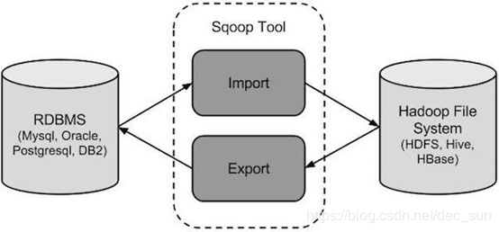

[toc]
## 简介

Apache Sqoop 是一种被设计用于 Apache Hadoop 和结构化数据库之间进行数据转移的工具。其可以将数据从 Hadoop 导出到关系型数据库，也可以将数据从关系型数据库导入到 Hadoop 中。官方网址：[http://sqoop.apache.org/](http://sqoop.apache.org)。

如图所示，Sqoop 的核心作用是 导入/导出。
**导入数据**：MySql，Oracle 等关系型数据库导入数据到 Hadoop 的 HDFS，HIVE等数据存储系统；
**导出数据**：从 Hadoop 的文件系统中导出数据到关系型数据库，如 MySql，Oracle 等。


## 安装

版本以 cdh 5.3.x 版本为例。下载地址：http://archive.cloudera.com/cdh5/cdh/5/，用户手册地址：http://archive.cloudera.com/cdh5/cdh/5/sqoop-1.4.5-cdh5.3.6/SqoopUserGuide.html

1. 下载：sqoop-1.4.5-cdh5.2.6.tar.gz
2. 解压：tar -zxvf sqoop-1.4.5-cdh5.2.6.tar.gz
3. 改名：mv sqoop-env-template.sh sqoop-env.sh
4. 配置 sqoop-env.sh 文件
		export HADOOP_COMMON_HOME=【Hadoop 目录】
		export HADOOP_MAPRED_HOME=【Hadoop 目录】
		export HIVE_HOME=【hive 目录】
5. 修改驱动包，将 [mysql 的驱动 jar](http://central.maven.org/maven2/mysql/mysql-connector-java/) （下载地址：http://central.maven.org/maven2/mysql/mysql-connector-java/），拷贝到 /lib 目录下。


## MySql 导入 HDFS

### 准备工作

```
# 创建数据库和数据表 (mysql 关系型数据库中操作)

create database if not exists sqoop;
create table mysqltohdfs(
id int primary key not null,
name varchar(20) not null
);

# 添加数据

insert into mysqltohdfs value('0','0');
insert into mysqltohdfs value('1','1');
insert into mysqltohdfs value('2','2');
insert into mysqltohdfs value('3','3');
insert into mysqltohdfs value('4','4');
insert into mysqltohdfs value('5','5');
```


### 导入到 HDFS 上

```
# 从 mysql 导入到 hdfs 的根目录下的 mysqltohdfs 目录中

bin/sqoop import \
--connect jdbc:mysql://localhost:3306/sqoop \    # 连接 mysql 数据库
--username root \                                       # mysql 数据库的用户名
--password 123456 \                                     # mysql 数据库的密码
--table mysqltohdfs                                     # mysql 表的名称。

-- 如果没有指定  --target-dir，则数据导入到 HDFS 的主目录上。target-dir 指定 hdfs上的导入目录

# 导入到 HDFS 的指定目录

bin/sqoop import \
--connect jdbc:mysql://localhost:3306/sqoop \
--username root \
--password 123456 \
--table mysqltohdfs \
--target-dir /sqoop  

```


### 设置并行 Mapper 个数

```
# 因为数据从关系型数据库导入到 hdfs上是 MapReduce 操作, 所以 --num-mappers 指定 map 的处理数量

bin/sqoop import \
--connect jdbc:mysql://localhost:3306/sqoop \
--username root \
--password 123456 \
--table mysqltohdfs \
--target-dir /sqoop02 \
--num-mappers 1    
```

 

### 导入数据的子集 / 导入指定条件的数据

```
# 指定 id =1 的数据导入到hdfs.

bin/sqoop import \
--connect jdbc:mysql://localhost:3306/sqoop \
--username root \
--password 123456 \
--table mysqltohdfs \
--target-dir /sqoop03 \
--num-mappers 1
--where “id = ‘1’”
```


### 指定导入数据的存储类型

```
# 使用 sequencefile 文件类型作为存储方式, 文件类型见hadoop.

bin/sqoop import \
--connect jdbc:mysql://localhost:3306/sqoop \
--username root \
--password 123456 \
--table mysqltohdfs \
--target-dir /sqoop04 \
--num-mappers 1
--as-sequencefile 
```


### 导入数据前删除指定目录

```
# -delete-target-dir 如果指定目录存在, 那么删除. 
bin/sqoop import \
--connect jdbc:mysql://localhost:3306/sqoop \
--username root \
--password 123456 \
--table mysqltohdfs \
--delete-target-dir \
--target-dir /sqoop01 \
--num-mappers 1    
```


### 指定存储在 HDFS 的数据的分隔符

```
# 通过 ‘\t’ 来分割文件。 输入 --input-fields-terminated-by '\t'  
bin/sqoop import \
--connect jdbc:mysql://localhost:3306/sqoop \
--username root \
--password 123456 \
--table mysqltohdfs \
--delete-target-dir \
--target-dir /sqoop01 \
--num-mappers 1 \
--fields-terminated-by '\t'    
```


### 指定相应列数据从 Mysql 导入到 HDFS

```
# columns 指定导入的列: id, name，使用 --columns。

bin/sqoop import \
--connect jdbc:mysql://localhost:3306/sqoop \
--username root \
--password 123456 \
--table mysqltohdfs \
--columns id,name
--delete-target-dir \
--target-dir /sqoop01 \
--num-mappers 1 \
```


### 清洗过滤数据，将过滤后的数据导入到 HDFS

```
# 清洗数据,  $CONDITIONS 不可以省略. --query

bin/sqoop import \
--connect jdbc:mysql://localhost:3306/sqoop \
--username root \
--password 123456 \
--query ‘select id,name from mysqltohdfs where $CONDITIONS’ \
# --query "select * from person where name='003' and $CONDITIONS"
--delete-target-dir \
--target-dir /sqoop01 \
--num-mappers 1 
```


### 快速模式

```
# direct 利用某些数据库本身提供的快速导入导出数据的工具，直连模式，速度更快（HBase不支持）

bin/sqoop import \
--connect jdbc:mysql://localhost:3306/sqoop \
--username root \
--password 123456 \
--direct \
--table mysqltohdfs \
--delete-target-dir \
--target-dir /sqoop01 \
--num-mappers 1 \
--fields-terminated-by '\t'
```


### 开启压缩

```
# 开启压缩 --compress
# 压缩类型 --compression-codec

bin/sqoop import \
--connect jdbc:mysql://localhost:3306/sqoop \
--username root \
--password 123456 \
--direct \
--table mysqltohdfs \
--delete-target-dir \
--target-dir /sqoop01 \
--num-mappers 1 \
--compress \
--compression-codec org.apache.hadoop.io.compress.SnappyCodec
```


### 增量导入

```
# 录导入新的文件系统
# --check-column 检查指定的列，根据此列判断哪些记录是新数据且需要导入的，列不能是字符相关类型
# --incremental 指定增量模式，mode包含两种方式：append和lastmodified
# --last-value 指定某个值，将大于该值的检查列记录导入，以确定仅将新的或者更新后的记录导入新的文件系统

bin/sqoop import \
--connect jdbc:mysql://localhost:3306/sqoop \
--username root \
--password 123456 \
--direct \
--table mysqltohdfs \
--target-dir /sqoop01 \
--num-mappers 1 \
--fields-terminated-by '\t'
--check-column id \     
--incremental append \  
--last-value 5  
```


## HDFS 导出 MySql

### 准备工作

```
# mysql 数据库的操作
create table tomysql(
id int primary key not null,
name varchar(20) not null
);
```

### 导出数据到 MySql 数据库

```
# 以 ‘\t’分割, 导出到数据库, 

bin/sqoop export \
--connect jdbc:mysql://localhost:3306/sqoop \  # 连接 MySql 数据库
--username root \                              # 指定 MySql 的用户名
--password 123456 \                            # 指定 MySql 的密码
--table tomysql \                              # 指定 存储到 MySql 的表名 
--export-dir /sqoop \                          # 指定 HDFS 需要导出的数据目录 
--num-mappers 1 \                              # 指定 Map 的个数
--input-fields-terminated-by '\t'              # 指定导出数据使用的分隔符
```


## MySql 导入 HIVE

### 准备工作

```
# hive 建库建表
 
create table mysqltohive(
id int,
name string
)
row format delimited fields terminated by '\t';
```


### 导入

```
bin/sqoop import  \
--connect jdbc:mysql://localhost:3306/sqoop \   # 连接 MySql 数据库
--username root \                               # MySql 数据库用户名
--password 123456 \                             # MySql 数据库密码
--table mysqltohdfs \                           # 指定MySql 数据库的数据表
--hive-import \                                 # 指定导入到 HIVE
--hive-database db01 \                          # 指定导入到 HIVE 的数据库
--hive-table mysqltohive \                      # 指定导入到 HIVE 的数据表
--num-mappers 1 \                               # 指定 Map 的个数
--fields-terminated-by '\t'                     # 指定导出数据使用的分隔符
```
总结：mysql导入HDFS + 结果集移动到hive的表对应的文件夹 = mysql导入Hive


## HIVE 导出到 MySql

```
bin/sqoop export \
--connect jdbc:mysql://localhost:3306/sqoop \
--username root \
--password 123456 \
--table hivetomysql \
--export-dir /user/root/warehouse/sqoop \
--num-mappers 1 \
--input-fields-terminated-by '\t'
```


## 脚本方式

方式：以hdfs导出到mysql为例

### 脚本 sqoop.file

```
export
--connect
jdbc:mysql://localhost:3306/sqoop
--username
root
--password
123456
--table
hdfstomysql02
--export-dir
/sqoop
--num-mappers
1
--input-fields-terminated-by
'\t'
```


### 执行

```
bin/sqoop --options-file sqoop.file

# --num-mappers 2 修改脚本内容
bin/sqoop --options-file sqoop.file --num-mappers 2
```


## job 任务

### 创建 Job 任务

```
bin/sqoop job \
--create addnum_job \
--import \
--connect jdbc:mysql://localhost:3306/sqoop \
--username root \
--password 123456 \
--direct \
--table mysqltohdfs \
--target-dir /sqoop01 \
--num-mappers 1 \
--fields-terminated-by '\t'
--check-column id \
--incremental append \
--last-value 10
```

### 执行 job

```
bin/sqoop job --exec addnum_job
```