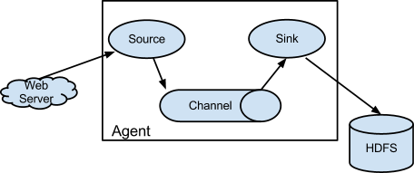
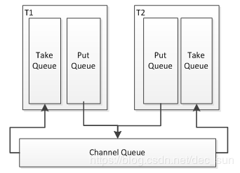

[toc]
Flume 是一种分布式的，可靠且高效地收集、聚集和移动大量数据的工具。它具有基于流数据的简单灵活的体系结构。并且具有健壮性和容错性，可调整的可靠性机制和许多故障转移和恢复机制。它使用了一个简单的可扩展的数据模型，允许在线分析应用程序。

官网地址：http://flume.apache.org/
用户手册地址：http://flume.apache.org/FlumeUserGuide.html

Flume 可以实时收集数据，经常与 Storm/Spark 集成进行使用。其运行需求 JVM，且只能在 Linux 系统上运行。

​										 
Flume 只有一个节点 Agent 的角色，其是 Flume 的核心，同时也是做小的运行单位。一个agent就是一个jvm。Agent 有三大组件：

收集数据：source
聚合数据： channel
移动数据：sink

| 角色    | 简介                                                         |
| ------- | ------------------------------------------------------------ |
| source  | source 用于采集数据，source 是产生数据流的地方，同时 source 会将产生的数据流传输到 channel |
| channel | 连接 source 和sink，这个有点像一个队列                       |
| sink    | 从 channel 收集数据，将数据写到目标源，可以是下一个 source 也可以是 HDFS，HBase，Kafka |

- source
封装数据成 Event，并存入到 channel

- channel
扮演中间人角色，可以理解成数据的缓冲区，以队列的形式进行操作。
将 Event 暂存在内存中，也可以持久化到本地磁盘，直到 sink 数据传递结束。 

- sink
可以发送 Event 到其他 agent 的source。sink 必须达到下一个 agent 或者存入到外部目的地之后，才会将Event 移除。

Event 是 Flume 数据传输的基本单元，Flume 以 Event 的形式将数据从源头传送到最终的目标。Event 有可选的 header 头和载有字节数组 byte  array 构成，载有的数据对 Flume 是透明的，header 头是容纳了 key-value 的无序集合，key 在集合内是唯一的，header 可以在上下文路由中使用扩展。

Flume 提供了三种方式处理数据丢失的错误:
1.  end-to-end：收到数据，Agent 首先会将数据写到磁盘，等待传输成功后在删除。如果传输失败，再次发送。
2. store on failure：若接收方 crash，再把数据写到本地，等待对方回复之后继续发送。
3. besteffort：等待数据发送到接收方之后，不会进行确认。


## 安装部署
下载地址：http://flume.apache.org/download.html

配置：
1. 修改 flume-env.sh.template 为 flume-env.sh
2. Flume 在 hadoop 集群中

	  修改 flume-env.sh
	export JAVA_HOME=/opt/moduels/jdk1.7.0_67

如果 hadoop 配置了HA（HDFS 入口是个逻辑名称）,将 Hadoop 的 core-site 和 hdfs-site 文件拷贝到 flume/conf 下
如果 Flume 不在 hadoop 集群中，将 Hadoop 相关 jar 包放到 lib 目录下   (flume-hdfs-jars.zip)。

## 格式

```
bin/flume-ng <command> [options]...
# -name Agent名称
# -conf 配置文件目录
#- conf-file 配置文件

最基本格式：
bin/flume-ng agent --conf conf --name agent-test --conf-file test.conf
# bin/flume-ng agent --conf conf --name agent_name --conf-file xxx.conf

简写后格式：
bin/flume-ng agent -c conf -n agent-test -f test.conf
```

### 案例
**需求：**读取 hive下的 log日志,采用 memory channel。

Flume 的 conf 文件夹下为我们提供了一份模板文件 flume-conf.properties.template 复制一份 cp flume-conf.properties.template hive_memory_logger.properties

- 编辑 hive_memory_logger.properties

- [ ] Memory channel

```
# define agent
a1.sources = s1
a1.channels = c1
a1.sinks = k1

# define sources
a1.sources.s1.type = exec
#推荐绝对路径
a1.sources.s1.command = tail -f /opt/cdh/hive-0.13.1-cdh5.3.6/logs/hive.log

# define channels
a1.channels.c1.type = memory   # memory channel
# 下面的配置的单位是event
#  transactionCapacity比capacity推荐1：10到1：100
a1.channels.c1.capacity = 100
a1.channels.c1.transactionCapacity = 10

# define sink
a1.sinks.k1.type = logger
# bind the soures and  sink to the channel
a1.sources.s1.channels = c1
a1.sinks.k1.channel = c1
```

- 运行

```
bin/flume-ng agent --conf conf/ --name a1 --conf-file conf/hive_memory_logger.properties -Dflume.root.logger=INFO,console

# 要求必须在 --conf 参数指定的目录下有 log4j的配置文件
# 可以通过-Dflume.root.logger=INFO,console在命令启动时手动指定log4j参数
```

 - [ ] File channel

```
a1.channels.c1.type = file   # memory  修改为 file，其他地方不变
a1.channels.c1.checkpointDir = /opt/datas/flume/file/check
a1.channels.c1.dataDirs = /opt/datas/flume/file/data
```

 - [ ] hdfs sink

```
a1.sinks.k1.type = hdfs  # 修改Sink类型为hdfs sink
a1.sinks.k1.hdfs.path = hdfs://bigdata01:8020/flume/event/hdfs
# a1.sinks.k1.hdfs.path = /flume/event/hdfs
a1.channels.c1.capacity = 10000
a1.channels.c1.transactionCapacity = 10000

优化:
# 采集文件根据date进行区分
a1.sinks.k1.hdfs.path = hdfs://bigdata:8020/flume/event01/data/date=%Y-%m_%d
# 和时间相关的序列需要开启该功能
a1.sinks.k1.hdfs.useLocalTimeStamp = true

# 多久生成一个文件，0为不适用该配置，优先级高
a1.sinks.k1.hdfs.rollInterval = 0
# 文件大小进行回滚，单位kb，不建议设满128M
a1.sinks.k1.hdfs.rollSize = 10240
# 多少event生成一个文件，0为不使用该配置
a1.sinks.k1.hdfs.rollCount = 0

# 修改保存文件的前缀
a1.sinks.k1.hdfs.filePrefix = hivelog
```

 - [ ] Spooling Directory Source

```
a1.sources.s1.type = spooldir
a1.sources.s1.spoolDir = /opt/datas/flume/spooling/

# 忽略某些文件
a1.sources.s1.ignorePattern = ([^ ]*\.tmp$)
```

 - [ ] 扇入扇出

**扇出**：一个source对应多个channel

```
# define agent
a1.sources = s1
a1.channels = c1 c2   # 对应 c1，c2 两个 channel。
a1.sinks = k1 k2

# define sources
a1.sources.s1.type = exec
a1.sources.s1.command = tail -f /opt/cdh/hive-0.13.1-cdh5.3.6/logs/hive.log

# define channels
a1.channels.c1.type = memory
a1.channels.c1.capacity = 10000
a1.channels.c1.transactionCapacity = 10000

a1.channels.c2.type = memory
a1.channels.c2.capacity = 10000
a1.channels.c2.transactionCapacity = 10000

# define sink
a1.sinks.k1.type = hdfs
a1.sinks.k1.hdfs.path = hdfs://bigdata:8020/flume/event/hdfs1/date=%Y-%m_%d
a1.sinks.k1.hdfs.rollInterval = 0
a1.sinks.k1.hdfs.rollSize = 10240
a1.sinks.k1.hdfs.rollCount = 0
a1.sinks.k1.hdfs.filePrefix = hivelog1
a1.sinks.k1.hdfs.useLocalTimeStamp = true

a1.sinks.k2.type = hdfs
a1.sinks.k2.hdfs.path = hdfs://bigdata:8020/flume/event/hdfs2/date=%Y-%m_%d
a1.sinks.k2.hdfs.rollInterval = 0
a1.sinks.k2.hdfs.rollSize = 10240
a1.sinks.k2.hdfs.rollCount = 0
a1.sinks.k2.hdfs.filePrefix = hivelog2
a1.sinks.k2.hdfs.useLocalTimeStamp = true

# bind the soures and  sink to the channel
a1.sources.s1.channels = c1 c2
a1.sinks.k1.channel = c1
a1.sinks.k2.channel = c1
```

**扇入**：多个sink对应一个source (先启动服务端, 再启动客户端)

**Client 端**
```
# 创建 avro_client.properties，编辑：

a1.sources = s1
a1.channels = c1
a1.sinks = k1

# define sources
a1.sources.s1.type = avro
a1.sources.s1.command = tail -f /opt/cdh/hive-0.13.1-cdh5.3.6/logs/hive.log

# define channels
a1.channels.c1.type = memory
a1.channels.c1.capacity = 10000
a1.channels.c1.transactionCapacity = 1000

# define sink
a1.sinks.k1.type = avro
a1.sinks.k1.hostname = bigdata
a1.sinks.k1.port = 44444

# bind the soures and  sink to the channel
a1.sources.s1.channels = c1
a1.sinks.k1.channel = c1

# 运行

bin/flume-ng agent --conf conf/ --name a1 --conf-file conf/avro_client.properties -Dflume.root.logger=INFO,console
```

**Collect端**

```
# define agent
a1.sources = s1
a1.channels = c1
a1.sinks = k1

# define sources
a1.sources.s1.type = avro
a1.sources.s1.bind = lee01.cniao5.com
a1.sources.s1.port = 44444

# define channels
a1.channels.c1.type = memory 
a1.channels.c1.capacity = 10000
a1.channels.c1.transactionCapacity = 10000

# define sink
a1.sinks.k1.type = hdfs
a1.sinks.k1.hdfs.path = hdfs://bigdata:8020/flume/event/avro
a1.sinks.k1.hdfs.rollInterval = 0
a1.sinks.k1.hdfs.rollSize = 10240
a1.sinks.k1.hdfs.rollCount = 0
a1.sinks.k1.hdfs.filePrefix = hivelog
a1.sinks.k1.hdfs.useLocalTimeStamp = true

# bind the soures and  sink to the channel
a1.sources.s1.channels = c1
a1.sinks.k1.channel = c1
```

 - [ ] TailDir

OG 中 tailsource/taildirsource 可以将文件的一行数据读取到 channel，在 NG 中，取而代之的是 ExecSource/spoolingdir，可以通过 tail -f 的命令来指定按照行读取文件内容，但是很难直接指定按照行读取文件夹中的内容。1.7之后的版本中，出现了 taildirsource 可以解决这一问题，不过很早之前，就已经开放了源码，需要编译并集成到 flume 中。

**集成/环境配置**：将flume-taildir-source-1.5.0-cdh5.3.6.jar 导入至lib目录。

```
# define agent
a1.sources = s1
a1.channels = c1
a1.sinks = k1

# define sources
# 非1.7+版本，需要完整的类名
a1.sources.s1.type = org.apache.flume.source.taildir.TaildirSource

# Json位置文件
a1.sources.s1.positionFile = /opt/datas/flume/taildir/position/taildir_position.json

# exec和sopplingdir抽取出来，分别用来监控文件和文件夹，fl对应exec，f2对应spoolingdir
a1.sources.s1.filegroups = f1 f2

# 文件地址
a1.sources.s1.filegroups.f1 = /opt/datas/flume/taildir/test.file

# 监控的文件的头部的值，用于标识，默认即可
a1.sources.s1.headers.f1.headerKey1 = value1

# 文件夹地址
a1.sources.s1.filegroups.f2 = /opt/datas/flume/taildir/test/.*
a1.sources.s1.headers.f2.headerKey1 = value2
a1.sources.s1.headers.f2.headerKey2 = value2-2
a1.sources.r1.fileHeader = true

# define channels
a1.channels.c1.type = memory
a1.channels.c1.capacity = 10000
a1.channels.c1.transactionCapacity = 1000

# define sink
a1.sinks.k1.type = hdfs
a1.sinks.k1.hdfs.path = hdfs://bigdata:8020/flume/event/taildir
a1.sinks.k1.hdfs.rollSize = 1024000
a1.sinks.k1.hdfs.rollInterval = 0
a1.sinks.k1.hdfs.rollCount = 0
a1.sinks.k1.hdfs.filePrefix = hivelog

# bind the soures and  sink to the channel
a1.sources.s1.channels = c1
a1.sinks.k1.channel = c1
```
重复读取相关 taildir_position.json，会把我们需要读取的文件和文件夹的信息统统记录到 taildir_position.json，下次读取的时候，会先读取该文件，从上次结束的位置再次读取。

## 事务
**事务**：保证我们任务要么完全执行完毕，要么就完全执行失败
**结果**： 成功，失败就重新来过

​													 
**事务的分别**：put / take， 需要保证我们这两个事务全部成功才算成功，失败的话，会将数据回滚到前一个组件。