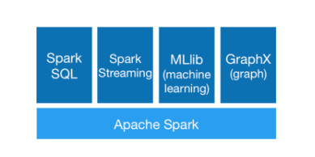
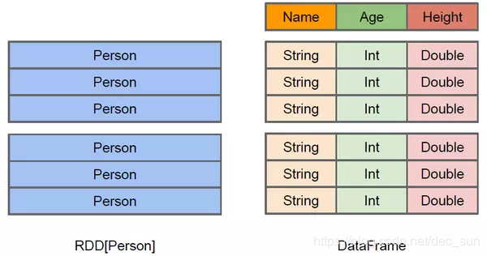
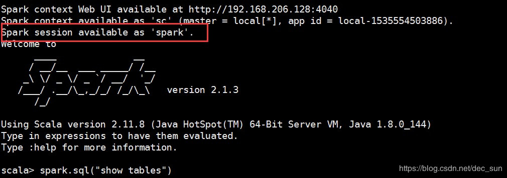
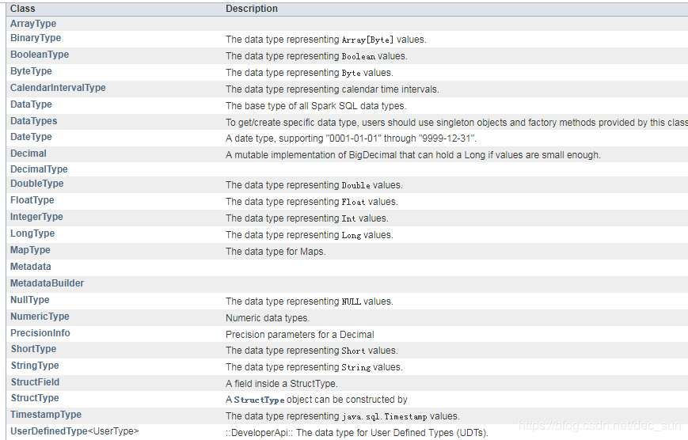
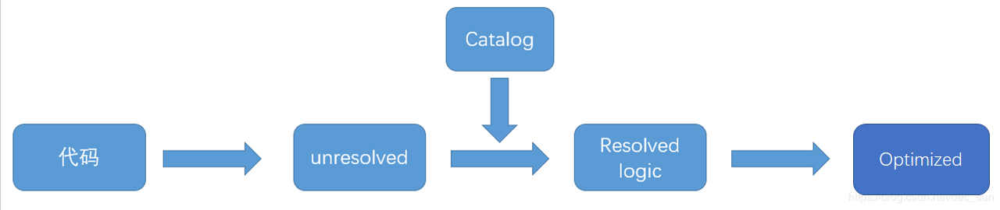
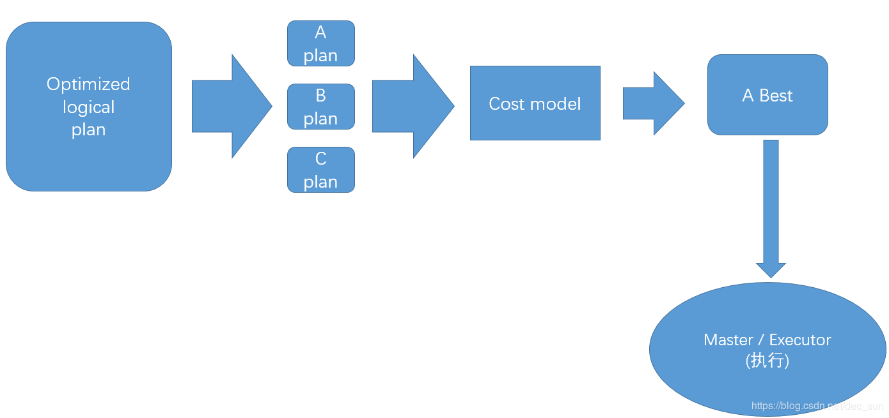

[TOC]

# 简介

SparkSQL 是 Spark 计算框架的一个模块，与基础 Spark RDD API 不同，SparkSQL 为 Spark 提供了更多 **数据结构schema** 信息，在内部，SparkSQL 使用这些额外的数据结构信息做进一步的优化操作，与 SparkSQL 交互的方式有多种，包括 SQL语句交互、DatasetAPI 交互。当使用 SparkSQL 获取数据处理结果时，无论使用什么样的交互方式，无论采用什么样的语言编写程序，其底层的执行引擎都是相同的。



SparkSQL 是以SparkRDD 为基础，以SQL方式做大数据分析。其只能针对**结构化数据或半结构化数据**做分析，无法对非结构化数据做分析。


## SparkSQL 基本介绍

### SQL语句交互

SparkSQL 的用处之一是执行 SQL 查询，SparkSQL 也可以从已有 Hive 数据仓库中读取数据（Spark On Hive）。SparkSQL 语句的执行结果是一个 DataFrame 或 Dataset对象。同时支持命令行执行 SQL 和JDBC/ODBC 连接。


### Datasets API 交互

Dataset 是一个分布式的数据集合。在Spark1.6版本中，Dataset 作为一个新街口添加进来，兼具有 RDD 的优点（强类型、使用强大的Lambda 函数的功能）和 SparkSQl 优化引擎的优势。Dataset 可以从 JVM 对象来构建，然后使用一系列转换函数进行计算。

DataFrame（Dataset\<Row>）是一个由命名列组成的 Dataset。概念上相当于关系型数据库中的一个表，但底层提供了丰富的优化操作。DataFrames 可以从一系列广泛的数据来源中构建，如结构化数据文件，Hive 中的表、外部数据库、或者已有的 RDD。

Dataset: 具有强类型的特定。Dataset中每一行是什么类型是不一定的，在自定义了case class之后可以很自由的获得每一行的信息。
DataFrame：DataFrame每一行的类型固定为Row，只有通过解析才能获取各个字段的值；是分布式的Row对象的集合。

DataFrame和DataSet可以相互转化，df.as[ElementType]这样可以把DataFrame转化为DataSet，ds.toDF()这样可以把DataSet转化为DataFrame。

**RDD 与DataFrame 的区别**



### SparkSession

SparkSession 提供了与底层 Spark功能交互的入口，允许使用 DataFrame 和 Dataset API 对 Spark 进行编程。最重要的是：它限制了概念的数量（SparkContext，SQLContext，HiveContext），并构建了开发人员与 Spark 交互时必须兼顾的结构。

启动 Spark-shell 控制台后，SparkSession 被实例化为 spark 变量，在控制台中可以直接使用。




### partition 分区

为了使每个 executor 执行器并行执行任务，Spark 将数据分为 partition。每个分区是集群中的物理机器上的集合。DataFrame 的分区表示在执行过程中数据时如何在集群上物理分布的。

对于 DataFrame 操作，大多数情况下不需要手动或单独操作分区，因为使用 DataFrame 的高级 transformation 操作，底层会做一系列的优化操作，然后转化为 RDD 进行计算。


### transformation

执行一个简单的转换，以在当前的 DataFrame 中找到所有偶数：

```scala
val myRange = spark.range(1000).toDF("number")
val divisBy2 = myRange.where("number % 2=0")
```
这里只是申明了一个抽象转换 where，直到调用一个 action 操作，Spark 才开始进行转换操作。


### 延迟计算

延迟计算意味着 spark 将等到最后一刻才执行一系列的 transformation。在 SparkSQL 中，不会在执行某个 transformation 操作时立即修改数据，spark 会构建一个引用于源数据的 plan。直到最后 action 时执行代码，Spark 将这个计划从原始的 DataFrame 转化为 Physical Plan（物理计划），该计划将在整个集群中高效地运行，因为 Spark 可以从端到端优化整个数据流。


### Action

为了触发计算，需要运行一个 action 操作。action 操作使 Spark 通过执行一系列 transformation 转换，得出计算结果。最简单的 action 操作是 count，它给出了DataFrame 中记录的总数。

```
divisBy2.count()
```
Action 有三种类型:
1. 在控制台中查看数据的 action；
2. 数据收集的 action 操作；
3. 输出到第三方存储系统的 action 操作。

在执行这个 count 操作时，启动了一个 sparkJob，运行过滤器 where 转换（一个窄依赖转换），然后是一个聚合（一个款依赖转换），它在每个分区基础上执行计数，然后是一个收集 action，它将我们的结果到 driver 端。通过检查SparkUI，可以看到这一切。


### 注册为表或视图

可以通过一个简单的方法调用将任何 DataFrame 转换为一个表或视图：

```
myData.createOrReplaceTempView("myData”)；
```
现在我们可以通过使用 SQL来查询我们的数据了。使用spark.sql函数，这里是返回一个新的 DataFrame。


### DataFrame 概念

1. DataFrame 是从 Spark1.3 开始引入了一个名为 DataFrame 的表格式数据抽象；
2. DataFrame 是用于处理结构化和半结构化数据的数据抽象；
3. DataFrame 利用其 Schema 以比原始 RDDs 更有效的方式存储数据；
4. DataFrame 利用 RDD 的不可变性、内存计算、弹性的、分布式的和并行的特性，变成数据应用一个成为 schema 的数据结构，允许 spark 管理 schema， 以比 java序列化更有效的方法在集群节点之间进行数据的传递。
5. 与 RDD 不同，DataFrame 中的数据被组织到指定的 columns 中，就像噶UN系数据库中的表一样。


### Dataset 概念

1. 面向对象的编程风格；
2. 像 RDD API 一样的编译时类型安全；
3. 利用 schema 处理结构化数据的优势；
4. Dataset 是结构化数据集，数据集泛型可以是 Row （DataFrame），也可以是特定的数据类型；
5. Java 和 Spark 在编译时将知道数据集中数据的类型。


### DataFrame 和 Dataset 对比

1. DataFrame API 与 Dataset API 合并；
2. Dataset 提供了 两个截然不同的 API特性：强类型 API（strong typed API），未定义类型 API（untyped API）；
3. 可以将 DataFrame 看做是 Dataset 的 untyped 类型：Dataset<Row>，Row 是一个 untyped 的 JVM 对象；
4. Dataset 是强类型 JVM 对象的集合。


# DataFrames

DataFrames 和 Dataset 是类似于表的集合，具有定义好的行和列。每个列必须是相同的行数（如果指定值缺失，可以使用null），并且每个列都是类型信息，这些信息必须与集合中的每一行一致。这是因为内部有一个 schema 的概念，其定义了分布式集合中存储的数据类型。


## schema

schema 定义了 DataFrame 的列名和类型。可以手动定义 schemas 模式或从数据源读取 schemas 模式。 Schema包含列类型，用于申明什么列存储了什么类型的数据。


## Rows

一行 Row 只是表示数据的一条记录。 DataFrame 中的每条记录必须是 Row 类型。


## Column

column 表示一个简单的类型，如 integer 或 string，复杂类型，如 array ，map， null。Spark 将跟踪所有这类类型的信息，并提供多种方式对 columns 进行装潢


## Spark DataType

Spark 有大量的内部类型表示，这样就可以很容易地引用在特定的语言中，与Spark类型想匹配的类型。其位于 [import org.apache.spark.sql.types.DataTypes 类中。](http://spark.apache.org/docs/latest/api/java/index.html)





**实战演练**

> 使用自定义 schema 创建 DataFrame

```scala
--- scala
/**
* 使用createDataFrame(rdd,schema)方法创建DataFrame
*/
val schema=StructType(List(
					StructField("name",StringType,nullable=false),    
					StructField("age",IntegerType,nullable=false),  
					StructField("address",StringType,nullable=false),  
					StructField("birthday",DateType,nullable=false)
))

val rowRDD=spark.sparkContext.parallelize(Seq(
					Row("zhangsan",10,"beijing",Date.valueOf("2008-01-01")),
					Row("lisi",20,"shanghai",Date.valueOf("1998-01-01"))    
		), 2) // parallelize 为 2.
	
val rddSchemaDF=spark.createDataFrame(rowRDD, schema)

rddSchemaDF.show()
rddSchemaDF.printSchema()
```


```java
-- java
/**
* 使用List<Row>、schema创建DataFrame
* 注意：创建StructField、StructType，要使用DataTypes的工厂方法。
*/
List<Row> rows=new ArrayList<Row>();
rows.add(RowFactory.create("zhangsan",20,"beijing"));
rows.add(RowFactory.create("lisi",18,"shanghai"));

StructField[] fields=new StructField[]{
				DataTypes.createStructField("name", DataTypes.StringType, false),
				DataTypes.createStructField("age", DataTypes.IntegerType, false),
				DataTypes.createStructField("address", DataTypes.StringType, false)
};

StructType schema=DataTypes.createStructType(fields);
Dataset<Row> listSchemaDF=spark.createDataFrame(rows, schema);  //DataFrame

listSchemaDF.show();
listSchemaDF.printSchema();
```


# DataFrame 基本操作
从定义上看，一个 DataFrame 包括一系列的 records 记录，这些行的类型是 Row 类型，包括一系列的 columns。 Schema 定义了每一列的列名和数据类型。DataFrame 的分区定义了 DataFrame 或 Dataset 在整个集群中的物理分布情况。

```scala
//创建DataFrame
val df = spark.read.format("json") .load("/data/flight-data/json/2015-summary.json")

//查看schema
df.printSchema()

// 查看schema
spark.read.format("json").load("/data/flight-data/json/2015-summary.json").schema

//输出：
org.apache.spark.sql.types.StructType = ...
               StructType( StructField(DEST_COUNTRY_NAME,StringType,true),
                           StructField(ORIGIN_COUNTRY_NAME,StringType,true),
                           StructField(count,LongType,true)
                           )
//解释
一个schema就是一个StructType，由多个StructField类型的fields组成，每个field包括一个列名称、一个列类型、一个布尔型的标识（是否可以有缺失值和null值）
//如何在DataFrame上创建和执行特定的schema

```


## Columns 操作

spark 中的列类型类似于电子表格中的列，可以从 DataFrame 中选择列、操作列和删除列。对 Spark 来说，列是逻辑结构，它仅仅表示通过一个表达式按每条记录计算出一个值。这意味着，要得到一个 column 列的真实值，需要有一行 row 数据，为了得到一行数据，就需要一个DataFrame。不能在 DataFrame 的上下文之外操作单个列。必须在 DataFrame 内使用 Spark 转换来的操作列。

有许多不同的方法来构造和引用列，但是最简单的方式就是使用 col() 和 column() 函数。要使用这些函数，需要传入一个列名。

```scala
// in Scala
import org.apache.spark.sql.functions.{col, column}

 col("someColumnName")
 column("someColumnName")
```
如前所述，这个列可能存在于我们的 DataFrames 中，也可能不存在。在将列名和我们在 catalog 中维护的列进行比较之前，列不会被解析，即列是 unresolved。
|                             注意                             |
| :----------------------------------------------------------: |
| 我们刚才提到的两种不同的方法引用列。Scala有一些独特的语言特性， 允许使用更多的简写方式来引用列。以下的语法糖执行完全相同的事情， 即创建一个列， 但不提供性能改进:  $‘’myColumn” ，  'myColumn。 **"\$"**  允许我们将一个字符串指定为一个特殊的字符串，该字符串应该引用一个表达式。 标记  **( ' )** 是一种特殊的东西，称为符号; 这是一个特定于scala语言的，指向某个标识符。它们都执行相同的操作，是按名称引用列的简写方式。当您阅读不同的人的Spark代码时，可能会看到前面提到的所有引用。 |


**表达式 expression**
表达式是在 DataFrame 中数据记录的一个或多个值上的一组转换。**列是表达式**，把它想象成一个函数，它将一个或多个列名作为输入，表达式会解析它们，为数据集中的每个记录返回一个单一值。

在最简单的情况下，expr("someCol") 等价于 col("someCol")。

列操作是表达式功能的一个子集。expr(“someCol - 5”) 与执 行col(“someCol”) - 5，或甚至 expr(“someCol”)- 5 的转换相同。这是因为 Spark 将它们编译为一个逻辑树，逻辑树指定了操作的顺序。

```
// Scala方式
df.select("DEST_COUNTRY_NAME").show(2)

-- SQL方式
SELECT DEST_COUNTRY_NAME FROM dfTable LIMIT 2
```

可以使用相同的查询样式选择多个列，只需在 select 方法调用中添加更多的列名字符串参数：

```
// in Scala
df.select("DEST_COUNTRY_NAME", "ORIGIN_COUNTRY_NAME").show(2)

-- in SQL
SELECT DEST_COUNTRY_NAME, ORIGIN_COUNTRY_NAME FROM dfTable LIMIT 2
```

可以用许多不同的方式引用列，可以交替使用它们

```
-- in Scala
import org.apache.spark.sql.functions.{expr, col, column}
df.select(
        df.col("DEST_COUNTRY_NAME"),
    		col("DEST_COUNTRY_NAME"),
            column("DEST_COUNTRY_NAME"),
            'DEST_COUNTRY_NAME,
            $"DEST_COUNTRY_NAME",
             expr("DEST_COUNTRY_NAME"))
  .show(2)
```
但是有一个常见的错误，就是混合使用列对象和列字符串，例如：
```
df.select(col("DEST_COUNTRY_NAME"), "EST_COUNTRY_NAME")
```

expr 是我们可以使用的最灵活的引用，它可以引用一个简单的列或一个列字符串操作。例如：

```
// 更改列名，然后通过使用AS关键字来更改它
-- in Scala
df.select(expr("DEST_COUNTRY_NAME AS destination")).show(2)

-- in SQL
SELECT DEST_COUNTRY_NAME as destination FROM dfTable LIMIT 2

// 操作将列名更改为原来的名称
df.select(expr("DEST_COUNTRY_NAME  as  destination").alias("DEST_COUNTRY_NAME")) .show(2)
```


## 字面常量转换为 Spark 类型

有时候，需要将显式字面常量值传递给 Spark， 它只是一个值，而不是一个列。这可能是一个 常数值或以后需要比较的值。可以通过 literals，将给定变成语言的字面值转换为 Spark 能够理解的值。

```
-- in Scala
import org.apache.spark.sql.functions.lit

df.select(expr("*"), lit(1).as("One")).show(2)

-- in SQL
SELECT *, 1 as One FROM dfTable LIMIT 2
```


## 添加列

将新列添加到 DataFrame 中，这是通过在 DataFrame 上使用 withColum 方法来实现的。例如，添加一个列，将数字 “1” 添加为一个列，列名为 numberOne：
```
-- in Scala
df.withColumn("numberOne", lit(1)).show(2)

-- in SQL
SELECT *, 1 as numberOne FROM dfTable LIMIT 2
```
例如，设置一个布尔标志，表示源国与目标国相同：

```
-- in Scala
df.withColumn("withinCountry", expr("ORIGIN_COUNTRY_NAME == DEST_COUNTRY_NAME"))
```
注意：witchColumn 函数有两个参数：别名和为 DataFrame 中的给定行的创建值的表达式。

同时也可以重命名列
```
df.withColumn("Destination", expr("DEST_COUNTRY_NAME")).columns
```


## 重命名列

可以使用 withColumnRenamed 方法来重命名，这会将第一个参数中的字符串的名称重命名为第二个参数中的字符串
```
-- in Scala
df.withColumnRenamed("DEST_COUNTRY_NAME", "dest").columns
```


## 删除列

```
df.drop("ORIGIN_COUNTRY_NAME").columns
df.drop("ORIGIN_COUNTRY_NAME", "DEST_COUNTRY_NAME")
```

## 更改列类型
如需要列从一种类型转换到另一种类型。例如，从一组 StringType 应该是整数，可以将列从一种类型转换为另一种类型。

将count列从整数类型转换成 Long 类型：
```
-- in scala
df.withColumn("count2", col("count").cast("long"))

-- in SQL
SELECT *, cast(count as long) AS count2 FROM dfTable
```


## 过滤行

为了过滤行，创建一个计算值为 true 或 false 的表达式。然后用一个等于 false 的表达式过滤掉这些行。使用 DataFrames 执行此操作的最常见方法是将表达式创建为字符串，或者使用一组列操作构建表达式。执行此操作有两种方法： 可以使用 where 或 filter，它们都将执行相同的操作，并在使用 DataFrames 时接受相同的参数类型
```
-- in scala
df.filter(col("count") < 2).show(2)
df.where("count < 2").show(2)

-- in SQL
SELECT * FROM dfTable WHERE count < 2 LIMIT 2
```
如希望将多个过滤器放入相同的表达式中，只需要将它们按顺序链接起来，让 Spark 处理
```
-- in Scala
df.where(col("count") < 2).where(col("ORIGIN_COUNTRY_NAME") =!= "Croatia")
  .show(2)

-- in SQL
SELECT * FROM dfTable WHERE count < 2 AND ORIGIN_COUNTRY_NAME != "Croatia"
LIMIT 2
```


## 行去重

一个常见的用例是在一个 DataFrame 中提取唯一的或不同的值。这些值可以在一个或多个列中。这样做的方式为：在 DataFrame 上使用不同的方法，它允许我们对该 DataFrame 中的任何行进行删除重复行操作。
```
-- in Scala
df.select("ORIGIN_COUNTRY_NAME", "DEST_COUNTRY_NAME").distinct().count()

-- in SQL
SELECT COUNT(DISTINCT(ORIGIN_COUNTRY_NAME, DEST_COUNTRY_NAME)) FROM dfTable
```


## Union

DataFrame 是不可变的，这意味着用户不能向 DataFrame 追加，因为这会改变 DataFrame。要附加到 DataFrame 上，必须将原始的 DataFrame 与新的 DataFr5ame 结合起来。这只是连接两个 DataFrame， 对于 union 两个 DataFrame，必须确保它们具有相同的模式和列数，否则，union 将会报错。
```
-- in Scala
import org.apache.spark.sql.Row
val schema = df.schema
val newRows = Seq(
  Row("New Country", "Other Country", 5L),
  Row("New Country 2", "Other Country 3", 1L)
)

val parallelizedRows = spark.sparkContext.parallelize(newRows)
val newDF = spark.createDataFrame(parallelizedRows, schema)

df.union(newDF)
  .where("count = 1")
  .where($"ORIGIN_COUNTRY_NAME" =!= "United States")
  .show()
```


## 行排序

在对 DataFrame 中的值进行排序时，如需对DataFrame 顶部最大或最小值进行排序。有两个相同的操作可以执行这种操作：sort、orderBy。它们默认是按升序排序，可以接受多个表达式，字符串和列。

```
-- in Scala
df.sort("count").show(5)

df.orderBy("count", "DEST_COUNTRY_NAME").show(5)
df.orderBy(col("count"), col("DEST_COUNTRY_NAME")).show(5)

//要更明确地指定排序方向，需要在操作列时使用asc和desc函数
import org.apache.spark.sql.functions.{desc, asc}

df.orderBy(expr("count desc")).show(2)
df.orderBy(desc("count"), asc("DEST_COUNTRY_NAME")).show(2)
```

出于优化目的，有时建议在另一组转换之前对每个分区进行排序。可以使用 sortWithinPartitions 方法来执行
```
spark.read.format("json").load("/data/flight-data/json/*-summary.json").sortWithinPartitions("count")
```


## limit

通常要限制从 DataFrame 中提取的内容，如要取 DataFrame 中的前几位

```
-- in Scala
df.limit(5).show()

-- in SQL
SELECT * FROM dfTable LIMIT 6

-- in Scala
df.orderBy(expr("count desc")).limit(6).show()

-- in SQL
SELECT * FROM dfTable ORDER BY count desc LIMIT 6
```


## rePartition & coalesce

一个重要的优化方式是根据一些经常过滤的列对数据进行分区，它控制跨集群的数据的物理分布，包括分区计划和分区数量。

rePartition 将导致数据的完全 shuffle， 无论是否需要重新 shuffle。这意味着只有当将来的分区数目大于当前的分区数目时，或者当希望通过一组列进行分区时，才应该使用 rePartition。

```
-- in Scala
df.rdd.getNumPartitions // 1

-- in Scala
df.repartition(5)

//如果经常对某个列进行过滤，那么基于该列进行重新分区是值得的
df.repartition(col("DEST_COUNTRY_NAME"))
df.repartition(5, col("DEST_COUNTRY_NAME"))
```

而 coalesce 不会导致完全 shuffle，并尝试合并分区。

```
-- in Scala
df.repartition(5, col("DEST_COUNTRY_NAME")).coalesce(2)
```


## 收集数据到 Driver

- collect 从整个 DataFrame 中获取所有数据；
- take 选取 DataFrame 的前几行；
- show 打印出几行数据

```
--  in Scala
val collectDF = df.limit(10)
collectDF.take(5) 
collectDF.show() 
collectDF.show(5, false)
collectDF.collect()
```


## UDF 的使用

```
spark.udf.register("zipToLong", (z:String) => z.toLong)
spark.udf.register("largerThan", (z:String,number:Long) => z.toLong>number)

zipDS.select(col("city"),zipToLongUDF(col("zip")).as("zipToLong"),largerThanUDF(col("zip"),lit("99923")).as("largerThan")).orderBy(desc("zipToLong")).show();
```


# Spark on hive

[http://spark.apache.org/docs/latest/sql-programming-guide.html](http://spark.apache.org/docs/latest/sql-programming-guide.html)
## 开发环境配置
 1. 将 hive_home/conf 的 hive-site.xml 拷贝到 spark_home/conf 内；
 2. 将 hadoop_home/etc/hadoop 内的 hdfs-site.xml 和 core-site.xml 拷贝到spark_home/conf 内；
 3. 在拷贝到 spark_home/conf 所在节点上以 local 模式启动 spark-sql；
 4. 如果 hive 的 metastore 是 mysql 数据库，需要将 mysql 驱动放到 spark_home/jars 目录下面；

**开发环境**：在项目中创建文件夹 conf ,将上述三个文件放入 conf 目录； 如果 hive 的 metastore 是 mysql 数据库，需要将 mysql 驱动放到项目的类路径下。

```
val spark = SparkSession
              .builder()
              .master("local[*]")
              .appName("Spark Hive Example")
              .enableHiveSupport()//启用对hive的支持
              .getOrCreate()

<!--如果版本高于1.2.1，设置hive-site.xml中的属性,避免报错：-->
<property>
    <name>hive.metastore.schema.verification</name>
    <value>false</value>
</property>
```


# SparkSQL 执行过程

## SparkSQL执行过程
1. 编辑 Dataset API SQL代码；
2. 如果代码编译没有报错，Spark 会将代码转化为逻辑计划；
3. Spark 会将逻辑计划转化为物理计划，会对代码进行优化（catalyst 优化器） ；
4. Spark 执行物理计划 （RDD）。


## 逻辑计划（Logical plan）

逻辑计划不涉及 Executor 和 Driver，只是将用户写的代码转化为最优版本，通过将用户代码转化为 unresolved logic plan，然后再转化为 resolvd logic plan，catalog（所有表和 DataFrame 信息的存储库），接着会把计划给 catalyst 优化器，catalyst 优化器是一组优化规则的集合：谓词下推、投影。





## 物理计划

最优逻辑计划通过生成不同的物理执行策略（A  B  C 计划），这些物理执行计划会通过 cost model 来比较，从而从中被选取一个最优的物理执行计划，其结果是一系列的 RDD 和 transformation。


## 执行
选择一个物理执行计划，运行所有的 RDD 代码，使用 tungsten 进一步优化，生成本地 Java 字节码，执行生成的各种 stages，最后返回结果给用户。