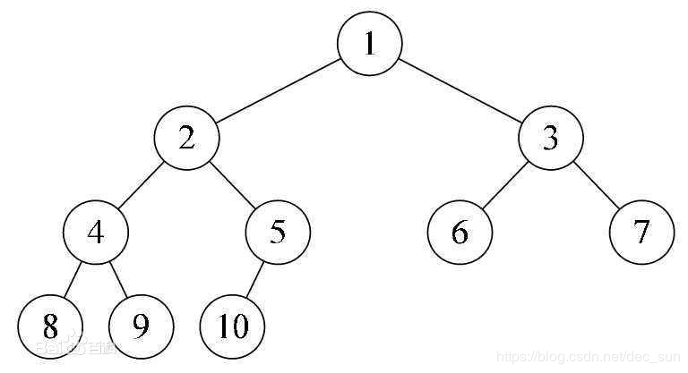
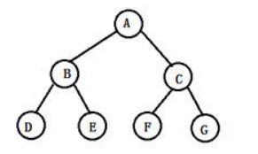
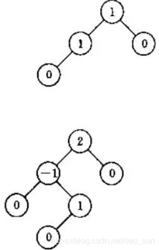
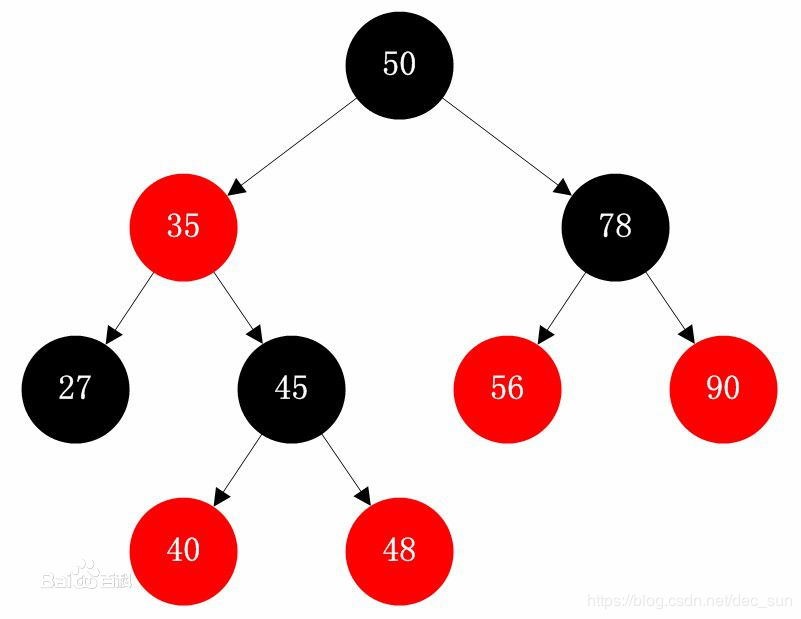
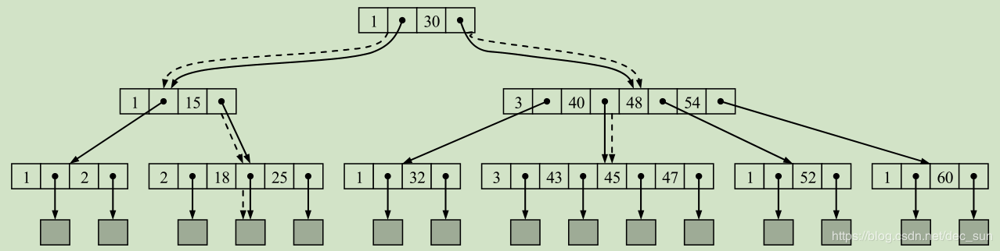
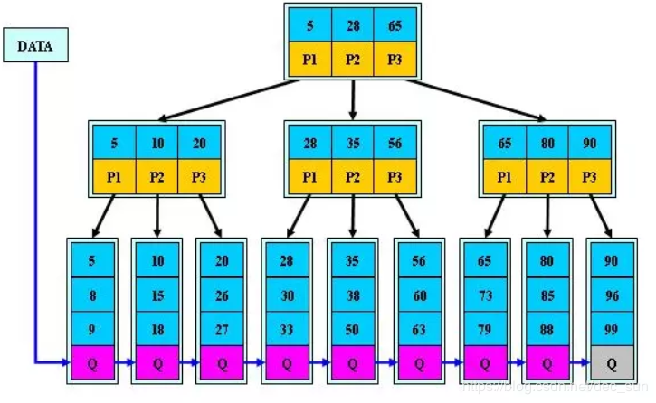
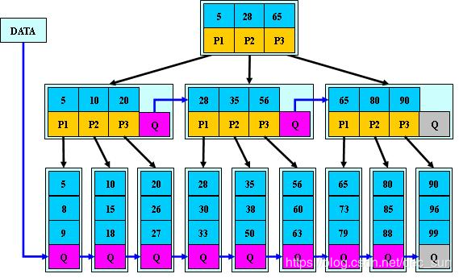

[toc]

# 二叉树
二叉树是节点最多有两个子树（左子树，右子树）的树结构。第 i 层至多有 2_^_(i-1) 个节点（i >= 1）；深度为 k 的二叉树至多有 2_^k_ -1 个节点，对任何一棵二叉树，如果其终端节点为 n~0~，度为 2 的节点数为 n~2~， 则 n~0~=n~2~+1。

 

# 完全二叉树

设二叉树的深度为 h，其它（1 ~ h-1）各层的节点数都达到了最大（两个子树），同时第 h 层的所有节点都连续集中在最左侧。即为 完全二叉树。

1. 叶子节点只能出现在 h 层和 （h-1）层；
2. h 层的节点都集中在改层的最左侧；
3. (h-1) 层的部分节点可以没有子节点；
4. 允许右子树的深度为 L。而左子树的深度可以是 L，也可以是 L+1

如图就是一个完全二叉树。

# 满二叉树

设一个深度为 h 的二叉树，如果第1 ~ h-1 层节点的子节点的个数为 2，即是满二叉树。

1. 节点总数为 (2^h^- 1)；
2. 除了叶子节点层，其他每层的节点数为：2^i-1^
3. 叶子节点的总数为：2^h-1^；
4. 除了叶子节点，每个节点必须都包含左子树和右子树；
5. 满二叉树类似于一个标准的三角

#  自平衡二叉查找树

AVL，它是一棵空树或它的左右两个子树的高度差的绝对值不超过1，并且左右两个子树都是一棵平衡二叉树。

1. 左子树与右子树的深度差值不会超过 1；
2. 子树也是一棵平衡二叉树；

# 红黑树

[什么是红黑树](https://juejin.im/post/5a27c6946fb9a04509096248#comment)

红黑树是一种自平衡二叉查找树

1. 每个节点非红即黑；
2. 根节点总是黑色；
3. 每个叶子节点都是黑色的空节点；
4. 如果节点是红色，则其子节点必须是黑色；
5. 如果节点是黑色，则其子节点不必一定是红色；
6. 从根节点到叶子节点的每条路径，必须包含相同数目的黑色节点（黑色节点数目相等）

红黑色的调整方式有：变色和旋转

# B-tree（B tree）

B tree 即 Balance Tree。

若存在一个 M 阶 B tree：（M 阶，树中节点存在最大值为 M 的子树）

1. 根节点必须有 K 个的子树， M >= K >= 2； 
2. 非根非叶的分支节点的子树数量 K，且包含的数据个数为 K - 1，M >= K >= M/2；
3. 所有叶子节点都位于同一层，左子树深度 = 右子树深度。且 所有叶子节点不包含任何信息（可以看做分支节点指向这些节点的指针为空）；
4. 所有非叶子的（分支或根）节点中包含的信息数据：(n, A~0~, K~1~, A~1~, K~2~, ..., K~n~, A~n~)。其中 K~i~ 为数据，且 K~i~ < K~i+1~，A~i~ 为指向子树节点的指针。且指针 A~i~ 所指子树中所有节点的数据均小于 K~i~，A~n~ 所指子树中所有节点的数据均大于 K~n~。n 为数据的个数。
5. 左子树的数据小于根节点的数据，根节点的数据小于右子树的数据；
6. 数据可以在分支节点被命中，因为信息保存在分支节点而不是叶子节点；

 4阶 B- tree
 

- 总结：

1. B Tree 的阶：节点的最多子节点个数；
2. B Tree 的搜索从根节点开始，对节点内的关键字序列进行二分查找，如果命中就结束，否者进入到子树节点中进行查找，重复操作，直到叶子节点；
3. 关键内容集合分布在整棵树中，即叶子节点和非叶子节点都存放了数据；
4. 搜索可能在非叶子节点结束；

# B+ tree

若存在一个 m 阶的 B+ tree：

1. 树中非叶子节点的子树最多有 m 个；
2. 非根非叶节点的子树数量 K，且包含的数据值个数为 K，M >= K >= M/2；
3. 叶子节点用于存储，作为存储数据的数据层。根节点和分支节点不保存数据，仅仅用于索引；
4. 所有分支节点或根节点的数据同时也存在于子节点中，在子节点中是最大值或者是最小值；
5. 叶子节点中的数据是按照从小到大的顺序排列；
6. 数据只有在叶子节点才能被命中，因为数据只保存在叶子节点；
7. 叶子节点存在链表指针；
8. 当一个结点满时，分配一个新的结点，并将原结点中1/2的数据复制到新结点，最后在父结点中增加新结点的指针；

3 阶 B+ 树

- 总结：

1. B+ tree 的数据保存在叶子节点，因此查询数据时，只能在叶子节点才能被命中；

2. 链表中的关键字恰好是有序的；

3. 非叶子节点是无法命中的；

4. 非叶子节点相当于叶子节点的索引，叶子节点相当于存储数据的数据层；

5. B+ Tree 更加适合于文件索引系统；

   

# B* Tree

若存在一个 m 阶的 B* tree：

1. 树中非叶子节点的子树最多有 m 个；
2. 非根非叶节点的子树数量 >= m/2，且包含的数据值个数为 >= 2*m / 3; 
3.  当一个结点满时，如果它的右兄弟结点未满，那么将一部分数据移到兄弟结点中，再在原结点插入关键字，最后修改父结点中兄弟结点的关键字;
4. 如果兄弟也满了，则在原结点与兄弟结点之间增加新结点，并各复制1/3的数据到新结点，最后在父结点增加新结点的指针；

- 总结

1. B* Tree 定义了非叶子节点关键字个数至少为 2/3 * M，即块的最低使用效率为 2/3，而 B+ Tree 块的最低使用率为 1/2；
2. B* Tree 分配新节点的概率比B+ Tree 要低，空间使用率更高。