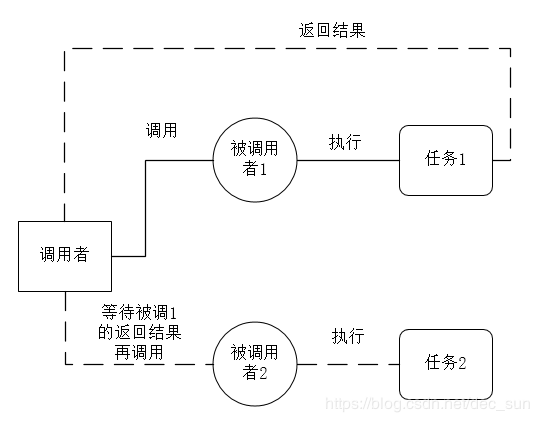
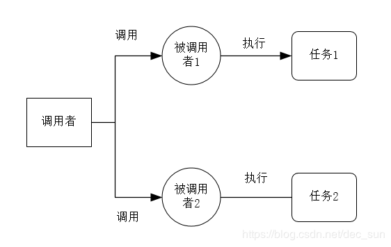
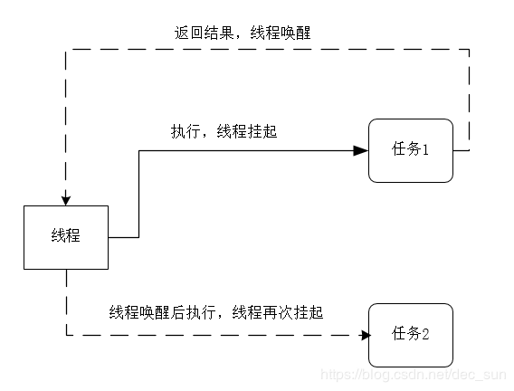
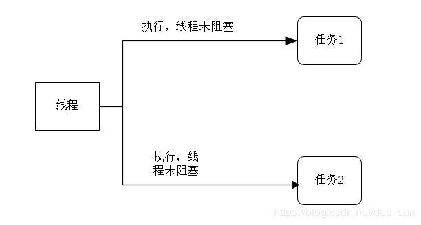

[toc]

# 同步与异步
同步：同步是对一个功能进行调用时，调用者必须等待这个结果才返回。如果没有等待到结果，那么调用就不返回。即调用者必须等待这个返回结果，才能进行下一步操作。

如图所示：调用者只有等待到结果后才才开始进行对 “被调用者2” 的执行。

异步：异步是对一个功能进行调用时，调用者不必等待结果，就直接返回了，然后进行其它操作。即调用者不必等待结果就直接返回，进行其它操作。

如图所示：调用者无需等待 "被调1" 的返回结果，就可以进行 “被调2” 的任务操作。

比如：小明等着吃妈妈做好可口饭菜，小明问妈妈，是否现在可以吃饭了。妈妈说，不行，在一旁等着。小明只好一直等到妈妈把饭菜做好后才开始吃饭，接着才去休息。这个就可以看做是一个同步的过程。如果妈妈说，你先去休息，到了吃饭的时间叫你。等妈妈把饭菜做好，小明就被叫过来开始吃饭。这个过程就可以看做是一个异步过程。

即等的过程中，直到这个任务完成再进行下一个任务，就是同步；而在等的过程中，没有等待这个任务完成，又可以做了其它任务，即就是异步。

从上面的概念可以看出，同步与异步主要关注了调用者是否需要等待请求结果。

# 阻塞与非阻塞
阻塞：即在没有得到结果返回时，当前线程会被挂起。直到有结果返回，当前线程才被唤醒执行后续操作。

如果线程的任务都是阻塞式的，那么在执行一次任务时，线程就会挂起一次，等待返回结果。

非阻塞：即在没有得到结果返回时，当前线程也不会被挂起。其在有无结果返回的情况下，都会执行后续操作。

如果线程的任务都是非阻塞式的，那么在执行一个任务时，线程不会挂起，可以执行下一个任务。

从上面概念可以看出，阻塞与非阻塞主要关注线程是否被阻塞。也就是程序在等待结果时的状态。

 比如： 比如妈妈在做一顿可口的饭菜，如果当前炒菜，那么需要人不停的守在铁锅那儿。妈妈当前只能炒菜而不能做其他事， 这个过程就是一个阻塞过程。如果妈妈正在小火煮汤，这个汤需要煮很久的时间，那么妈妈可以在这个时间去看电视或者去做家务等其他事情，这个过程就是一个非阻塞的过程。

# 总结

|                             同步                             |                             异步                             |                             阻塞                             |                            非阻塞                            |
| :----------------------------------------------------------: | :----------------------------------------------------------: | :----------------------------------------------------------: | :----------------------------------------------------------: |
| 基于结果的描述，只有等待当前结果返回，才能执行下一个操作或任务 | 基于结果的描述，无需等待当前结果返回，就可以执行其他任务或操作 | 基于过程的描述，当前操作和任务独占当前对象，直到当前操作或任务完成为止 | 基于过程的描述，当前操作和任务不会独占当前对象，当前对象可以调用执行其他操作或任务 |