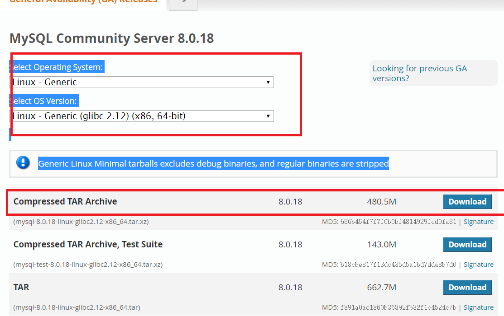

[toc]

平台：Centos 7


# 开机配置Centos

## 修改 hostname

```
hostnamectl set-hostname <hostname>
```

## 修改映射关系

```
vim /etc/hosts

192.168.100.100 node00
```

## 关闭防火墙

```
systemctl stop firewalld.service
```

## 关闭 SELINUX

```
--查看
getenforce

--临时关闭
setenforce 0

--永久关闭
vi /etc/selinux/config
将 SELINUX=enforcing 改为 SELINUX=disabled
设置后需要重启才能生效
```

## 安装 ssh

```
-- 安装
yum install openssh-server

-- 启动
service sshd start

-- 开机启动
chkconfig sshd on
```

## 修改网络 IP，DNS 等

```
vim /etc/sysconfig/ne

HWADDR=00:0C:29:47:77:35
TYPE=Ethernet
PROXY_METHOD=none
BROWSER_ONLY=no
BOOTPROTO=none
DEFROUTE=yes
IPV4_FAILURE_FATAL=yes
IPV6INIT=yes
IPV6_AUTOCONF=yes
IPV6_DEFROUTE=yes
IPV6_FAILURE_FATAL=no
IPV6_PRIVACY=no
IPV6_ADDR_GEN_MODE=stable-privacy
NAME=connection
UUID=c11ba339-eda2-3582-8100-886e15bd0ba2
ONBOOT=yes
IPADDR=192.168.100.100
PREFIX=24
GATEWAY=192.168.100.2
DNS1=8.8.8.8
DNS2=8.8.4.4
```

## 在 window 主机上配置 hosts

```
C:\Windows\System32\drivers\etc\hosts

# localhost name resolution is handled within DNS itself.
#	127.0.0.1       localhost
#	::1             localhost
192。168.100.100  node00
```

## 配置yum

```
yum clean all
yum makecache
yum install wget
```


# JDK 安装

```
tar -zxvf jdk-8u181-linux-x64.tar.gz -C /opt/module/

mv jdk1.8.0_181/ jdk

vim /etc/profile
export JAVA_HOME=/opt/module/jdk
export PATH=$JAVA_HOME/bin:$PATH
export CLASSPATH=.:$JAVA_HOME/lib/dt.jar:$JAVA_HOME/lib/tools.jar

source /etc/profile
java -version
```


# MySQL 安装

```
-- 查看
rpm -qa | grep mysql
# rpm -qa | grep mysql
qt-mysql-4.8.7-3.el7_6.x86_64
akonadi-mysql-1.9.2-4.el7.x86_64

-- 卸载
rpm -e --nodeps qt-mysql-4.8.7-3.el7_6.x86_64

-- 查找相关目录并删除
whereis mysql
find / -name mysql
rm $?

-- 下载
https://dev.mysql.com/downloads/mysql/
```



```
-- 解压移动
xz -d mysql-8.0.18-linux-glibc2.12-x86_64.tar.xz
tar -xvf mysql-8.0.18-linux-glibc2.12-x86_64.tar
mv mysql-8.0.18-linux-glibc2.12-x86_64 /usr/local/mysql

-- 创建 data 目录，赋予权限
mkdir /usr/local/mysql/data
chown -R mysql:mysql /usr/local/mysql
chmod -R 755 /usr/local/mysql

-- 初始化
cd /usr/local/mysql/bin
./mysqld --initialize --user=mysql --datadir=/usr/local/mysql/data --basedir=/usr/local/mysql

记住最后出现的密码 ye6yCgw)yhSI
```


```
-- 修改 my.cnf
vim /etc/my.cnf

[mysqld]
datadir=/usr/local/mysql/data
socket=/usr/local/mysql/mysql.sock
# Disabling symbolic-links is recommended to prevent assorted security risks
symbolic-links=0
# Settings user and group are ignored when systemd is used.
# If you need to run mysqld under a different user or group,
# customize your systemd unit file for mariadb according to the
# instructions in http://fedoraproject.org/wiki/Systemd

-- 启动 MySql 服务
cd /usr/local/mysql/support-files/
./mysql.server start

-- 将 mysql 写到环境中
vim /etc/profile

export MYSQL_HOME=/usr/local/mysql
export PATH=$MYSQL_HOME/bin:$PATH

-- 进入 
mysql -u root -p

-- 设置密码
ALTER USER 'root'@'localhost' identified by '123456';
flush privileges;

-- 开启远程
use mysql;
create user 'root'@'%' identified by '123456';
GRANT ALL PRIVILEGES ON *.* TO 'root'@'%' WITH GRANT OPTION;
flush privileges;
select host,user from user;
+-----------+------------------+
| host      | user             |
+-----------+------------------+
| %         | root             |
| localhost | mysql.infoschema |
| localhost | mysql.session    |
| localhost | mysql.sys        |
| localhost | root             |
+-----------+------------------+


-- 开机自启动
cp /usr/local/mysql/support-files/mysql.server /etc/init.d/mysqld
chmod +x /etc/init.d/mysqld
chkconfig --add mysqld
chkconfig --list
```

# Hadoop 安装

