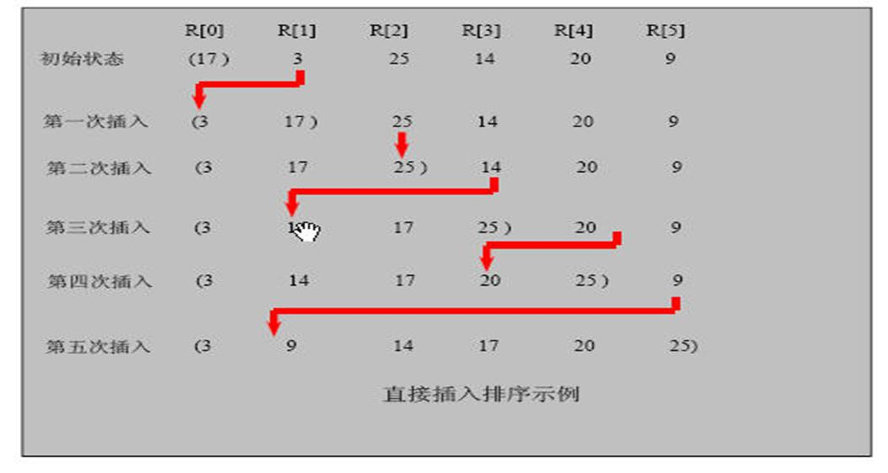
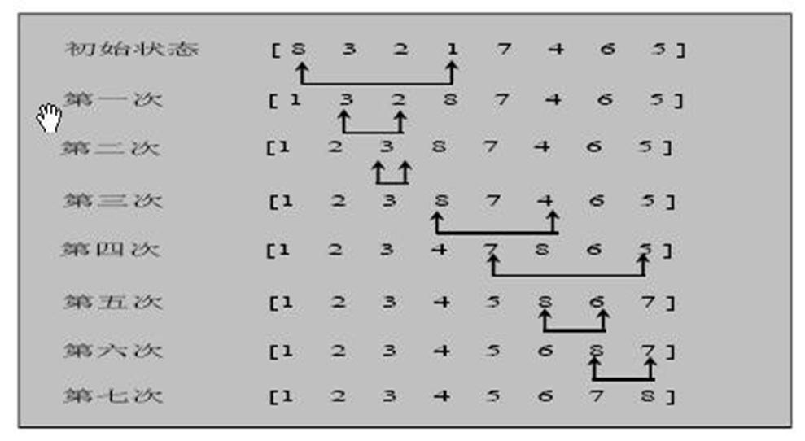
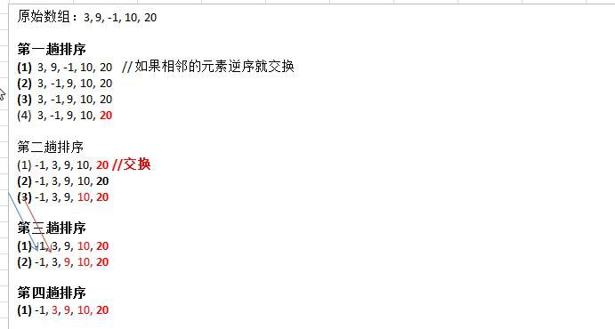
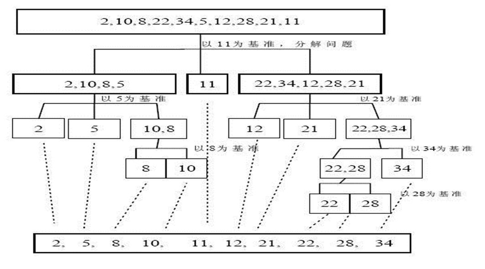
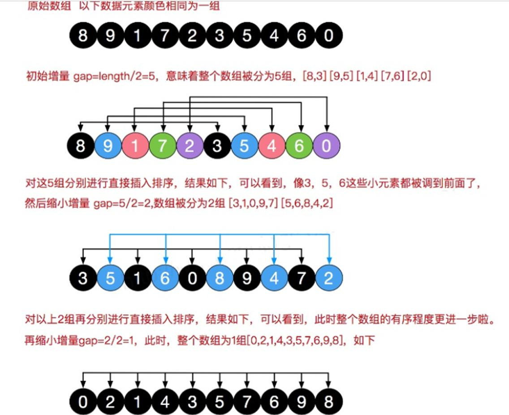
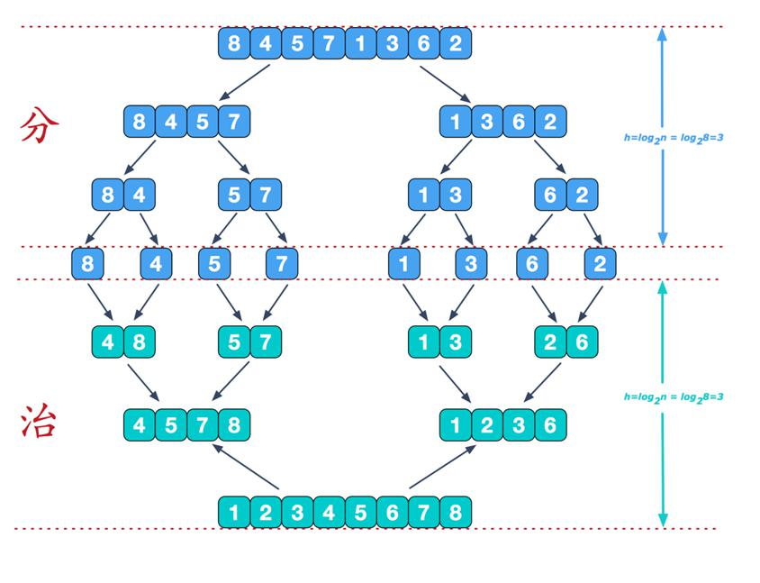
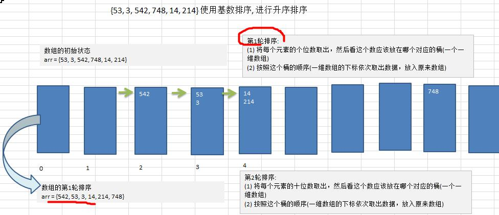
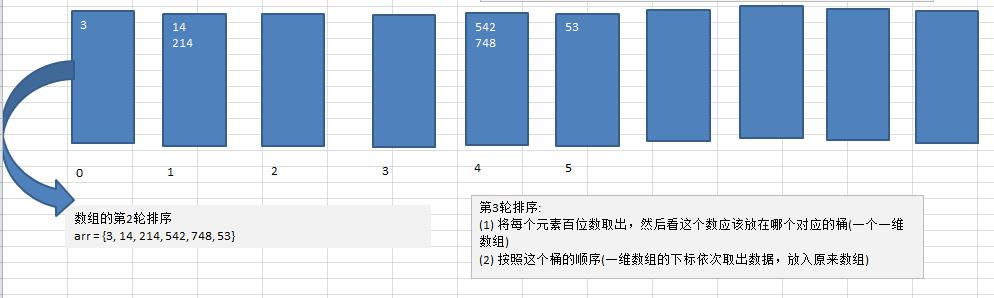
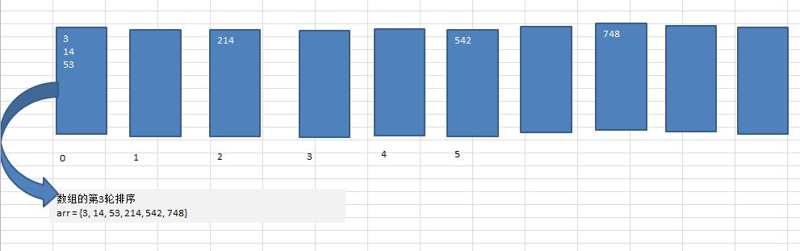

[toc]

#  插入排序

插入排序属于内部排序法，是对欲排序的元素以插入的方式寻找该袁术的适当位置，以达到排序的目的。

把 n 个待排序的元素看成为一个有序表和一个无序表：

1. 有序表开始时仅有一个元素，无序表中有 n-1 个元素；
2. 从无序表中取出一个元素，与有序表中的元素进行比较；
3. 通过比较，就可以将元素存放到适当的位置。



```java
/**
 * 插入排序：从数据中依次取出一个元素，对比插入。
 */
private static void insertSort(int[] arr){

    for(int i=1;i<arr.length;i++){
        int value = arr[i];
        int index = i-1;

        while(index >= 0 && value < arr[index]){
            arr[index+1] = arr[index];
            index --;
        }

        if(index + 1 != i){
            arr[index + 1] = value;
        }
    }
}
```


# 选择排序

选择排序也是一种内部排序法，其先从欲排序的数组中，按指定的规则找到一个元素，然后在依次排序。

比如需要寻找到从小到大的顺序排序：

1. 从中选择某一个元素，假设其为最小值，并记录下其位置；
2. 从当前之后的位置进行比较，如果某一个元素比他还小，就记录下位置和元素；
3. 将最小值与记录的位置的元素进行比较交换；



```java
/**
 * 选择排序：遍历这个数组，将最小的排在最前面
 */
private static void selectSort(int[] arr){
    for(int i=0;i< arr.length;i++){
        int min = arr[i];
        int index = i;

        for(int j=i+1;j<arr.length;j++){
            if(arr[j] < min){
                min = arr[j];
                index = j;
            }
        }

        arr[index] = arr[i];
        arr[i] = min;
    }
}
```


# 冒泡排序

冒泡排序：比较两个相应的元素，发现逆序就交换。

1. 遍历所有元素；
2. 对元素进行两两排序；



```java
/**
 * 冒泡排序：两两比较，将最大值排在最后面
 */

private static void bubbleSort(int[] arr){
    for(int i=0;i<arr.length ;i++){
        for(int j=0;j<arr.length-i-1;j++){
            if(arr[j] > arr[j+1]){
                int tmp = arr[j];
                arr[j] = arr[j+1];
                arr[j+1] = tmp;
            }
        }
    }
}
```


# 快速排序

快速排序是对冒泡排序的改进，就是将一个元素数组根据讯处的 key 进行分割，一组始终比另一组要大(小)。

1. 找到数组中的中心点，作为基准点；
2. 设置两个指针，一个在最左边 l，一个在最右边 r；
3. l 从左向右遍历，r 从右向左遍历，如果满足左边小于基准点，右边大于基准点，就可以直接移动指针；
4. 如果不满足，就可以对将两端的元素进行交换；
5. 使用递归，对左边和右边的数组进行递归操作；



```java
/**
 * 快速排序：选取一个数组值，然后再从数组中取出元素，如果小于就放左边，大于就放右边。
 */
private static void quickSort(int[] arr, int left, int right) {
    int l = left;
    int r = right;
    int mid = arr[(left+right)/2];

    while(l < r){
        while(arr[l] < mid){
            l ++;
        }

        while(mid < arr[r]){
            r--;
        }

        if(l >= r){
            break;
        }

        int tmp = arr[l];
        arr[l] = arr[r];
        arr[r] = tmp;

        if(arr[l] == mid){
            r--;
        }

        if(arr[r] == mid){
            l++;
        }
    }

    if(l == r){
        r--;
        l++;
    }

    if(l <right){
        quickSort(arr,l,right);
    }

    if(left < r){
        quickSort(arr,left,r);
    }
}
```


# 希尔排序

希尔排序是把记录按照下标进行定量 gap 分组，对每组使用直接插入排序算法；当 gap =1 时，分组完成，算法终止。

1. 设置 定量 gap，每次对 gap 进行定除；
2. 遍历所有元素，每一个 gap 内的元素属于不同的分组；
3. 然后对每一个分组内的数组，添加一个元素就进行一次插入排序；
4. 直到 gap =1 ，程序终止。



```java
/**
 * 希尔排序：取一个增量 gap ，gap = gap /2,
 * 每次都是 gap 间隔的数据元素进行对比交换
 */

private static void shellSort(int[] arr){
    int length = arr.length;

    for(int gap = length/2;gap >0;gap /=2){
        for(int i= gap; i<length;i++){
            for(int j=i-gap;j>=0;j--){
                if(arr[j] > arr[j+gap]){
                    int tmp = arr[j];
                    arr[j] = arr[j+gap];
                    arr[j+gap] = tmp;
                }
            }
        }
    }
}
```


# 归并排序

归并排序的特点就是先分后合。

1. 首先对数组进行多次拆分，直到数组变成单个的元素；
2. 合并操作。将拆分后的元素逐渐添加到临时的 tmp 数组中；
3. 此时 tmp 临时数组是一个有序的数组；



```java
/**
 * 归并排序: 将数组完全切分，最终将数组具有 2 个元素的数组。然后对比这两个元素，这样就能保证
 * 每个小数组内是正常排序的。然后在将两个小数组拼接成一个中数组，这个中数组也是排序正常的。
 * 经过一些列的数组合并排序，最终排序完成
 */
private static void mergeSort(int[] arr,int left,int right, int[] tmp) {
    if(left< right){
        int mid = (left + right) /2;

        mergeSort(arr,left,mid,tmp);
        mergeSort(arr,mid+1,right,tmp);
        merge(arr,left,mid,right,tmp);
    }
}

private static void merge(int[] arr, int left, int mid, int right, int[] tmp) {
    int i = left;
    int j = mid+1;
    int t =0;

    while(i<= mid && j <= right){
        if(arr[i] < arr[j]){
            tmp[t] = arr[i];
            t++;
            i++;
        }else{
            tmp[t] = arr[j];
            t++;
            j++;
        }
    }

    while(i <= mid){
        tmp[t] = arr[i];
        t++;
        i++;
    }

    while(j <= right){
        tmp[t] = arr[j];
        t++;
        j++;
    }

    t = 0;
    int index = left;

    while(index <= right){
        arr[index] = tmp[t];
        t++;
        index ++;
    }
}
```


# 堆排序

堆排序其实通过构建大(小)堆顶，这样就可以获得一个要求的排序。

1. 首先创建一个大/小顶堆，如从小到大排序，就创建大顶堆；
2. 将数组调整成大顶堆；
3. 始终将顶堆的元素调整到数组末尾。

```java
/**
 * 堆排序：创建一个大小顶堆。
 */
private static void heapSort(int[] arr) {

    // 将数组构建成大顶堆
    for (int i = arr.length /2 -1 ; i >= 0; i--) {
        adjustHeap(arr, i, arr.length);
    }

    // 始终将栈顶元素与栈顶元素进行交换，保证数组末尾始终是最大值
    for (int j = arr.length - 1; j > 0; j--) {
        int tmp = arr[j];
        arr[j] = arr[0];
        arr[0] = tmp;
        adjustHeap(arr, 0, j);
    }
}

// 构建大堆顶
private static void adjustHeap(int[] arr, int i, int length) {

    int tmp = arr[i];
    // 2*i+1 是左节点
    for (int k = i * 2 + 1; k < length; k = k * 2 + 1) {
        if (k + 1 < length && arr[k] < arr[k + 1]) {
            // k += 1 是右子节点
            k++;
        }
        // 子根节点与左右子树节点进行比较
        if (arr[k] > tmp) {
            arr[i] = arr[k];
            i = k;
        } else {
            break;
        }
    }
    arr[i] = tmp;
}
```


# 基数排序

基数排序首先需要建桶，然后对数组元素进行个位，十位，百位，千位等数值取出，并放到规定的桶内，当各位数都进桶出桶后，所有元素就完成了排序；

1. 需要取出数组中最大值的元素，并确认其位数；
2. 因为位数的值只可能是 0 ,1,2,3,4，5,6,7,8,9。可以创建二维数组，表示有 10 个桶，每个桶装载一定量数据；
3. 先将元素存放到指定的桶中，然后再取出；
4. 多次进行存放桶和取出，直到各个位完成遍历。







```java
private static void radixSort(int[] arr){
    int max = arr[0];
    for(int i = 1; i< arr.length;i++){
        if(arr[i] > max){
            max = arr[i];
        }
    }

    int maxLength = (max+"").length();

   	// 创建桶
    int[][] bucket = new int[10][arr.length];
    // 用于保存每个桶的元素个数；
    int [] bucketElementCounts = new int[10];

	// 分桶操作，将数据放到规定的桶中
    for(int i=0,n =1;i<maxLength;i++,n*=10){
        for(int j = 0;j<arr.length;j++){
            int digitOfElement = arr[j]/n %10;
            bucket[digitOfElement][bucketElementCounts[digitOfElement]] = arr[j];
            bucketElementCounts[digitOfElement]++;
        }
        
		// 将数组取出放回到原数组，并初始化 bucketElementCounts
        int index = 0;
        for(int k = 0;k<bucketElementCounts.length;k++){
            if(bucketElementCounts[k] != 0){
                for(int l =0;l<bucketElementCounts[k];l++) {
                    arr[index++] = bucket[k][l];
                }
            }
            bucketElementCounts[k] = 0;
        }

    }
}
```

